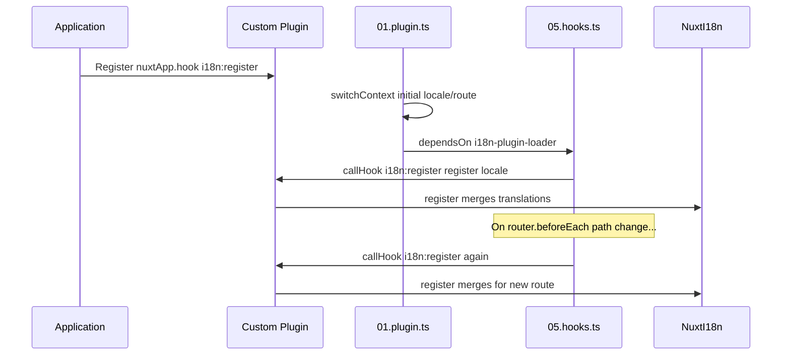

# 📢 Hendelser

## 🔄 `i18n:register`

Hendelsen `i18n:register` i `Nuxt I18n Micro` muliggjør dynamisk tillegg av oversettelser til applikasjonens i18n-kontekst, noe som gjør internasjonaliseringsprosessen sømløs og fleksibel. Denne hendelsen lar deg integrere nye oversettelser etter behov og styrker applikasjonens lokaliseringsevner.

### 📝 Hendelsesdetaljer

- **Formål**:
  - Muliggjør dynamisk innlemmelse av ytterligere oversettelser i det eksisterende settet for en bestemt lokale.

- **Payload**:
  - **`register`**:
    - En funksjon som hendelsen leverer, og som tar to argumenter:
      - **`translations`** (`Translations`):
        - Et objekt som inneholder nøkkel-verdi-par som representerer oversettelser, organisert i henhold til `Translations`-grensesnittet.
      - **`locale`** (`string`, valgfri):
        - Lokale-koden (f.eks. `'en'`, `'ru'`) som oversettelsene registreres for. Faller tilbake til lokalen levert av hendelsen hvis den ikke er angitt.

- **Atferd**:
  - Når den utløses, fletter `register`-funksjonen de nye oversettelsene inn i gjeldende kontekst for den angitte lokalen, og oppdaterer tilgjengelige oversettelser i hele applikasjonen.

### ⏱️ Når den utløses

Modulens hooks-plugin (`05.hooks.ts`, `dependsOn: ['i18n-plugin-loader']`) kaller `nuxtApp.callHook('i18n:register', …)`:

1. **Én gang ved oppstart** — etter at hoved-i18n-pluginen (`01.plugin.ts`) har lastet oversettelser for den initielle ruten
2. **Ved navigasjon** — i `router.beforeEach` når stien endres, eller ved hver navigasjon når `strategy: 'no_prefix'`

Registrer lytteren din i en vanlig Nuxt-plugin med `nuxtApp.hook('i18n:register', …)`. Hooks-pluginen kjører etter at loaderen er klar, slik at callbacken din kalles når oversettelser må utvides.

Sett `hooks: false` i `nuxt.config` for å deaktivere automatiske `i18n:register`-kall (se [Konfigurasjon — `hooks`](/guides/configuration#hooks)).

### 💡 Eksempelbruk

Følgende eksempel viser hvordan du bruker hendelsen `i18n:register` til å legge til oversettelser dynamisk:

```typescript
nuxt.hook('i18n:register', async (register: (translations: unknown, locale?: string) => void, locale: string) => {
  register(
    {
      greeting: 'Hello',
      farewell: 'Goodbye',
    },
    locale,
  )
})
```

### 🛠️ Forklaring



- **Utløse hendelsen**:
  - Hooks-pluginen (`05.hooks.ts`) utløser `i18n:register` etter at hovedloaderen er klar, og ved relevante navigasjoner.

- **Legge til oversettelser**:
  - Eksempelet registrerer engelske oversettelser for `"greeting"` og `"farewell"`.
  - `register`-funksjonen fletter disse oversettelsene inn i det eksisterende settet for den angitte lokalen.

### 🔗 Nøkkelfordeler

- **Dynamiske oppdateringer**:
  - Oppdater eller legg til oversettelser enkelt uten å måtte deploye hele applikasjonen på nytt.

- **Lokaliseringsfleksibilitet**:
  - Støtter sanntidsjusteringer i lokalisering basert på bruker- eller applikasjonsbehov.

Ved å bruke hendelsen `i18n:register` sikrer du at applikasjonens lokaliseringsstrategi forblir fleksibel og tilpasningsdyktig, og forbedrer den samlede brukeropplevelsen.

---

## 🛠️ Endre oversettelser med plugins

For å endre oversettelser dynamisk i Nuxt-applikasjonen din anbefales det å bruke plugins. Plugins gir en strukturert måte å håndtere lokaliseringsoppdateringer på, spesielt når du jobber med moduler eller eksterne oversettelsesfiler.

### **Registrere pluginen**

Hvis du bruker en modul, registrer pluginen der oversettelsesendringer skjer, ved å legge den til i modulens konfigurasjon:

```javascript
addPlugin({
  src: resolve('./plugins/extend_locales'),
})
```

Dette registrerer pluginen som ligger i `./plugins/extend_locales`, og som håndterer dynamisk lasting og registrering av oversettelser.

### **Implementere pluginen**

I pluginen kan du håndtere lokale-endringer. Her er et eksempel på implementasjon i en Nuxt-plugin:

```typescript
import { defineNuxtPlugin } from '#app'

export default defineNuxtPlugin(async (nuxtApp) => {
  // Function to load translations from JSON files and register them
  const loadTranslations = async (lang: string) => {
    try {
      const translations = await import(`../locales/${lang}.json`)
      return translations.default
    } catch (error) {
      console.error(`Error loading translations for language: ${lang}`, error)
      return null
    }
  }

  // Hook into the 'i18n:register' event to dynamically add translations
  // eslint-disable-next-line @typescript-eslint/ban-ts-comment
  // @ts-expect-error
  nuxtApp.hook('i18n:register', async (register: (translations: unknown, locale?: string) => void, locale: string) => {
    const translations = await loadTranslations(locale)
    if (translations) {
      register(translations, locale)
    }
  })
})
```

### 📝 Detaljert forklaring

1. **Laste oversettelser**:

- Funksjonen `loadTranslations` importerer oversettelsesfiler dynamisk basert på lokalen. Filene forventes å ligge i `locales`-katalogen og være navngitt etter lokale-koder (f.eks. `en.json`, `de.json`).
- Ved vellykket lasting returneres oversettelsene, ellers logges en feilmelding.

2. **Registrere oversettelser**:

- Pluginen hekter seg på hendelsen `i18n:register` med `nuxtApp.hook`.
- Når hendelsen utløses, kalles `register`-funksjonen med de lastede oversettelsene og tilhørende lokale.
- Dette fletter de nye oversettelsene inn i i18n-konteksten for den angitte lokalen, og oppdaterer tilgjengelige oversettelser gjennom hele applikasjonen.

### 🔗 Fordeler ved å bruke plugins for oversettelsesendringer

- **Separasjon av ansvar**:
  - Innkapsler lokaliseringslogikk separat fra hovedapplikasjonskoden, noe som gjør håndtering og vedlikehold enklere.

- **Dynamisk og skalerbart**:
  - Ved å laste og registrere oversettelser dynamisk kan du oppdatere innhold uten full ny-deploy av applikasjonen. Dette er spesielt nyttig for applikasjoner med hyppig oppdatert eller flerspråklig innhold.

- **Forbedret lokaliseringsfleksibilitet**:
  - Plugins lar deg endre eller utvide oversettelser etter behov, og gir en mer tilpasningsdyktig og responsiv lokaliseringsstrategi som møter brukerpreferanser eller forretningsbehov.

Ved å ta i bruk denne tilnærmingen kan du effektivt utvide og endre applikasjonens lokalisering gjennom en strukturert og vedlikeholdbar prosess med plugins, og holde internasjonaliseringen tilpasningsdyktig til endrede behov mens du forbedrer den samlede brukeropplevelsen.
