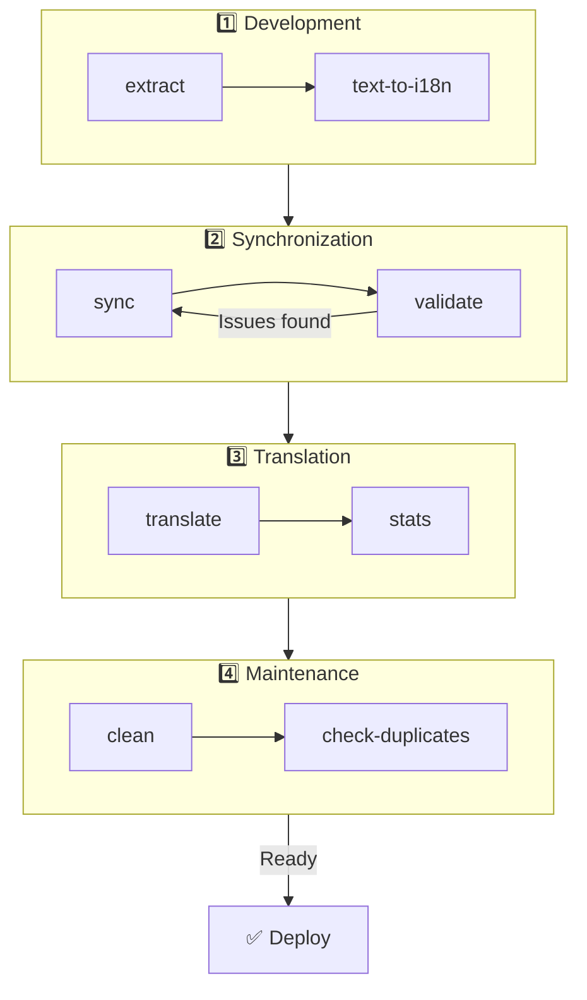

# 🌐 Guide til nuxt-i18n-micro-cli

## 📖 Innledning

`nuxt-i18n-micro-cli` er et kommandolinjeverktøy laget for å strømlinjeforme lokaliserings- og internasjonaliseringsprosessen i Nuxt.js-prosjekter som bruker `nuxt-i18n-micro`-modulen (Nuxt I18n Micro). Det tilbyr verktøy for å trekke ut oversettelsesnøkler fra kodebasen, administrere oversettelsesfiler, synkronisere oversettelser på tvers av locales og automatisere oversettelsesprosessen ved hjelp av eksterne oversettelsestjenester.

Denne guiden viser hvordan du installerer, konfigurerer og bruker `nuxt-i18n-micro-cli` for effektiv håndtering av oversettelsene i prosjektet ditt. Pakken finnes på [npmjs.com](https://www.npmjs.com/package/nuxt-i18n-micro-cli).

## 🔧 Installasjon og oppsett

### 📦 Installere nuxt-i18n-micro-cli

Installer globalt eller som en dev-avhengighet i Nuxt-prosjektet ditt (anbefalt for CI):

```bash
# global
npm install -g nuxt-i18n-micro-cli

# or per project
pnpm add -D nuxt-i18n-micro-cli
pnpm exec i18n-micro text-to-i18n --dryRun
```

Bruk **`nuxt-i18n-micro-cli` ≥ 2.1.1** hvis prosjektet ditt bruker Nuxt 4-mappen `app/` (`app/pages`, `app/components`, …). Eldre CLI-versjoner skannet kun `pages/` i prosjektroten.

### 🛠 Initialisering i prosjektet

Etter installasjon kan du kjøre `i18n-micro`-kommandoer i Nuxt.js-prosjektmappen.

Sørg for at prosjektet ditt er satt opp med `nuxt-i18n-micro` og har nødvendig konfigurasjon i `nuxt.config.ts` (eller `nuxt.config.js`).

### 📄 Vanlige argumenter

- `--cwd`: Angi gjeldende arbeidsmappe (standard: `.`).
- `--logLevel`: Sett loggnivået (`silent`, `info`, `verbose`).
- `--translationDir`: Mappe som inneholder JSON-oversettelsesfiler (standard: `locales`).

## 📊 Oversikt over CLI-arbeidsflyten



### Steg i arbeidsflyten

| Fase           | Kommandoer                    | Formål                           |
| --------------- | --------------------------- | --------------------------------- |
| **Utvikling** | `extract`, `text-to-i18n`   | Finn og trekk ut oversettelsesnøkler |
| **Synkronisering**        | `sync`, `validate`          | Sikre at alle locales har samme nøkler |
| **Oversette**   | `translate`, `stats`        | Auto-oversett manglende nøkler       |
| **Vedlikehold** | `clean`, `check-duplicates` | Hold oversettelsene ryddige            |

## 📋 Kommandoer

### 🔄 `text-to-i18n`-kommandoen

CLI-pakke: [`nuxt-i18n-micro-cli`](https://www.npmjs.com/package/nuxt-i18n-micro-cli)

**Beskrivelse**: Skanner Vue/TS/JS-filer for hardkodede brukerrettede strenger, erstatter dem med `$t('...')` og slår sammen nye nøkler i JSON-oversettelsesfilen. Kjør fra **Nuxt-prosjektroten** (der `nuxt.config` ligger).

**Bruk**:

```bash
i18n-micro text-to-i18n [options]
```

**Alternativer**:

| Alternativ                  | Standard           | Beskrivelse                                                           |
| ----------------------- | ----------------- | --------------------------------------------------------------------- |
| `--translationFile`     | `locales/en.json` | JSON-fil for nye nøkler (relativ til prosjektroten).                    |
| `--path`                | —                 | Behandle kun én fil eller mappe (f.eks. `app/pages/about.vue`).      |
| `--context`             | —                 | Nøkkelprefiks (f.eks. `auth` → `auth.*`).                                  |
| `--dryRun`              | `false`           | Forhåndsvis uten å skrive filer.                                        |
| `--verbose`             | `false`           | Ekstra logging.                                                        |
| `--interactive`         | `false`           | Bekreft eller rediger hver nøkkel før den anvendes.                             |
| `--extractOnlyDirs`     | `plugins`         | Mapper der nøkler trekkes ut, men kildefiler **ikke** skrives om. |
| `--extractOnlyPatterns` | —                 | Glob-lignende extract-only-mønstre (f.eks. `**/*.plugin.ts`).              |

**Eksempel**:

```bash
i18n-micro text-to-i18n --translationFile locales/en.json --context auth --dryRun
```

#### Hvilke mapper skannes?

<Info>
Siden CLI **v2.1.1** skanner `text-to-i18n` både klassiske rotmapper og `app/*`-ekvivalenter. Kjør kommandoen fra **prosjektroten** — ikke `cd app`.
</Info>

Samler `*.vue`, `*.js` og `*.ts` under:

| Nuxt 3 (prosjektrot) | Nuxt 4 (`app/`-mappen) |
| --------------------- | ------------------------- |
| `pages/`              | `app/pages/`              |
| `components/`         | `app/components/`         |
| `plugins/`            | `app/plugins/`            |
| `layouts/`            | `app/layouts/`            |

Andre mapper (`server/`, `composables/`, `middleware/`, …) hoppes over med mindre du bruker `--path`. For Nuxt 4 kjører du fra prosjektroten (ingen grunn til å `cd app`). Match `i18n.translationDir` i `--translationFile` hvis den ikke er `locales/`.

```bash
i18n-micro text-to-i18n --path app/pages
```

#### Slik fungerer det

1. Samle filer fra mappene ovenfor (eller fra `--path`).
2. Erstatt bokstavlige verdier / template-tekst med `$t('generated.key')` (`plugins/` er extract-only som standard).
3. Slå nye nøkler sammen i `--translationFile` uten å fjerne eksisterende oppføringer.

**Eksempeltransformasjoner**:

Før:

```vue
<template>
  <div>
    <h1>Welcome to our site</h1>
    <p>Please sign in to continue</p>
  </div>
</template>
```

Etter:

```vue
<template>
  <div>
    <h1>{{ $t('pages.home.welcome_to_our_site') }}</h1>
    <p>{{ $t('pages.home.please_sign_in') }}</p>
  </div>
</template>
```

**Beste praksis**: kjør dry run først; commit før en full kjøring; still `--translationFile` i takt med `i18n.translationDir` i `nuxt.config`; behold `--extractOnlyDirs plugins` for bootstrap-kode.

**Begrensninger**: separat npm-pakke (ikke bundlet med modulen); leser ikke `nuxt.config` automatisk; skriver `$t(...)`; komplekse dynamiske strenger kan trenge `extract` / `search` i stedet.

### 📊 `stats`-kommandoen

**Beskrivelse**: Kommandoen `stats` viser oversettelsesstatistikk for hver locale i Nuxt.js-prosjektet. Den hjelper deg å forstå fremdriften i oversettelsene ved å vise hvor mange nøkler som er oversatt sammenlignet med totalt antall tilgjengelige nøkler.

**Bruk**:

```bash
i18n-micro stats [options]
```

**Alternativer**:

- `--full`: Vis kun kombinerte oversettelsesstatistikker (standard: `false`).

**Eksempel**:

```bash
i18n-micro stats --full
```

### 🌍 `translate`-kommandoen

**Beskrivelse**: Kommandoen `translate` oversetter automatisk manglende nøkler ved hjelp av eksterne oversettelsestjenester. Denne kommandoen forenkler oversettelsesprosessen ved å bruke API-er fra tjenester som Google Translate, DeepL og andre til å fylle inn manglende oversettelser.

**Bruk**:

```bash
i18n-micro translate [options]
```

**Alternativer**:

- `--service`: Oversettelsestjenesten som skal brukes (f.eks. `google`, `deepl`, `yandex`). Hvis den ikke er spesifisert, blir du bedt om å velge én.
- `--token`: API-nøkkelen for den valgte oversettelsestjenesten. Hvis den ikke er oppgitt, blir du bedt om å skrive den inn.
- `--options`: Ekstra alternativer for oversettelsestjenesten, oppgitt som key:value-par, adskilt med komma (f.eks. `model:gpt-3.5-turbo,max_tokens:1000`).
- `--replace`: Oversett alle nøkler og erstatt eksisterende oversettelser (standard: `false`).

**Eksempel**:

```bash
i18n-micro translate --service deepl --token YOUR_DEEPL_API_KEY
```

#### 🌐 Støttede oversettelsestjenester

Kommandoen `translate` støtter flere oversettelsestjenester. Noen av de støttede tjenestene er:

- **Google Translate** (`google`)
- **DeepL** (`deepl`)
- **Yandex Translate** (`yandex`)
- **OpenAI** (`openai`)
- **Azure Translator** (`azure`)
- **IBM Watson** (`ibm`)
- **Baidu Translate** (`baidu`)
- **LibreTranslate** (`libretranslate`)
- **MyMemory** (`mymemory`)
- **Lingva Translate** (`lingvatranslate`)
- **Papago** (`papago`)
- **Tencent Translate** (`tencent`)
- **Systran Translate** (`systran`)
- **Yandex Cloud Translate** (`yandexcloud`)
- **ModernMT** (`modernmt`)
- **Lilt** (`lilt`)
- **Unbabel** (`unbabel`)
- **Reverso Translate** (`reverso`)

#### ⚙️ Tjenestekonfigurasjon

Noen tjenester krever spesifikke konfigurasjoner eller API-nøkler. Når du bruker `translate`-kommandoen, kan du spesifisere tjenesten og oppgi nødvendig `--token` (API-nøkkel) samt ekstra `--options` ved behov.

For eksempel:

```bash
i18n-micro translate --service openai --token YOUR_OPENAI_API_KEY --options openaiModel:gpt-3.5-turbo,max_tokens:1000
```

### 🛠️ `extract`-kommandoen

**Beskrivelse**: Trekker ut oversettelsesnøkler fra kodebasen din og organiserer dem etter scope.

**Bruk**:

```bash
i18n-micro extract [options]
```

**Alternativer**:

- `--prod, -p`: Kjør i produksjonsmodus.

**Eksempel**:

```bash
i18n-micro extract
```

### 🔄 `sync`-kommandoen

**Beskrivelse**: Synkroniserer oversettelsesfiler på tvers av locales og sikrer at alle locales har samme nøkler.

**Bruk**:

```bash
i18n-micro sync [options]
```

**Eksempel**:

```bash
i18n-micro sync
```

### ✅ `validate`-kommandoen

**Beskrivelse**: Validerer oversettelsesfiler for manglende eller ekstra nøkler sammenlignet med referanse-locale.

**Bruk**:

```bash
i18n-micro validate [options]
```

**Eksempel**:

```bash
i18n-micro validate
```

### 🧹 `clean`-kommandoen

**Beskrivelse**: Fjerner ubrukte oversettelsesnøkler fra oversettelsesfilene.

**Bruk**:

```bash
i18n-micro clean [options]
```

**Eksempel**:

```bash
i18n-micro clean
```

### 📤 `import`-kommandoen

**Beskrivelse**: Konverterer PO-filer tilbake til JSON-format og lagrer dem i oversettelsesmappen.

**Bruk**:

```bash
i18n-micro import [options]
```

**Alternativer**:

- `--potsDir`: Mappe som inneholder PO-filer (standard: `pots`).

**Eksempel**:

```bash
i18n-micro import --potsDir pots
```

### 📥 `export`-kommandoen

**Beskrivelse**: Eksporterer oversettelser til PO-filer for ekstern håndtering.

**Bruk**:

```bash
i18n-micro export [options]
```

**Alternativer**:

- `--potsDir`: Mappe der PO-filene lagres (standard: `pots`).

**Eksempel**:

```bash
i18n-micro export --potsDir pots
```

### 🗂️ `export-csv`-kommandoen

**Beskrivelse**: Kommandoen `export-csv` eksporterer oversettelsesnøkler og verdier fra JSON-filer, inkludert filstier, til CSV-format. Denne kommandoen er nyttig for team som foretrekker å jobbe med oversettelsesdata i regnearkprogramvare.

**Bruk**:

```bash
i18n-micro export-csv [options]
```

**Alternativer**:

- `--csvDir`: Mappe der de eksporterte CSV-filene skal lagres.
- `--delimiter`: Angi et skilletegn for CSV-filen (standard: `,`).

**Eksempel**:

```bash
i18n-micro export-csv --csvDir csv_files
```

### 📑 `import-csv`-kommandoen

**Beskrivelse**: Kommandoen `import-csv` importerer oversettelsesdata fra CSV-filer og oppdaterer de tilhørende JSON-filene. Dette er nyttig for å ta i bruk bulk-oppdateringer av oversettelser fra regneark.

**Bruk**:

```bash
i18n-micro import-csv [options]
```

**Alternativer**:

- `--csvDir`: Mappe som inneholder CSV-filene som skal importeres.
- `--delimiter`: Angi skilletegnet brukt i CSV-filen (standard: `,`).

**Eksempel**:

```bash
i18n-micro import-csv --csvDir csv_files
```

### 🧾 `diff`-kommandoen

**Beskrivelse**: Sammenligner oversettelsesfiler mellom standard-locale og andre locales i samme mappe (inkludert undermapper). Kommandoen identifiserer manglende nøkler og verdiene deres i standard-locale sammenlignet med andre locales, slik at det blir enklere å spore fremdrift i oversettelsen eller finne avvik.

**Bruk**:

```bash
i18n-micro diff [options]
```

**Eksempel**:

```bash
i18n-micro diff
```

### 🔍 `check-duplicates`-kommandoen

**Beskrivelse**: Kommandoen `check-duplicates` sjekker for dupliserte oversettelsesverdier innen hver locale på tvers av alle oversettelsesfiler, inkludert både rotnivå- og sidespesifikke oversettelser. Den sikrer at ulike nøkler innenfor samme språk ikke deler identiske oversettelsesverdier, slik at oversettelsene forblir tydelige og konsistente.

**Bruk**:

```bash
i18n-micro check-duplicates [options]
```

**Eksempel**:

```bash
i18n-micro check-duplicates
```

**Slik fungerer det**:

- Kommandoen sjekker både rotnivå- og sidespesifikke oversettelsesfiler for hver locale.
- Hvis en oversettelsesverdi opptrer flere steder (enten innen rot-oversettelsene eller på tvers av forskjellige sider), rapporterer den de dupliserte verdiene sammen med filen og nøkkelen der de er funnet.
- Hvis ingen duplikater finnes, bekrefter kommandoen at locale-en er fri for dupliserte oversettelsesverdier.

Denne kommandoen bidrar til å sikre at oversettelsesnøkler har unike verdier og hindrer utilsiktet repetisjon innen samme locale.

### 🔄 `replace-values`-kommandoen

**Beskrivelse**: Kommandoen `replace-values` lar deg utføre bulk-erstatninger av oversettelsesverdier på tvers av alle locales. Den støtter både enkle tekst-erstatninger og avanserte erstatninger med regulære uttrykk (regex). Du kan også bruke fangstgrupper i regex-mønstre og referere til dem i erstatningsstrengen, noe som gjør den ideell for mer komplekse erstatningsscenarier.

**Bruk**:

```bash
i18n-micro replace-values [options]
```

**Alternativer**:

- `--search`: Teksten eller regex-mønsteret som skal søkes etter i oversettelsene. Dette er et påkrevd alternativ.
- `--replace`: Erstatningsteksten som brukes for de funne oversettelsene. Dette er et påkrevd alternativ.
- `--useRegex`: Aktiver søk ved hjelp av et regulært uttrykk (standard: `false`).

**Eksempel 1**: Enkel erstatning

Erstatt strengen "Hello" med "Hi" på tvers av alle locales:

```bash
i18n-micro replace-values --search "Hello" --replace "Hi"
```

**Eksempel 2**: Regex-erstatning

Aktiver regex-søk og erstatt enhver streng som starter med "Hello" etterfulgt av tall (f.eks. "Hello123") med "Hi" på tvers av alle locales:

```bash
i18n-micro replace-values --search "Hello\\d+" --replace "Hi" --useRegex
```

**Eksempel 3**: Bruk av regex-fangstgrupper

Bruk fangstgrupper til å dynamisk sette inn deler av den matchede strengen i erstatningen. For eksempel: erstatt "Hello [name]" med "Hi [name]" mens navnet bevares:

```bash
i18n-micro replace-values --search "Hello (\\w+)" --replace "Hi $1" --useRegex
```

I dette tilfellet refererer `$1` til den første fangstgruppen som matcher `[name]`-delen etter "Hello". Erstatningen bevarer navnet fra den opprinnelige strengen.

**Slik fungerer det**:

- Kommandoen skanner alle oversettelsesfiler (både globale og sidespesifikke).
- Når et treff blir funnet basert på søkestrengen eller regex-mønsteret, erstattes den matchede teksten med den oppgitte erstatningen.
- Ved bruk av regex kan fangstgrupper brukes i erstatningsstrengen ved å referere til dem med `$1`, `$2` osv.
- Alle endringer logges, med filsti, oversettelsesnøkkel og før/etter-tilstand for oversettelsesverdien.

**Logging**:
For hver erstatning logger kommandoen detaljer som inkluderer:

- Locale og filsti
- Oversettelsesnøkkelen som endres
- Den gamle verdien og den nye verdien etter erstatning
- Ved bruk av regex med fangstgrupper viser loggen gruppetreffene og hvordan de ble erstattet.

Dette lar deg spore nøyaktig hvor og hva som er endret under erstatningsoperasjonen, og gir en tydelig historikk over endringer på tvers av oversettelsesfilene.

## 🛠 Eksempler

- **Trekke ut oversettelser**:

  ```bash
  i18n-micro extract
  ```

- **Oversette manglende nøkler med Google Translate**:

  ```bash
  i18n-micro translate --service google --token YOUR_GOOGLE_API_KEY
  ```

- **Oversette alle nøkler og erstatte eksisterende oversettelser**:

  ```bash
  i18n-micro translate --service deepl --token YOUR_DEEPL_API_KEY --replace
  ```

- **Validere oversettelsesfiler**:

  ```bash
  i18n-micro validate
  ```

- **Rydde bort ubrukte oversettelsesnøkler**:

  ```bash
  i18n-micro clean
  ```

- **Synkronisere oversettelsesfiler**:

  ```bash
  i18n-micro sync
  ```

## ⚙️ Konfigurasjonsguide

`nuxt-i18n-micro-cli` bygger på Nuxt.js-i18n-konfigurasjonen din i `nuxt.config.ts` (eller `nuxt.config.js`). Sørg for at du har `nuxt-i18n-micro`-modulen installert og konfigurert.

### 🔑 Eksempel på nuxt.config.js

```ts
export default defineNuxtConfig({
  modules: ['nuxt-i18n-micro'],
  i18n: {
    locales: [
      { code: 'en', iso: 'en-US' },
      { code: 'fr', iso: 'fr-FR' },
    ],
    defaultLocale: 'en',
    fallbackLocale: 'en',
    translationDir: 'locales', // or 'app/locales' for Nuxt 4 colocation
  },
})
```

Sørg for at `translationDir` samsvarer med mappen som brukes av `nuxt-i18n-micro-cli` (standard er `locales`).

## 📝 Beste praksis

### 🔑 Konsistent nøkkelnavngivning

Sørg for at oversettelsesnøkler er konsistente og beskrivende for å unngå forvirring og duplisering.

### 🧹 Regelmessig vedlikehold

Bruk `clean`-kommandoen regelmessig for å fjerne ubrukte oversettelsesnøkler og holde oversettelsesfilene ryddige.

### 🛠 Automatiser oversettelsesarbeidsflyten

Integrer `nuxt-i18n-micro-cli`-kommandoer i utviklingsarbeidsflyten eller CI/CD-pipelinen for å automatisere uttrekk, oversettelse, validering og synkronisering av oversettelsesfiler.

### 🛡️ Sikre API-nøkler

Når du bruker oversettelsestjenester som krever API-nøkler, må du sørge for at nøklene holdes sikre og ikke commit-es til versjonskontrollsystemer. Vurder å bruke miljøvariabler eller sikre nøkkelhåndteringsløsninger.

## 📞 Støtte og bidrag

Hvis du støter på problemer eller har forslag til forbedringer, kan du bidra til prosjektet eller åpne et issue i prosjektets repository.

---

Ved å følge denne guiden kan du effektivt administrere oversettelser i Nuxt.js-prosjektet ditt med `nuxt-i18n-micro-cli`, strømlinjeforme internasjonaliseringsarbeidet og sikre en jevn opplevelse for brukere i ulike locales.
