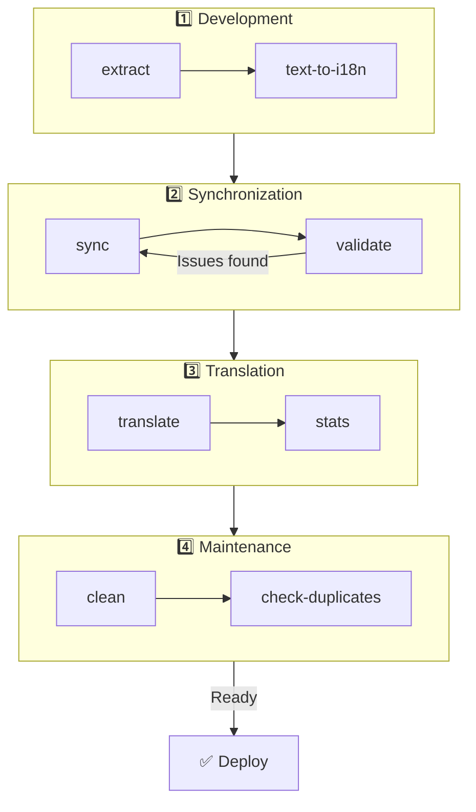

# 🌐 nuxt-i18n-micro-cli-guide

## 📖 Introduksjon

`nuxt-i18n-micro-cli` er et kommandolinjeverktøy designet for å strømlinjeforme lokaliserings- og internasjonaliseringsprosessen i Nuxt.js-prosjekter som bruker `nuxt-i18n-micro`-modulen (Nuxt I18n Micro). Det tilbyr verktøy for å hente ut oversettelsesnøkler fra kodebasen, administrere oversettelsesfiler, synkronisere oversettelser på tvers av lokaler og automatisere oversettelsesprosessen ved hjelp av eksterne oversettelsestjenester.

Denne guiden veileder deg gjennom installasjon, konfigurasjon og bruk av `nuxt-i18n-micro-cli` for å administrere prosjektets oversettelser effektivt. Pakken finnes på [npmjs.com](https://www.npmjs.com/package/nuxt-i18n-micro-cli).

## 🔧 Installasjon og oppsett

### 📦 Installere nuxt-i18n-micro-cli

Installer globalt eller som en dev-avhengighet i Nuxt-prosjektet (anbefalt for CI):

```bash
# global
npm install -g nuxt-i18n-micro-cli

# or per project
pnpm add -D nuxt-i18n-micro-cli
pnpm exec i18n-micro text-to-i18n --dryRun
```

Bruk **`nuxt-i18n-micro-cli` ≥ 2.1.1** hvis prosjektet ditt bruker Nuxt 4 sitt `app/`-katalog (`app/pages`, `app/components`, …). Eldre CLI-versjoner scannet kun `pages/` i prosjektroten.

### 🛠 Initialisere i prosjektet

Etter installasjon kan du kjøre `i18n-micro`-kommandoer i Nuxt.js-prosjektkatalogen.

Sørg for at prosjektet er satt opp med `nuxt-i18n-micro` og har nødvendig konfigurasjon i `nuxt.config.ts` (eller `nuxt.config.js`).

### 📄 Vanlige argumenter

- `--cwd`: Angi gjeldende arbeidskatalog (standard er `.`).
- `--logLevel`: Sett log-nivå (`silent`, `info`, `verbose`).
- `--translationDir`: Katalog som inneholder JSON-oversettelsesfiler (standard: `locales`).

## 📊 Oversikt over CLI-arbeidsflyt



### Arbeidsflyt-steg

| Fase            | Kommandoer                  | Formål                            |
| --------------- | --------------------------- | --------------------------------- |
| **Utvikling**   | `extract`, `text-to-i18n`   | Finn og hent ut oversettelsesnøkler |
| **Synkronisering** | `sync`, `validate`       | Sørg for at alle lokaler har samme nøkler |
| **Oversettelse** | `translate`, `stats`       | Autooversett manglende nøkler     |
| **Vedlikehold** | `clean`, `check-duplicates` | Hold oversettelser ryddige        |

## 📋 Kommandoer

### 🔄 `text-to-i18n`-kommando

CLI-pakke: [`nuxt-i18n-micro-cli`](https://www.npmjs.com/package/nuxt-i18n-micro-cli)

**Beskrivelse**: Scanner Vue-/TS-/JS-filer for hardkodede brukervendte strenger, erstatter dem med `$t('...')` og fletter nye nøkler inn i JSON-oversettelsesfilen. Kjør fra **Nuxt-prosjektroten** (der `nuxt.config` ligger).

**Bruk**:

```bash
i18n-micro text-to-i18n [options]
```

**Alternativer**:

| Alternativ              | Standard          | Beskrivelse                                                           |
| ----------------------- | ----------------- | --------------------------------------------------------------------- |
| `--translationFile`     | `locales/en.json` | JSON-fil for nye nøkler (relativ til prosjektroten).                  |
| `--path`                | —                 | Behandle bare én fil eller katalog (f.eks. `app/pages/about.vue`).    |
| `--context`             | —                 | Nøkkelprefiks (f.eks. `auth` → `auth.*`).                             |
| `--dryRun`              | `false`           | Forhåndsvis uten å skrive filer.                                      |
| `--verbose`             | `false`           | Ekstra logging.                                                       |
| `--interactive`         | `false`           | Bekreft eller rediger hver nøkkel før den anvendes.                   |
| `--extractOnlyDirs`     | `plugins`         | Kataloger der nøkler hentes ut, men kildefiler **ikke** omskrives.    |
| `--extractOnlyPatterns` | —                 | Glob-lignende extract-only-mønstre (f.eks. `**/*.plugin.ts`).         |

**Eksempel**:

```bash
i18n-micro text-to-i18n --translationFile locales/en.json --context auth --dryRun
```

#### Hvilke mapper scannes?

<Info>
Fra og med CLI **v2.1.1** scanner `text-to-i18n` både klassiske rot-mapper og `app/*`-ekvivalenter. Kjør kommandoen fra **prosjektroten** — ikke `cd app`.
</Info>

Samler `*.vue`, `*.js` og `*.ts` under:

| Nuxt 3 (prosjektrot) | Nuxt 4 (`app/`-katalog)   |
| --------------------- | ------------------------- |
| `pages/`              | `app/pages/`              |
| `components/`         | `app/components/`         |
| `plugins/`            | `app/plugins/`            |
| `layouts/`            | `app/layouts/`            |

Andre mapper (`server/`, `composables/`, `middleware/`, …) hoppes over med mindre du bruker `--path`. For Nuxt 4, kjør fra prosjektroten (ingen grunn til å `cd app`). Match `i18n.translationDir` i `--translationFile` hvis det ikke er `locales/`.

```bash
i18n-micro text-to-i18n --path app/pages
```

#### Slik fungerer det

1. Samle filer fra katalogene over (eller fra `--path`).
2. Erstatt literaler / mal-tekst med `$t('generated.key')` (`plugins/` er extract-only som standard).
3. Flett nye nøkler inn i `--translationFile` uten å fjerne eksisterende oppføringer.

**Eksempeltransformasjoner**:

Før:

```vue
<template>
  <div>
    <h1>Welcome to our site</h1>
    <p>Please sign in to continue</p>
  </div>
</template>
```

Etter:

```vue
<template>
  <div>
    <h1>{{ $t('pages.home.welcome_to_our_site') }}</h1>
    <p>{{ $t('pages.home.please_sign_in') }}</p>
  </div>
</template>
```

**Beste praksis**: dry run først; commit før full kjøring; juster `--translationFile` mot `i18n.translationDir` i `nuxt.config`; behold `--extractOnlyDirs plugins` for bootstrap-kode.

**Begrensninger**: separat npm-pakke (ikke bundlet med modulen); leser ikke `nuxt.config` automatisk; utsteder `$t(...)`; komplekse dynamiske strenger kan trenge `extract` / `search` i stedet.

### 📊 `stats`-kommando

**Beskrivelse**: `stats`-kommandoen brukes til å vise oversettelsesstatistikk for hver lokale i Nuxt.js-prosjektet. Den hjelper deg å forstå fremdriften i oversettelsene ved å vise hvor mange nøkler som er oversatt sammenlignet med det totale antallet nøkler.

**Bruk**:

```bash
i18n-micro stats [options]
```

**Alternativer**:

- `--full`: Vis bare kombinert oversettelsesstatistikk (standard: `false`).

**Eksempel**:

```bash
i18n-micro stats --full
```

### 🌍 `translate`-kommando

**Beskrivelse**: `translate`-kommandoen oversetter manglende nøkler automatisk ved hjelp av eksterne oversettelsestjenester. Denne kommandoen forenkler oversettelsesprosessen ved å utnytte API-er fra tjenester som Google Translate, DeepL og andre til å fylle inn manglende oversettelser.

**Bruk**:

```bash
i18n-micro translate [options]
```

**Alternativer**:

- `--service`: Oversettelsestjeneste (f.eks. `google`, `deepl`, `yandex`). Hvis ikke angitt, blir du bedt om å velge en.
- `--token`: API-nøkkel som samsvarer med valgt tjeneste. Hvis den ikke oppgis, blir du bedt om å skrive den inn.
- `--options`: Ekstra alternativer for oversettelsestjenesten, oppgitt som key:value-par, adskilt med komma (f.eks. `model:gpt-3.5-turbo,max_tokens:1000`).
- `--replace`: Oversett alle nøkler og erstatt eksisterende oversettelser (standard: `false`).

**Eksempel**:

```bash
i18n-micro translate --service deepl --token YOUR_DEEPL_API_KEY
```

#### 🌐 Støttede oversettelsestjenester

`translate`-kommandoen støtter flere oversettelsestjenester. Noen støttede er:

- **Google Translate** (`google`)
- **DeepL** (`deepl`)
- **Yandex Translate** (`yandex`)
- **OpenAI** (`openai`)
- **Azure Translator** (`azure`)
- **IBM Watson** (`ibm`)
- **Baidu Translate** (`baidu`)
- **LibreTranslate** (`libretranslate`)
- **MyMemory** (`mymemory`)
- **Lingva Translate** (`lingvatranslate`)
- **Papago** (`papago`)
- **Tencent Translate** (`tencent`)
- **Systran Translate** (`systran`)
- **Yandex Cloud Translate** (`yandexcloud`)
- **ModernMT** (`modernmt`)
- **Lilt** (`lilt`)
- **Unbabel** (`unbabel`)
- **Reverso Translate** (`reverso`)

#### ⚙️ Tjenestekonfigurasjon

Noen tjenester krever spesifikke konfigurasjoner eller API-nøkler. Når du bruker `translate`-kommandoen, kan du angi tjenesten og oppgi nødvendig `--token` (API-nøkkel) og eventuelle `--options`.

For eksempel:

```bash
i18n-micro translate --service openai --token YOUR_OPENAI_API_KEY --options openaiModel:gpt-3.5-turbo,max_tokens:1000
```

### 🛠️ `extract`-kommando

**Beskrivelse**: Henter ut oversettelsesnøkler fra kodebasen og organiserer dem etter scope.

**Bruk**:

```bash
i18n-micro extract [options]
```

**Alternativer**:

- `--prod, -p`: Kjør i produksjonsmodus.

**Eksempel**:

```bash
i18n-micro extract
```

### 🔄 `sync`-kommando

**Beskrivelse**: Synkroniserer oversettelsesfiler på tvers av lokaler, og sikrer at alle lokaler har samme nøkler.

**Bruk**:

```bash
i18n-micro sync [options]
```

**Eksempel**:

```bash
i18n-micro sync
```

### ✅ `validate`-kommando

**Beskrivelse**: Validerer oversettelsesfiler for manglende eller ekstra nøkler sammenlignet med referanselokalen.

**Bruk**:

```bash
i18n-micro validate [options]
```

**Eksempel**:

```bash
i18n-micro validate
```

### 🧹 `clean`-kommando

**Beskrivelse**: Fjerner ubrukte oversettelsesnøkler fra oversettelsesfiler.

**Bruk**:

```bash
i18n-micro clean [options]
```

**Eksempel**:

```bash
i18n-micro clean
```

### 📤 `import`-kommando

**Beskrivelse**: Konverterer PO-filer tilbake til JSON-format og lagrer dem i oversettelseskatalogen.

**Bruk**:

```bash
i18n-micro import [options]
```

**Alternativer**:

- `--potsDir`: Katalog som inneholder PO-filer (standard: `pots`).

**Eksempel**:

```bash
i18n-micro import --potsDir pots
```

### 📥 `export`-kommando

**Beskrivelse**: Eksporterer oversettelser til PO-filer for ekstern oversettelseshåndtering.

**Bruk**:

```bash
i18n-micro export [options]
```

**Alternativer**:

- `--potsDir`: Katalog for å lagre PO-filer (standard: `pots`).

**Eksempel**:

```bash
i18n-micro export --potsDir pots
```

### 🗂️ `export-csv`-kommando

**Beskrivelse**: `export-csv`-kommandoen eksporterer oversettelsesnøkler og -verdier fra JSON-filer, inkludert filstier, til CSV-format. Denne kommandoen er nyttig for team som foretrekker å jobbe med oversettelsesdata i regnearkprogramvare.

**Bruk**:

```bash
i18n-micro export-csv [options]
```

**Alternativer**:

- `--csvDir`: Katalog der de eksporterte CSV-filene lagres.
- `--delimiter`: Angi et skilletegn for CSV-filen (standard: `,`).

**Eksempel**:

```bash
i18n-micro export-csv --csvDir csv_files
```

### 📑 `import-csv`-kommando

**Beskrivelse**: `import-csv`-kommandoen importerer oversettelsesdata fra CSV-filer og oppdaterer tilhørende JSON-filer. Dette er nyttig for å anvende bulk-oversettelsesoppdateringer fra regneark.

**Bruk**:

```bash
i18n-micro import-csv [options]
```

**Alternativer**:

- `--csvDir`: Katalog som inneholder CSV-filene som skal importeres.
- `--delimiter`: Angi skilletegnet som brukes i CSV-filen (standard: `,`).

**Eksempel**:

```bash
i18n-micro import-csv --csvDir csv_files
```

### 🧾 `diff`-kommando

**Beskrivelse**: Sammenligner oversettelsesfiler mellom standardlokalen og andre lokaler i samme katalog (inkludert underkataloger). Kommandoen identifiserer manglende nøkler og verdier i standardlokalen sammenlignet med andre lokaler, noe som gjør det lettere å spore oversettelsesfremdrift eller avvik.

**Bruk**:

```bash
i18n-micro diff [options]
```

**Eksempel**:

```bash
i18n-micro diff
```

### 🔍 `check-duplicates`-kommando

**Beskrivelse**: `check-duplicates`-kommandoen sjekker etter dupliserte oversettelsesverdier i hver lokale på tvers av alle oversettelsesfiler, både rot-nivå og sidespesifikke. Den sikrer at ulike nøkler i samme språk ikke deler identiske oversettelsesverdier, noe som bidrar til å bevare klarhet og konsistens.

**Bruk**:

```bash
i18n-micro check-duplicates [options]
```

**Eksempel**:

```bash
i18n-micro check-duplicates
```

**Slik fungerer det**:

- Kommandoen sjekker både rot-nivå og sidespesifikke oversettelsesfiler for hver lokale.
- Hvis en oversettelsesverdi vises flere steder (enten i rot-oversettelser eller på tvers av ulike sider), rapporteres duplikatverdiene sammen med filen og nøkkelen der de finnes.
- Hvis ingen duplikater finnes, bekrefter kommandoen at lokalen er fri for dupliserte oversettelsesverdier.

Denne kommandoen bidrar til å sikre at oversettelsesnøkler beholder unike verdier, og forebygger utilsiktet gjentakelse innenfor samme lokale.

### 🔄 `replace-values`-kommando

**Beskrivelse**: `replace-values`-kommandoen lar deg utføre bulk-erstatninger av oversettelsesverdier på tvers av alle lokaler. Den støtter både enkle teksterstatninger og avanserte erstatninger med regulære uttrykk (regex). Du kan også bruke fangstgrupper i regex-mønstre og referere til dem i erstatningsstrengen, noe som er ideelt for mer komplekse erstatningsscenarier.

**Bruk**:

```bash
i18n-micro replace-values [options]
```

**Alternativer**:

- `--search`: Teksten eller regex-mønsteret som skal søkes etter i oversettelser. Påkrevd.
- `--replace`: Erstatningsteksten som skal brukes for de funne oversettelsene. Påkrevd.
- `--useRegex`: Aktiver søk med et regex-mønster (standard: `false`).

**Eksempel 1**: Enkel erstatning

Erstatt strengen "Hello" med "Hi" på tvers av alle lokaler:

```bash
i18n-micro replace-values --search "Hello" --replace "Hi"
```

**Eksempel 2**: Regex-erstatning

Aktiver regex-søk og erstatt alle strenger som starter med "Hello" etterfulgt av tall (f.eks. "Hello123") med "Hi" på tvers av alle lokaler:

```bash
i18n-micro replace-values --search "Hello\\d+" --replace "Hi" --useRegex
```

**Eksempel 3**: Bruk av regex-fangstgrupper

Bruk fangstgrupper til å sette inn deler av matchen dynamisk i erstatningen. For eksempel, erstatt "Hello [name]" med "Hi [name]" mens du beholder navnet:

```bash
i18n-micro replace-values --search "Hello (\\w+)" --replace "Hi $1" --useRegex
```

I dette tilfellet refererer `$1` til den første fangstgruppen, som matcher `[name]`-delen etter "Hello". Erstatningen beholder navnet fra den opprinnelige strengen.

**Slik fungerer det**:

- Kommandoen scanner gjennom alle oversettelsesfiler (både globale og sidespesifikke).
- Når en match blir funnet basert på søkestrengen eller regex-mønsteret, erstattes den matchede teksten med den oppgitte erstatningen.
- Ved bruk av regex kan fangstgrupper brukes i erstatningsstrengen ved å referere til dem med `$1`, `$2` osv.
- Alle endringer logges og viser filstien, oversettelsesnøkkelen og før-/etter-tilstanden.

**Logging**:
For hver erstatning logger kommandoen detaljer som:

- Lokale og filsti
- Oversettelsesnøkkelen som endres
- Gammel og ny verdi etter erstatning
- Ved bruk av regex med fangstgrupper viser loggene gruppematchene og hvordan de ble erstattet

Dette lar deg spore nøyaktig hvor og hvilke endringer som ble gjort under erstatningsoperasjonen, og gir en klar historikk over modifikasjoner på tvers av oversettelsesfilene.

## 🛠 Eksempler

- **Hente ut oversettelser**:

  ```bash
  i18n-micro extract
  ```

- **Oversette manglende nøkler med Google Translate**:

  ```bash
  i18n-micro translate --service google --token YOUR_GOOGLE_API_KEY
  ```

- **Oversette alle nøkler og erstatte eksisterende oversettelser**:

  ```bash
  i18n-micro translate --service deepl --token YOUR_DEEPL_API_KEY --replace
  ```

- **Validere oversettelsesfiler**:

  ```bash
  i18n-micro validate
  ```

- **Rydde ubrukte oversettelsesnøkler**:

  ```bash
  i18n-micro clean
  ```

- **Synkronisere oversettelsesfiler**:

  ```bash
  i18n-micro sync
  ```

## ⚙️ Konfigurasjonsguide

`nuxt-i18n-micro-cli` er avhengig av Nuxt.js sin i18n-konfigurasjon i `nuxt.config.ts` (eller `nuxt.config.js`). Sørg for at du har `nuxt-i18n-micro`-modulen installert og konfigurert.

### 🔑 Eksempel på nuxt.config.js

```ts
export default defineNuxtConfig({
  modules: ['nuxt-i18n-micro'],
  i18n: {
    locales: [
      { code: 'en', iso: 'en-US' },
      { code: 'fr', iso: 'fr-FR' },
    ],
    defaultLocale: 'en',
    fallbackLocale: 'en',
    translationDir: 'locales', // or 'app/locales' for Nuxt 4 colocation
  },
})
```

Sørg for at `translationDir` samsvarer med katalogen som brukes av `nuxt-i18n-micro-cli` (standard er `locales`).

## 📝 Beste praksis

### 🔑 Konsistent navngivning av nøkler

Sørg for at oversettelsesnøkler er konsistente og beskrivende for å unngå forvirring og duplisering.

### 🧹 Regelmessig vedlikehold

Bruk `clean`-kommandoen regelmessig for å fjerne ubrukte oversettelsesnøkler og holde oversettelsesfilene rene.

### 🛠 Automatiser oversettelsesarbeidsflyten

Integrer `nuxt-i18n-micro-cli`-kommandoer i utviklingsarbeidsflyten eller CI/CD-pipelinen for å automatisere uthenting, oversettelse, validering og synkronisering av oversettelsesfiler.

### 🛡️ Sikre API-nøkler

Når du bruker oversettelsestjenester som krever API-nøkler, sørg for at nøklene holdes sikre og ikke commit-es til versjonskontrollsystemer. Vurder å bruke miljøvariabler eller sikre nøkkelhåndteringsløsninger.

## 📞 Support og bidrag

Hvis du støter på problemer eller har forslag til forbedringer, kan du gjerne bidra til prosjektet eller åpne en issue i prosjektets repository.

---

Ved å følge denne guiden vil du kunne administrere oversettelser i Nuxt.js-prosjektet effektivt med `nuxt-i18n-micro-cli`, strømlinjeforme internasjonaliseringsarbeidet og sikre en jevn opplevelse for brukere på tvers av lokaler.
