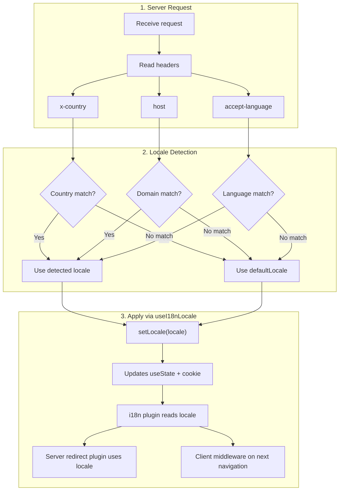

# 🔧 Egendefinert språkgjenkjenning i Nuxt I18n Micro

## 📖 Oversikt

Nuxt I18n Micro v3 tilbyr en sentralisert composable — `useI18nLocale()` — for all lokale-håndtering. Denne erstatter de manuelle `useState`-/`useCookie`-mønstrene fra v2. Ved å bruke `useI18nLocale().setLocale()` i en server-plugin kan du implementere hvilken som helst egendefinert deteksjonslogikk mens du beholder full kompatibilitet med modulens omdirigerings- og cookie-systemer.

## 🏗️ Arkitektur

```mermaid
flowchart TB
    subgraph Plugins["Plugin Execution Order"]
        A["Your plugin<br/>order: -10"] -->|setLocale()| B["01.plugin.ts<br/>order: -5"]
        B --> C["06.redirect.ts server<br/>order: 10"]
    end

    subgraph Client["Client SPA Navigation"]
        D["i18n-redirect.global.ts<br/>route middleware"]
    end

    subgraph State["Locale State"]
        E["useState('i18n-locale')"]
        F["localeCookie"]
    end

    A -->|"setLocale() updates both"| E
    A -->|"setLocale() updates both"| F
    B -->|reads| E
    C -->|reads| E
    C -->|reads| F
    D -->|reads target route +| E
```

**Nøkkelprinsipp**: Kall `useI18nLocale().setLocale()` i en server-plugin med `order: -10`. Dette oppdaterer både `useState('i18n-locale')` og lokale-cookien atomisk, slik at i18n-pluginen (`order: -5`) og server-omdirigeringspluginen (`order: 10`) ser riktig lokale på den første SSR-forespørselen. Klient-side auto-omdirigeringer kjører i den globale rute-mellomvaren på etterfølgende navigasjoner.

## 🛠️ Deaktivere innebygd autodeteksjon

Hvis du vil ha full kontroll over lokale-gjenkjenningen, deaktiver den innebygde mekanismen:

```ts
export default defineNuxtConfig({
  i18n: {
    autoDetectLanguage: false,
  },
})
```

## ✨ Eksempel: Server-side-gjenkjenning med `useI18nLocale`

Dette er den **anbefalte tilnærmingen** for alle strategier.

### Steg 1: Konfigurer `nuxt.config.ts`

```ts
export default defineNuxtConfig({
  modules: ['nuxt-i18n-micro'],
  i18n: {
    strategy: 'no_prefix', // Works with ANY strategy
    defaultLocale: 'en',
    localeCookie: 'user-locale',
    autoDetectLanguage: false,
    locales: [
      { code: 'en', iso: 'en-US' },
      { code: 'de', iso: 'de-DE' },
      { code: 'ja', iso: 'ja-JP' },
    ],
  },
})
```

### Steg 2: Opprett `plugins/i18n-loader.server.ts`

```ts
import { defineNuxtPlugin, useRequestHeaders } from '#imports'

export default defineNuxtPlugin({
  name: 'i18n-custom-loader',
  enforce: 'pre',
  order: -10, // Execute BEFORE the i18n plugin (which has order -5)

  setup() {
    const { setLocale } = useI18nLocale()
    const headers = useRequestHeaders(['host', 'x-country', 'accept-language'])
    let detectedLocale = 'en'

    // --- YOUR DETECTION LOGIC ---

    // Example 1: By domain
    const host = headers['host']
    if (host?.includes('example.de')) {
      detectedLocale = 'de'
    }
    // Example 2: By custom header
    else if (headers['x-country'] === 'JP') {
      detectedLocale = 'ja'
    }
    // Example 3: By Accept-Language header
    else if (headers['accept-language']?.includes('de')) {
      detectedLocale = 'de'
    }

    // --- APPLY THE LOCALE ---
    setLocale(detectedLocale)
  },
})
```

### Slik fungerer det



1. **Pluginen kjører først** (`order: -10`) — gjenkjenner lokale fra headere, domene eller andre kilder
2. **`setLocale()` oppdaterer begge** `useState('i18n-locale')` og cookie — sikrer umiddelbar synlighet for alle etterfølgende plugins
3. **i18n-pluginen** (`order: -5`) leser lokalen og laster riktige oversettelser
4. **Server-omdirigeringspluginen** (`order: 10`) bruker lokalen til omdirigeringsbeslutninger på SSR
5. **Klient-rute-mellomvaren** (`i18n-redirect`) anvender omdirigeringer på SPA-navigasjon når URL-lokalen ikke samsvarer med preferansen

## 🌐 Strategispesifikk atferd

`useI18nLocale().setLocale()` fungerer med **alle strategier**. Omdirigeringsatferden avhenger av strategien:

<Tip>
| Strategi | Effekt av `setLocale('de')` |
|----------|---------------------------|
| `no_prefix` | Rendrer på tysk, ingen URL-endring |
| `prefix` | 302 → `/de/` (server-side omdirigering) |
| `prefix_except_default` | 302 → `/de/` hvis `de` ≠ standard; ingen omdirigering hvis `de` = standard |
| `prefix_and_default` | Ingen omdirigering (både `/` og `/de/` er gyldige) |
</Tip>

**Viktige merknader:**

- Cookie-basert lokale-gjenkjenning er deaktivert som standard (`localeCookie: null`)
- Sett `localeCookie: 'user-locale'` for å aktivere cookie-persistering
- Hvis cookie-/state-verdien ikke er i `locales`-listen, faller den tilbake til `defaultLocale`

## 🏢 Avansert: Domenebasert gjenkjenning

For multi-domene-oppsett der hvert domene leverer en annen lokale:

```ts
import { defineNuxtPlugin, useRequestHeaders } from '#imports'

export default defineNuxtPlugin({
  name: 'i18n-domain-loader',
  enforce: 'pre',
  order: -10,

  setup() {
    const { setLocale } = useI18nLocale()
    const headers = useRequestHeaders(['host'])
    const host = headers['host'] || ''

    let detectedLocale = 'en'

    if (host.endsWith('.de') || host.includes('german.')) {
      detectedLocale = 'de'
    } else if (host.endsWith('.fr') || host.includes('french.')) {
      detectedLocale = 'fr'
    } else if (host.endsWith('.jp') || host.includes('japanese.')) {
      detectedLocale = 'ja'
    }

    setLocale(detectedLocale)
  },
})
```

## 🔄 Avansert: Respektere brukerpreferanse

Hvis brukere kan bytte språk manuelt, respekter deres valg foran autogjenkjenning:

```ts
import { defineNuxtPlugin, useRequestHeaders } from '#imports'

export default defineNuxtPlugin({
  name: 'i18n-smart-loader',
  enforce: 'pre',
  order: -10,

  setup() {
    const { getLocale, setLocale } = useI18nLocale()

    // If user already has a preference (from cookie), respect it
    if (getLocale()) {
      return
    }

    // Otherwise, detect locale from headers
    const headers = useRequestHeaders(['accept-language'])
    let detectedLocale = 'en'

    const acceptLanguage = headers['accept-language'] || ''
    if (acceptLanguage.includes('de')) {
      detectedLocale = 'de'
    } else if (acceptLanguage.includes('ja')) {
      detectedLocale = 'ja'
    }

    setLocale(detectedLocale)
  },
})
```

## ⚙️ Server-only- eller klient-only-plugins

Bruk [Nuxt-filnavnkonvensjoner](https://nuxt.com/docs/getting-started/directory-structure#plugins) for å styre hvor pluginen kjører:

- **Kun server**: `i18n-loader.server.ts` — kjører bare under SSR (anbefalt for header-basert deteksjon)
- **Kun klient**: `i18n-loader.client.ts` — kjører bare i nettleseren (for `localStorage`- eller DOM-basert deteksjon)


## ✅ Sammendrag

| Funksjon                               | Beskrivelse                                                       |
| -------------------------------------- | ----------------------------------------------------------------- |
| `useI18nLocale().setLocale()`          | Oppdaterer `useState` + cookie atomisk; fungerer med alle strategier |
| `useI18nLocale().getLocale()`          | Returnerer gjeldende lokale fra state eller cookie                |
| `useI18nLocale().getPreferredLocale()` | Returnerer foretrukket lokale (validert mot `locales`-listen)     |
| Plugin `order: -10`                    | Sikrer at pluginen kjører før i18n-initialiseringen               |
| `enforce: 'pre'`                       | Kjører i "pre"-plugin-gruppen                                     |

**Ikke gjør:**

- Bruk `useCookie('user-locale')` direkte — `useI18nLocale()` administrerer cookies internt
- Bruk `useState('i18n-locale')` direkte — bruk `useI18nLocale().setLocale()` i stedet
- Sett `order` >= -5 — pluginen din må kjøre før i18n-pluginen
