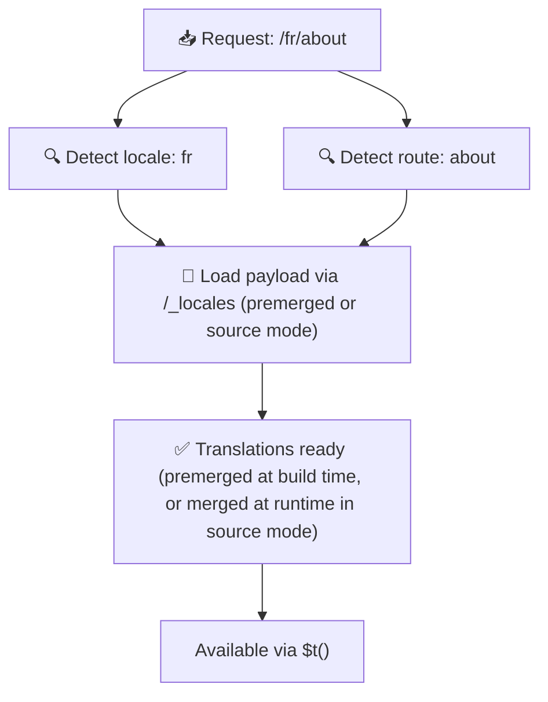

# 📂 Guide til mappestruktur

## 📖 Introduksjon

Å organisere oversettelsesfilene effektivt er avgjørende for å opprettholde et skalerbart og effektivt internasjonaliseringssystem (i18n). `Nuxt I18n Micro` forenkler denne prosessen ved å tilby en tydelig tilnærming til å administrere rot- og sidespesifikke oversettelser. Denne guiden går gjennom den anbefalte mappestrukturen og forklarer hvordan `Nuxt I18n Micro` håndterer disse oversettelsene.

## 🗂️ Anbefalt mappestruktur

`Nuxt I18n Micro` organiserer oversettelser i rot-filer og sidespesifikke filer inne i `pages`-katalogen. Med `translationPayloads.mode: 'premerged'` (standard) flettes rot-oversettelser automatisk inn i hver sidefil ved byggetid, slik at hver side har et komplett sett med oversettelser uten runtime-fletteoverhead.

Med `mode: 'source'` holdes kildefiler separate i Nitro-ressurser og flettes i kjøretid via `/_locales`-ruten. Se [Serverless Payload Output](/guides/performance#serverless-payload-output).

### 🔧 Grunnleggende struktur

Her er et grunnleggende eksempel på mappestrukturen du bør følge:

```text
locales/
├── pages/
│   ├── index/
│   │   ├── en.json
│   │   ├── fr.json
│   │   └── ar.json
│   ├── about/
│   │   ├── en.json
│   │   ├── fr.json
│   │   └── ar.json
├── en.json
├── fr.json
└── ar.json

```

### 📄 Forklaring av strukturen

#### 1. 🌍 Rot-oversettelsesfiler

- **Sti:** `/locales/\{locale\}.json` (f.eks. `/locales/en.json`)
- **Formål:** Disse filene inneholder oversettelser som deles på tvers av hele applikasjonen (navigasjonsmenyer, headere, footere osv.). Med `mode: 'premerged'` (standard) flettes de automatisk inn i hver sidespesifikke fil ved byggetid, slik at serveren returnerer én forhåndsbygget fil per side.

  **Eksempelinnhold (`/locales/en.json`):**

  ```json
  {
    "menu": {
      "home": "Home",
      "about": "About Us",
      "contact": "Contact"
    },
    "footer": {
      "copyright": "© 2024 Your Company"
    }
  }
  ```

#### 2. 📄 Sidespesifikke oversettelsesfiler

- **Sti:** `/locales/pages/\{routeName\}/\{locale\}.json` (f.eks. `/locales/pages/index/en.json`)
- **Formål:** Disse filene inneholder oversettelser som er spesifikke for enkelte sider. Med `mode: 'premerged'` (standard) flettes rot-oversettelser inn som en base ved byggetid, slik at hver sidefil blir selvstendig.

  **Eksempelinnhold (`/locales/pages/index/en.json`):**

  ```json
  {
    "title": "Welcome to Our Website",
    "description": "We offer a wide range of products and services to meet your needs."
  }
  ```

  **Eksempelinnhold (`/locales/pages/about/en.json`):**

  ```json
  {
    "title": "About Us",
    "description": "Learn more about our mission, vision, and values."
  }
  ```

### 📂 Håndtering av dynamiske ruter og nøstede stier

`Nuxt I18n Micro` transformerer automatisk dynamiske segmenter og nøstede stier i ruter til en flat mappestruktur ved hjelp av en spesifikk omdøpingskonvensjon. Dette sikrer at alle oversettelser lagres på en konsistent og lett tilgjengelig måte.

#### Mappestruktur for dynamiske ruter

Ved dynamiske ruter, som `/products/[id]`, konverterer modulen det dynamiske segmentet `[id]` til et statisk format i filstrukturen.

**Eksempel på mappestruktur for dynamiske ruter:**

For en rute som `/products/[id]`, lagres oversettelsesfilene i en mappe kalt `products-id`:

```text
locales/pages/
├── products-id/
│   ├── en.json
│   ├── fr.json
│   └── ar.json

```

**Eksempel på mappestruktur for nøstede dynamiske ruter:**

For en nøstet rute som `/products/key/[id]`, lagres oversettelsesfilene i en mappe kalt `products-key-id`:

```text
locales/pages/
├── products-key-id/
│   ├── en.json
│   ├── fr.json
│   └── ar.json

```

**Eksempel på mappestruktur for ruter med flere nivåer:**

For en mer kompleks nøstet rute som `/products/category/[id]/details`, lagres oversettelsesfilene i en mappe kalt `products-category-id-details`:

```text
locales/pages/
├── products-category-id-details/
│   ├── en.json
│   ├── fr.json
│   └── ar.json

```

### 🛠 Tilpasse mappestrukturen

Hvis du foretrekker å lagre oversettelser i en annen katalog, lar `Nuxt I18n Micro` deg tilpasse katalogen der oversettelsesfilene ligger. Du kan konfigurere dette i `nuxt.config.ts`-filen.

**Eksempel: Tilpasse oversettelseskatalogen**

```typescript
export default defineNuxtConfig({
  i18n: {
    translationDir: 'i18n', // Custom directory path
  },
})
```

Dette forteller `Nuxt I18n Micro` å lete etter oversettelsesfiler i `/i18n`-katalogen i stedet for standard `/locales`-katalogen.

## ⚙️ Hvordan oversettelser lastes

### 🌍 Dynamiske lokale-ruter

`Nuxt I18n Micro` bruker dynamiske lokale-ruter for å laste oversettelser effektivt. Når en bruker besøker en side, bestemmer modulen riktig lokale og laster de tilhørende oversettelsesfilene basert på gjeldende rute og lokale.



For eksempel:

- Å besøke `/en/index` laster oversettelser fra `/locales/pages/index/en.json`.
- Å besøke `/fr/about` laster oversettelser fra `/locales/pages/about/fr.json`.

Denne metoden sikrer at bare de nødvendige oversettelsene lastes, og optimaliserer både serverbelastning og klient-side-ytelse.

### 💾 Caching og pre-rendering

For å ytterligere forbedre ytelsen støtter `Nuxt I18n Micro` caching og pre-rendering av oversettelsesfiler:

- **Caching**: Når en oversettelsesfil er lastet, caches den for etterfølgende forespørsler, noe som reduserer behovet for gjentatt datahenting.
- **Pre-rendering**: Under byggeprosessen kan du pre-rendere oversettelsesfiler for alle konfigurerte lokaler og ruter, slik at de kan serveres direkte fra serveren uten runtime-forsinkelser.

## 📝 Beste praksis

### 📂 Bruk sidespesifikke filer med omhu

Utnytt sidespesifikke filer for å holde oversettelsene organiserte. Dette holder hver sides oversettelser slanke og raske å laste, noe som er spesielt viktig for sider med komplekst eller stort innhold.

### 🔑 Hold oversettelsesnøkler konsistente

Bruk konsistente navnekonvensjoner for oversettelsesnøkler på tvers av filer. Dette bidrar til å bevare klarhet og forebygger problemer når du administrerer oversettelser, spesielt etter hvert som applikasjonen vokser.

### 🗂️ Organiser oversettelser etter kontekst

Grupper relaterte oversettelser sammen i filene dine. For eksempel, grupper alle knappe-etiketter under en `buttons`-nøkkel og all skjemarelatert tekst under en `forms`-nøkkel. Dette forbedrer ikke bare lesbarheten, men gjør det også enklere å administrere oversettelser på tvers av ulike lokaler.

### ⚠️ Grense for nøstingsdybde (2 nivåer anbefalt)

Under klient-side-navigasjon bruker `Nuxt I18n Micro` en optimalisert 2-nivås dyp fletting for å kombinere oversettelser fra siden du forlater og siden du går til. Dette sikrer at overlappende nøstede nøkler (f.eks. begge sidene har nøkler under `common.*`) bevares under overgangs-animasjoner.

**Dette fungerer korrekt for standard `Seksjon → Nøkkel → Verdi`-struktur (2 nivåer):**

```json
// Page A translations
{ "common": { "fromA": "Text A" } }

// Page B translations
{ "common": { "fromB": "Text B" } }

// During transition, both are available:
// { "common": { "fromA": "Text A", "fromB": "Text B" } }
```

**Men hvis du bruker 3+ nivåer av nøsting, kan dypere nøkler bli overskrevet under overganger:**

```json
// Page A translations
{ "auth": { "form": { "login": "Login" } } }

// Page B translations
{ "auth": { "form": { "register": "Register" } } }

// During transition: "login" key is lost
// { "auth": { "form": { "register": "Register" } } }
```


### 🧹 Rydd regelmessig i ubrukte oversettelser

Over tid kan applikasjonen samle opp ubrukte oversettelsesnøkler, spesielt hvis funksjoner fjernes eller omstruktureres. Gå gjennom og rydd i oversettelsesfilene periodisk for å holde dem slanke og vedlikeholdbare.
