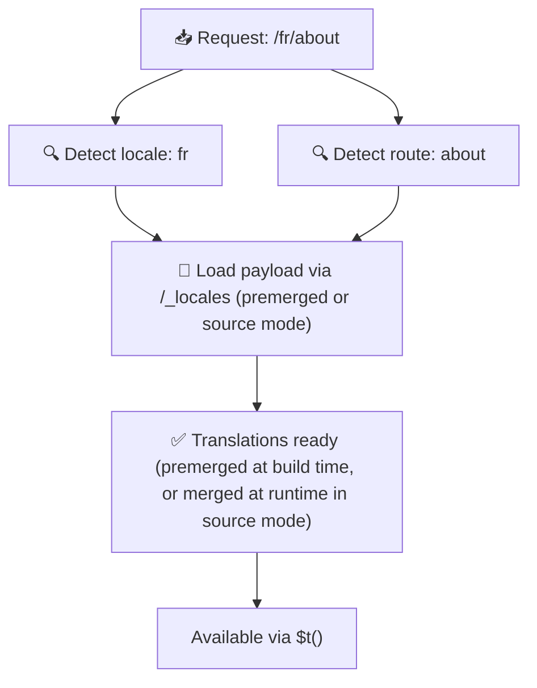

# 📂 Guide til mappestruktur

## 📖 Innledning

En effektiv organisering av oversettelsesfilene dine er avgjørende for å opprettholde et skalerbart og effektivt internasjonaliseringssystem (i18n). `Nuxt I18n Micro` forenkler denne prosessen ved å tilby en tydelig tilnærming for å håndtere både rotnivå- og sidespesifikke oversettelser. Denne guiden går gjennom den anbefalte mappestrukturen og forklarer hvordan `Nuxt I18n Micro` behandler disse oversettelsene.

## 🗂️ Anbefalt mappestruktur

`Nuxt I18n Micro` organiserer oversettelser i rotfiler og sidespesifikke filer i `pages`-mappen. Med `translationPayloads.mode: 'premerged'` (standard) slås rot-oversettelser automatisk inn i hver sidefil ved byggetid, slik at hver side har et komplett sett med oversettelser uten sammenslåingsoverhead ved kjøretid.

Med `mode: 'source'` holdes kildefilene atskilt i Nitro-assets og slås sammen ved kjøretid via `/_locales`-ruten. Se [Serverless Payload Output](/guides/performance#serverless-payload-output).

### 🔧 Grunnleggende struktur

Her er et grunnleggende eksempel på mappestrukturen du bør følge:

```text
locales/
├── pages/
│   ├── index/
│   │   ├── en.json
│   │   ├── fr.json
│   │   └── ar.json
│   ├── about/
│   │   ├── en.json
│   │   ├── fr.json
│   │   └── ar.json
├── en.json
├── fr.json
└── ar.json

```

### 📄 Forklaring av strukturen

#### 1. 🌍 Oversettelsesfiler på rotnivå

- **Sti:** `/locales/\{locale\}.json` (f.eks. `/locales/en.json`)
- **Formål:** Disse filene inneholder oversettelser som deles på tvers av hele applikasjonen (navigasjonsmenyer, headere, footere osv.). Med `mode: 'premerged'` (standard) slås de automatisk inn i hver sidespesifikke fil ved byggetid, slik at serveren returnerer én forhåndsbygd fil per side.

  **Eksempelinnhold (`/locales/en.json`):**

  ```json
  {
    "menu": {
      "home": "Home",
      "about": "About Us",
      "contact": "Contact"
    },
    "footer": {
      "copyright": "© 2024 Your Company"
    }
  }
  ```

#### 2. 📄 Sidespesifikke oversettelsesfiler

- **Sti:** `/locales/pages/\{routeName\}/\{locale\}.json` (f.eks. `/locales/pages/index/en.json`)
- **Formål:** Disse filene inneholder oversettelser som er spesifikke for enkeltsider. Med `mode: 'premerged'` (standard) slås rot-oversettelser inn som en base ved byggetid, slik at hver sidefil blir selvforsynt.

  **Eksempelinnhold (`/locales/pages/index/en.json`):**

  ```json
  {
    "title": "Welcome to Our Website",
    "description": "We offer a wide range of products and services to meet your needs."
  }
  ```

  **Eksempelinnhold (`/locales/pages/about/en.json`):**

  ```json
  {
    "title": "About Us",
    "description": "Learn more about our mission, vision, and values."
  }
  ```

### 📂 Håndtering av dynamiske ruter og nøstede stier

`Nuxt I18n Micro` transformerer automatisk dynamiske segmenter og nøstede stier i ruter til en flat mappestruktur ved hjelp av en bestemt navnekonvensjon. Dette sikrer at alle oversettelser lagres på en konsistent og lett tilgjengelig måte.

#### Mappestruktur for oversettelser i dynamiske ruter

Ved dynamiske ruter, som `/products/[id]`, konverterer modulen det dynamiske segmentet `[id]` til et statisk format i filstrukturen.

**Eksempel på mappestruktur for dynamiske ruter:**

For en rute som `/products/[id]` lagres oversettelsesfilene i en mappe kalt `products-id`:

```text
locales/pages/
├── products-id/
│   ├── en.json
│   ├── fr.json
│   └── ar.json

```

**Eksempel på mappestruktur for nøstede dynamiske ruter:**

For en nøstet rute som `/products/key/[id]` lagres oversettelsesfilene i en mappe kalt `products-key-id`:

```text
locales/pages/
├── products-key-id/
│   ├── en.json
│   ├── fr.json
│   └── ar.json

```

**Eksempel på mappestruktur for flernivå-nøstede ruter:**

For en mer kompleks nøstet rute som `/products/category/[id]/details` lagres oversettelsesfilene i en mappe kalt `products-category-id-details`:

```text
locales/pages/
├── products-category-id-details/
│   ├── en.json
│   ├── fr.json
│   └── ar.json

```

### 🛠 Tilpasse mappestrukturen

Hvis du foretrekker å lagre oversettelser i en annen mappe, lar `Nuxt I18n Micro` deg tilpasse mappen der oversettelsesfilene lagres. Dette kan du konfigurere i `nuxt.config.ts`-filen.

**Eksempel: Tilpasse mappen for oversettelser**

```typescript
export default defineNuxtConfig({
  i18n: {
    translationDir: 'i18n', // Custom directory path
  },
})
```

Dette får `Nuxt I18n Micro` til å se etter oversettelsesfiler i `/i18n`-mappen i stedet for standardmappen `/locales`.

## ⚙️ Hvordan oversettelser lastes

### 🌍 Dynamiske locale-ruter

`Nuxt I18n Micro` bruker dynamiske locale-ruter for å laste oversettelser effektivt. Når en bruker besøker en side, bestemmer modulen riktig locale og laster tilhørende oversettelsesfiler basert på gjeldende rute og locale.



For eksempel:

- Å besøke `/en/index` laster oversettelser fra `/locales/pages/index/en.json`.
- Å besøke `/fr/about` laster oversettelser fra `/locales/pages/about/fr.json`.

Denne metoden sørger for at kun nødvendige oversettelser lastes, og optimerer både serverbelastning og klientytelse.

### 💾 Caching og pre-rendering

For å øke ytelsen ytterligere støtter `Nuxt I18n Micro` caching og pre-rendering av oversettelsesfiler:

- **Caching**: Når en oversettelsesfil er lastet, caches den for etterfølgende forespørsler, slik at samme data ikke må hentes gjentatte ganger.
- **Pre-rendering**: Under byggeprosessen kan du pre-rendere oversettelsesfiler for alle konfigurerte locales og ruter, slik at de kan serveres direkte fra serveren uten forsinkelser ved kjøretid.

## 📝 Beste praksis

### 📂 Bruk sidespesifikke filer med omtanke

Bruk sidespesifikke filer for å holde oversettelser organiserte. Dette holder oversettelsene per side slanke og raske å laste, noe som er spesielt viktig for sider med komplekst eller stort innhold.

### 🔑 Hold oversettelsesnøklene konsistente

Bruk konsistente navnekonvensjoner for oversettelsesnøklene på tvers av filer. Dette bidrar til tydelighet og forhindrer problemer når du administrerer oversettelser, spesielt ettersom applikasjonen din vokser.

### 🗂️ Organiser oversettelser etter kontekst

Grupper relaterte oversettelser i filene dine. Grupper for eksempel alle knappeetiketter under en `buttons`-nøkkel og alle skjemarelaterte tekster under en `forms`-nøkkel. Dette forbedrer ikke bare lesbarheten, men gjør det også enklere å administrere oversettelser på tvers av ulike locales.

### ⚠️ Begrensning på nesting-dybde (2 nivåer anbefalt)

Under klientside-navigasjon bruker `Nuxt I18n Micro` en optimalisert 2-nivås dyp merge for å kombinere oversettelser fra siden man forlater og siden man går inn til. Dette sikrer at overlappende nøstede nøkler (f.eks. at begge sidene har nøkler under `common.*`) bevares under overgangsanimasjoner.

**Dette fungerer korrekt for den standard `Section → Key → Value`-strukturen (2 nivåer):**

```json
// Page A translations
{ "common": { "fromA": "Text A" } }

// Page B translations
{ "common": { "fromB": "Text B" } }

// During transition, both are available:
// { "common": { "fromA": "Text A", "fromB": "Text B" } }
```

**Men hvis du bruker 3 eller flere nivåer av nesting, kan dypere nøkler bli overskrevet under overganger:**

```json
// Page A translations
{ "auth": { "form": { "login": "Login" } } }

// Page B translations
{ "auth": { "form": { "register": "Register" } } }

// During transition: "login" key is lost
// { "auth": { "form": { "register": "Register" } } }
```

<Tip>

</Tip>

### 🧹 Rydd jevnlig opp i ubrukte oversettelser

Over tid kan applikasjonen samle opp ubrukte oversettelsesnøkler, spesielt hvis funksjoner fjernes eller omstruktureres. Gå periodisk gjennom og rydd opp i oversettelsesfilene for å holde dem slanke og vedlikeholdbare.
