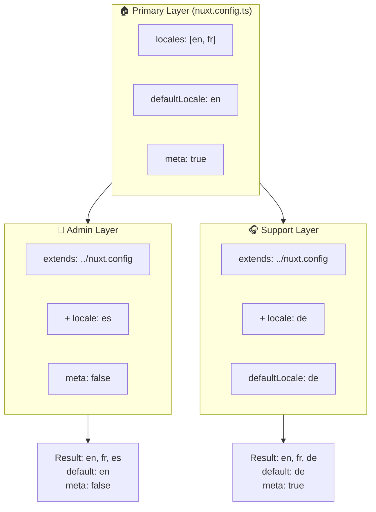

# 🗂️ Lag i `Nuxt I18n Micro`

## 📖 Introduksjon til lag

Lag i `Nuxt I18n Micro` lar deg administrere og tilpasse lokaliseringsinnstillinger fleksibelt på tvers av ulike deler av applikasjonen din. Ved å definere ulike lag kan du justere konfigurasjonen for forskjellige kontekster, som å overstyre innstillinger for bestemte seksjoner av siden eller opprette gjenbrukbare basiskonfigurasjoner som kan utvides av andre deler av applikasjonen.

### Arvflyt for lag



## 🛠️ Primær konfigurasjonslag

**Primær konfigurasjonslag** er der du setter opp standard-lokaliseringsinnstillingene for hele applikasjonen. Dette laget er essensielt fordi det definerer den globale konfigurasjonen, inkludert støttede lokaler, standardspråk og andre viktige i18n-innstillinger.

### 📄 Eksempel: Definere det primære konfigurasjonslaget

Her er et eksempel på hvordan du kan definere det primære konfigurasjonslaget i `nuxt.config.ts`-filen:

```typescript
export default defineNuxtConfig({
  i18n: {
    locales: [
      { code: 'en', iso: 'en-EN', dir: 'ltr' },
      { code: 'fr', iso: 'fr-FR', dir: 'ltr' },
      { code: 'ar', iso: 'ar-SA', dir: 'rtl' },
    ],
    defaultLocale: 'en', // The default locale for the entire app
    translationDir: 'locales', // Directory where translations are stored
    meta: true, // Automatically generate SEO-related meta tags like `alternate`
    autoDetectLanguage: true, // Automatically detect and use the user's preferred language
  },
})
```

## 🌱 Child-lag

Child-lag brukes til å utvide eller overstyre den primære konfigurasjonen for bestemte deler av applikasjonen. For eksempel kan det være at du vil legge til flere lokaler eller endre standardlokalen for en bestemt seksjon av siden. Child-lag er spesielt nyttige i modulære applikasjoner der ulike deler kan ha ulike lokaliseringskrav.

### 📄 Eksempel: Utvide det primære laget i et child-lag

Anta at du har en seksjon av siden som må støtte flere lokaler, eller at du vil deaktivere en bestemt lokale i en gitt kontekst. Slik gjør du det ved å utvide det primære konfigurasjonslaget:

```typescript
// basic/nuxt.config.ts (Primary Layer)
export default defineNuxtConfig({
  i18n: {
    locales: [
      { code: 'en', iso: 'en-EN', dir: 'ltr' },
      { code: 'fr', iso: 'fr-FR', dir: 'ltr' },
    ],
    defaultLocale: 'en',
    meta: true,
    translationDir: 'locales',
  },
})
```

```typescript
// extended/nuxt.config.ts (Child Layer)
export default defineNuxtConfig({
  extends: '../basic', // Inherit the base configuration from the 'basic' layer
  i18n: {
    locales: [
      { code: 'en', iso: 'en-EN', dir: 'ltr' }, // Inherited from the base layer
      { code: 'fr', iso: 'fr-FR', dir: 'ltr' }, // Inherited from the base layer
      { code: 'de', iso: 'de-DE', dir: 'ltr' }, // Added in the child layer
    ],
    defaultLocale: 'fr', // Override the default locale to French for this section
    autoDetectLanguage: false, // Disable automatic language detection in this section
  },
})
```

### 🌐 Bruke lag i en modulær applikasjon

I en større modulær Nuxt-applikasjon kan du ha flere seksjoner som hver krever egne i18n-innstillinger. Ved å utnytte lag kan du opprettholde en ren og skalerbar konfigurasjonsstruktur.

### 📄 Eksempel: Lagbasert konfigurasjon i en modulær applikasjon

Se for deg at du har en e-handelsside med tydelige seksjoner som hovedsiden, adminpanelet og kundeportalen. Hver seksjon kan trenge et forskjellig sett med lokaler eller andre i18n-innstillinger.

#### **Primærlag (global konfigurasjon):**

```typescript
// nuxt.config.ts
export default defineNuxtConfig({
  i18n: {
    locales: [
      { code: 'en', iso: 'en-EN', dir: 'ltr' },
      { code: 'fr', iso: 'fr-FR', dir: 'ltr' },
    ],
    defaultLocale: 'en',
    meta: true,
    translationDir: 'locales',
    autoDetectLanguage: true,
  },
})
```

#### **Child-lag for adminpanel:**

```typescript
// admin/nuxt.config.ts
export default defineNuxtConfig({
  extends: '../nuxt.config', // Inherit the global settings
  i18n: {
    locales: [
      { code: 'en', iso: 'en-EN', dir: 'ltr' }, // Inherited
      { code: 'fr', iso: 'fr-FR', dir: 'ltr' }, // Inherited
      { code: 'es', iso: 'es-ES', dir: 'ltr' }, // Specific to the admin panel
    ],
    defaultLocale: 'en',
    meta: false, // Disable automatic meta generation in the admin panel
  },
})
```

#### **Child-lag for kundeportalen:**

```typescript
// support/nuxt.config.ts
export default defineNuxtConfig({
  extends: '../nuxt.config', // Inherit the global settings
  i18n: {
    locales: [
      { code: 'en', iso: 'en-EN', dir: 'ltr' }, // Inherited
      { code: 'fr', iso: 'fr-FR', dir: 'ltr' }, // Inherited
      { code: 'de', iso: 'de-DE', dir: 'ltr' }, // Specific to the support portal
    ],
    defaultLocale: 'de', // Default to German in the support portal
    autoDetectLanguage: false, // Disable automatic language detection
  },
})
```

I dette modulære eksempelet:

- Hver seksjon (admin, support) har sine egne i18n-innstillinger, men alle arver basiskonfigurasjonen.
- Adminpanelet legger til spansk (`es`) som lokale og deaktiverer meta-tag-generering.
- Kundeportalen legger til tysk (`de`) som lokale og bruker tysk som standard i brukergrensesnittet.

## 📝 Beste praksis for bruk av lag

- **🔧 Hold det primære laget enkelt:** Det primære laget bør inneholde de vanligste innstillingene som gjelder globalt. Hold det oversiktlig for å sikre konsistens.
- **⚙️ Bruk child-lag for spesifikke tilpasninger:** Overstyr eller utvid bare innstillinger i child-lag når det er nødvendig. Denne tilnærmingen unngår unødvendig kompleksitet i konfigurasjonen.
- **📚 Dokumenter lagene dine:** Dokumenter tydelig formålet og detaljene til hvert lag i prosjektet. Dette bevarer klarhet og gjør det enklere for andre (eller ditt fremtidige jeg) å forstå konfigurasjonen.
