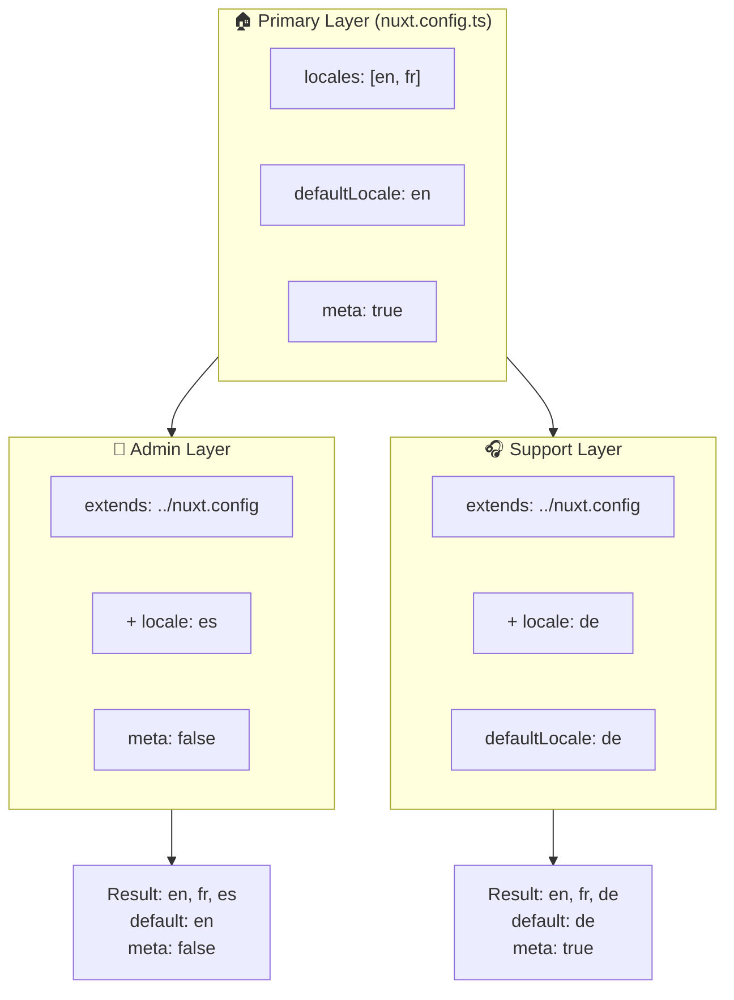

# 🗂️ Lag i `Nuxt I18n Micro`

## 📖 Introduksjon til lag

Lag (layers) i `Nuxt I18n Micro` lar deg administrere og tilpasse lokaliseringsinnstillinger fleksibelt på tvers av ulike deler av applikasjonen din. Ved å definere ulike lag kan du justere konfigurasjonen for forskjellige kontekster, som å overstyre innstillinger for spesifikke seksjoner på nettstedet ditt eller lage gjenbrukbare baskonfigurasjoner som kan utvides av andre deler av applikasjonen.

### Arvstrøm mellom lag



## 🛠️ Primær konfigurasjonslag

Det **primære konfigurasjonslaget** er der du setter opp standardinnstillingene for lokalisering for hele applikasjonen. Dette laget er essensielt fordi det definerer den globale konfigurasjonen, inkludert støttede locales, standardspråk og andre kritiske i18n-innstillinger.

### 📄 Eksempel: Definere det primære konfigurasjonslaget

Her er et eksempel på hvordan du kan definere det primære konfigurasjonslaget i `nuxt.config.ts`:

```typescript
export default defineNuxtConfig({
  i18n: {
    locales: [
      { code: 'en', iso: 'en-EN', dir: 'ltr' },
      { code: 'fr', iso: 'fr-FR', dir: 'ltr' },
      { code: 'ar', iso: 'ar-SA', dir: 'rtl' },
    ],
    defaultLocale: 'en', // The default locale for the entire app
    translationDir: 'locales', // Directory where translations are stored
    meta: true, // Automatically generate SEO-related meta tags like `alternate`
    autoDetectLanguage: true, // Automatically detect and use the user's preferred language
  },
})
```

## 🌱 Underlag

Underlag brukes til å utvide eller overstyre den primære konfigurasjonen for spesifikke deler av applikasjonen. Du vil for eksempel kanskje legge til flere locales eller endre standard-locale for en bestemt seksjon. Underlag er spesielt nyttige i modulære applikasjoner der ulike deler kan ha ulike lokaliseringsbehov.

### 📄 Eksempel: Utvide primærlaget i et underlag

Anta at du har en seksjon på nettstedet som må støtte flere locales, eller at du vil deaktivere en bestemt locale i en gitt kontekst. Slik oppnår du det ved å utvide det primære konfigurasjonslaget:

```typescript
// basic/nuxt.config.ts (Primary Layer)
export default defineNuxtConfig({
  i18n: {
    locales: [
      { code: 'en', iso: 'en-EN', dir: 'ltr' },
      { code: 'fr', iso: 'fr-FR', dir: 'ltr' },
    ],
    defaultLocale: 'en',
    meta: true,
    translationDir: 'locales',
  },
})
```

```typescript
// extended/nuxt.config.ts (Child Layer)
export default defineNuxtConfig({
  extends: '../basic', // Inherit the base configuration from the 'basic' layer
  i18n: {
    locales: [
      { code: 'en', iso: 'en-EN', dir: 'ltr' }, // Inherited from the base layer
      { code: 'fr', iso: 'fr-FR', dir: 'ltr' }, // Inherited from the base layer
      { code: 'de', iso: 'de-DE', dir: 'ltr' }, // Added in the child layer
    ],
    defaultLocale: 'fr', // Override the default locale to French for this section
    autoDetectLanguage: false, // Disable automatic language detection in this section
  },
})
```

### 🌐 Bruke lag i en modulær applikasjon

I en større, modulær Nuxt-applikasjon kan du ha flere seksjoner der hver krever sine egne i18n-innstillinger. Ved å utnytte lag kan du opprettholde en ren og skalerbar konfigurasjonsstruktur.

### 📄 Eksempel: Lagvis konfigurasjon i en modulær applikasjon

Se for deg et e-handelsnettsted med distinkte seksjoner som hovednettstedet, adminpanelet og kundestøtteportalen. Hver seksjon kan trenge et annet sett med locales eller andre i18n-innstillinger.

#### **Primærlag (Global konfigurasjon):**

```typescript
// nuxt.config.ts
export default defineNuxtConfig({
  i18n: {
    locales: [
      { code: 'en', iso: 'en-EN', dir: 'ltr' },
      { code: 'fr', iso: 'fr-FR', dir: 'ltr' },
    ],
    defaultLocale: 'en',
    meta: true,
    translationDir: 'locales',
    autoDetectLanguage: true,
  },
})
```

#### **Underlag for adminpanel:**

```typescript
// admin/nuxt.config.ts
export default defineNuxtConfig({
  extends: '../nuxt.config', // Inherit the global settings
  i18n: {
    locales: [
      { code: 'en', iso: 'en-EN', dir: 'ltr' }, // Inherited
      { code: 'fr', iso: 'fr-FR', dir: 'ltr' }, // Inherited
      { code: 'es', iso: 'es-ES', dir: 'ltr' }, // Specific to the admin panel
    ],
    defaultLocale: 'en',
    meta: false, // Disable automatic meta generation in the admin panel
  },
})
```

#### **Underlag for kundestøtteportal:**

```typescript
// support/nuxt.config.ts
export default defineNuxtConfig({
  extends: '../nuxt.config', // Inherit the global settings
  i18n: {
    locales: [
      { code: 'en', iso: 'en-EN', dir: 'ltr' }, // Inherited
      { code: 'fr', iso: 'fr-FR', dir: 'ltr' }, // Inherited
      { code: 'de', iso: 'de-DE', dir: 'ltr' }, // Specific to the support portal
    ],
    defaultLocale: 'de', // Default to German in the support portal
    autoDetectLanguage: false, // Disable automatic language detection
  },
})
```

I dette modulære eksempelet:

- Hver seksjon (admin, support) har sine egne i18n-innstillinger, men arver alle baskonfigurasjonen.
- Adminpanelet legger til spansk (`es`) som locale og deaktiverer automatisk generering av meta-tagger.
- Supportportalen legger til tysk (`de`) som locale og har tysk som standardspråk i brukergrensesnittet.

## 📝 Beste praksis for bruk av lag

- **🔧 Hold primærlaget enkelt:** Primærlaget bør inneholde de mest brukte innstillingene som gjelder globalt for hele applikasjonen. Hold det enkelt for å sikre konsistens.
- **⚙️ Bruk underlag for spesifikke tilpasninger:** Overstyr eller utvid kun innstillinger i underlag når det er nødvendig. Slik unngår du unødvendig kompleksitet i konfigurasjonen.
- **📚 Dokumenter lagene dine:** Dokumenter tydelig formålet og detaljene for hvert lag i prosjektet ditt. Dette bidrar til klarhet og gjør det enklere for andre (eller for deg selv senere) å forstå konfigurasjonen.
