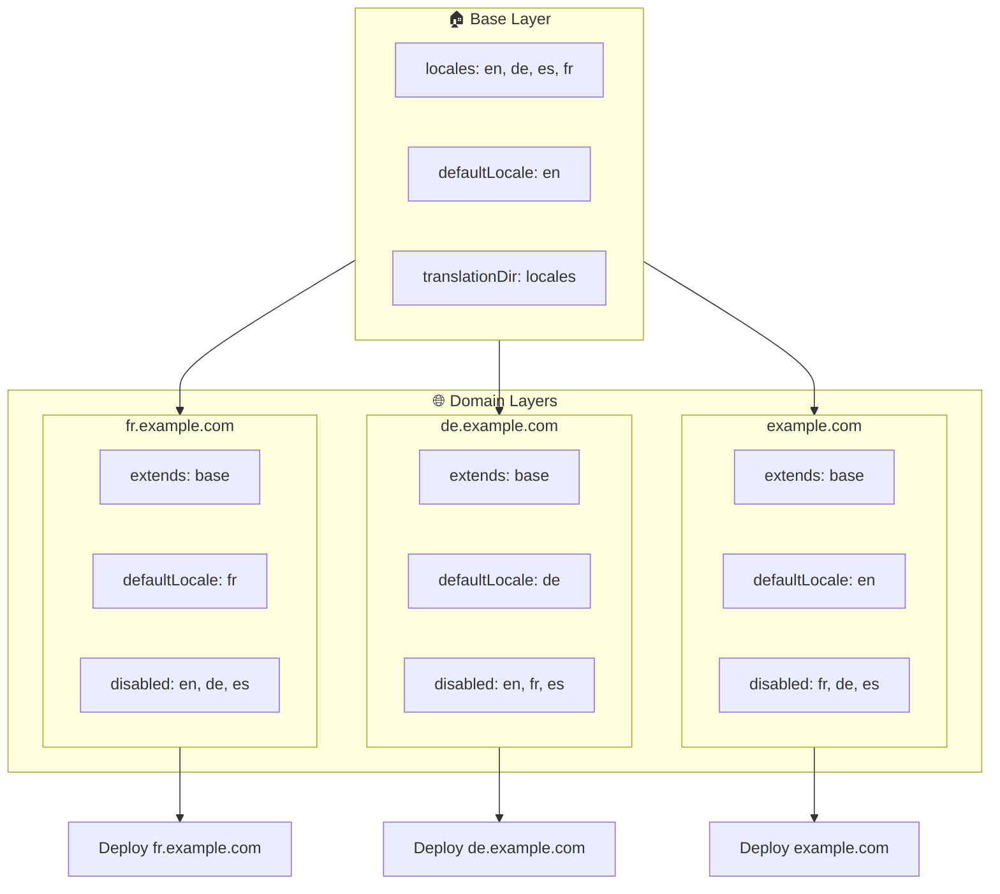

# 🌍 Sette opp multi-domene-lokaler med `Nuxt I18n Micro` ved bruk av lag

## 📝 Introduksjon

Ved å utnytte lag i `Nuxt I18n Micro` kan du opprette et fleksibelt og vedlikeholdbart oppsett for multi-domene-lokalisering. Denne tilnærmingen forenkler ikke bare domenehåndtering ved å eliminere behovet for kompleks funksjonalitet, men gir også effektiv lastfordeling og redusert prosjektkompleksitet. Ved å kjøre separate prosjekter for ulike lokaler kan applikasjonen enkelt skaleres og tilpasses varierende lokale-krav på tvers av flere domener, og tilbyr en robust og skalerbar løsning for globale applikasjoner.

## 🎯 Mål

Å lage et oppsett der ulike domener leverer bestemte lokaler ved å tilpasse konfigurasjonen i child-lagene. Denne metoden utnytter Nuxts lag-system og lar deg opprettholde en basiskonfigurasjon mens du utvider eller endrer den for hvert domene.

### Multi-domene-arkitektur



## 🛠 Steg for å implementere multi-domene-lokaler

### 1. **Opprett base-laget**

Start med å opprette et basiskonfigurasjonslag som inneholder alle felles lokale-innstillinger for applikasjonen din. Denne konfigurasjonen fungerer som fundamentet for andre domenespesifikke konfigurasjoner.

#### **Konfigurasjon av base-laget**

Opprett basis-konfigurasjonsfilen `base/nuxt.config.ts`:

```typescript
// base/nuxt.config.ts

export default defineNuxtConfig({
  i18n: {
    locales: [
      { code: 'en', iso: 'en-US', dir: 'ltr' },
      { code: 'de', iso: 'de-DE', dir: 'ltr' },
      { code: 'es', iso: 'es-ES', dir: 'ltr' },
    ],
    defaultLocale: 'en',
    translationDir: 'locales',
    meta: true,
    autoDetectLanguage: true,
  },
})
```

### 2. **Opprett domenespesifikke child-lag**

For hvert domene oppretter du et child-lag som endrer basiskonfigurasjonen for å møte de spesifikke kravene til det domenet. Du kan deaktivere lokaler som ikke trengs for et bestemt domene.

#### **Eksempel: Konfigurasjon for det franske domenet**

Opprett en child-lag-konfigurasjon for det franske domenet i `fr/nuxt.config.ts`:

```typescript
// fr/nuxt.config.ts

export default defineNuxtConfig({
  extends: '../base', // Inherit from the base configuration

  i18n: {
    locales: [
      { code: 'en', iso: 'en-US', dir: 'ltr', disabled: true }, // Disable English
      { code: 'fr', iso: 'fr-FR', dir: 'ltr' }, // Add and enable the French locale
      { code: 'de', iso: 'de-DE', dir: 'ltr', disabled: true }, // Disable German
      { code: 'es', iso: 'es-ES', dir: 'ltr', disabled: true }, // Disable Spanish
    ],
    defaultLocale: 'fr', // Set French as the default locale
    autoDetectLanguage: false, // Disable automatic language detection
  },
})
```

#### **Eksempel: Konfigurasjon for det tyske domenet**

Opprett tilsvarende en child-lag-konfigurasjon for det tyske domenet i `de/nuxt.config.ts`:

```typescript
// de/nuxt.config.ts

export default defineNuxtConfig({
  extends: '../base', // Inherit from the base configuration

  i18n: {
    locales: [
      { code: 'en', iso: 'en-US', dir: 'ltr', disabled: true }, // Disable English
      { code: 'fr', iso: 'fr-FR', dir: 'ltr', disabled: true }, // Disable French
      { code: 'de', iso: 'de-DE', dir: 'ltr' }, // Use the German locale
      { code: 'es', iso: 'es-ES', dir: 'ltr', disabled: true }, // Disable Spanish
    ],
    defaultLocale: 'de', // Set German as the default locale
    autoDetectLanguage: false, // Disable automatic language detection
  },
})
```

### 3. **Deploy applikasjonen for hvert domene**

Deploy applikasjonen med riktig konfigurasjon for hvert domene. For eksempel:

- Deploy `fr`-lagets konfigurasjon til `fr.example.com`.
- Deploy `de`-lagets konfigurasjon til `de.example.com`.

### 4. **Sett opp flere prosjekter for ulike lokaler**

For hver lokale og hvert domene må du kjøre en separat instans av applikasjonen. Dette sikrer at hvert domene leverer riktig lokale-konfigurasjon, optimaliserer lastfordelingen og forenkler prosjektstrukturen. Ved å kjøre flere prosjekter tilpasset hver lokale kan du opprettholde et rent skille mellom konfigurasjoner og redusere kompleksiteten i det samlede oppsettet.

### 5. **Konfigurer ruting basert på domene**

Sørg for at rutingen er konfigurert til å dirigere brukere til riktig prosjekt basert på domenet de får tilgang til. Dette sikrer at hvert domene leverer den riktige lokalen, forbedrer brukeropplevelsen og opprettholder konsistens på tvers av ulike regioner.

### 6. **Deploy og verifiser**

Etter å ha konfigurert lagene og deployet dem til sine respektive domener, sjekk at hvert domene leverer riktig lokale. Test applikasjonen grundig for å bekrefte at riktig lokale lastes avhengig av domenet.

## 📝 Beste praksis

- **Hold basiskonfigurasjonen generisk**: Basiskonfigurasjonen bør dekke generelle innstillinger som gjelder for alle domener.
- **Isoler domenespesifikk logikk**: Behold domenespesifikke konfigurasjoner i sine respektive lag for å opprettholde klarhet og separasjon av ansvar.

## 🎉 Konklusjon

Ved å utnytte lag i `Nuxt I18n Micro` kan du opprette et fleksibelt og vedlikeholdbart oppsett for multi-domene-lokalisering. Denne tilnærmingen eliminerer ikke bare behovet for kompleks domenehåndtering, men lar deg også distribuere lasten effektivt og redusere prosjektkompleksiteten. Å kjøre separate prosjekter for ulike lokaler sikrer at applikasjonen kan skaleres enkelt og tilpasses ulike lokale-krav på tvers av forskjellige domener, og gir en robust og skalerbar løsning for globale applikasjoner.
