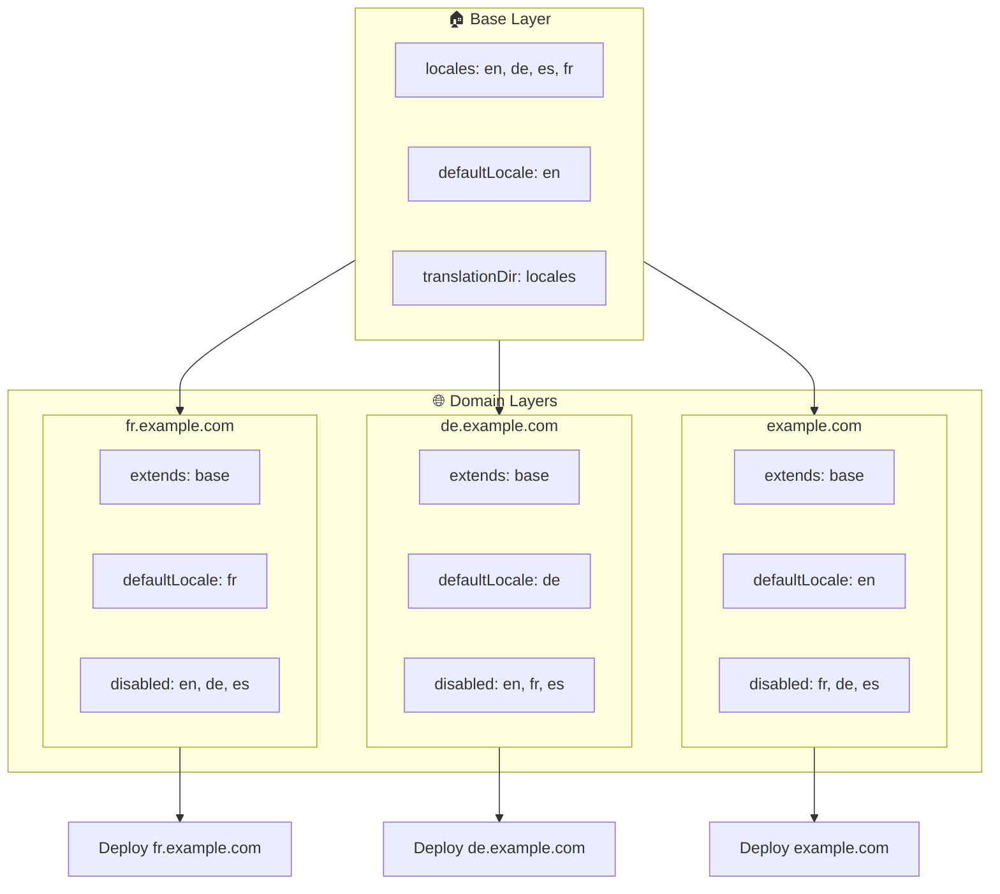

# 🌍 Sette opp locales for flere domener med `Nuxt I18n Micro` ved hjelp av lag

## 📝 Innledning

Ved å utnytte lag (layers) i `Nuxt I18n Micro` kan du lage et fleksibelt og vedlikeholdbart oppsett for lokalisering på flere domener. Denne tilnærmingen forenkler ikke bare domenehåndteringen ved å eliminere behovet for kompleks funksjonalitet — den muliggjør også effektiv lastfordeling og redusert kompleksitet i prosjektet. Ved å kjøre separate prosjekter for forskjellige locales kan applikasjonen skalere lett og tilpasse seg varierende locale-krav på tvers av flere domener, og gir en robust og skalerbar løsning for globale applikasjoner.

## 🎯 Mål

Å lage et oppsett der ulike domener serverer bestemte locales ved å tilpasse konfigurasjoner i undernivåer. Denne metoden utnytter Nuxts lag-system, og lar deg beholde en basiskonfigurasjon mens du utvider eller endrer den for hvert domene.

### Arkitektur for flere domener



## 🛠 Steg for å implementere locales for flere domener

### 1. **Opprett baslaget**

Start med å lage et baslag som inneholder alle felles locale-innstillinger for applikasjonen din. Denne konfigurasjonen fungerer som grunnlaget for andre domenespesifikke konfigurasjoner.

#### **Konfigurasjon av baslaget**

Opprett baskonfigurasjonsfilen `base/nuxt.config.ts`:

```typescript
// base/nuxt.config.ts

export default defineNuxtConfig({
  i18n: {
    locales: [
      { code: 'en', iso: 'en-US', dir: 'ltr' },
      { code: 'de', iso: 'de-DE', dir: 'ltr' },
      { code: 'es', iso: 'es-ES', dir: 'ltr' },
    ],
    defaultLocale: 'en',
    translationDir: 'locales',
    meta: true,
    autoDetectLanguage: true,
  },
})
```

### 2. **Opprett domenespesifikke underlag**

For hvert domene oppretter du et underlag som endrer baskonfigurasjonen etter behovene til det domenet. Du kan deaktivere locales som ikke er nødvendige for et bestemt domene.

#### **Eksempel: Konfigurasjon for det franske domenet**

Opprett en konfigurasjon for det franske domenet i `fr/nuxt.config.ts`:

```typescript
// fr/nuxt.config.ts

export default defineNuxtConfig({
  extends: '../base', // Inherit from the base configuration

  i18n: {
    locales: [
      { code: 'en', iso: 'en-US', dir: 'ltr', disabled: true }, // Disable English
      { code: 'fr', iso: 'fr-FR', dir: 'ltr' }, // Add and enable the French locale
      { code: 'de', iso: 'de-DE', dir: 'ltr', disabled: true }, // Disable German
      { code: 'es', iso: 'es-ES', dir: 'ltr', disabled: true }, // Disable Spanish
    ],
    defaultLocale: 'fr', // Set French as the default locale
    autoDetectLanguage: false, // Disable automatic language detection
  },
})
```

#### **Eksempel: Konfigurasjon for det tyske domenet**

Tilsvarende oppretter du en underlagskonfigurasjon for det tyske domenet i `de/nuxt.config.ts`:

```typescript
// de/nuxt.config.ts

export default defineNuxtConfig({
  extends: '../base', // Inherit from the base configuration

  i18n: {
    locales: [
      { code: 'en', iso: 'en-US', dir: 'ltr', disabled: true }, // Disable English
      { code: 'fr', iso: 'fr-FR', dir: 'ltr', disabled: true }, // Disable French
      { code: 'de', iso: 'de-DE', dir: 'ltr' }, // Use the German locale
      { code: 'es', iso: 'es-ES', dir: 'ltr', disabled: true }, // Disable Spanish
    ],
    defaultLocale: 'de', // Set German as the default locale
    autoDetectLanguage: false, // Disable automatic language detection
  },
})
```

### 3. **Deploy applikasjonen for hvert domene**

Deploy applikasjonen med riktig konfigurasjon for hvert domene. For eksempel:

- Deploy `fr`-lagkonfigurasjonen til `fr.example.com`.
- Deploy `de`-lagkonfigurasjonen til `de.example.com`.

### 4. **Sett opp flere prosjekter for ulike locales**

For hver locale og hvert domene må du kjøre en separat instans av applikasjonen. Dette sikrer at hvert domene serverer riktig locale-konfigurasjon, optimaliserer lastfordelingen og forenkler prosjektets struktur. Ved å kjøre flere prosjekter tilpasset hver locale kan du opprettholde et rent skille mellom konfigurasjonene og redusere kompleksiteten i det totale oppsettet.

### 5. **Konfigurer ruting basert på domene**

Sørg for at rutingen er konfigurert slik at brukere sendes til riktig prosjekt basert på domenet de bruker. Dette sikrer at hvert domene serverer riktig locale, forbedrer brukeropplevelsen og opprettholder konsistens på tvers av regioner.

### 6. **Deploy og verifiser**

Etter at du har konfigurert lagene og deployet dem til de respektive domenene, må du sikre at hvert domene serverer riktig locale. Test applikasjonen grundig for å bekrefte at riktig locale lastes avhengig av domenet.

## 📝 Beste praksis

- **Hold baskonfigurasjonen generisk**: Baskonfigurasjonen bør dekke generelle innstillinger som gjelder for alle domener.
- **Isoler domenespesifikk logikk**: Behold domenespesifikke konfigurasjoner i sine egne lag for å opprettholde tydelighet og separasjon av ansvar.

## 🎉 Oppsummering

Ved å utnytte lag i `Nuxt I18n Micro` kan du lage et fleksibelt og vedlikeholdbart oppsett for lokalisering over flere domener. Denne tilnærmingen fjerner ikke bare behovet for kompleks funksjonalitet knyttet til domenehåndtering — den lar deg også fordele lasten effektivt og redusere kompleksiteten i prosjektet. Å kjøre separate prosjekter for ulike locales sikrer at applikasjonen enkelt kan skaleres og tilpasses ulike locale-krav på tvers av domener, og gir en robust og skalerbar løsning for globale applikasjoner.
