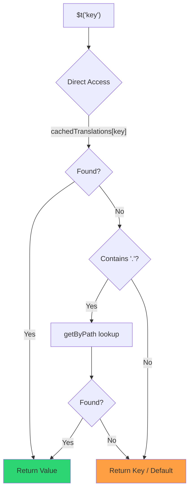

# 🚀 Ytelsesguide

## 📖 Introduksjon

`Nuxt I18n Micro` er designet med ytelse i tankene, og gir en betydelig forbedring over tradisjonelle internasjonaliseringsmoduler (i18n) som `nuxt-i18n`. Denne guiden gir en detaljert oversikt over ytelsesfordelene ved å bruke `Nuxt I18n Micro`, og hvordan den sammenlignes med andre løsninger.

## 🤔 Hvorfor fokusere på ytelse?

I storskala-prosjekter og miljøer med høy trafikk kan ytelsesflaskehalser føre til trege byggetider, økt minnebruk og dårlige serverresponstider. Disse problemene blir mer fremtredende med komplekse i18n-oppsett som involverer store oversettelsesfiler. `Nuxt I18n Micro` ble bygget for å møte disse utfordringene direkte ved å optimalisere for hastighet, minneeffektivitet og minimal påvirkning på applikasjonens bundle-størrelse.

## 📊 Ytelsessammenligning

Vi har utført en serie tester på identiske fixtures via `pnpm test:performance` (`pnpm -C scripts cli performance`) mot **`@nuxtjs/i18n@10.6.0`**. Full metodikk og diagrammer: [Ytelsestestresultater](/guides/performance-results).

Standard CLI-profil: **4 lokaler** × **2 sider** (`index`, `page`) × ~10k index-blad-nøkler. Øk `--locales` / `--keys` for en tyngre regresjons-radar-belastning. Rapporten deler **kode**, **oversettelser** (inkludert `@nuxtjs/i18n` `chunks/raw/*`) og **total** deployerbar utdata.

```bash
pnpm test:performance
pnpm -C scripts cli performance --only micro --skip-stress
pnpm -C scripts cli performance --locales 12 --keys 100000 --runs 3
```

### ⏱️ Byggetid og ressursforbruk

<Accordion title="**@nuxtjs/i18n v10.6**">
- **Kode-bundle**: 2.16 MB
- **Oversettelser**: 7.21 MB (message-chunker + lokale-payloads)
- **Total deployerbar**: 9.37 MB
- **Maks minnebruk**: 1 821 MB
- **Forløpt tid**: 8.34s (snitt av 3)
</Accordion>

<Tip>
- **Kode-bundle**: 1.74 MB — **~19% mindre kode enn `@nuxtjs/i18n` v10.6**
- **Oversettelser**: 6.8 MB (lazy-lastet JSON)
- **Total deployerbar**: 8.54 MB
- **Maks minnebruk**: 1 065 MB — **~41% mindre minne enn `@nuxtjs/i18n` v10.6**
- **Forløpt tid**: 5.34s — **~36% raskere enn `@nuxtjs/i18n` v10.6** (≈ plain-nuxt-baseline)
</Tip>

> Eldre dokumenter som viste `@nuxtjs/i18n` "kode ≈ 15 MB / oversettelser 0 B" regnet `chunks/raw`-meldingsfiler som app-kode. Den nåværende klassifikatoren skiller dem; gapet på **kode** er mindre, og micro leder fortsatt på byggetid, toppminne (RSS) og lasttester.

Se [den fullstendige benchmark-rapporten](/guides/performance-results) for diagrammer, Autocannon-resultater og fixture-detaljer.

### 🌐 Serverytelse under belastning

Artillery (6s@6 + 60s@60) og Autocannon (10c / 10s), snitt av 3 påfølgende kjøringer per fixture.

<Accordion title="**@nuxtjs/i18n v10.6**">
- **Forespørsler per sekund (Artillery)**: 143 [#/sek]
- **Gjennomsnittlig responstid**: 956 ms
- **Autocannon RPS / snitt-latens**: 72 / 139 ms
</Accordion>

<Tip>
- **Forespørsler per sekund (Artillery)**: 275 [#/sek] — **~93% mer enn `@nuxtjs/i18n` v10.6**
- **Gjennomsnittlig responstid**: 483 ms — **~49% raskere enn `@nuxtjs/i18n` v10.6**
- **Autocannon RPS / snitt-latens**: 162 / 62 ms
</Tip>

### 📈 Visuell sammenligning

<Note>
Interaktivt diagram utelates i Mintlify-dokumentene. Se benchmark-tabellene på denne siden eller [VitePress-dokumentene](https://s00d.github.io/nuxt-i18n-micro/guide/performance-results) for diagram: `chart`.
</Note>

<Note>
Interaktivt diagram utelates i Mintlify-dokumentene. Se benchmark-tabellene på denne siden eller [VitePress-dokumentene](https://s00d.github.io/nuxt-i18n-micro/guide/performance-results) for diagram: `chart`.
</Note>

| Metrikk         | @nuxtjs/i18n v10.6 | i18n-micro | Forbedring         |
| --------------- | ------------------ | ---------- | ------------------ |
| Byggetid        | 8.34s              | 5.34s      | **~36% raskere**   |
| Minne (bygg)    | 1 821 MB           | 1 065 MB   | **~41% mindre**    |
| Kode-bundle     | 2.16 MB            | 1.74 MB    | **~19% mindre**    |
| Responstid      | 956 ms             | 483 ms     | **~49% raskere**   |
| RPS (Artillery) | 143                | 275        | **~93% mer**       |

### 🔍 Tolkning av resultatene

Mot nåværende `@nuxtjs/i18n` **v10.6** (standard CLI-profil, snitt av 3):

- 🗜️ **Mindre kodegraf**: ~1.74 MB vs ~2.16 MB når meldings-chunker ikke feilaktig merkes som "kode".
- 🧠 **Lavere bygg-RSS**: ~1.1 GB topp vs ~1.8 GB.
- 🕒 **Raskere bygg**: ~5.3s vs ~8.3s (micro matcher plain-Nuxt-baseline på denne profilen).
- ⚡ **Mye bedre under belastning**: ~275 vs ~143 Artillery RPS, ~162 vs ~72 Autocannon RPS, lavere gjennomsnittlig latens.

Absolutte tall skiller seg fra eldre publiserte tabeller (mindre ordbøker, eldre Nuxt og en urettferdig "0 B oversettelser"-fordeling for `@nuxtjs/i18n`). Retningsmessig det samme: micro forblir foran på byggekostnad og request-gjennomstrømming.

## ⚙️ Sentrale optimaliseringer

### 🛠️ Minimalistisk design

`Nuxt I18n Micro` er bygget rundt en minimalistisk arkitektur med en liten kjerne og dedikerte strategipakker. Dette reduserer overhead og forenkler den interne logikken, noe som gir forbedret ytelse.

### 🚦 Effektiv ruting

I v3 er rutegenerering og runtime-sti-logikk delt inn i dedikerte pakker for optimal tree-shaking:

- **`@i18n-micro/route-strategy`** — Byggetids-rutegenerering: utvider Nuxt-sider med lokaliserte ruter. Bare den valgte strategien (`no_prefix`, `prefix`, `prefix_except_default`, `prefix_and_default`) inkluderes.
- **`@i18n-micro/path-strategy`** — Kjøretids-oppløsning av stier, omdirigeringer og lenkegenerering. Bruker rene funksjoner og forhåndsberegnede kontekst-flagg for å minimere allokeringer på hot paths. Sub-path-eksporter (`/prefix`, `/no-prefix` osv.) sikrer at bare den valgte implementasjonen bundles.

Denne tilnærmingen holder rutingskonfigurasjonen lettvekts og sikrer rask ruteoppløsning uavhengig av antall lokaler.

### 📂 Strømlinjeformet oversettelseslasting

Modulen støtter kun JSON-filer for oversettelser, med et tydelig skille mellom globale og sidespesifikke filer. Dette sikrer at bare nødvendig oversettelsesdata lastes til enhver tid, noe som ytterligere forbedrer ytelsen.

### 🔒 GlobalThis singleton-cache

Fra v3.0.0 bruker modulen et `globalThis` singleton-mønster med `Symbol.for` for å garantere en enkelt cache-instans i hele Node.js-prosessen. Dette forhindrer:

- Cache-duplisering når samme modul bundles flere ganger
- Per-forespørsel objektgjenskaping som skaper trykk på søppelinnsamling
- Minnelekkasjer fra foreldreløse cache-instanser

```mermaid
flowchart LR
    subgraph Process["Node.js Process"]
        G["globalThis[Symbol.for('CACHE')]"]

        subgraph R1["SSR Request 1"]
            P1[Plugin Instance] --> G
        end

        subgraph R2["SSR Request 2"]
            P2[Plugin Instance] --> G
        end

        subgraph R3["SSR Request 3"]
            P3[Plugin Instance] --> G
        end
    end

    G --> Cache["Single Map Instance"]
    Cache --> D1["en:index → translations"]
    Cache --> D2["en:about → translations"
```

```typescript
// Internal implementation pattern
const CACHE_KEY = Symbol.for('__NUXT_I18N_STORAGE_CACHE__')
if (!globalThis[CACHE_KEY]) {
  globalThis[CACHE_KEY] = new Map()
}
```

### ⚡ Optimalisert oversettelsesfunksjon (tFast)

`$t()`-funksjonen bruker en direkte oppslagsstrategi optimalisert for hastighet:

1. **Forhåndsberegnet kontekst**: Lokale og rutenavn beregnes én gang under navigasjon, ikke på hvert `$t()`-kall
2. **Enkeltkilde-oppslag**: Alle oversettelser (rot + sidespesifikke + fallback) er forhåndsflettet ved byggetid til én fil per side — ingen lagvis søking nødvendig
3. **Kumulativ dyp fletting ved navigasjon**: Ved navigasjon innenfor samme lokale dyp-flettes nye sideoversettelser (2-nivås dybde) inn i den aktive ordboken, slik at nøkler fra forrige side forblir synlige under overgangsanimasjoner — selv når sider deler overlappende nøstede prefikser (f.eks. begge sidene har nøkler under `common.*`)
4. **Søppelinnsamling via `page:transition:finish`**: Etter at overgangsanimasjonen er fullstendig ferdig, erstattes den flettede ordboken med rene oversettelser kun for den nye siden, og frigjør minne fra gammel-side-nøkler
5. **Direkte egenskapstilgang**: Bruker `obj[key]` i stedet for Map-oppslag på hot paths



```typescript
// Simplified lookup logic — single active dictionary
let val = cachedTranslations[key]
if (val === undefined && key.includes('.')) {
  val = getByPath(cachedTranslations, key)
}
```

### 💉 Server-side lasting (ingen HTML-embed)

Oversettelser lastet under SSR forblir i **serverminne** for `$t` under rendering. De blir **ikke** kopiert til `nuxtApp.payload` / HTML-dokumentet (samme idé som `@nuxtjs/i18n` med `experimental.preload: false`).

På klienten `await`-er `01.plugin.ts` `switchContext`, som laster `/\{apiBaseUrl\}/:page/:locale/data.json` før appen fortsetter — én forespørsel, ikke en 8 MB inline-blob.

`NuxtI18n` beholder fortsatt den aktive flettede ordboken (`cachedTranslations`) for `$t()` / `$has()`. Same-locale-navigasjoner dyp-fletter side-chunker til `page:transition:finish` rydder opp i utdaterte nøkler.

#### Hvor det står i dag

Tallene under leses fra budsjettfilen `pnpm run budget:payload` måler og håndhever.

{/* generated:payload-budget — do not edit; run `pnpm run docs:generate` */}

Målt på `playground` på tvers av `/`, `/de`:

| Måling | Størrelse |
| --- | --- |
| Oversettelseskilder på disk | 15.2 MB |
| Servert som separate payload-filer | 76.3 MB |
| Største inline `__NUXT_DATA__` | 6.9 MB |
| Klientressurser | 449.5 KB |

Playgroundet bærer en bevisst overdimensjonert ordbok, så dette er ikke tall å forvente fra en reell
applikasjon — de er et fast punkt å måle mot. Budsjettet feiler når de vokser uventet,
og slik legges det merke til hvis en uheldig endring i hva payloaden bærer.

{/* /generated:payload-budget */}

### 💾 Caching og pre-rendering

Oversettelser går gjennom flere cacher, og å vite hvilken som besvarte en forespørsel er forskjellen
mellom en fem-minutters og en fem-timers debugging-økt. Det finnes fire, i den
rekkefølgen en forespørsel møter dem:

| Lag | Hvor | Levetid | Fjernes av |
| --- | --- | --- | --- |
| Nettleser / CDN | `Cache-Control` på `/\{apiBaseUrl\}/**` | `httpCacheDuration`, `immutable` | en ny `?v=` — dvs. en deploy som endret oversettelser |
| Nitro rute-cache | `routeRules['/\{apiBaseUrl\}/**'].cache` | 60 s, stale-while-revalidate | omstart av server |
| Server-loader | in-process `CacheControl`, nøklet `locale:routeName` | prosess-levetid, eller `cacheTtl` | omstart av server, HMR i utvikling |
| Klient-store | `translationStorage` + den aktive chunken i `NuxtI18n` | side-levetid | oppdatering |

To regler holder dem fra å motsi hverandre:

- **Nitros rute-cache eksisterer bare når `?v=` gjør det.** Med en cache-buster er hver URL unik for sitt innhold, så å cache den server-side er fritt for utdaterthet. Sett `dateBuild: 0` og det laget er slått av, fordi URL-en da er stabil og svaret sier `must-revalidate` — en server-side cache ville svare fra en utdatert oppføring i opptil et minutt og stille beseire det.
- **`immutable` krever også `?v=`.** Uten en buster er headeren `public, max-age=0, must-revalidate`, uansett hva `httpCacheDuration` sier: en lang `max-age` på en URL som aldri endres, låser det første svaret en nettleser noen gang har sett.

<Warning>
Med `translationPayloads.publicAssets` (standard i premerged-modus) kopieres payloads til
`public/<apiBaseUrl>/\{page\}/\{locale\}/data.json`. En plattform som serverer den katalogen selv
(Cloudflare Pages, Firebase Hosting, `npx serve`) anvender sine egne headere — Nitros
`routeRules`-header når bare svar som går gjennom serveren. Sett cache-policy for
disse statiske filene i plattformens egen konfigurasjon.
</Warning>

🏁 **Pre-rendering**: i premerged-modus har `publicAssets` allerede skrevet klientens URL-tre til
`public/`. Meld deg på `prerenderRoutes` bare hvis du trenger Nitro til å materialisere handler-ruter når
den kopien er deaktivert.

### 🗜️ Komprimerte offentlige payloads

Når `nitro.compressPublicAssets` er aktivert, får oversettelses-payloadene som er kopiert til den offentlige
katalogen også `.gz`- og `.br`-søsken:

```ts
export default defineNuxtConfig({
  nitro: { compressPublicAssets: true },
})
```

Nitro komprimerer offentlige ressurser før hooken som kopierer payloadene, så uten dette ville de
vært den ene ukomprimerte delen av et statisk bygg. Modulen slår ikke på komprimering selv —
den anvender bare innstillingen du valgte. Per-encoding-valg (`\{ gzip: true, brotli: false \}`)
respekteres.

Playground-index-payload: 6 651 984 B rå, 1 012 831 B gzip, 821 617 B brotli.

### ☁️ Serverless payload-utdata

På **Node** leser SSR oversettelses-JSON fra `public/<apiBaseUrl>` (`readFile`, ingen Nitro `serverAssets` / Rollup `raw:`). På **Edge** inkluderer Nitro `serverAssets` det samme treet (foretrekk `mode: 'source'` for store kataloger).

```typescript
export default defineNuxtConfig({
  i18n: {
    translationPayloads: {
      serverAssets: true, // default — Node → public copy; Edge → serverAssets embed
      publicAssets: true, // default in premerged mode
    },
  },
})
```

Bruk `translationPayloads.mode: 'source'` for kompakte Edge-embeds (og valgfrie kompakte offentlige kopier):

```typescript
export default defineNuxtConfig({
  i18n: {
    translationPayloads: {
      mode: 'source',
    },
  },
})
```

`mode: 'source'` holder lag-flettede kildefiler kompakte og fletter rot/side/fallback i kjøretid gjennom den innebygde `/_locales`-ruten (eller Edge `assets:i18n`). Som standard deaktiverer den offentlige ressurskopier og pre-renderede payload-ruter.

<Warning>
`prerenderRoutes` er som standard `false`. Med `mode: 'source'` er `publicAssets` også som standard `false`. Ren statisk hosting uten et Nitro-/edge-kjøretidsmiljø kan derfor ikke laste oversettelser på klienten med mindre du aktiverer en av disse utdataene, holder `serverHandler` tilgjengelig i kjøretid, eller hoster payloads eksternt.

Standard premerged + `publicAssets` plasserer allerede `/\{apiBaseUrl\}/\{page\}/\{locale\}/data.json` under `public/`, så statiske verter kan servere klient-fetches uten Nitro.
</Warning>

<Warning>
Å sette `apiBaseServerHost` eller `apiBaseClientHost` flytter payload-servering til det origin, som kommer med sine egne krav — se [Konfigurasjon → Eksterne CDN-verter](/guides/configuration#external-cdn-hosts).
</Warning>

Eller deaktiver individuelle HTTP-/offentlige utdata og host payloads eksternt:

```typescript
export default defineNuxtConfig({
  i18n: {
    apiBaseClientHost: 'https://cdn.example.com',
    apiBaseServerHost: 'https://cdn.example.com',
    translationPayloads: {
      serverHandler: false,
      publicAssets: false,
      prerenderRoutes: false,
    },
  },
})
```

Behold `serverHandler` aktivert når du er avhengig av den innebygde lokale `/\{apiBaseUrl\}/:page/:locale/data.json`-ruten. Deaktiver den når payloads hostes eksternt og `apiBaseServerHost` peker på det eksterne origin. Aktiver `prerenderRoutes` bare når du trenger Nitro til å materialisere statiske payload-ruter og `publicAssets` ikke allerede har skrevet dem.

Under bygg advarer modulen når generert payload-utdata overskrider `translationPayloads.warnFileCount` (standard 500) eller `translationPayloads.warnSizeBytes` (standard 10 MB). Den advarer også når alle lokale utdata er deaktivert uten at eksterne payload-verter er konfigurert.

## 📝 Tips for maksimal ytelse

Her er noen tips for å sikre at du får best mulig ytelse ut av `Nuxt I18n Micro`:

- 📉 **Begrens lokale-data**: Inkluder bare de lokalene du trenger i prosjektet ditt for å holde bundle-størrelsen liten.
- 🗂️ **Bruk sidespesifikke oversettelser**: Organiser oversettelsesfilene etter side for å unngå å laste unødvendig data.
- 💾 **Aktiver caching**: Utnytt cache-funksjonene for å redusere serverbelastning og forbedre responstider.
- 🏁 **Utnytt pre-rendering**: Pre-render oversettelser for å øke hastigheten på sidelastinger og redusere runtime-overhead.

For detaljerte resultater av ytelsestestene, se [Ytelsestestresultater](/guides/performance-results).
