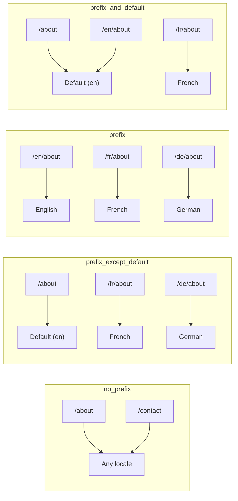
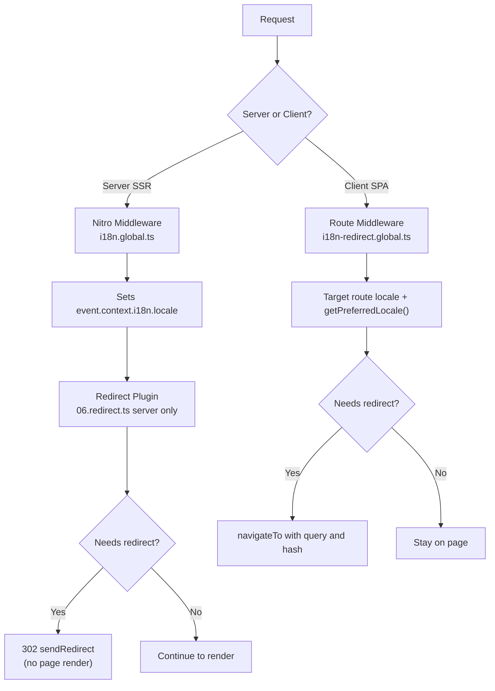

# 🗂️ Rutestrategier i Nuxt I18n Micro

## 📖 Oversikt

Nuxt I18n Micro styrer hvordan locale-prefikser vises i URL-ene via `strategy`-alternativet. Under panseret er det to pakker som implementerer dette:

- **`@i18n-micro/route-strategy`** — generering av ruter ved byggetid (utvider Nuxt-sider med lokaliserte ruter)
- **`@i18n-micro/path-strategy`** — sti-oppløsning ved kjøretid, omdirigeringer, SEO-attributter og lenkegenerering

Nuxt-modulen velger riktig strategiklasse ved byggetid og aliaser den via `#i18n-strategy`, slik at kun den valgte implementasjonen bundles.

## 🚦 Tilgjengelige strategier

{/* generated:option:strategy — do not edit; run `pnpm run docs:generate` */}

**Type** `Strategies` · **Standard** `'prefix_except_default'`

URL-rutingsstrategi for locale-prefikser.

- `'no_prefix'` — ingen locale i URL; locale lagres i cookie.
- `'prefix_except_default'` — prefiks for alle locales unntatt standard-locale.
- `'prefix'` — alltid prefiks, inkludert standard-locale.
- `'prefix_and_default'` — som `prefix`, men standard-locale er også tilgjengelig uten prefiks.

{/* /generated:option:strategy */}

### Sammenligning av strategier



### 🛑 `no_prefix`

URL-er har ikke noe locale-segment. Locale bestemmes av cookies, `useI18nLocale()`-tilstand, eller nettleserdeteksjon.

- **Ruter**: `/about`, `/contact` — samme URL-mønster for alle locales (ingen `/en/`- eller `/fr/`-prefiks)
- **Locale-persistens**: Via `localeCookie` (settes automatisk til `'user-locale'` hvis ikke spesifisert)
- **Egendefinerte stier**: Støttes via [`globalLocaleRoutes`](/guides/configuration#globallocaleroutes) og [`defineI18nRoute`](/guides/custom-locale-routes) — lokaliserte slugger genereres uten å legge til locale-prefiks i URL-ene (f.eks. `/about` vs. `/ueber-uns`). Nøstede ruter, aliaser og locale-baserte restriksjoner er enklere enn i `prefix_except_default`.

<Tip>
Ved bruk av `no_prefix` settes `localeCookie` automatisk til `'user-locale'` hvis ikke annet er spesifisert. Dette kreves fordi URL-en ikke inneholder locale-informasjon.
</Tip>

```typescript
i18n: {
  strategy: 'no_prefix'
  // localeCookie is automatically set to 'user-locale'
}
```

### 🚧 `prefix_except_default`

Alle ruter har et locale-prefiks **unntatt** standard-locale.

- **Standard-locale**: `/about`, `/contact`
- **Andre locales**: `/fr/about`, `/de/contact`
- **Standard-locale med prefiks gir 404**: `/en/about` → 404 (når `en` er standard)

```typescript
i18n: {
  strategy: 'prefix_except_default' // This is the default
}
```

### 🌍 `prefix`

Hver rute har et locale-prefiks, inkludert standard-locale.

- **Alle locales**: `/en/about`, `/fr/about`, `/de/about`
- **Rot `/`**: Omdirigerer til `/\{locale\}/` basert på brukerpreferanse

```typescript
i18n: {
  strategy: 'prefix'
}
```

### 🔄 `prefix_and_default`

Standard-locale er tilgjengelig både med og uten prefiks. Ikke-standard-locales har alltid et prefiks.

- **Standard-locale**: både `/about` og `/en/about` er gyldige
- **Andre locales**: `/fr/about`, `/de/about`
- **Ingen omdirigering fra `/`**: Både `/` og `/en/` serverer standard-locale

```typescript
i18n: {
  strategy: 'prefix_and_default'
}
```

## 🔀 Omdirigeringsarkitektur (v3)

I v3 er omdirigeringslogikken delt i to lag for optimal ytelse:

### Slik fungerer det



### Serverside (ingen flash)

1. **Nitro-mellomvare** (`i18n.global.ts`) kjører først — detekterer locale fra URL, cookie eller `Accept-Language`-header og setter `event.context.i18n.locale`
2. **Omdirigeringspluginen** (`06.redirect.ts`, kun server) sjekker om den aktuelle stien trenger en omdirigering med `i18nStrategy.getClientRedirect()` og sender en 302 **før** noen sideoppbygging skjer
3. Dette forhindrer «feil-flash» der brukere kort ser feil side før omdirigering

### Klientside (SPA-navigasjon)

1. Global rute-mellomvare (`i18n-redirect.global.ts`) kjører ved hver klientnavigasjon når `redirects` er aktivert
2. Utleder ønsket locale fra **målruten** først, med fallback til `useI18nLocale().getPreferredLocale()`
3. Bruker `i18nStrategy.getClientRedirect()` for å avgjøre om en omdirigering trengs
4. Bevarer `query` og `hash` ved omdirigering

### Prioritetsrekkefølge for locale

På serveren bestemmer omdirigeringspluginen ønsket locale i denne rekkefølgen:

1. **`useState('i18n-locale')`** — høyest prioritet (satt programmatisk via `useI18nLocale().setLocale()`)
2. **Cookie** — hvis `localeCookie` er konfigurert
3. **`Accept-Language`-header** — hvis `autoDetectLanguage: true`
4. **`defaultLocale`** — endelig fallback

På klienten foretrekker rute-mellomvaren locale fra målruten, og bruker deretter samme kjede av state/cookie-fallback.

### Omdirigeringsadferd per strategi

| Strategi                | Adferd for `GET /`                              | Krever cookie? |
| ----------------------- | --------------------------------------------- | ---------------- |
| `no_prefix`             | Ingen omdirigering (locale fra cookie/state)        | Auto-satt         |
| `prefix`                | 302 → `/\{locale\}/`                            | Anbefalt      |
| `prefix_except_default` | 302 → `/\{locale\}/` hvis locale ≠ standard        | Anbefalt      |
| `prefix_and_default`    | Ingen omdirigering (både `/` og `/\{locale\}/` gyldige) | Valgfritt         |

### Deaktivere omdirigeringer

```typescript
i18n: {
  redirects: false // Disables automatic locale redirects
}
```

Når `redirects: false` er automatiske locale-omdirigeringer deaktivert:

- **Server**: omdirigeringspluginen (`06.redirect.ts`, kun server) forblir registrert, men hopper over omdirigeringslogikken. Den utfører fortsatt **404-sjekker** for ugyldige locale-prefikser (f.eks. `/xx/about` der `xx` ikke er en gyldig locale) og **cookie-synkronisering** fra URL-prefiks (f.eks. besøk på `/fr/about` synker cookien til `fr`)
- **Klient**: `i18n-redirect`-globale rute-mellomvare er **ikke registrert** — ingen automatiske SPA-omdirigeringer

## 🍪 Locale-persistens basert på cookies

<Warning>
Når du bruker `prefix` eller `prefix_except_default` med `redirects: true` (standard), **må** du sette `localeCookie` for at omdirigeringer skal fungere korrekt. Uten en cookie kan ikke omdirigeringspluginen huske brukerens locale-preferanse på tvers av sidelastinger.

```typescript
i18n: {
  strategy: 'prefix_except_default',
  localeCookie: 'user-locale' // Required for redirects to work properly
}
```
</Warning>

**Slik fungerer `localeCookie` i v3:**

- Håndteres internt av `useI18nLocale()` — **ikke sett den manuelt** via `useCookie()`
- Når en bruker besøker en prefikset URL (f.eks. `/fr/about`), synkes cookien automatisk til `fr`
- Ved neste besøk til `/` brukes cookie-verdien til å omdirigere til `/\{locale\}/`
- Hvis cookien inneholder en ugyldig locale (ikke i `locales`-listen), faller den tilbake til `defaultLocale`

| Strategi                | Standard for `localeCookie` | Merknader                                |
| ----------------------- | ---------------------- | ------------------------------------ |
| `no_prefix`             | Auto: `'user-locale'`  | Kreves; settes automatisk          |
| `prefix`                | `null` (deaktivert)      | Sett til `'user-locale'` for omdirigeringer |
| `prefix_except_default` | `null` (deaktivert)      | Sett til `'user-locale'` for omdirigeringer |
| `prefix_and_default`    | `null` (deaktivert)      | Valgfritt                             |

## 🔍 `autoDetectLanguage` og `autoDetectPath`

### `autoDetectLanguage`

{/* generated:option:autoDetectLanguage — do not edit; run `pnpm run docs:generate` */}

**Type** `boolean` · **Standard** `true`

Detekter automatisk brukerens foretrukne språk fra `Accept-Language`-HTTP-headeren.
Brukes sammen med `autoDetectPath` for å avgjøre når deteksjon skjer.

{/* /generated:option:autoDetectLanguage */}

Sjekken kjøres i server-mellomvaren og er en fallback: en cookie eller eksisterende tilstand vinner.

```typescript
i18n: {
  autoDetectLanguage: true
}
```

### `autoDetectPath`

{/* generated:option:autoDetectPath — do not edit; run `pnpm run docs:generate` */}

**Type** `string` · **Standard** `'/'`

Hvor cookie- / Accept-Language-preferanseomdirigeringer kan kjøre (når `redirects` er aktivert).

- `'/'` — kun `/` (dyplenker i standard-locale forblir tilgjengelige; standard)
- `'no_prefix'` — kun stier uten locale-prefiks
- `'*'` — alle stier, inkludert omskriving av eksplisitt locale-prefiks
  (f.eks. `/fr/about` → `/de/about` når cookien foretrekker `de`)

- enhver annen streng — eksakt sti-treff (f.eks. `'/welcome'`)

Opprydding for prefiks-strategien (f.eks. `/en` → `/` under `prefix_except_default`) er ikke betinget.

{/* /generated:option:autoDetectPath */}

```typescript
i18n: {
  autoDetectPath: '/' // Default: only root
  // autoDetectPath: '*' // All paths — redirects even /fr/about to /de/about
}
```

<Warning>
Med `autoDetectPath: '*'` vil selv URL-er med et eksplisitt locale-prefiks (f.eks. `/fr/about`) bli omdirigert hvis brukerens foretrukne locale er en annen. Dette kan være nyttig for domenebaserte oppsett, men kan forvirre brukere som deler URL-er.
</Warning>

Med standard `autoDetectPath: '/'` og en locale-cookie:

| forespørsel | cookie | resultat |
| --- | --- | --- |
| `/` | `de` | 302 → `/de` |
| `/about` | `de` | 200, standard-locale (ingen omskriving) |

```typescript
i18n: {
  localeCookie: 'user-locale',
  strategy: 'prefix_except_default',
  // Default — remember language on entry, keep deep links stable
  autoDetectPath: '/',
  // Or redirect on every unprefixed path (but not /de/… → /fr/…):
  // autoDetectPath: 'no_prefix',
}
```

## ⚠️ Kjente problemer og beste praksis

### 1. Hydration-mismatch i `no_prefix`-strategien

Ved bruk av `no_prefix` bestemmes locale dynamisk. Hvis serveren og klienten er uenige om locale, vil du se en hydration-mismatch.

**Løsning**: Bruk `useI18nLocale().setLocale()` i en server-plugin (med `order: -10`) for å sette locale før i18n initialiseres:

```ts
// plugins/i18n-loader.server.ts
export default defineNuxtPlugin({
  name: 'i18n-custom-loader',
  enforce: 'pre',
  order: -10,
  setup() {
    const { setLocale } = useI18nLocale()
    setLocale('ja') // Your detection logic here
  },
})
```

Se [Egendefinert språkdeteksjon](/guides/custom-language-detection) for detaljerte eksempler.

### 2. Bruk navngitte ruter med `localeRoute`

Sti-basert ruting kan skape problemer med ruteoppløsning:

```typescript
// May cause issues
$localeRoute('/page')

// Preferred approach
$localeRoute({ name: 'page' })
```

### 3. Bruk av `pages: false` med i18n

Når du bruker Nuxt med `pages: false`:

```typescript
export default defineNuxtConfig({
  pages: false,
  i18n: {
    strategy: 'no_prefix', // Recommended
    disablePageLocales: true, // Required
    localeCookie: 'user-locale', // Required for persistence
  },
})
```

**Begrensninger med `pages: false`:**

- Ingen automatiske omdirigeringer
- Ingen URL-basert locale-deteksjon
- Locale-bytte på klientside krever sidereload eller manuell lasting av oversettelser

### 4. Håndtering av ugyldige cookies

Hvis en cookie inneholder en ugyldig locale (ikke i `locales`-listen), faller modulen elegant tilbake til `defaultLocale`. Ingen feil kastes.

## 📝 Oppsummering av beste praksis

| Anbefaling            | Detaljer                                                                             |
| ------------------------- | ----------------------------------------------------------------------------------- |
| **Sett `localeCookie`**    | Sett den alltid for prefiks-strategier med `redirects: true`                             |
| **Bruk `useI18nLocale()`** | Den sentraliserte måten å administrere locale-tilstand på (erstatter manuell `useState`/`useCookie`) |
| **Bruk navngitte ruter**      | `$localeRoute(\{ name: 'page' \})` fremfor `$localeRoute('/page')`                       |
| **Programmatisk locale**   | Bruk `useI18nLocale().setLocale()` i en server-plugin med `order: -10`              |
| **Unngå manuelle cookies**  | Ikke bruk `useCookie('user-locale')` direkte — `useI18nLocale()` håndterer dette      |
