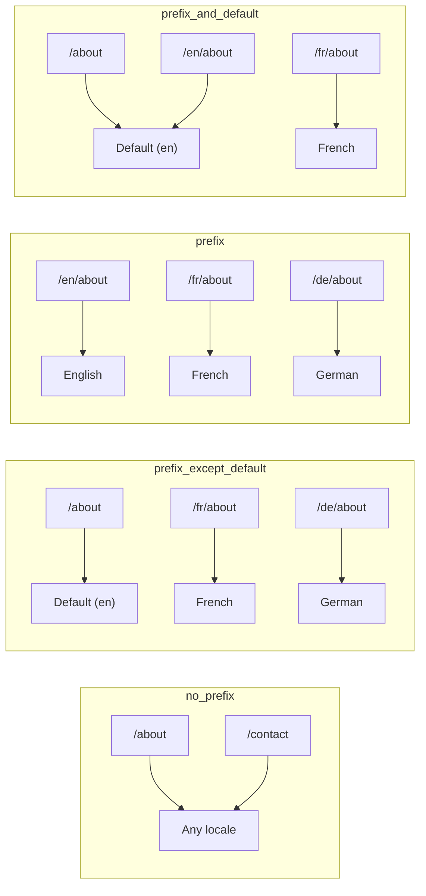
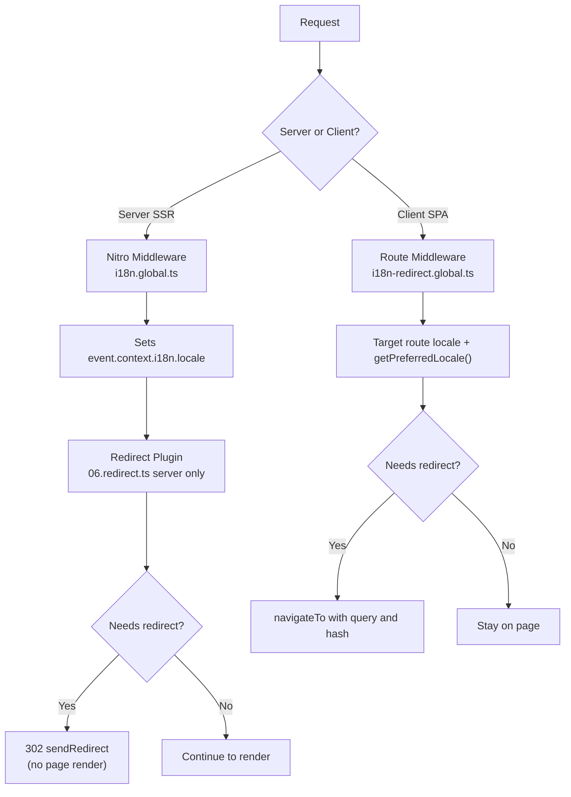

# 🗂️ Rutingsstrategier i Nuxt I18n Micro

## 📖 Oversikt

Nuxt I18n Micro styrer hvordan lokale-prefikser vises i URL-er via `strategy`-alternativet. Under panseret implementeres dette av to pakker:

- **`@i18n-micro/route-strategy`** — byggetids-rutegenerering (utvider Nuxt-sider med lokaliserte ruter)
- **`@i18n-micro/path-strategy`** — kjøretids-oppløsning av stier, omdirigeringer, SEO-attributter og lenkegenerering

Nuxt-modulen velger riktig strategiklasse ved byggetid og aliasserer den via `#i18n-strategy`, slik at bare den valgte implementasjonen bundles.

## 🚦 Tilgjengelige strategier

{/* generated:option:strategy — do not edit; run `pnpm run docs:generate` */}

**Type** `Strategies` · **Standard** `'prefix_except_default'`

URL-rutingsstrategi for lokale-prefikser.

- `'no_prefix'` — ingen lokale i URL; lokale lagres i cookie.
- `'prefix_except_default'` — prefiks alle lokaler unntatt standarden.
- `'prefix'` — alltid prefiks, inkludert standardlokalen.
- `'prefix_and_default'` — som `prefix`, men standardlokalen er også tilgjengelig uten prefiks.

{/* /generated:option:strategy */}

### Sammenligning av strategier



### 🛑 `no_prefix`

URL-er har ingen lokale-segment. Lokalen bestemmes av cookies, `useI18nLocale()`-state eller nettleser-gjenkjenning.

- **Ruter**: `/about`, `/contact` — samme URL-mønster for alle lokaler (ingen `/en/`-, `/fr/`-prefiks)
- **Lokale-persistering**: Via `localeCookie` (settes automatisk til `'user-locale'` hvis ikke angitt)
- **Egendefinerte stier**: Støttes via [`globalLocaleRoutes`](/guides/configuration#globallocaleroutes) og [`defineI18nRoute`](/guides/custom-locale-routes) — lokaliserte slugs genereres uten å legge til lokale-prefiks i URL-er (f.eks. `/about` vs `/ueber-uns`). Nøstede ruter, aliaser og per-lokale-begrensninger er enklere enn i `prefix_except_default`.

<Tip>
Ved bruk av `no_prefix` settes `localeCookie` automatisk til `'user-locale'` hvis ikke angitt. Dette er påkrevd fordi URL-en ikke inneholder lokale-informasjon.
</Tip>

```typescript
i18n: {
  strategy: 'no_prefix'
  // localeCookie is automatically set to 'user-locale'
}
```

### 🚧 `prefix_except_default`

Alle ruter har et lokale-prefiks **unntatt** standardlokalen.

- **Standardlokale**: `/about`, `/contact`
- **Andre lokaler**: `/fr/about`, `/de/contact`
- **Standardlokale med prefiks returnerer 404**: `/en/about` → 404 (når `en` er standard)

```typescript
i18n: {
  strategy: 'prefix_except_default' // This is the default
}
```

### 🌍 `prefix`

Hver rute har et lokale-prefiks, inkludert standardlokalen.

- **Alle lokaler**: `/en/about`, `/fr/about`, `/de/about`
- **Rot `/`**: Omdirigerer til `/\{locale\}/` basert på brukerpreferanse

```typescript
i18n: {
  strategy: 'prefix'
}
```

### 🔄 `prefix_and_default`

Standardlokalen er tilgjengelig både med og uten prefiks. Ikke-standard lokaler har alltid et prefiks.

- **Standardlokale**: både `/about` og `/en/about` er gyldige
- **Andre lokaler**: `/fr/about`, `/de/about`
- **Ingen omdirigering fra `/`**: Både `/` og `/en/` leverer standardlokalen

```typescript
i18n: {
  strategy: 'prefix_and_default'
}
```

## 🔀 Omdirigeringsarkitektur (v3)

I v3 er omdirigeringslogikken delt i to lag for optimal ytelse:

### Slik fungerer det



### Server-side (ingen blink)

1. **Nitro-mellomvare** (`i18n.global.ts`) kjører først — gjenkjenner lokale fra URL, cookie eller `Accept-Language`-header og setter `event.context.i18n.locale`
2. **Omdirigeringsplugin** (`06.redirect.ts`, kun server) sjekker om gjeldende sti trenger omdirigering ved hjelp av `i18nStrategy.getClientRedirect()` og utsteder en 302 **før** noen siderendering skjer
3. Dette forhindrer "feil-blink" der brukere kort ser feil side før omdirigering

### Klient-side (SPA-navigasjon)

1. Global rute-mellomvare (`i18n-redirect.global.ts`) kjører på hver klient-navigasjon når `redirects` er aktivert
2. Utleder foretrukket lokale fra **målruten** først, deretter faller den tilbake til `useI18nLocale().getPreferredLocale()`
3. Bruker `i18nStrategy.getClientRedirect()` til å bestemme om en omdirigering trengs
4. Bevarer `query` og `hash` ved omdirigering

### Lokale-prioritetsrekkefølge

På serveren bestemmer omdirigeringspluginen foretrukket lokale i denne rekkefølgen:

1. **`useState('i18n-locale')`** — høyeste prioritet (satt programmatisk via `useI18nLocale().setLocale()`)
2. **Cookie** — hvis `localeCookie` er konfigurert
3. **`Accept-Language`-header** — hvis `autoDetectLanguage: true`
4. **`defaultLocale`** — endelig fallback

På klienten foretrekker rute-mellomvaren lokalen fra målruten, og bruker deretter samme state/cookie-fallback-kjede.

### Omdirigeringsatferd per strategi

| Strategi                | `GET /`-atferd                                | Cookie påkrevd?  |
| ----------------------- | --------------------------------------------- | ---------------- |
| `no_prefix`             | Ingen omdirigering (lokale fra cookie/state)  | Auto-satt        |
| `prefix`                | 302 → `/\{locale\}/`                            | Anbefalt         |
| `prefix_except_default` | 302 → `/\{locale\}/` hvis lokale ≠ standard    | Anbefalt         |
| `prefix_and_default`    | Ingen omdirigering (både `/` og `/\{locale\}/` gyldige) | Valgfri  |

### Deaktivere omdirigeringer

```typescript
i18n: {
  redirects: false // Disables automatic locale redirects
}
```

Når `redirects: false` er automatiske lokale-omdirigeringer deaktivert:

- **Server**: omdirigeringspluginen (`06.redirect.ts`, kun server) forblir registrert, men hopper over omdirigeringslogikk. Den utfører fortsatt **404-sjekker** for ugyldige lokale-prefikser (f.eks. `/xx/about` der `xx` ikke er en gyldig lokale) og **cookie-synkronisering** fra URL-prefiks (f.eks. besøk til `/fr/about` synkroniserer cookien til `fr`)
- **Klient**: den globale rute-mellomvaren `i18n-redirect` er **ikke registrert** — ingen SPA-auto-omdirigeringer

## 🍪 Cookie-basert lokale-persistering

<Warning>
Ved bruk av `prefix` eller `prefix_except_default` med `redirects: true` (standard) **må** du sette `localeCookie` for at omdirigeringer skal fungere korrekt. Uten en cookie kan ikke omdirigeringspluginen huske brukerens lokale-preferanse på tvers av sideoppdateringer.

```typescript
i18n: {
  strategy: 'prefix_except_default',
  localeCookie: 'user-locale' // Required for redirects to work properly
}
```
</Warning>

**Hvordan `localeCookie` fungerer i v3:**

- Administreres internt av `useI18nLocale()` — **ikke sett den manuelt** via `useCookie()`
- Når en bruker besøker en prefikset URL (f.eks. `/fr/about`), synkroniseres cookien automatisk til `fr`
- Ved neste besøk på `/`, brukes cookie-verdien til å omdirigere til `/\{locale\}/`
- Hvis cookien inneholder en ugyldig lokale (ikke i `locales`-listen), faller den tilbake til `defaultLocale`

| Strategi                | `localeCookie` standard | Merknader                            |
| ----------------------- | ----------------------- | ------------------------------------ |
| `no_prefix`             | Auto: `'user-locale'`   | Påkrevd; settes automatisk           |
| `prefix`                | `null` (deaktivert)     | Sett til `'user-locale'` for omdirigeringer |
| `prefix_except_default` | `null` (deaktivert)     | Sett til `'user-locale'` for omdirigeringer |
| `prefix_and_default`    | `null` (deaktivert)     | Valgfri                              |

## 🔍 `autoDetectLanguage` og `autoDetectPath`

### `autoDetectLanguage`

{/* generated:option:autoDetectLanguage — do not edit; run `pnpm run docs:generate` */}

**Type** `boolean` · **Standard** `true`

Gjenkjenn brukerens foretrukne språk automatisk fra HTTP-headeren `Accept-Language`.
Brukes i kombinasjon med `autoDetectPath` for å bestemme når deteksjon skjer.

{/* /generated:option:autoDetectLanguage */}

Sjekken kjøres i server-mellomvaren og er en fallback: en cookie eller eksisterende state vinner.

```typescript
i18n: {
  autoDetectLanguage: true
}
```

### `autoDetectPath`

{/* generated:option:autoDetectPath — do not edit; run `pnpm run docs:generate` */}

**Type** `string` · **Standard** `'/'`

Hvor cookie- / Accept-Language-preferanseomdirigeringer kan kjøre (når `redirects` er aktivert).

- `'/'` — bare `/` (deep links i standardlokalen forblir nåbare; standard)
- `'no_prefix'` — bare stier uten lokale-prefiks
- `'*'` — alle stier, inkludert omskriving av et eksplisitt lokale-prefiks
  (f.eks. `/fr/about` → `/de/about` når cookien foretrekker `de`)

- hvilken som helst annen streng — eksakt sti-match (f.eks. `'/welcome'`)

Opprydding for prefikserte strategier (f.eks. `/en` → `/` under `prefix_except_default`) er ikke gated.

{/* /generated:option:autoDetectPath */}

```typescript
i18n: {
  autoDetectPath: '/' // Default: only root
  // autoDetectPath: '*' // All paths — redirects even /fr/about to /de/about
}
```

<Warning>
Med `autoDetectPath: '*'` vil selv URL-er med et eksplisitt lokale-prefiks (f.eks. `/fr/about`) bli omdirigert hvis brukerens foretrukne lokale er annerledes. Dette kan være nyttig for domenebaserte oppsett, men kan forvirre brukere som deler URL-er.
</Warning>

Med standard `autoDetectPath: '/'` og en lokale-cookie:

| forespørsel | cookie | resultat |
| --- | --- | --- |
| `/` | `de` | 302 → `/de` |
| `/about` | `de` | 200, standardlokale (ingen omskriving) |

```typescript
i18n: {
  localeCookie: 'user-locale',
  strategy: 'prefix_except_default',
  // Default — remember language on entry, keep deep links stable
  autoDetectPath: '/',
  // Or redirect on every unprefixed path (but not /de/… → /fr/…):
  // autoDetectPath: 'no_prefix',
}
```

## ⚠️ Kjente problemer og beste praksis

### 1. Hydreringsavvik i `no_prefix`-strategi

Ved bruk av `no_prefix` bestemmes lokalen dynamisk. Hvis server og klient er uenige om lokalen, får du et hydreringsavvik.

**Løsning**: Bruk `useI18nLocale().setLocale()` i en server-plugin (med `order: -10`) for å sette lokalen før i18n-initialisering:

```ts
// plugins/i18n-loader.server.ts
export default defineNuxtPlugin({
  name: 'i18n-custom-loader',
  enforce: 'pre',
  order: -10,
  setup() {
    const { setLocale } = useI18nLocale()
    setLocale('ja') // Your detection logic here
  },
})
```

Se [Egendefinert språkgjenkjenning](/guides/custom-language-detection) for detaljerte eksempler.

### 2. Bruk navngitte ruter med `localeRoute`

Sti-basert ruting kan skape problemer med ruteoppløsning:

```typescript
// May cause issues
$localeRoute('/page')

// Preferred approach
$localeRoute({ name: 'page' })
```

### 3. Bruke `pages: false` med i18n

Når du bruker Nuxt med `pages: false`:

```typescript
export default defineNuxtConfig({
  pages: false,
  i18n: {
    strategy: 'no_prefix', // Recommended
    disablePageLocales: true, // Required
    localeCookie: 'user-locale', // Required for persistence
  },
})
```

**Begrensninger med `pages: false`:**

- Ingen automatiske omdirigeringer
- Ingen URL-basert lokale-gjenkjenning
- Klient-side lokale-veksling krever sideoppdatering eller manuell oversettelseslasting

### 4. Håndtering av ugyldig cookie

Hvis en cookie inneholder en ugyldig lokale (ikke i `locales`-listen), faller modulen elegant tilbake til `defaultLocale`. Ingen feil kastes.

## 📝 Sammendrag av beste praksis

| Anbefaling                | Detaljer                                                                            |
| ------------------------- | ----------------------------------------------------------------------------------- |
| **Sett `localeCookie`**   | Sett alltid for prefiks-strategier med `redirects: true`                            |
| **Bruk `useI18nLocale()`** | Den sentraliserte måten å administrere lokale-tilstand (erstatter manuelle `useState`/`useCookie`) |
| **Bruk navngitte ruter**  | `$localeRoute(\{ name: 'page' \})` foran `$localeRoute('/page')`                     |
| **Programmatisk lokale**  | Bruk `useI18nLocale().setLocale()` i en server-plugin med `order: -10`              |
| **Unngå manuelle cookies** | Ikke bruk `useCookie('user-locale')` direkte — `useI18nLocale()` administrerer dette |
