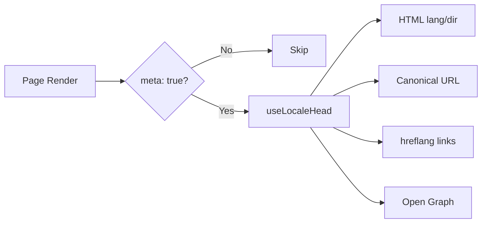

# 🌐 SEO-guide for Nuxt I18n Micro

## 📖 Innledning

Effektiv SEO (søkemotoroptimalisering) er avgjørende for at et flerspråklig nettsted skal være tilgjengelig og synlig for brukere over hele verden gjennom søkemotorer. `Nuxt I18n Micro` forenkler SEO-håndteringen for flerspråklige nettsteder ved automatisk å generere viktige meta-tagger og attributter som informerer søkemotorer om strukturen og innholdet på nettstedet ditt.

Denne guiden forklarer hvordan `Nuxt I18n Micro` håndterer SEO for å forbedre synligheten og brukeropplevelsen — uten behov for ekstra konfigurasjon.

## ⚙️ Automatisk SEO-håndtering

### Flyt for generering av SEO-meta



**Genererte tagger:**

| Tagg             | Eksempel                                                  |
| --------------- | -------------------------------------------------------- |
| HTML-attributter | `<html lang="en" dir="ltr">`                             |
| Canonical       | `<link rel="canonical" href="...">`                      |
| hreflang        | `<link rel="alternate" hreflang="en" href="...">`        |
| x-default       | `<link rel="alternate" hreflang="x-default" href="...">` |
| Open Graph      | `<meta property="og:locale" content="en_US">`            |

#### `og` per locale (`og:locale` vs. BCP 47)

`<html lang>` og `hreflang` bruker **BCP 47** via `locale.iso` (f.eks. `ar-AE`).  
Open Graph krever **`language_TERRITORY`** med **understrek** (`ar_AE`), i henhold til [OG-protokollen](https://ogp.me/).

Som standard utledes `og:locale` fra `iso` når mappingen er entydig (`en-US` → `en_US`).  
Sett en eksplisitt **`og`**-streng når du trenger en tilpasset verdi (f.eks. `zh-Hans` → `zh_CN`).  
Hvis verken `og` eller en konverterbar `iso` er tilgjengelig, genereres ikke `og:locale`-tagger — i utvikling får du en console-advarsel (respekterer `missingWarn`).

```typescript
i18n: {
  meta: true,
  locales: [
    { code: 'ar', iso: 'ar-AE', og: 'ar_AE', dir: 'rtl' },
    { code: 'en', iso: 'en-US' }, // og:locale → en_US
    { code: 'zh', iso: 'zh-Hans', og: 'zh_CN' }, // script tags need explicit og
  ],
}
```

### 🔑 Viktige SEO-funksjoner

Når `meta`-alternativet er aktivert i `Nuxt I18n Micro`, håndterer modulen automatisk følgende SEO-aspekter:

1. **🌍 Språk- og retningsattributter**:
   - Modulen setter `lang`- og `dir`-attributtene på `<html>`-taggen basert på gjeldende locale og tekstretning (f.eks. `ltr` for engelsk eller `rtl` for arabisk).

2. **🔗 Kanoniske URL-er**:
   - Modulen genererer en canonical-lenke (`<link rel="canonical">`) for hver side, slik at søkemotorer gjenkjenner den primære versjonen av innholdet.

3. **🌐 Alternative språklenker (`hreflang`)**:
   - Modulen genererer automatisk `<link rel="alternate" hreflang="">`-tagger for alle tilgjengelige locales. Dette hjelper søkemotorer å forstå hvilke språkversjoner av innholdet ditt som er tilgjengelige, og forbedrer opplevelsen for et globalt publikum.
   - Hver locale sender ut **én** tagg: `hreflang = iso || code`. Når `iso` er satt, brukes aldri rutens `code` som `hreflang` (slik at markedsnøkler som `mx` ikke blir ugyldige språkkoder).
   - Valgfritt `hreflangBaseLanguage: true` sender også ut en bar-språk-tagg utledet fra `iso` (f.eks. `es-ES` → `es`), tilordnet den første regionale locale-en i `locales`.

4. **🌏 `x-default` hreflang**:
   - Modulen genererer automatisk en `<link rel="alternate" hreflang="x-default">`-tagg som peker til standard-locale-URL-en. Dette forteller søkemotorer hvilken URL som skal vises til brukere der språket ikke matcher noen av de definerte locales. Ingen ekstra konfigurasjon er nødvendig — det fungerer automatisk når `meta: true` er satt.

5. **🔖 Open Graph-metadata**:
   - Modulen genererer Open Graph-metatagger (`og:locale`, `og:url` osv.) for hver locale, noe som er spesielt nyttig for deling i sosiale medier og søkemotorindeksering.

### 🛠️ Konfigurasjon

For å aktivere disse SEO-funksjonene må du sørge for at `meta`-alternativet er satt til `true` i `nuxt.config.ts`:

```typescript
export default defineNuxtConfig({
  modules: ['nuxt-i18n-micro'],
  i18n: {
    locales: [
      { code: 'en', iso: 'en-US', dir: 'ltr' },
      { code: 'fr', iso: 'fr-FR', dir: 'ltr' },
      { code: 'ar', iso: 'ar-SA', dir: 'rtl' },
    ],
    defaultLocale: 'en',
    translationDir: 'locales',
    meta: true, // Enables automatic SEO management
  },
})
```

### 🌍 Dynamisk `metaBaseUrl` for flerdomene-deployments

Når `metaBaseUrl` ikke er satt, løses absolutte SEO-URL-er i denne rekkefølgen (#240):

1. `site.url` fra [`nuxt-site-config`](https://nuxtseo.com/docs/site-config) (hvis den modulen er til stede — f.eks. via `@nuxtjs/seo`)
2. Ellers vertsnavnet fra gjeldende forespørsel (`useRequestURL()` / `window.location.origin`)

Fallback via request-opphav respekterer reverse-proxy-headere (`X-Forwarded-Host`, `X-Forwarded-Proto`), så den fungerer korrekt bak nginx, Cloudflare, AWS ALB og lignende proxyer.

Det betyr at apper som allerede setter `site.url` for sitemap / robots / schema.org, **ikke** trenger en ekstra `metaBaseUrl`-deklarasjon:

```typescript
export default defineNuxtConfig({
  site: {
    url: process.env.NUXT_SITE_URL, // also used by micro for canonical / og:url / hreflang
  },
  i18n: {
    meta: true,
    // metaBaseUrl omitted — picks up site.url, then request origin
  },
})
```

Uten `site.url` kan én applikasjonsinstans fortsatt servere **flere domener** med korrekte SEO-tagger for hver, via request-opphav:

```typescript
export default defineNuxtConfig({
  i18n: {
    meta: true,
    // metaBaseUrl is undefined by default — resolved dynamically from the request
  },
})
```

For eksempel vil en forespørsel til `https://site-a.com/en/about` produsere:

```html
<link rel="canonical" href="https://site-a.com/en/about" /> <meta property="og:url" content="https://site-a.com/en/about" />
```

Mens den samme appen som serverer `https://site-b.com/en/about` vil produsere:

```html
<link rel="canonical" href="https://site-b.com/en/about" /> <meta property="og:url" content="https://site-b.com/en/about" />
```

Hvis du trenger en fast base-URL som alltid vinner over `site.url`, kan du sende inn en statisk streng:

```typescript
metaBaseUrl: 'https://example.com'
```

### 🔍 Whitelist for kanoniske query-parametere

Som standard fjernes query-parametere fra canonical og `og:url` for å unngå duplisert innhold. Du kan whiteliste spesifikke query-parametere som skal bevares:

```typescript
i18n: {
  canonicalQueryWhitelist: ['page', 'sort', 'filter', 'search', 'q', 'query', 'tag']
}
```

Kun parametere som er listet i `canonicalQueryWhitelist` vil vises i kanoniske URL-er. Alle andre query-parametere (f.eks. tracking, session-ID-er) fjernes.

### 🚫 Deaktivere meta-tagger per side

Du kan deaktivere generering av SEO-metatagger for bestemte sider ved å bruke `defineI18nRoute()`:

```vue
<script setup>
// Disable all SEO meta tags for this page
defineI18nRoute({
  disableMeta: true,
})
</script>
```

Du kan også deaktivere meta kun for spesifikke locales:

```vue
<script setup>
// Disable meta tags only for English locale on this page
defineI18nRoute({
  disableMeta: ['en'],
})
</script>
```

Når `disableMeta` er aktiv, genereres ingen `hreflang`-, `canonical`-, `og:locale`-, `og:url`- eller `x-default`-tagger for den berørte siden/locale-en.

### 🔇 Deaktiverte locales

Locales med `disabled: true` ekskluderes automatisk fra all SEO-taggenerering — ingen `hreflang`, `og:locale:alternate` eller alternative lenker opprettes for dem:

```typescript
i18n: {
  locales: [
    { code: 'en', iso: 'en-US' },
    { code: 'fr', iso: 'fr-FR', disabled: true }, // excluded from SEO tags
  ]
}
```

### 🙈 Opt-out-locales (`seo: false`)

For locales som skal forbli rutbare og oversatte, men ikke skal vises i tagger for locale-oppdagelse på tvers, kan du sette `seo: false`. Disse locales utelates fra `hreflang`-alternativer og `og:locale:alternate`. Hvis den konfigurerte **standard**-locale-en har `seo: false`, sendes `x-default`-lenken heller ikke ut.

```typescript
i18n: {
  locales: [
    { code: 'en', iso: 'en-US' },
    { code: 'ru', iso: 'ru-RU', seo: false }, // internal / non-indexed locale
  ]
}
```

### 📌 Strategispesifikk adferd

| Strategi                | hreflang-lenker   | x-default             | canonical      | og:url |
| ----------------------- | ---------------- | --------------------- | -------------- | ------ |
| `prefix`                | ✅ Alle locales   | ✅ Standard-locale-URL | ✅ Gjeldende URL | ✅     |
| `prefix_except_default` | ✅ Alle locales   | ✅ Uprefikset URL     | ✅ Gjeldende URL | ✅     |
| `prefix_and_default`    | ✅ Alle locales   | ✅ Standard-locale-URL | ✅ Gjeldende URL | ✅     |
| `no_prefix`             | ❌ Ikke generert | ❌ Ikke generert      | ✅ Gjeldende URL | ✅     |

For `no_prefix`-strategien genereres kun `canonical`, `og:url`, `og:locale` og `html`-attributter (`lang`, `dir`). Alternative språklenker (`hreflang`) og `x-default` genereres ikke fordi det ikke finnes distinkte URL-er per locale.

## Overstyringer på sidenivå (`useI18nHead`)

For **artikler, guider eller annet CMS-innhold** der ikke alle locales finnes, eller der URL-er kommer fra et API, kan du bruke [`useI18nHead`](/api/composables/use-i18n-head) på siden i stedet for en egendefinert i18n-head-plugin.

### Artikkel med delvise oversettelser

```vue
<script setup lang="ts">
const article = await loadArticle()
// article.locales = { en: '...', de: '...' } — only translated locales

useI18nHead({
  meta: [{ property: 'og:title', content: article.title }],
  replace: {
    hreflang: Object.entries(article.locales).map(([locale, href]) => ({
      rel: 'alternate',
      hreflang: locale,
      href,
    })),
    ogAlternates: Object.keys(article.locales),
  },
})
</script>
```

### Slugger per locale med `$setI18nRouteParams`

Når slugger er forskjellige per språk, setter du rute-params først og overstyrer deretter alternatives med reelle URL-er:

```vue
<script setup lang="ts">
const { $defineI18nRoute, $setI18nRouteParams } = useNuxtApp()
const { data: article } = await useFetch(`/api/articles/${slug}`)

$defineI18nRoute({
  localeRoutes: { en: '/blog/[slug]', de: '/de/blog/[slug]' },
})

$setI18nRouteParams({
  en: { slug: article.value.slugEn },
  de: { slug: article.value.slugDe },
})

useI18nHead({
  replace: {
    hreflang: ['en', 'de'].map((locale) => ({
      rel: 'alternate',
      hreflang: locale,
      href: article.value.urls[locale],
    })),
    ogAlternates: ['en', 'de'],
  },
})
</script>
```

### HTTPS-opphav bak en proxy

For korrekte absolutte URL-er ved SSR uten en egendefinert origin-composable:

```ts
i18n: {
  meta: true,
  metaBaseUrl: undefined,
  metaTrustForwardedHost: true,
  metaTrustForwardedProto: true,
}
```

Flere eksempler (overstyring av canonical, `x-default`, reaktiv fetch, delte hjelpere): [useI18nHead composable](/api/composables/use-i18n-head).

### ⚠️ Trailing slash

Modulen genererer canonical- og `hreflang`-URL-er basert på den faktiske stien fra `useRoute().fullPath`. Hvis applikasjonen din bruker etterfølgende skråstrek (f.eks. via Nuxts `router.options`), vil de genererte URL-ene reflektere dette. `$switchLocalePath` kan imidlertid normalisere stier og fjerne etterfølgende skråstrek. Hvis konsekvent bruk av etterfølgende skråstrek er kritisk for SEO-en din, bør du verifisere at de genererte URL-ene samsvarer med URL-strukturen i applikasjonen din.

### 🎯 Fordeler

Ved å aktivere `meta`-alternativet får du følgende fordeler:

- **📈 Bedre plassering i søkemotorer**: Søkemotorer kan indeksere nettstedet ditt bedre og forstår sammenhengen mellom ulike språkversjoner.
- **👥 Bedre brukeropplevelse**: Brukere serveres riktig språkversjon basert på preferanser, noe som gir en mer personlig opplevelse.
- **🔧 Redusert manuell konfigurasjon**: Modulen håndterer SEO-oppgaver automatisk, slik at du slipper å legge til SEO-relaterte metatagger og attributter manuelt.

## 🔗 Nuxt SEO (`@nuxtjs/seo`)

[`@nuxtjs/seo`](https://nuxtseo.com/) samler moduler for sitemap, robots, schema.org, OG-bilder med mer. Den integreres med **nuxt-i18n-micro** gjennom [`nuxt-site-config`](https://nuxtseo.com/docs/site-config/guides/i18n) (v4+).

### Krav

- **`@nuxtjs/seo` 3+** (nåværende utgivelser bruker `nuxt-site-config` 4+, som registrerer `nuxt-site-config:i18n`-pluginen for micro)
- **`i18n.meta: true`** (anbefalt — micro leverer locale-bevisste head-tagger; Nuxt SEO legger til sitemap, schema.org osv.)

### Modulrekkefølge

List **nuxt-i18n-micro før `@nuxtjs/seo`** slik at site config kan lese locale-oppsettet ditt:

```typescript
export default defineNuxtConfig({
  modules: ['nuxt-i18n-micro', '@nuxtjs/seo'],
  site: {
    url: 'https://example.com',
    name: 'My Site',
  },
  i18n: {
    meta: true,
    defaultLocale: 'en',
    locales: [
      { code: 'en', iso: 'en-US' },
      { code: 'de', iso: 'de-DE' },
    ],
  },
})
```

### Oversatt nettstednavn og beskrivelse

Nuxt Site Config leser valgfrie oversettelsesnøkler fra locale-filene dine:

```json
{
  "nuxtSiteConfig": {
    "name": "My Site",
    "description": "My site description"
  }
}
```

Per-locale-verdier i `locales/en.json`, `locales/de.json` osv. plukkes opp automatisk.

### Feilsøking

Hvis du ser `Plugin nuxt-seo:defaults depends on nuxt-site-config:i18n but they are not registered`, oppgrader **`@nuxtjs/seo` til 3+** (se [issue #133](https://github.com/s00d/nuxt-i18n-micro/issues/133)). Eldre `nuxt-site-config` 3.x koblet kun i18n for `@nuxtjs/i18n`, ikke micro.

Mer: [Sitemap i18n-guide](https://nuxtseo.com/docs/sitemap/guides/i18n), [Site Config i18n-guide](https://nuxtseo.com/docs/site-config/guides/i18n).
