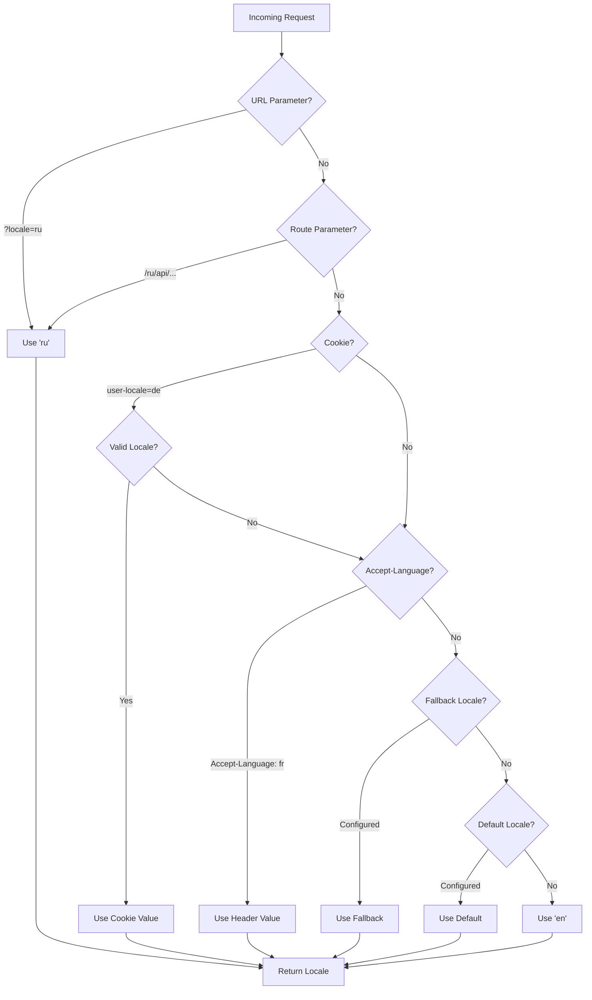

# 🌍 Server-side oversettelser og lokale-informasjon i Nuxt I18n Micro

## 📖 Oversikt

Nuxt I18n Micro støtter server-side oversettelser og lokale-informasjon, slik at du kan oversette innhold og få tilgang til lokale-detaljer på serveren. Dette er spesielt nyttig for API-er eller server-rendrede applikasjoner der lokalisering trengs før innholdet når klienten.

Oversettelsene bruker lokale-meldinger definert i Nuxt I18n-konfigurasjonen og løses dynamisk basert på gjenkjent lokale.

Som standard (`translationPayloads.mode: 'premerged'`) bakes rot-filer inn i hver side-payload ved byggetid som `\{page\}/\{locale\}/data.json`. Serveren laster de samme forhåndsbygde filene som klienten henter under `/\{apiBaseUrl\}/...`, slik at alle nøkler (både delte og sidespesifikke) er tilgjengelige i server-håndterere.

Med `translationPayloads.mode: 'source'` flettes kompakte kildefiler i kjøretid når `loadTranslationsFromServer()` (eller `/_locales`-ruten) kalles — på **Edge** via Nitro `serverAssets`, på **Node** fra den valgfrie offentlige kopien. Se [Ytelsesguiden — Serverless Payload Output](/guides/performance#serverless-payload-output) og [Cache og lagringsarkitektur](/api/cache) for detaljer.

For en samlet liste over runtime- og server-API-er, se [API-referansen](/api/overview).

## 🛠️ Sette opp server-side mellomvare

For å aktivere server-side oversettelser og lokale-informasjon, bruk de medfølgende mellomvarefunksjonene:

- `useTranslationServerMiddleware` — for å oversette innhold
- `useLocaleServerMiddleware` — for å få tilgang til lokale-informasjon

Begge mellomvarefunksjonene er automatisk tilgjengelige i alle server-ruter.

Lokale-deteksjonslogikken deles mellom begge mellomvarefunksjonene gjennom `detectCurrentLocale`-hjelpe-funksjonen for å sikre konsistens på tvers av modulen.

## ✨ Bruke oversettelser i server-håndterere

Du kan sømløst oversette innhold i vilkårlig `eventHandler` ved å bruke oversettelses-mellomvaren.

### Eksempel: Grunnleggende oversettelsesbruk

```typescript
import { defineEventHandler } from 'h3'

export default defineEventHandler(async (event) => {
  const t = await useTranslationServerMiddleware(event)
  return {
    message: t('greeting'), // Returns the translated value for the key "greeting"
  }
})
```

I dette eksempelet:

- Brukerens lokale gjenkjennes automatisk fra spørringsparametere, cookies eller headere.
- `t`-funksjonen henter riktig oversettelse for den gjenkjente lokalen.

## 🌍 Bruke lokale-informasjon i server-håndterere

### Grunnleggende bruk av lokale-informasjon

```typescript
import { defineEventHandler } from 'h3'

export default defineEventHandler((event) => {
  const localeInfo = useLocaleServerMiddleware(event)

  return {
    success: true,
    data: localeInfo,
    timestamp: new Date().toISOString(),
  }
})
```

### Oppgi egendefinerte lokale-parametere

```typescript
import { defineEventHandler } from 'h3'

export default defineEventHandler((event) => {
  // Force specific locale with custom default
  const localeInfo = useLocaleServerMiddleware(event, 'en', 'ru')

  return {
    success: true,
    data: localeInfo,
    timestamp: new Date().toISOString(),
  }
})
```

### Responsstruktur

Lokale-mellomvaren returnerer et `LocaleInfo`-objekt med følgende egenskaper:

```typescript
interface LocaleInfo {
  current: string // Current detected locale code
  default: string // Default locale code
  fallback: string // Fallback locale code
  available: string[] // Array of all available locale codes
  locale: Locale | null // Full locale configuration object
  isDefault: boolean // Whether current locale is the default
  isFallback: boolean // Whether current locale is the fallback
}
```

### Eksempelrespons

```json
{
  "success": true,
  "data": {
    "current": "ru",
    "default": "en",
    "fallback": "en",
    "available": ["en", "ru", "de"],
    "locale": {
      "code": "ru",
      "iso": "ru-RU",
      "dir": "ltr",
      "displayName": "Русский"
    },
    "isDefault": false,
    "isFallback": false
  },
  "timestamp": "2024-01-15T10:30:00.000Z"
}
```

## 🌐 Oppgi en egendefinert lokale

Hvis du må spesifisere en lokale manuelt (f.eks. for testing eller bestemte forespørsler), kan du sende den til oversettelses-mellomvaren:

### Eksempel: Egendefinert lokale

```typescript
import { defineEventHandler } from 'h3'

function detectLocale(event): string | null {
  const urlSearchParams = new URLSearchParams(event.node.req.url?.split('?')[1])
  const localeFromQuery = urlSearchParams.get('locale')
  if (localeFromQuery) return localeFromQuery

  return 'en'
}

export default defineEventHandler(async (event) => {
  const t = await useTranslationServerMiddleware(event, 'en', detectLocale(event)) // Force French local, en - default locale
  return {
    message: t('welcome'), // Returns the French translation for "welcome"
  }
})
```

## 📋 Logikk for lokale-deteksjon

Begge mellomvarefunksjoner bestemmer automatisk brukerens lokale ved hjelp av følgende prioritetsrekkefølge:



1. **URL-parametere**: `?locale=ru`
2. **Rute-parametere**: `/ru/api/endpoint`
3. **Cookies**: `user-locale`-cookie
4. **HTTP-headere**: `Accept-Language`-header
5. **Fallback-lokale**: Som konfigurert i modulalternativene
6. **Standardlokale**: Som konfigurert i modulalternativene
7. **Hardkodet fallback**: `'en'`

> **Merk**: Lokale-deteksjonslogikken deles mellom `useLocaleServerMiddleware` og `useTranslationServerMiddleware` for å sikre konsistens på tvers av modulen.

## 📋 Avanserte brukseksempler

### Betinget respons basert på lokale

```typescript
import { defineEventHandler } from 'h3'

export default defineEventHandler((event) => {
  const { current, isDefault, locale } = useLocaleServerMiddleware(event)

  // Return different content based on locale
  if (current === 'ru') {
    return {
      message: 'Привет, мир!',
      locale: current,
      isDefault,
    }
  }

  if (current === 'de') {
    return {
      message: 'Hallo, Welt!',
      locale: current,
      isDefault,
    }
  }

  // Default English response
  return {
    message: 'Hello, World!',
    locale: current,
    isDefault,
  }
})
```

### Egendefinert lokale-deteksjon

```typescript
import { defineEventHandler } from 'h3'

export default defineEventHandler((event) => {
  // Force German locale with English as fallback
  const { current, isDefault, locale } = useLocaleServerMiddleware(event, 'en', 'de')

  return {
    message: 'Hallo, Welt!',
    locale: current,
    isDefault: false, // Will be false since we forced German
  }
})
```

### Lokale-bevisst API med validering

```typescript
import { defineEventHandler, createError } from 'h3'

export default defineEventHandler((event) => {
  const { current, available, locale } = useLocaleServerMiddleware(event)

  // Validate if the detected locale is supported
  if (!available.includes(current)) {
    throw createError({
      statusCode: 400,
      statusMessage: `Unsupported locale: ${current}. Available locales: ${available.join(', ')}`,
    })
  }

  // Return locale-specific configuration
  return {
    locale: current,
    direction: locale?.dir || 'ltr',
    displayName: locale?.displayName || current,
    availableLocales: available,
  }
})
```

### Integrasjon med oversettelses-mellomvare

Du kan kombinere lokale-informasjon med oversettelses-mellomvare for omfattende internasjonalisering:

```typescript
import { defineEventHandler } from 'h3'

export default defineEventHandler(async (event) => {
  const localeInfo = useLocaleServerMiddleware(event)
  const t = await useTranslationServerMiddleware(event)

  return {
    locale: localeInfo.current,
    message: t('welcome_message'),
    availableLocales: localeInfo.available,
    isDefault: localeInfo.isDefault,
  }
})
```

## 📝 Beste praksis

1. **Valider alltid lokaler**: Sjekk om den gjenkjente lokalen er i listen over tilgjengelige lokaler
2. **Bruk fallback-logikk**: Oppgi fornuftige standarder når lokale-deteksjonen feiler
3. **Cache lokale-informasjon**: For ytelseskritiske applikasjoner, vurder å cache lokale-deteksjonsresultater
4. **Håndter grensetilfeller**: Ta høyde for ikke-støttede lokaler og gi passende feilrespons
5. **Kombiner med oversettelser**: Bruk lokale-informasjon sammen med oversettelses-mellomvare for full i18n-støtte

## 🚀 Ytelseshensyn

- Begge mellomvarefunksjoner er lettvekts og designet for rask utførelse
- Lokale-deteksjon bruker effektive fallback-kjeder
- Ingen eksterne API-kall gjøres under lokale-deteksjon
- Resultater beregnes synkront for optimal ytelse
