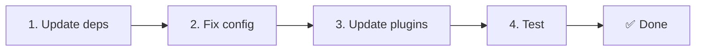

# 📦 Oppgradere fra v2.x til v3.x

<Tip>
Se [Migrering fra nuxt-i18n](/migration/from-nuxtjs-i18n) — den guiden dekker overgang fra vue-i18n-økosystemet, ikke fra nuxt-i18n-micro v2.
</Tip>

v3.0.0 introduserer fundamentale arkitekturendringer: strategipakker, et nytt cachesystem, sentralisert lokale-håndtering via `useI18nLocale()`, og en omdesignet omdirigeringspipeline. Denne seksjonen dekker alle bruddendringer og hvordan du oppdaterer koden din.

## Migreringssteg



## Sammendrag av bruddendringer

- **Lokale-tilstand** — `useState` / `useCookie` manuelt → `useI18nLocale()`-composable
- **Konfigurasjonstilgang** — `useRuntimeConfig().public.i18nConfig` → `getI18nConfig()` fra `#build/i18n.strategy.mjs`
- **Omdirigeringskomponent** — `fallbackRedirectComponentPath`-alternativet → Server-omdirigeringsplugin + klient-rute-mellomvare (automatisk)
- **`includeDefaultLocaleRoute`** — Støttet (utfaset) → Fjernet, bruk `strategy`-alternativet
- **`experimental.hmr`** — Under `experimental` → Rot-nivå-alternativ
- **`previousPageFallback`** — Fjernet helt (kumulativ merge-strategi håndterer dette automatisk)
- **Caching** — `useStorage('cache')` → `TranslationStorage`-singleton (`Symbol.for` på `globalThis`)
- **SSR-overføring** — Runtime-konfigurasjon → Nuxt-payload (v3 brukte `useState`; chunker bor nå i `payload.data`, se [Ytelse](/guides/performance#server-side-payload-transfer))
- **Strategiklasser** — Interne → Separate pakker (`@i18n-micro/route-strategy`, `@i18n-micro/path-strategy`)

## Fjernet: `fallbackRedirectComponentPath`

`fallbackRedirectComponentPath`-alternativet og `locale-redirect.vue`-fallback-komponenten er fjernet. Omdirigeringslogikk håndteres nå av:

1. **Server-mellomvare** (`i18n.global.ts`) — setter `event.context.i18n.locale`
2. **Server-omdirigeringsplugin** (`06.redirect.ts`, kun server) — 302-omdirigeringer før rendering
3. **Klient-rute-mellomvare** (`i18n-redirect.global.ts`) — SPA-omdirigeringer etter hydrering

```diff
 i18n: {
   strategy: 'prefix_except_default',
-  fallbackRedirectComponentPath: '~/components/MyRedirect.vue',
 }
```

Hvis du hadde egendefinert omdirigeringslogikk i fallback-komponenten, implementer den i en server-plugin i stedet:

```ts
// plugins/i18n-loader.server.ts
export default defineNuxtPlugin({
  name: 'i18n-custom-redirect',
  enforce: 'pre',
  order: -10,
  setup() {
    const { setLocale } = useI18nLocale()
    // Your custom detection logic
    setLocale(detectedLocale)
  },
})
```

## Fjernet: `includeDefaultLocaleRoute`

Bruk `strategy`-alternativet i stedet:

- `includeDefaultLocaleRoute: true` → `strategy: 'prefix'`
- `includeDefaultLocaleRoute: false` → `strategy: 'prefix_except_default'` (standard)

```diff
 i18n: {
-  includeDefaultLocaleRoute: true,
+  strategy: 'prefix',
 }
```

## Konfigurasjonstilgang: `getI18nConfig()` erstatter `useRuntimeConfig`

```diff
- const config = useRuntimeConfig()
- const cookieName = config.public.i18nConfig?.localeCookie || 'user-locale'
+ import { getI18nConfig } from '#build/i18n.strategy.mjs'
+ const { localeCookie: configCookie } = getI18nConfig()
+ const cookieName = configCookie ?? 'user-locale'
```

## Lokale-håndtering: `useI18nLocale()` erstatter manuell state

I v2 kan du ha brukt `useState('i18n-locale')` eller `useCookie('user-locale')` direkte. I v3, bruk den sentraliserte `useI18nLocale()`-composablen:

```diff
- const locale = useState('i18n-locale')
- const cookie = useCookie('user-locale')
- locale.value = 'fr'
- cookie.value = 'fr'
+ const { setLocale } = useI18nLocale()
+ setLocale('fr') // Updates both state and cookie atomically
```

Se [Egendefinert språkgjenkjenning](/guides/custom-language-detection) for detaljerte eksempler.

## Eksperimentelle alternativer flyttet / fjernet

`hmr` er flyttet fra `experimental` til rot-nivå. `previousPageFallback` er fjernet helt — modulen bruker nå en kumulativ dyp merge-strategi (2-nivås dybde) som automatisk bevarer oversettelser fra forrige side under overgangs-animasjoner, selv når sider deler overlappende nøstede nøkler. Etter at overgangs-animasjonen er ferdig, rydder `page:transition:finish`-hooken bort gammelside-nøkler fra minnet.

```diff
 i18n: {
-  experimental: {
-    hmr: true,
-    previousPageFallback: true
-  }
+  hmr: true,
+  // previousPageFallback removed — handled automatically
 }
```

## Omdirigeringsarkitektur (v3)

Omdirigeringer håndteres nå automatisk av to komponenter:

1. **Server-side** (`06.redirect.ts`, kun server): Kjører under SSR, utsteder 302-omdirigeringer før noen siderendering. Ingen "feil-blink".
2. **Klient-side** (`i18n-redirect.global.ts`): Global rute-mellomvare på SPA-navigasjon; bevarer spørringsstreng og hash

Lokale-prioritet for omdirigeringer:

1. `useState('i18n-locale')` — satt via `useI18nLocale().setLocale()`
2. Cookie — hvis `localeCookie` er konfigurert
3. `Accept-Language`-header — hvis `autoDetectLanguage: true`
4. `defaultLocale` — fallback

Ingen kodeendringer kreves for standardoppsett.

<Warning>
For `prefix`- og `prefix_except_default`-strategier med `redirects: true`, sett `localeCookie: 'user-locale'` for å aktivere lokale-persistering på tvers av sideoppdateringer. Uten den bruker omdirigeringer bare `Accept-Language` eller `defaultLocale`.
</Warning>

## TypeScript: interne modultyper (valgfritt)

Hvis du støter på typefeil relatert til interne imports som `#i18n-internal/plural`, `#i18n-internal/strategy` eller `#i18n-internal/config`, legg til `imports`-seksjonen i prosjektets `package.json`:

```json
{
  "imports": {
    "#i18n-internal/plural": "nuxt-i18n-micro/internals",
    "#i18n-internal/strategy": "nuxt-i18n-micro/internals",
    "#i18n-internal/config": "nuxt-i18n-micro/internals"
  }
}
```
