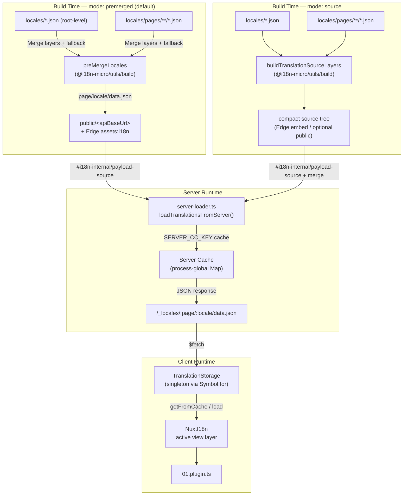

# 🗄️ Architektura pamięci podręcznej i przechowywania tłumaczeń

## 📖 Przegląd

Nuxt I18n Micro v3 korzysta z wielowarstwowej architektury pamięci podręcznej dla tłumaczeń. Ładowanie payloadu zależy od `translationPayloads.mode`:

- **`premerged`** (domyślne) — pliki root, page, fallback i warstw są scalane w czasie budowania przez `@i18n-micro/utils/build` w `\{page\}/\{locale\}/data.json`.
- **`source`** — zwarte pliki źródłowe są zachowywane do scalania w runtime przez `@i18n-micro/utils/source-loader` i `@i18n-micro/utils/merge-source` (Edge osadza je w `serverAssets` Nitro; Node czyta je z `public/`, gdy zostały skopiowane).

Ta strona opisuje, jak działa wbudowana pamięć podręczna oraz jak ją rozszerzać dla niestandardowych zastosowań (narzędzia administracyjne, zewnętrzne API, unieważnianie pamięci podręcznej).

## 📊 Przegląd architektury

### Przepływ danych



## 🧱 Główne komponenty

### 1. `TranslationStorage` (klient + serwer)

**Plik**: `src/runtime/utils/storage.ts`

Klasa typu singleton zapewniająca ujednolicone przechowywanie tłumaczeń zarówno dla klienta, jak i serwera. Używa `Symbol.for('__NUXT_I18N_STORAGE_CACHE__')` na `globalThis`, aby zapewnić, że istnieje tylko jedna instancja, nawet gdy załadowanych jest wiele paczek.

**Kluczowe metody:**

| Metoda                              | Opis                                                                   |
| ----------------------------------- | ---------------------------------------------------------------------- |
| `getFromCache(locale, routeName?)`  | Synchroniczne sprawdzenie: zwraca dane z pamięci podręcznej lub `null` |
| `load(locale, routeName?, options)` | Asynchroniczne ładowanie z cache: najpierw sprawdza cache, potem pobiera przez `$fetch` |
| `clear()`                           | Czyści całą pamięć podręczną                                            |

**Format klucza cache**: `\{locale\}:\{routeName\}` (np. `en:index`, `fr:about`)

```typescript
import { translationStorage } from '../utils/storage'

// Synchronous cache check
const cached = translationStorage.getFromCache('en', 'index')

// Async load (with automatic caching)
const result = await translationStorage.load('en', 'index', {
  apiBaseUrl: '_locales',
  baseURL: '/',
  dateBuild: '2024-01-01',
})
// result.data — merged translations
// result.cacheKey — cache key used
```

### ⚙️ Deterministyczne cache busting (`i18n.dateBuild`)

Domyślnie moduł generuje `dateBuild` w czasie budowania przy użyciu `Date.now()`. Wartość ta jest następnie osadzana w wygenerowanym `#build/i18n.strategy.mjs` i używana jako parametr zapytania (`?v=...`), aby unieważniać cache pobierania tłumaczeń po przebudowaniu.

Jeśli potrzebujesz powtarzalnych buildów (na przykład, aby zwiększyć współczynnik trafień cache chunków w rolling deploymentach), ustaw stabilną wartość w `nuxt.config`:

```ts
export default defineNuxtConfig({
  i18n: {
    // Any stable string/number (git SHA, CI build number, release tag, etc.)
    dateBuild: process.env.GIT_SHA ?? 'local-dev',
  },
})
```

### 2. `loadTranslationsFromServer()` (tylko serwer)

**Plik**: `src/runtime/server/utils/server-loader.ts`

Ładuje tłumaczenia dla danego locale/strony i cachuje scalony wynik w globalnej dla procesu mapie `CacheControl`, kluczowanej przez `@i18n-micro/hmr/cache-keys` (`SERVER_CC_KEY`).

Zachowanie: SSR ładuje z `#i18n-internal/payload-source` — **Node** `readFile` pod `public/<apiBaseUrl>` (`\{page\}/\{locale\}/data.json` w trybie premerged), **Edge** `assets:i18n`. `premerged` czyta jeden plik; `source` scala root/page/fallback przez `@i18n-micro/utils/source-loader`.

```typescript
import { loadTranslationsFromServer } from '../server/utils/server-loader'

// Returns { data: Translations, json: string }
const { data, json } = await loadTranslationsFromServer('en', 'index')
```

### 3. Ładowanie po stronie klienta (bez osadzania w HTML)

Słowniki **nie** są zapisywane w `nuxtApp.payload`. Serwer przechowuje je w pamięci na potrzeby renderowania SSR; wtyczka kliencka wykonuje `await` na `switchContext`, która ładuje `/\{apiBaseUrl\}/:page/:locale/data.json` (to samo domyślne podejście co `@nuxtjs/i18n` przy `experimental.preload: false`).

`NuxtI18n` przechowuje aktywny słownik warstwy widoku używany przez `$t()` i `$has()`. `NuxtTranslationLoader` przełącza kontekst locale/route i scala chunki w tę warstwę.

### 4. Trasa API serwera

**Trasa**: `/_locales/\{page\}/\{locale\}/data.json`

**Plik**: `src/runtime/server/routes/i18n.ts`

Ta trasa Nitro serwuje scalone tłumaczenia dla aktywnego trybu payloadu. Wywołuje `loadTranslationsFromServer()` i zwraca wynik jako JSON.

W produkcji ustawia też:

```http
Cache-Control: public, max-age={httpCacheDuration}, immutable
```

Domyślny `httpCacheDuration` to `31536000` (1 rok). Jest to bezpieczne, ponieważ klienci pobierają payloady z cache-bustingiem `?v=\{dateBuild\}`. Ustaw `httpCacheDuration: 0`, aby pominąć nagłówek. Nagłówek nie jest stosowany w trybie dev.

## 📥 Rozszerzanie: niestandardowe ładowanie tłumaczeń

### Odczyt z cache (trasa serwerowa)

```ts
// server/api/i18n/load-cache.[post].ts
import { defineEventHandler, readBody } from 'h3'
import { loadTranslationsFromServer } from '#imports'

export default defineEventHandler(async (event) => {
  const { page, locale } = await readBody<{ page: string; locale: string }>(event)
  const { data } = await loadTranslationsFromServer(locale, page)
  return { locale, page, data }
})
```

### Aktualizacja tłumaczeń (plik + unieważnienie cache)

```ts
// server/api/i18n/update.[post].ts
import { defineEventHandler, readBody, createError } from 'h3'
import { join } from 'node:path'
import { readFile, writeFile } from 'node:fs/promises'
import { deepMergeTranslations } from '@i18n-micro/utils/deep-merge'

export default defineEventHandler(async (event) => {
  const { path, updates } = await readBody<{ path: string; updates: Record<string, unknown> }>(event)

  if (!path || !updates) {
    throw createError({ statusCode: 400, statusMessage: 'Missing path or updates' })
  }

  const fullPath = join('locales', path)
  let existing: Record<string, unknown> = {}

  try {
    const content = await readFile(fullPath, 'utf-8')
    existing = JSON.parse(content) as Record<string, unknown>
  } catch {
    // File does not exist — create new
  }

  const merged = deepMergeTranslations(existing, updates)
  await writeFile(fullPath, JSON.stringify(merged, null, 2), 'utf-8')

  return { success: true, path, updated: merged }
})
```

<Tip>

</Tip>

## 🧹 Czyszczenie pamięci podręcznej

### Programowe czyszczenie cache (klient)

Użyj wbudowanej metody `$clearCache`:

```vue
<script setup>
const { $clearCache } = useNuxtApp()

// Clears both TranslationStorage and plugin-level cache
$clearCache()
</script>
```

### Zachowanie cache po stronie serwera

Cache serwerowy (`loadTranslationsFromServer`) jest globalny dla procesu i trwa aż do:

- Restartu procesu serwera
- Wykrycia nowego wdrożenia (inna wartość `dateBuild`)

Dla środowisk serverless każdy zimny start ma świeży cache.

## ⚙️ Konfiguracja serverless

Dla środowisk serverless (Cloudflare Workers, AWS Lambda) wbudowany cache używa obiektów `Map` w pamięci. Sama pamięć podręczna tłumaczeń nie wymaga konfiguracji zewnętrznego storage.

Jednak storage Nitro dla plików źródłowych tłumaczeń może wymagać konfiguracji:

```ts
export default defineNuxtConfig({
  nitro: {
    storage: {
      // Only needed if default file-system storage is unavailable
      'assets:server': {
        driver: 'cloudflare-kv-binding',
        binding: 'MY_KV_NAMESPACE',
      },
    },
  },
})
```

## 💡 Kluczowe różnice względem v2

| Aspekt           | v2                            | v3                                                                       |
| ---------------- | ----------------------------- | ------------------------------------------------------------------------ |
| Cache klienta    | `useStorage('cache')`         | Singleton `TranslationStorage` (Symbol.for na globalThis)                 |
| Transfer SSR     | Runtime config                | Pełne chunki przez `payload.data` (v3.0 używało `useState`)               |
| Cache serwera    | Nitro cache storage           | Globalny dla procesu `Map` przez `Symbol.for`                              |
| Logika scalania  | Po stronie klienta            | W czasie budowania (`premerged`) lub w runtime (`source`) przez `@i18n-micro/utils/*` |
| Format klucza cache | `i18n:merged:\{page\}:\{locale\}` | `\{locale\}:\{routeName\}`                                                   |

## 📚 Powiązane

- [Przewodnik po wydajności](/guides/performance) — jak cache wpływa na wydajność
- [Tłumaczenia po stronie serwera](/guides/server-side-translations) — używanie tłumaczeń w trasach serwerowych
- [Wdrożenie Firebase](/guides/firebase) — kwestie cache specyficzne dla wdrożenia
