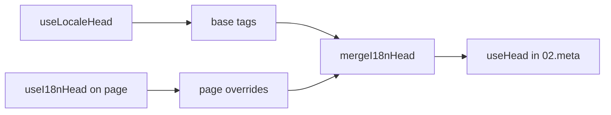

# Kompozycja `useI18nHead`

`useI18nHead` pozwala dostosowywać tagi SEO i18n **dla poszczególnych stron** bez pisania własnej wtyczki meta. Gdy `meta: true`, moduł scala Twoje wejście na wyniku [`useLocaleHead`](/api/composables/use-locale-head).

Typowe zastosowania:

- **Artykuły CMS / bloga** — tylko niektóre locale są przetłumaczone; alternatywne URL-e różnią się w zależności od języka (różne slugi lub ścieżki).
- **Dynamiczny canonical** — URL kanoniczny musi zgadzać się z URL-em artykułu z API, a nie z `$switchLocalePath`.
- **Dodatkowe Open Graph** — `og:title`, `og:description`, `og:image` obok automatycznie generowanych `og:locale` / `og:url`.
- **Częściowa kontrola** — zachowaj wygenerowany przez moduł canonical i `og:url`, ale zastąp tylko `hreflang` i `og:locale:alternate`.

---

## Sygnatura

{/* generated:symbol:useI18nHead — do not edit; run `pnpm run docs:generate` */}

```ts
useI18nHead(input?: MaybeRefOrGetter<I18nHeadInput | null>): { pageHead: any; resetPageHead: () => void }
```

Rejestruj nadpisania tagów SEO head i18n na poziomie strony.
Scalane na wyniku `useLocaleHead` przez wtyczkę `02.meta`.

| Parametr | Typ | Opis |
| --- | --- | --- |
| `input` *(opcjonalny)* | `MaybeRefOrGetter<I18nHeadInput \| null>` |  |

{/* /generated:symbol:useI18nHead */}

## Jak wpasowuje się w pipeline



Wywołujesz `useI18nHead` w komponencie strony. Wtyczka `02.meta` stosuje nadpisania po każdym `updateMeta()` (zmiana trasy, `$setI18nRouteParams`, `page:finish` na kliencie).

---

## Przykład 1 — Artykuł z tłumaczeniami tylko w niektórych locale

Częsty wzorzec: API zwraca, które locale istnieją, oraz ich URL-e absolutne lub względne.

```ts
interface Article {
  title: string
  slug: string
  /** Locale code → page URL (absolute or site-relative) */
  locales: Record<string, string>
}
```

```vue
<script setup lang="ts">
const route = useRoute()
const { data: article } = await useFetch<Article>(`/api/articles/${route.params.slug}`)

const localeCodes = computed(() => Object.keys(article.value?.locales ?? {}))

useI18nHead(() => {
  if (!article.value) return null

  return {
    meta: [
      { property: 'og:title', content: article.value.title },
      { property: 'og:type', content: 'article' },
    ],
    replace: {
      hreflang: localeCodes.value.map((locale) => ({
        rel: 'alternate',
        hreflang: locale,
        href: article.value!.locales[locale]!,
      })),
      ogAlternates: localeCodes.value,
    },
  }
})
</script>
```

`ogAlternates` przyjmuje **kody locale** z Twojej konfiguracji `i18n.locales`. Wartości dla `og:locale:alternate` są rozstrzygane przez `locale.og` lub `iso` (format Open Graph `en_US`).

---

## Przykład 2 — Artykuł z per-locale slugami (`$defineI18nRoute` + `$setI18nRouteParams`)

Gdy URL-e są budowane z zlokalizowanych szablonów tras i parametrów dynamicznych:

```vue
<script setup lang="ts">
const { $defineI18nRoute, $setI18nRouteParams } = useNuxtApp()
const route = useRoute()

const { data: article } = await useFetch(`/api/articles/${route.params.slug}`)

$defineI18nRoute({
  localeRoutes: {
    en: '/blog/[slug]',
    de: '/de/blog/[slug]',
    fr: '/fr/blog/[slug]',
  },
})

if (article.value) {
  $setI18nRouteParams({
    en: { slug: article.value.slugEn },
    de: { slug: article.value.slugDe },
    fr: { slug: article.value.slugFr },
  })

  const availableLocales = article.value.availableLocales as string[]

  useI18nHead({
    meta: [{ property: 'og:title', content: article.value.title }],
    replace: {
      hreflang: availableLocales.map((locale) => ({
        rel: 'alternate',
        hreflang: locale,
        href: article.value!.urls[locale],
      })),
      ogAlternates: availableLocales,
    },
  })
}
</script>
```

Alternatywy generowane przez moduł zawierałyby **wszystkie** skonfigurowane locale. `replace.hreflang` ogranicza tagi do locale, dla których faktycznie istnieje tłumaczenie.

---

## Przykład 3 — Niestandardowy `x-default` dla URL-a artykułu w domyślnym locale

Domyślnie `x-default` wskazuje na URL domyślnego locale z `$switchLocalePath`. Dla artykułów skieruj go na URL domyślnego tłumaczenia:

```vue
<script setup lang="ts">
const { $defaultLocale } = useNuxtApp()
const article = await loadArticle()

const defaultLocale = $defaultLocale() ?? 'en'
const defaultHref = article.locales[defaultLocale]

useI18nHead({
  replace: {
    hreflang: Object.entries(article.locales).map(([locale, href]) => ({
      rel: 'alternate',
      hreflang: locale,
      href,
    })),
    xDefault: defaultHref ? { rel: 'alternate', hreflang: 'x-default', href: defaultHref } : false,
    ogAlternates: Object.keys(article.locales),
  },
})
</script>
```

---

## Przykład 4 — Zastąp canonical i `og:url` danymi z API

Gdy canonical musi zgadzać się z URL-em dostarczonym przez CMS (wielodomenowość, niestandardowa ścieżka lub gotowy URL absolutny):

```vue
<script setup lang="ts">
const article = await loadArticle()
const canonical = article.canonicalUrl // e.g. https://www.example.com/en/blog/my-post

useI18nHead({
  replace: {
    canonical,
    ogUrl: canonical,
    hreflang: buildAlternateLinks(article),
    ogAlternates: Object.keys(article.locales),
  },
  meta: [
    { property: 'og:title', content: article.title },
    { name: 'description', content: article.excerpt },
  ],
})
</script>
```

---

## Przykład 5 — Zachowaj automatyczny canonical / `og:url`, zastąp tylko alternatywy

Jeśli `$switchLocalePath` + `$setI18nRouteParams` produkują już poprawny canonical i `og:url`, zastąp tylko tagi discovery:

```vue
<script setup lang="ts">
const article = await loadArticle()

useI18nHead({
  replace: {
    hreflang: buildAlternateLinks(article),
    ogAlternates: Object.keys(article.locales),
  },
})
</script>
```

---

## Przykład 6 — Pełny head dla strony szczegółów treści (meta + linki)

Wzorzec podobny do rozdzielania „meta strony” i „linków alternate” na osobne helpery — połączone w jednym wywołaniu:

```vue
<script setup lang="ts">
const article = await loadArticle()
const alternates = Object.entries(article.locales).map(([locale, href]) => ({
  rel: 'alternate' as const,
  hreflang: locale,
  href: normalizeSeoUrl(href), // strip ?query and #hash if needed
}))

useI18nHead({
  meta: [
    { property: 'og:title', content: article.title },
    { property: 'og:description', content: article.description },
    { property: 'og:image', content: article.imageUrl },
    { name: 'twitter:card', content: 'summary_large_image' },
    { name: 'twitter:title', content: article.title },
  ],
  replace: {
    canonical: article.canonicalUrl,
    ogUrl: article.canonicalUrl,
    hreflang: alternates,
    ogAlternates: Object.keys(article.locales),
  },
})
</script>
```

```ts
/** Remove query and hash — useful when CMS URLs must be clean for SEO */
function normalizeSeoUrl(href: string): string {
  try {
    const url = new URL(href, 'https://placeholder.local')
    url.search = ''
    url.hash = ''
    return href.startsWith('http') ? url.href : `${url.pathname}`
  } catch {
    return href.split(/[?#]/)[0] ?? href
  }
}
```

---

## Przykład 7 — Dwa typy treści, ten sam wzorzec (news vs guides)

Ten sam kształt API, różne nazwy tras — użyj małego helpera:

```ts
// composables/useArticleHead.ts
import type { I18nHeadInput } from '@i18n-micro/types'

interface LocalizedContent {
  title: string
  locales: Record<string, string>
  canonicalUrl?: string
}

export function buildArticleHead(content: LocalizedContent): I18nHeadInput {
  const localeCodes = Object.keys(content.locales)
  const canonical = content.canonicalUrl ?? content.locales.en

  return {
    meta: [{ property: 'og:title', content: content.title }],
    replace: {
      canonical,
      ogUrl: canonical,
      hreflang: localeCodes.map((locale) => ({
        rel: 'alternate',
        hreflang: locale,
        href: content.locales[locale]!,
      })),
      ogAlternates: localeCodes,
    },
  }
}
```

```vue
<!-- pages/blog/[slug].vue -->
<script setup lang="ts">
const article = await loadArticle()
useI18nHead(buildArticleHead(article))
</script>
```

```vue
<!-- pages/guides/[slug].vue -->
<script setup lang="ts">
const guide = await loadGuide()
useI18nHead(buildArticleHead(guide))
</script>
```

---

## Przykład 8 — Wyłącz wbudowane alternatywy i dostarcz własną listę

Odpowiednik wyłączenia generatora hreflang modułu i podania niestandardowej listy (bez duplikatów zestawów alternate):

```vue
<script setup lang="ts">
const article = await loadArticle()

useI18nHead({
  disable: ['hreflang', 'x-default', 'og-alternates'],
  link: Object.entries(article.locales).map(([locale, href]) => ({
    rel: 'alternate',
    hreflang: locale,
    href,
  })),
  replace: {
    ogAlternates: Object.keys(article.locales),
  },
})
</script>
```

Alternatywnie preferuj `replace.hreflang` bez `disable` — zastępuje wszystkie linki `rel="alternate"` w jednym kroku.

---

## Przykład 9 — Strona docelowa: tylko dodatkowe OG, zachowaj wszystkie tagi i18n

```vue
<script setup lang="ts">
const { t } = useI18n()

useI18nHead({
  meta: [
    { property: 'og:title', content: t('landing.ogTitle') },
    { property: 'og:description', content: t('landing.ogDescription') },
  ],
})
</script>
```

---

## Przykład 10 — Strona produktu: wyłącz hreflang dla eksperymentu w pojedynczym locale

```vue
<script setup lang="ts">
useI18nHead({
  disable: ['hreflang', 'x-default'],
  // canonical, og:locale, og:url still generated
})
</script>
```

---

## Przykład 11 — Reaktywne aktualizacje po pobraniu po stronie klienta

```vue
<script setup lang="ts">
const article = ref<Article | null>(null)

onMounted(async () => {
  article.value = await $fetch('/api/articles/latest')
})

useI18nHead(() => {
  if (!article.value) return null
  return {
    meta: [{ property: 'og:title', content: article.value.title }],
    replace: {
      hreflang: Object.entries(article.value.locales).map(([locale, href]) => ({
        rel: 'alternate',
        hreflang: locale,
        href,
      })),
    },
  }
})
</script>
```

Head odświeża się na `page:finish` i gdy stan `pageHead` się zmienia.

---

## Przykład 12 — Origin HTTPS za reverse proxy

Jeśli wcześniej rozwiązywałeś kompozycję „public origin” dla absolutnych URL-i canonical / alternate, użyj zamiast tego konfiguracji modułu:

```ts
// nuxt.config.ts
export default defineNuxtConfig({
  i18n: {
    meta: true,
    // undefined = origin from current request (multi-domain friendly)
    metaBaseUrl: undefined,
    metaTrustForwardedHost: true,
    metaTrustForwardedProto: true,
  },
})
```

Następnie przekaż **ścieżki lub pełne URL-e** w `replace.hreflang` / `replace.canonical`. Moduł używa `useRequestURL` z nagłówkami `X-Forwarded-Host` / `X-Forwarded-Proto` na SSR.

---

## Dokumentacja API

### `meta`

Dodatkowe tagi `<meta>`. Deduplikacja po `id`, `property` lub `name`.

### `link`

Dodatkowe tagi `<link>`. Deduplikacja po `id` lub `rel` + `hreflang`.

### `htmlAttrs`

Scalane z atrybutami `<html>` z `useLocaleHead` (`lang`, `dir`).

### `replace`

| Klucz          | Typ                       | Efekt                                             |
| -------------- | ------------------------- | ------------------------------------------------- |
| `canonical`    | `string \| false`         | Zastąp lub usuń link kanoniczny                    |
| `hreflang`     | `I18nHeadLink[] \| false` | Zastąp lub usuń wszystkie linki `rel="alternate"`  |
| `xDefault`     | `I18nHeadLink \| false`   | Zastąp lub usuń `hreflang="x-default"`             |
| `ogLocale`     | `string \| false`         | Zastąp lub usuń `og:locale`                        |
| `ogUrl`        | `string \| false`         | Zastąp lub usuń `og:url`                           |
| `ogAlternates` | `string[] \| false`       | Odbuduj `og:locale:alternate` dla kodów locale     |

### `disable`

| Wartość         | Usuwa                                     |
| --------------- | ----------------------------------------- |
| `hreflang`      | Linki alternate locale (nie `x-default`)  |
| `x-default`     | Link `hreflang="x-default"`               |
| `canonical`     | Link kanoniczny                            |
| `og`            | `og:locale` i `og:url`                    |
| `og-alternates` | Tagi `og:locale:alternate`                |
| `html`          | `lang` / `dir` na `<html>`                |

---

## `useLocaleHead` vs `useI18nHead`

| Kompozycja      | Zakres               | Kiedy używać                                   |
| --------------- | -------------------- | ---------------------------------------------- |
| `useLocaleHead` | Globalny / ręczny head | `meta: false`, pełny niestandardowy `useHead`  |
| `useI18nHead`   | Nadpisania per strona | `meta: true`, dostosuj konkretne strony        |

Gdy `meta: true`, **nie** potrzebujesz `useLocaleHead` na stronach, które używają tylko `useI18nHead`.

---

## Migracja z niestandardowej wtyczki head i18n

Wiele projektów utrzymuje niestandardową wtyczkę, która:

- scala per-page alternate links ze wspólnego state;
- filtruje duplikaty regionalnych wpisów `hreflang`;
- normalizuje wartości `og:locale`;
- usuwa query stringi z URL-i SEO.

Możesz to zastąpić przez `useI18nHead` na każdej stronie treści oraz domyślne ustawienia modułu.

| Poprzednie podejście                                  | Z `useI18nHead`                                     |
| ----------------------------------------------------- | --------------------------------------------------- |
| Współdzielony state + „które locale istnieją dla artykułu” | `replace: \{ ogAlternates: localeCodes \}`             |
| Osobny helper budujący linki `rel="alternate"`         | `replace: \{ hreflang: links \}`                       |
| Niestandardowa wtyczka scalająca stan strony w head   | Wbudowane scalanie w `02.meta`                       |
| Niestandardowy „public origin” dla URL-i absolutnych  | `metaBaseUrl` + forwarded headers (zobacz Przykład 12) |
| Krótki `og:locale` (`en` zamiast `en_US`)             | Ustaw `locale.og` lub użyj `iso` → `en_US` (protokół OG) |

**`hreflang` z `iso`:** każde locale emituje jedną alternatywę z `hreflang = iso || code`. Routingowy `code` nigdy nie jest używany, gdy `iso` jest ustawione (unika nieprawidłowych tagów jak `hreflang="mx"`). Włącz gołe fallbacki językowe (`es-ES` → też `es`) przez `hreflangBaseLanguage: true` — wyprowadzane z `iso`, nie z `code`. Dla w pełni niestandardowych list użyj `replace.hreflang`.

**JSON-LD:** `useI18nHead` nie generuje danych strukturalnych. Zachowaj obok niego `useHead(\{ script: [...] \})` lub dedykowany helper JSON-LD.

---

## Zobacz też

- [Przewodnik SEO](/guides/seo) — automatyczne generowanie meta i nadpisania na poziomie strony
- [`useLocaleHead`](/api/composables/use-locale-head) — niskopoziomowe API head
