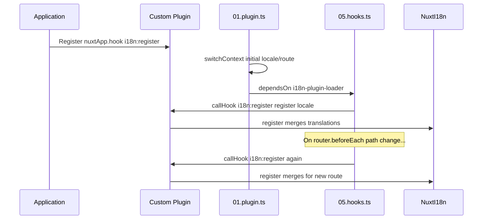

# 📢 Zdarzenia

## 🔄 `i18n:register`

Zdarzenie `i18n:register` w `Nuxt I18n Micro` umożliwia dynamiczne dodawanie tłumaczeń do kontekstu i18n Twojej aplikacji, dzięki czemu proces internacjonalizacji staje się płynny i elastyczny. To zdarzenie pozwala integrować nowe tłumaczenia w miarę potrzeb, zwiększając możliwości lokalizacyjne Twojej aplikacji.

### 📝 Szczegóły zdarzenia

- **Cel**:
  - Umożliwia dynamiczne włączanie dodatkowych tłumaczeń do istniejącego zestawu dla konkretnej lokalizacji.

- **Payload**:
  - **`register`**:
    - Funkcja dostarczana przez zdarzenie, która przyjmuje dwa argumenty:
      - **`translations`** (`Translations`):
        - Obiekt zawierający pary klucz-wartość reprezentujące tłumaczenia, zorganizowane zgodnie z interfejsem `Translations`.
      - **`locale`** (`string`, opcjonalny):
        - Kod lokalizacji (np. `'en'`, `'ru'`), dla której rejestrowane są tłumaczenia. Domyślnie używa lokalizacji dostarczonej przez zdarzenie, jeśli nie została określona.

- **Zachowanie**:
  - Po wywołaniu funkcja `register` scala nowe tłumaczenia z bieżącym kontekstem dla określonej lokalizacji, aktualizując dostępne tłumaczenia w całej aplikacji.

### ⏱️ Kiedy jest wywoływane

Plugin hooków modułu (`05.hooks.ts`, `dependsOn: ['i18n-plugin-loader']`) wywołuje `nuxtApp.callHook('i18n:register', …)`:

1. **Raz przy starcie** — po tym, jak główny plugin i18n (`01.plugin.ts`) załaduje tłumaczenia dla początkowej trasy
2. **Przy nawigacji** — w `router.beforeEach`, gdy zmienia się ścieżka, lub przy każdej nawigacji, gdy `strategy: 'no_prefix'`

Zarejestruj swojego listenera w zwykłym pluginie Nuxt za pomocą `nuxtApp.hook('i18n:register', …)`. Plugin hooków uruchamia się po tym, jak loader jest gotowy, więc Twój callback zostanie wywołany, gdy tłumaczenia będą musiały zostać rozszerzone.

Ustaw `hooks: false` w `nuxt.config`, aby wyłączyć automatyczne wywołania `i18n:register` (zobacz [Konfiguracja — `hooks`](/guides/configuration#hooks)).

### 💡 Przykładowe użycie

Poniższy przykład pokazuje, jak używać zdarzenia `i18n:register` do dynamicznego dodawania tłumaczeń:

```typescript
nuxt.hook('i18n:register', async (register: (translations: unknown, locale?: string) => void, locale: string) => {
  register(
    {
      greeting: 'Hello',
      farewell: 'Goodbye',
    },
    locale,
  )
})
```

### 🛠️ Wyjaśnienie



- **Wyzwalanie zdarzenia**:
  - Plugin hooków (`05.hooks.ts`) wywołuje `i18n:register` po tym, jak główny loader jest gotowy, oraz przy odpowiednich nawigacjach.

- **Dodawanie tłumaczeń**:
  - Przykład rejestruje angielskie tłumaczenia dla `"greeting"` i `"farewell"`.
  - Funkcja `register` scala te tłumaczenia z istniejącym zestawem dla dostarczonej lokalizacji.

### 🔗 Kluczowe korzyści

- **Dynamiczne aktualizacje**:
  - Łatwo aktualizuj lub dodawaj tłumaczenia bez konieczności ponownego wdrażania całej aplikacji.

- **Elastyczność lokalizacji**:
  - Wspiera dostosowywanie lokalizacji w czasie rzeczywistym w zależności od potrzeb użytkownika lub aplikacji.

Używając zdarzenia `i18n:register`, możesz zapewnić, że strategia lokalizacji Twojej aplikacji pozostanie elastyczna i adaptowalna, poprawiając ogólne doświadczenie użytkownika.

---

## 🛠️ Modyfikowanie tłumaczeń za pomocą pluginów

Aby dynamicznie modyfikować tłumaczenia w aplikacji Nuxt, zalecane jest używanie pluginów. Pluginy zapewniają ustrukturyzowany sposób obsługi aktualizacji lokalizacji, zwłaszcza przy pracy z modułami lub zewnętrznymi plikami tłumaczeń.

### **Rejestrowanie pluginu**

Jeśli używasz modułu, zarejestruj plugin, w którym mają zachodzić modyfikacje tłumaczeń, dodając go do konfiguracji modułu:

```javascript
addPlugin({
  src: resolve('./plugins/extend_locales'),
})
```

To rejestruje plugin znajdujący się w `./plugins/extend_locales`, który będzie obsługiwać dynamiczne ładowanie i rejestrację tłumaczeń.

### **Implementacja pluginu**

W pluginie możesz zarządzać modyfikacjami lokalizacji. Oto przykładowa implementacja w pluginie Nuxt:

```typescript
import { defineNuxtPlugin } from '#app'

export default defineNuxtPlugin(async (nuxtApp) => {
  // Function to load translations from JSON files and register them
  const loadTranslations = async (lang: string) => {
    try {
      const translations = await import(`../locales/${lang}.json`)
      return translations.default
    } catch (error) {
      console.error(`Error loading translations for language: ${lang}`, error)
      return null
    }
  }

  // Hook into the 'i18n:register' event to dynamically add translations
  // eslint-disable-next-line @typescript-eslint/ban-ts-comment
  // @ts-expect-error
  nuxtApp.hook('i18n:register', async (register: (translations: unknown, locale?: string) => void, locale: string) => {
    const translations = await loadTranslations(locale)
    if (translations) {
      register(translations, locale)
    }
  })
})
```

### 📝 Szczegółowe wyjaśnienie

1. **Ładowanie tłumaczeń**:

- Funkcja `loadTranslations` dynamicznie importuje pliki tłumaczeń na podstawie lokalizacji. Pliki są oczekiwane w katalogu `locales` i nazwane zgodnie z kodami lokalizacji (np. `en.json`, `de.json`).
- Po pomyślnym załadowaniu tłumaczenia są zwracane; w przeciwnym razie logowany jest błąd.

2. **Rejestrowanie tłumaczeń**:

- Plugin podłącza się do zdarzenia `i18n:register` za pomocą `nuxtApp.hook`.
- Gdy zdarzenie zostanie wywołane, funkcja `register` jest wywoływana z załadowanymi tłumaczeniami i odpowiednią lokalizacją.
- To scala nowe tłumaczenia z kontekstem i18n dla określonej lokalizacji, aktualizując dostępne tłumaczenia w całej aplikacji.

### 🔗 Korzyści z używania pluginów do modyfikacji tłumaczeń

- **Separacja odpowiedzialności**:
  - Zamknij logikę lokalizacji oddzielnie od głównego kodu aplikacji, ułatwiając zarządzanie i utrzymanie.

- **Dynamiczność i skalowalność**:
  - Dzięki dynamicznemu ładowaniu i rejestrowaniu tłumaczeń możesz aktualizować zawartość bez konieczności pełnego wdrożenia aplikacji, co jest szczególnie przydatne w aplikacjach z często aktualizowaną lub wielojęzyczną zawartością.

- **Zwiększona elastyczność lokalizacji**:
  - Pluginy pozwalają modyfikować lub rozszerzać tłumaczenia w razie potrzeby, zapewniając bardziej adaptowalną i responsywną strategię lokalizacji, dopasowaną do preferencji użytkownika lub wymagań biznesowych.

Stosując to podejście, możesz efektywnie rozszerzać i modyfikować lokalizację aplikacji poprzez ustrukturyzowany i możliwy do utrzymania proces przy użyciu pluginów, utrzymując internacjonalizację adaptowalną do zmieniających się potrzeb i poprawiając ogólne doświadczenie użytkownika.
