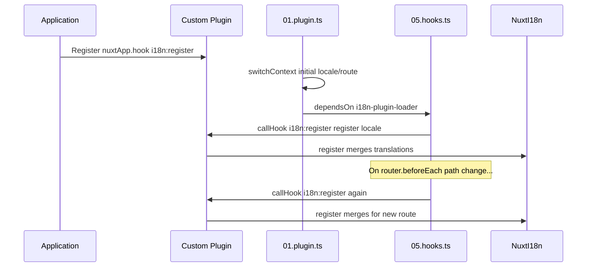

# 📢 Zdarzenia

## 🔄 `i18n:register`

Zdarzenie `i18n:register` w `Nuxt I18n Micro` umożliwia dynamiczne dodawanie tłumaczeń do kontekstu i18n Twojej aplikacji, dzięki czemu proces internacjonalizacji jest płynny i elastyczny. To zdarzenie pozwala integrować nowe tłumaczenia w miarę potrzeb, rozszerzając możliwości lokalizacji Twojej aplikacji.

### 📝 Szczegóły zdarzenia

- **Cel**:
  - Umożliwia dynamiczne włączanie dodatkowych tłumaczeń do istniejącego zestawu dla konkretnego locale.

- **Payload**:
  - **`register`**:
    - Funkcja dostarczana przez zdarzenie, przyjmująca dwa argumenty:
      - **`translations`** (`Translations`):
        - Obiekt zawierający pary klucz-wartość reprezentujące tłumaczenia, uporządkowane zgodnie z interfejsem `Translations`.
      - **`locale`** (`string`, opcjonalny):
        - Kod locale (np. `'en'`, `'ru'`), dla którego rejestrowane są tłumaczenia. Jeśli nie zostanie podany, przyjmuje wartość locale dostarczoną przez zdarzenie.

- **Zachowanie**:
  - Po wyzwoleniu funkcja `register` scala nowe tłumaczenia z bieżącym kontekstem dla wskazanego locale, aktualizując dostępne tłumaczenia w całej aplikacji.

### ⏱️ Kiedy jest wyzwalane

Wtyczka hooks modułu (`05.hooks.ts`, `dependsOn: ['i18n-plugin-loader']`) wywołuje `nuxtApp.callHook('i18n:register', …)`:

1. **Raz przy starcie** — po tym, jak główna wtyczka i18n (`01.plugin.ts`) załaduje tłumaczenia dla początkowej trasy.
2. **Podczas nawigacji** — w `router.beforeEach`, gdy zmienia się ścieżka, lub przy każdej nawigacji, gdy `strategy: 'no_prefix'`.

Zarejestruj swojego listenera w zwykłej wtyczce Nuxt za pomocą `nuxtApp.hook('i18n:register', …)`. Wtyczka hooks uruchamia się po tym, jak loader jest gotowy, więc Twój callback jest wywoływany, gdy tłumaczenia wymagają rozszerzenia.

Ustaw `hooks: false` w `nuxt.config`, aby wyłączyć automatyczne wywołania `i18n:register` (zobacz [Konfiguracja — `hooks`](/guides/configuration#hooks)).

### 💡 Przykład użycia

Poniższy przykład pokazuje, jak używać zdarzenia `i18n:register` do dynamicznego dodawania tłumaczeń:

```typescript
nuxt.hook('i18n:register', async (register: (translations: unknown, locale?: string) => void, locale: string) => {
  register(
    {
      greeting: 'Hello',
      farewell: 'Goodbye',
    },
    locale,
  )
})
```

### 🛠️ Objaśnienie



- **Wyzwalanie zdarzenia**:
  - Wtyczka hooks (`05.hooks.ts`) wyzwala `i18n:register` po gotowości głównego loadera oraz podczas odpowiednich nawigacji.

- **Dodawanie tłumaczeń**:
  - Przykład rejestruje angielskie tłumaczenia dla `"greeting"` i `"farewell"`.
  - Funkcja `register` scala te tłumaczenia z istniejącym zestawem dla podanego locale.

### 🔗 Kluczowe korzyści

- **Dynamiczne aktualizacje**:
  - Łatwo aktualizuj lub dodawaj tłumaczenia bez konieczności ponownego wdrażania całej aplikacji.

- **Elastyczność lokalizacji**:
  - Obsługuje aktualizacje lokalizacji w czasie rzeczywistym zgodnie z potrzebami użytkownika lub aplikacji.

Dzięki zdarzeniu `i18n:register` możesz zapewnić, że strategia lokalizacji Twojej aplikacji pozostanie elastyczna i łatwa do dostosowania, poprawiając ogólne doświadczenie użytkownika.

---

## 🛠️ Modyfikowanie tłumaczeń za pomocą wtyczek

Aby dynamicznie modyfikować tłumaczenia w aplikacji Nuxt, zalecane jest używanie wtyczek. Wtyczki zapewniają uporządkowany sposób obsługi aktualizacji lokalizacji, szczególnie przy pracy z modułami lub zewnętrznymi plikami tłumaczeń.

### **Rejestrowanie wtyczki**

Jeśli używasz modułu, zarejestruj wtyczkę w miejscu, w którym będą wykonywane modyfikacje tłumaczeń, dodając ją do konfiguracji modułu:

```javascript
addPlugin({
  src: resolve('./plugins/extend_locales'),
})
```

Rejestruje to wtyczkę znajdującą się pod ścieżką `./plugins/extend_locales`, która będzie obsługiwać dynamiczne ładowanie i rejestrację tłumaczeń.

### **Implementacja wtyczki**

W obrębie wtyczki możesz zarządzać modyfikacjami locale. Oto przykładowa implementacja w postaci wtyczki Nuxt:

```typescript
import { defineNuxtPlugin } from '#app'

export default defineNuxtPlugin(async (nuxtApp) => {
  // Function to load translations from JSON files and register them
  const loadTranslations = async (lang: string) => {
    try {
      const translations = await import(`../locales/${lang}.json`)
      return translations.default
    } catch (error) {
      console.error(`Error loading translations for language: ${lang}`, error)
      return null
    }
  }

  // Hook into the 'i18n:register' event to dynamically add translations
  // eslint-disable-next-line @typescript-eslint/ban-ts-comment
  // @ts-expect-error
  nuxtApp.hook('i18n:register', async (register: (translations: unknown, locale?: string) => void, locale: string) => {
    const translations = await loadTranslations(locale)
    if (translations) {
      register(translations, locale)
    }
  })
})
```

### 📝 Szczegółowe wyjaśnienie

1. **Ładowanie tłumaczeń**:

- Funkcja `loadTranslations` dynamicznie importuje pliki tłumaczeń w zależności od locale. Pliki oczekiwane są w katalogu `locales` i nazwane zgodnie z kodami locale (np. `en.json`, `de.json`).
- W przypadku pomyślnego załadowania tłumaczenia są zwracane; w przeciwnym razie logowany jest błąd.

2. **Rejestrowanie tłumaczeń**:

- Wtyczka podpina się pod zdarzenie `i18n:register` za pomocą `nuxtApp.hook`.
- Po wyzwoleniu zdarzenia wywoływana jest funkcja `register` z załadowanymi tłumaczeniami i odpowiednim locale.
- Scala to nowe tłumaczenia w kontekście i18n dla wskazanego locale, aktualizując dostępne tłumaczenia w całej aplikacji.

### 🔗 Korzyści z używania wtyczek do modyfikacji tłumaczeń

- **Separacja odpowiedzialności**:
  - Enkapsuluje logikę lokalizacji oddzielnie od głównego kodu aplikacji, ułatwiając zarządzanie i utrzymanie.

- **Dynamika i skalowalność**:
  - Dzięki dynamicznemu ładowaniu i rejestrowaniu tłumaczeń możesz aktualizować treści bez konieczności pełnego ponownego wdrożenia aplikacji, co jest szczególnie przydatne w aplikacjach z często aktualizowaną lub wielojęzyczną zawartością.

- **Zwiększona elastyczność lokalizacji**:
  - Wtyczki pozwalają modyfikować lub rozszerzać tłumaczenia w miarę potrzeb, zapewniając bardziej adaptacyjną i responsywną strategię lokalizacji, która odpowiada preferencjom użytkowników lub wymaganiom biznesowym.

Stosując to podejście, możesz efektywnie rozszerzać i modyfikować lokalizację aplikacji za pomocą uporządkowanego i łatwego w utrzymaniu procesu wykorzystującego wtyczki, utrzymując internacjonalizację adaptacyjną wobec zmieniających się potrzeb i poprawiając ogólne doświadczenie użytkownika.
