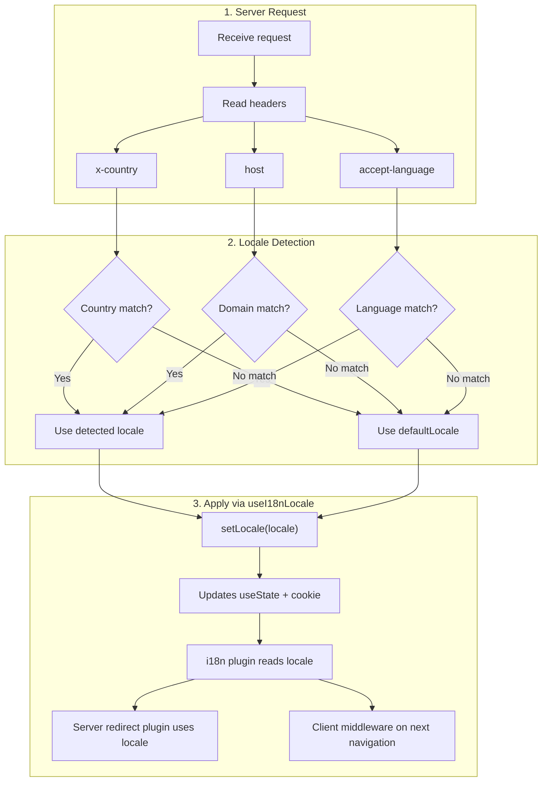

# 🔧 Niestandardowe wykrywanie języka w Nuxt I18n Micro

## 📖 Omówienie

Nuxt I18n Micro v3 zapewnia scentralizowany composable — `useI18nLocale()` — do całego zarządzania lokalizacją. Zastępuje on ręczne wzorce `useState`/`useCookie` z v2. Używając `useI18nLocale().setLocale()` w pluginie serwera, możesz zaimplementować dowolną niestandardową logikę wykrywania, zachowując pełną kompatybilność z systemami przekierowań i ciasteczek modułu.

## 🏗️ Architektura

```mermaid
flowchart TB
    subgraph Plugins["Plugin Execution Order"]
        A["Your plugin<br/>order: -10"] -->|setLocale()| B["01.plugin.ts<br/>order: -5"]
        B --> C["06.redirect.ts server<br/>order: 10"]
    end

    subgraph Client["Client SPA Navigation"]
        D["i18n-redirect.global.ts<br/>route middleware"]
    end

    subgraph State["Locale State"]
        E["useState('i18n-locale')"]
        F["localeCookie"]
    end

    A -->|"setLocale() updates both"| E
    A -->|"setLocale() updates both"| F
    B -->|reads| E
    C -->|reads| E
    C -->|reads| F
    D -->|reads target route +| E
```

**Kluczowa zasada**: wywołaj `useI18nLocale().setLocale()` w pluginie serwera z `order: -10`. To atomowo aktualizuje zarówno `useState('i18n-locale')`, jak i ciasteczko lokalizacji, więc plugin i18n (`order: -5`) i plugin przekierowania serwera (`order: 10`) widzą prawidłową lokalizację przy pierwszym żądaniu SSR. Auto-przekierowania po stronie klienta działają w globalnym middleware trasy przy kolejnych nawigacjach.

## 🛠️ Wyłączanie wbudowanego auto-wykrywania

Jeśli chcesz mieć pełną kontrolę nad wykrywaniem lokalizacji, wyłącz wbudowany mechanizm:

```ts
export default defineNuxtConfig({
  i18n: {
    autoDetectLanguage: false,
  },
})
```

## ✨ Przykład: wykrywanie po stronie serwera z `useI18nLocale`

To jest **zalecane podejście** dla wszystkich strategii.

### Krok 1: Skonfiguruj `nuxt.config.ts`

```ts
export default defineNuxtConfig({
  modules: ['nuxt-i18n-micro'],
  i18n: {
    strategy: 'no_prefix', // Works with ANY strategy
    defaultLocale: 'en',
    localeCookie: 'user-locale',
    autoDetectLanguage: false,
    locales: [
      { code: 'en', iso: 'en-US' },
      { code: 'de', iso: 'de-DE' },
      { code: 'ja', iso: 'ja-JP' },
    ],
  },
})
```

### Krok 2: Utwórz `plugins/i18n-loader.server.ts`

```ts
import { defineNuxtPlugin, useRequestHeaders } from '#imports'

export default defineNuxtPlugin({
  name: 'i18n-custom-loader',
  enforce: 'pre',
  order: -10, // Execute BEFORE the i18n plugin (which has order -5)

  setup() {
    const { setLocale } = useI18nLocale()
    const headers = useRequestHeaders(['host', 'x-country', 'accept-language'])
    let detectedLocale = 'en'

    // --- YOUR DETECTION LOGIC ---

    // Example 1: By domain
    const host = headers['host']
    if (host?.includes('example.de')) {
      detectedLocale = 'de'
    }
    // Example 2: By custom header
    else if (headers['x-country'] === 'JP') {
      detectedLocale = 'ja'
    }
    // Example 3: By Accept-Language header
    else if (headers['accept-language']?.includes('de')) {
      detectedLocale = 'de'
    }

    // --- APPLY THE LOCALE ---
    setLocale(detectedLocale)
  },
})
```

### Jak to działa



1. **Plugin uruchamia się jako pierwszy** (`order: -10`) — wykrywa lokalizację z nagłówków, domeny lub innych źródeł
2. **`setLocale()` aktualizuje oba** `useState('i18n-locale')` i ciasteczko — zapewnia natychmiastową widoczność dla wszystkich kolejnych pluginów
3. **Plugin i18n** (`order: -5`) odczytuje lokalizację i ładuje właściwe tłumaczenia
4. **Plugin przekierowania serwera** (`order: 10`) używa lokalizacji do decyzji o przekierowaniach w SSR
5. **Middleware trasy klienta** (`i18n-redirect`) stosuje przekierowania przy nawigacji SPA, gdy lokalizacja URL nie odpowiada preferencji

## 🌐 Zachowanie specyficzne dla strategii

`useI18nLocale().setLocale()` działa ze **wszystkimi strategiami**. Zachowanie przekierowań zależy od strategii:

<Tip>
| Strategia | Efekt `setLocale('de')` |
|-----------|-------------------------|
| `no_prefix` | Renderuje po niemiecku, bez zmiany URL |
| `prefix` | 302 → `/de/` (przekierowanie po stronie serwera) |
| `prefix_except_default` | 302 → `/de/`, gdy `de` ≠ domyślna; bez przekierowania, gdy `de` = domyślna |
| `prefix_and_default` | Bez przekierowania (zarówno `/` jak i `/de/` są prawidłowe) |
</Tip>

**Ważne uwagi:**

- Wykrywanie lokalizacji oparte na ciasteczkach jest domyślnie wyłączone (`localeCookie: null`)
- Ustaw `localeCookie: 'user-locale'`, aby włączyć trwałość ciasteczka
- Jeśli wartość ciasteczka/stanu nie znajduje się na liście `locales`, wraca do `defaultLocale`

## 🏢 Zaawansowane: wykrywanie na podstawie domeny

Dla konfiguracji multi-domenowych, w których każda domena serwuje inną lokalizację:

```ts
import { defineNuxtPlugin, useRequestHeaders } from '#imports'

export default defineNuxtPlugin({
  name: 'i18n-domain-loader',
  enforce: 'pre',
  order: -10,

  setup() {
    const { setLocale } = useI18nLocale()
    const headers = useRequestHeaders(['host'])
    const host = headers['host'] || ''

    let detectedLocale = 'en'

    if (host.endsWith('.de') || host.includes('german.')) {
      detectedLocale = 'de'
    } else if (host.endsWith('.fr') || host.includes('french.')) {
      detectedLocale = 'fr'
    } else if (host.endsWith('.jp') || host.includes('japanese.')) {
      detectedLocale = 'ja'
    }

    setLocale(detectedLocale)
  },
})
```

## 🔄 Zaawansowane: respektowanie preferencji użytkownika

Jeśli użytkownicy mogą ręcznie przełączać język, respektuj ich wybór ponad auto-wykrywaniem:

```ts
import { defineNuxtPlugin, useRequestHeaders } from '#imports'

export default defineNuxtPlugin({
  name: 'i18n-smart-loader',
  enforce: 'pre',
  order: -10,

  setup() {
    const { getLocale, setLocale } = useI18nLocale()

    // If user already has a preference (from cookie), respect it
    if (getLocale()) {
      return
    }

    // Otherwise, detect locale from headers
    const headers = useRequestHeaders(['accept-language'])
    let detectedLocale = 'en'

    const acceptLanguage = headers['accept-language'] || ''
    if (acceptLanguage.includes('de')) {
      detectedLocale = 'de'
    } else if (acceptLanguage.includes('ja')) {
      detectedLocale = 'ja'
    }

    setLocale(detectedLocale)
  },
})
```

## ⚙️ Pluginy tylko-serwer lub tylko-klient

Użyj [konwencji nazewnictwa plików Nuxt](https://nuxt.com/docs/getting-started/directory-structure#plugins), aby kontrolować, gdzie działa Twój plugin:

- **Tylko-serwer**: `i18n-loader.server.ts` — działa tylko podczas SSR (zalecane do wykrywania opartego na nagłówkach)
- **Tylko-klient**: `i18n-loader.client.ts` — działa tylko w przeglądarce (do wykrywania opartego na `localStorage` lub DOM)


## ✅ Podsumowanie

| Funkcja                                | Opis                                                                             |
| -------------------------------------- | -------------------------------------------------------------------------------- |
| `useI18nLocale().setLocale()`          | Atomowo aktualizuje `useState` + ciasteczko; działa ze wszystkimi strategiami    |
| `useI18nLocale().getLocale()`          | Zwraca bieżącą lokalizację ze stanu lub ciasteczka                               |
| `useI18nLocale().getPreferredLocale()` | Zwraca preferowaną lokalizację (zwalidowaną względem listy `locales`)            |
| Plugin `order: -10`                    | Zapewnia uruchomienie Twojego pluginu przed inicjalizacją i18n                   |
| `enforce: 'pre'`                       | Uruchamia w grupie pluginów „pre”                                                |

**NIE:**

- Używaj `useCookie('user-locale')` bezpośrednio — `useI18nLocale()` zarządza ciasteczkami wewnętrznie
- Używaj `useState('i18n-locale')` bezpośrednio — użyj `useI18nLocale().setLocale()`
- Ustawiaj `order` >= -5 — Twój plugin musi działać przed pluginem i18n
