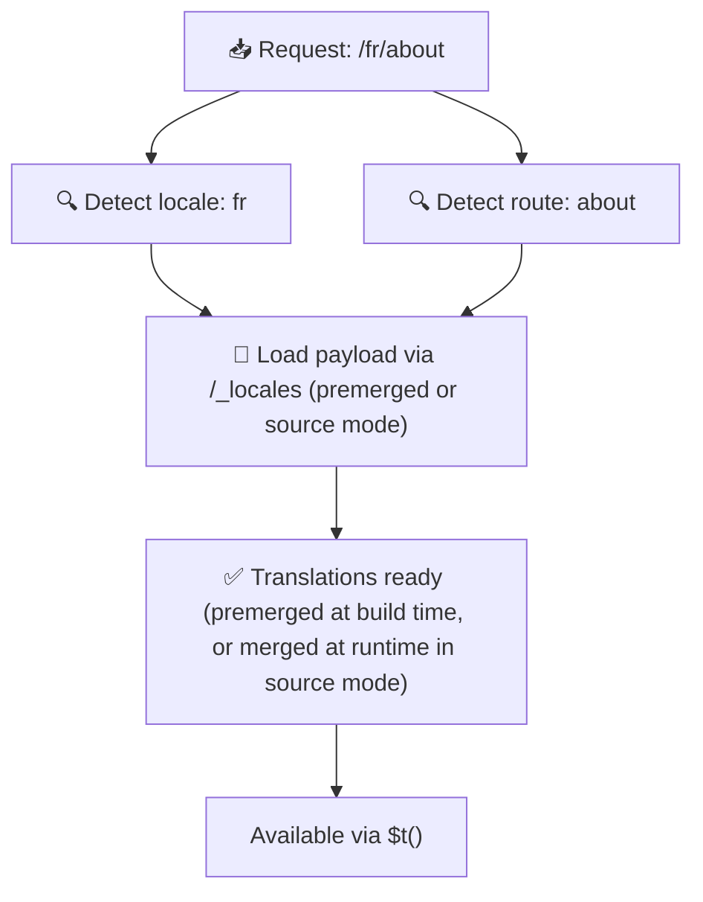

# 📂 Przewodnik po strukturze folderów

## 📖 Wprowadzenie

Efektywne organizowanie plików tłumaczeń jest niezbędne do utrzymania skalowalnego i wydajnego systemu internacjonalizacji (i18n). `Nuxt I18n Micro` upraszcza ten proces, oferując przejrzyste podejście do zarządzania tłumaczeniami root-level i page-specific. Ten przewodnik przeprowadzi Cię przez zalecaną strukturę folderów i wyjaśni, jak `Nuxt I18n Micro` obsługuje te tłumaczenia.

## 🗂️ Zalecana struktura folderów

`Nuxt I18n Micro` organizuje tłumaczenia w pliki root-level i pliki specyficzne dla stron w katalogu `pages`. Z `translationPayloads.mode: 'premerged'` (domyślne) tłumaczenia root-level są automatycznie scalane z każdym plikiem strony w czasie budowy, więc każda strona ma kompletny zestaw tłumaczeń bez narzutu scalania w runtime.

Z `mode: 'source'` pliki źródłowe pozostają osobno w zasobach Nitro i są scalane w runtime przez trasę `/_locales`. Zobacz [Wyjście payloadu serverless](/guides/performance#serverless-payload-output).

### 🔧 Podstawowa struktura

Oto podstawowy przykład struktury folderów, którą powinieneś zastosować:

```text
locales/
├── pages/
│   ├── index/
│   │   ├── en.json
│   │   ├── fr.json
│   │   └── ar.json
│   ├── about/
│   │   ├── en.json
│   │   ├── fr.json
│   │   └── ar.json
├── en.json
├── fr.json
└── ar.json

```

### 📄 Wyjaśnienie struktury

#### 1. 🌍 Pliki tłumaczeń root-level

- **Ścieżka:** `/locales/\{locale\}.json` (np. `/locales/en.json`)
- **Cel:** te pliki zawierają tłumaczenia współdzielone w całej aplikacji (menu nawigacyjne, nagłówki, stopki itp.). Z `mode: 'premerged'` (domyślne) są automatycznie scalane z każdym plikiem specyficznym dla strony w czasie budowy, więc serwer zwraca pojedynczy pre-built plik na stronę.

  **Przykładowa zawartość (`/locales/en.json`):**

  ```json
  {
    "menu": {
      "home": "Home",
      "about": "About Us",
      "contact": "Contact"
    },
    "footer": {
      "copyright": "© 2024 Your Company"
    }
  }
  ```

#### 2. 📄 Pliki tłumaczeń specyficzne dla stron

- **Ścieżka:** `/locales/pages/\{routeName\}/\{locale\}.json` (np. `/locales/pages/index/en.json`)
- **Cel:** te pliki zawierają tłumaczenia specyficzne dla poszczególnych stron. Z `mode: 'premerged'` (domyślne) tłumaczenia root-level są scalane jako baza w czasie budowy, więc każdy plik strony staje się samowystarczalny.

  **Przykładowa zawartość (`/locales/pages/index/en.json`):**

  ```json
  {
    "title": "Welcome to Our Website",
    "description": "We offer a wide range of products and services to meet your needs."
  }
  ```

  **Przykładowa zawartość (`/locales/pages/about/en.json`):**

  ```json
  {
    "title": "About Us",
    "description": "Learn more about our mission, vision, and values."
  }
  ```

### 📂 Obsługa dynamicznych tras i zagnieżdżonych ścieżek

`Nuxt I18n Micro` automatycznie przekształca dynamiczne segmenty i zagnieżdżone ścieżki w trasach w płaską strukturę folderów zgodnie z określoną konwencją zmiany nazw. Dzięki temu wszystkie tłumaczenia są przechowywane w spójny i łatwo dostępny sposób.

#### Struktura folderu tłumaczeń dla dynamicznych tras

Gdy masz do czynienia z dynamicznymi trasami, takimi jak `/products/[id]`, moduł konwertuje dynamiczny segment `[id]` na format statyczny w strukturze plików.

**Przykładowa struktura folderów dla dynamicznych tras:**

Dla trasy `/products/[id]` pliki tłumaczeń byłyby przechowywane w folderze o nazwie `products-id`:

```text
locales/pages/
├── products-id/
│   ├── en.json
│   ├── fr.json
│   └── ar.json

```

**Przykładowa struktura folderów dla zagnieżdżonych dynamicznych tras:**

Dla zagnieżdżonej trasy `/products/key/[id]` pliki tłumaczeń byłyby przechowywane w folderze o nazwie `products-key-id`:

```text
locales/pages/
├── products-key-id/
│   ├── en.json
│   ├── fr.json
│   └── ar.json

```

**Przykładowa struktura folderów dla wielopoziomowych zagnieżdżonych tras:**

Dla bardziej złożonej zagnieżdżonej trasy `/products/category/[id]/details` pliki tłumaczeń byłyby przechowywane w folderze o nazwie `products-category-id-details`:

```text
locales/pages/
├── products-category-id-details/
│   ├── en.json
│   ├── fr.json
│   └── ar.json

```

### 🛠 Dostosowywanie struktury katalogów

Jeśli wolisz przechowywać tłumaczenia w innym katalogu, `Nuxt I18n Micro` pozwala dostosować katalog, w którym przechowywane są pliki tłumaczeń. Możesz to skonfigurować w pliku `nuxt.config.ts`.

**Przykład: dostosowanie katalogu tłumaczeń**

```typescript
export default defineNuxtConfig({
  i18n: {
    translationDir: 'i18n', // Custom directory path
  },
})
```

To poinstruuje `Nuxt I18n Micro`, aby szukał plików tłumaczeń w katalogu `/i18n` zamiast w domyślnym `/locales`.

## ⚙️ Jak ładowane są tłumaczenia

### 🌍 Dynamiczne trasy lokalizacji

`Nuxt I18n Micro` używa dynamicznych tras lokalizacji, aby efektywnie ładować tłumaczenia. Gdy użytkownik odwiedza stronę, moduł określa odpowiednią lokalizację i ładuje odpowiednie pliki tłumaczeń na podstawie bieżącej trasy i lokalizacji.



Na przykład:

- Odwiedzenie `/en/index` załaduje tłumaczenia z `/locales/pages/index/en.json`.
- Odwiedzenie `/fr/about` załaduje tłumaczenia z `/locales/pages/about/fr.json`.

Ta metoda zapewnia, że ładowane są tylko niezbędne tłumaczenia, optymalizując zarówno obciążenie serwera, jak i wydajność po stronie klienta.

### 💾 Cache i pre-rendering

Aby jeszcze bardziej zwiększyć wydajność, `Nuxt I18n Micro` obsługuje cache i pre-rendering plików tłumaczeń:

- **Cache**: gdy plik tłumaczeń zostanie załadowany, jest cache'owany dla kolejnych żądań, redukując potrzebę wielokrotnego pobierania tych samych danych.
- **Pre-rendering**: podczas procesu budowy możesz pre-renderować pliki tłumaczeń dla wszystkich skonfigurowanych lokalizacji i tras, umożliwiając serwowanie ich bezpośrednio z serwera bez opóźnień runtime.

## 📝 Najlepsze praktyki

### 📂 Używaj plików specyficznych dla stron mądrze

Wykorzystuj pliki specyficzne dla stron, aby utrzymać tłumaczenia zorganizowane. To sprawia, że tłumaczenia każdej strony pozostają szczupłe i szybko się ładują, co jest szczególnie ważne dla stron ze złożoną lub obszerną zawartością.

### 🔑 Zachowaj spójność kluczy tłumaczeń

Używaj spójnych konwencji nazewnictwa dla swoich kluczy tłumaczeń między plikami. To pomaga utrzymać klarowność i zapobiega problemom przy zarządzaniu tłumaczeniami, szczególnie gdy aplikacja rośnie.

### 🗂️ Organizuj tłumaczenia kontekstowo

Grupuj powiązane tłumaczenia razem w plikach. Na przykład grupuj wszystkie etykiety przycisków pod kluczem `buttons`, a wszystkie teksty formularzy pod kluczem `forms`. To nie tylko poprawia czytelność, ale także ułatwia zarządzanie tłumaczeniami w różnych lokalizacjach.

### ⚠️ Limit głębokości zagnieżdżenia (zalecane 2 poziomy)

Podczas nawigacji po stronie klienta `Nuxt I18n Micro` używa zoptymalizowanego głębokiego scalania na 2 poziomach, aby połączyć tłumaczenia z opuszczanej i wchodzącej strony. Dzięki temu nakładające się zagnieżdżone klucze (np. obie strony mają klucze pod `common.*`) są zachowywane podczas animacji przejść.

**To działa poprawnie dla standardowej struktury `Sekcja → Klucz → Wartość` (2 poziomy):**

```json
// Page A translations
{ "common": { "fromA": "Text A" } }

// Page B translations
{ "common": { "fromB": "Text B" } }

// During transition, both are available:
// { "common": { "fromA": "Text A", "fromB": "Text B" } }
```

**Jeśli jednak używasz 3+ poziomów zagnieżdżenia, głębsze klucze mogą zostać nadpisane podczas przejść:**

```json
// Page A translations
{ "auth": { "form": { "login": "Login" } } }

// Page B translations
{ "auth": { "form": { "register": "Register" } } }

// During transition: "login" key is lost
// { "auth": { "form": { "register": "Register" } } }
```


### 🧹 Regularnie czyść nieużywane tłumaczenia

Z czasem Twoja aplikacja może gromadzić nieużywane klucze tłumaczeń, szczególnie gdy funkcje są usuwane lub restrukturyzowane. Okresowo przeglądaj i czyść pliki tłumaczeń, aby były szczupłe i łatwe w utrzymaniu.
