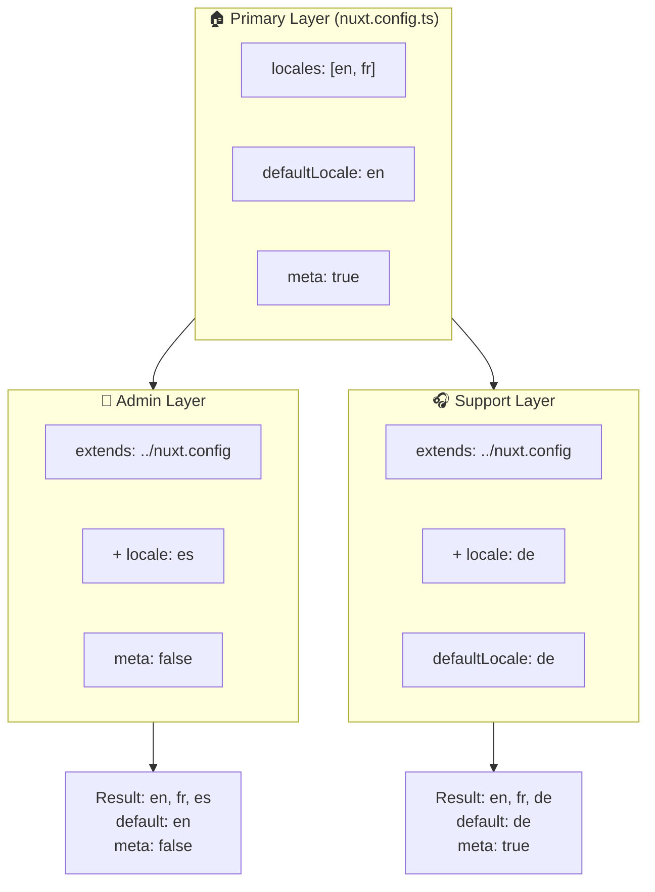

# 🗂️ Warstwy w `Nuxt I18n Micro`

## 📖 Wprowadzenie do warstw

Warstwy w `Nuxt I18n Micro` pozwalają elastycznie zarządzać i dostosowywać ustawienia lokalizacji w różnych częściach aplikacji. Definiując różne warstwy, możesz dostosować konfigurację dla różnych kontekstów, na przykład nadpisując ustawienia dla konkretnych sekcji witryny lub tworząc wielokrotnie używalne konfiguracje bazowe, które mogą być rozszerzane przez inne części aplikacji.

### Przepływ dziedziczenia warstw



## 🛠️ Warstwa konfiguracji głównej

**Warstwa konfiguracji głównej** to miejsce, gdzie ustawiasz domyślne ustawienia lokalizacji dla całej aplikacji. Ta warstwa jest niezbędna, ponieważ definiuje globalną konfigurację, w tym obsługiwane lokalizacje, domyślny język i inne krytyczne ustawienia i18n.

### 📄 Przykład: definiowanie warstwy konfiguracji głównej

Oto przykład, jak możesz zdefiniować warstwę konfiguracji głównej w pliku `nuxt.config.ts`:

```typescript
export default defineNuxtConfig({
  i18n: {
    locales: [
      { code: 'en', iso: 'en-EN', dir: 'ltr' },
      { code: 'fr', iso: 'fr-FR', dir: 'ltr' },
      { code: 'ar', iso: 'ar-SA', dir: 'rtl' },
    ],
    defaultLocale: 'en', // The default locale for the entire app
    translationDir: 'locales', // Directory where translations are stored
    meta: true, // Automatically generate SEO-related meta tags like `alternate`
    autoDetectLanguage: true, // Automatically detect and use the user's preferred language
  },
})
```

## 🌱 Warstwy potomne

Warstwy potomne służą do rozszerzania lub nadpisywania głównej konfiguracji dla konkretnych części aplikacji. Na przykład możesz chcieć dodać dodatkowe lokalizacje lub zmodyfikować domyślną lokalizację dla konkretnej sekcji witryny. Warstwy potomne są szczególnie przydatne w aplikacjach modularnych, w których różne części aplikacji mogą mieć różne wymagania lokalizacyjne.

### 📄 Przykład: rozszerzanie warstwy głównej w warstwie potomnej

Załóżmy, że masz sekcję witryny, która musi obsługiwać dodatkowe lokalizacje, lub chcesz wyłączyć konkretną lokalizację w danym kontekście. Oto jak to osiągnąć, rozszerzając warstwę konfiguracji głównej:

```typescript
// basic/nuxt.config.ts (Primary Layer)
export default defineNuxtConfig({
  i18n: {
    locales: [
      { code: 'en', iso: 'en-EN', dir: 'ltr' },
      { code: 'fr', iso: 'fr-FR', dir: 'ltr' },
    ],
    defaultLocale: 'en',
    meta: true,
    translationDir: 'locales',
  },
})
```

```typescript
// extended/nuxt.config.ts (Child Layer)
export default defineNuxtConfig({
  extends: '../basic', // Inherit the base configuration from the 'basic' layer
  i18n: {
    locales: [
      { code: 'en', iso: 'en-EN', dir: 'ltr' }, // Inherited from the base layer
      { code: 'fr', iso: 'fr-FR', dir: 'ltr' }, // Inherited from the base layer
      { code: 'de', iso: 'de-DE', dir: 'ltr' }, // Added in the child layer
    ],
    defaultLocale: 'fr', // Override the default locale to French for this section
    autoDetectLanguage: false, // Disable automatic language detection in this section
  },
})
```

### 🌐 Używanie warstw w aplikacji modularnej

W większej, modularnej aplikacji Nuxt możesz mieć wiele sekcji, z których każda wymaga własnych ustawień i18n. Wykorzystując warstwy, możesz utrzymać czystą i skalowalną strukturę konfiguracji.

### 📄 Przykład: konfiguracja warstwowa w aplikacji modularnej

Wyobraź sobie, że masz witrynę e-commerce z odrębnymi sekcjami, takimi jak główna witryna, panel administracyjny i portal wsparcia klienta. Każda sekcja może wymagać innego zestawu lokalizacji lub innych ustawień i18n.

#### **Warstwa główna (globalna konfiguracja):**

```typescript
// nuxt.config.ts
export default defineNuxtConfig({
  i18n: {
    locales: [
      { code: 'en', iso: 'en-EN', dir: 'ltr' },
      { code: 'fr', iso: 'fr-FR', dir: 'ltr' },
    ],
    defaultLocale: 'en',
    meta: true,
    translationDir: 'locales',
    autoDetectLanguage: true,
  },
})
```

#### **Warstwa potomna dla panelu administracyjnego:**

```typescript
// admin/nuxt.config.ts
export default defineNuxtConfig({
  extends: '../nuxt.config', // Inherit the global settings
  i18n: {
    locales: [
      { code: 'en', iso: 'en-EN', dir: 'ltr' }, // Inherited
      { code: 'fr', iso: 'fr-FR', dir: 'ltr' }, // Inherited
      { code: 'es', iso: 'es-ES', dir: 'ltr' }, // Specific to the admin panel
    ],
    defaultLocale: 'en',
    meta: false, // Disable automatic meta generation in the admin panel
  },
})
```

#### **Warstwa potomna dla portalu wsparcia klienta:**

```typescript
// support/nuxt.config.ts
export default defineNuxtConfig({
  extends: '../nuxt.config', // Inherit the global settings
  i18n: {
    locales: [
      { code: 'en', iso: 'en-EN', dir: 'ltr' }, // Inherited
      { code: 'fr', iso: 'fr-FR', dir: 'ltr' }, // Inherited
      { code: 'de', iso: 'de-DE', dir: 'ltr' }, // Specific to the support portal
    ],
    defaultLocale: 'de', // Default to German in the support portal
    autoDetectLanguage: false, // Disable automatic language detection
  },
})
```

W tym modularnym przykładzie:

- Każda sekcja (admin, support) ma własne ustawienia i18n, ale wszystkie dziedziczą konfigurację bazową.
- Panel administracyjny dodaje hiszpański (`es`) jako lokalizację i wyłącza generowanie tagów meta.
- Portal wsparcia dodaje niemiecki (`de`) jako lokalizację i domyślnie używa niemieckiego dla interfejsu użytkownika.

## 📝 Najlepsze praktyki używania warstw

- **🔧 Zachowaj prostotę warstwy głównej:** warstwa główna powinna zawierać najczęściej używane ustawienia, które mają zastosowanie globalnie w całej aplikacji. Zachowaj ją prostą, aby zapewnić spójność.
- **⚙️ Używaj warstw potomnych do konkretnych dostosowań:** nadpisuj lub rozszerzaj ustawienia w warstwach potomnych tylko wtedy, gdy jest to konieczne. To podejście unika niepotrzebnej złożoności konfiguracji.
- **📚 Dokumentuj swoje warstwy:** wyraźnie dokumentuj cel i szczegóły każdej warstwy w projekcie. To pomoże utrzymać klarowność i ułatwi innym (lub przyszłemu Tobie) zrozumienie konfiguracji.
