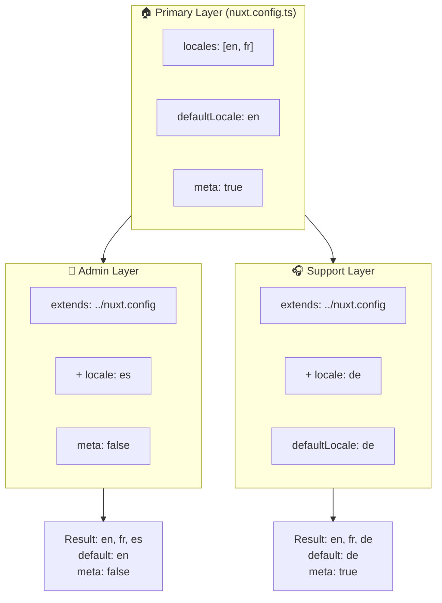

# 🗂️ Warstwy w `Nuxt I18n Micro`

## 📖 Wprowadzenie do warstw

Warstwy w `Nuxt I18n Micro` pozwalają elastycznie zarządzać i dostosowywać ustawienia lokalizacji w różnych częściach aplikacji. Definiując różne warstwy, możesz dostosować konfigurację do różnych kontekstów, na przykład nadpisując ustawienia dla konkretnych sekcji witryny lub tworząc reużywalne konfiguracje bazowe rozszerzane przez inne części aplikacji.

### Przepływ dziedziczenia warstw



## 🛠️ Podstawowa warstwa konfiguracji

**Podstawowa warstwa konfiguracji** to miejsce, w którym ustawiasz domyślne ustawienia lokalizacji dla całej aplikacji. Ta warstwa jest kluczowa, ponieważ definiuje globalną konfigurację, w tym obsługiwane locale, język domyślny i inne krytyczne ustawienia i18n.

### 📄 Przykład: definiowanie podstawowej warstwy konfiguracji

Oto przykład, jak możesz zdefiniować podstawową warstwę konfiguracji w pliku `nuxt.config.ts`:

```typescript
export default defineNuxtConfig({
  i18n: {
    locales: [
      { code: 'en', iso: 'en-EN', dir: 'ltr' },
      { code: 'fr', iso: 'fr-FR', dir: 'ltr' },
      { code: 'ar', iso: 'ar-SA', dir: 'rtl' },
    ],
    defaultLocale: 'en', // The default locale for the entire app
    translationDir: 'locales', // Directory where translations are stored
    meta: true, // Automatically generate SEO-related meta tags like `alternate`
    autoDetectLanguage: true, // Automatically detect and use the user's preferred language
  },
})
```

## 🌱 Warstwy potomne

Warstwy potomne służą do rozszerzania lub nadpisywania podstawowej konfiguracji dla określonych części aplikacji. Na przykład, możesz chcieć dodać dodatkowe locale lub zmodyfikować domyślne locale dla konkretnej sekcji witryny. Warstwy potomne są szczególnie przydatne w aplikacjach modułowych, gdzie różne części aplikacji mogą mieć różne wymagania dotyczące lokalizacji.

### 📄 Przykład: rozszerzanie podstawowej warstwy w warstwie potomnej

Załóżmy, że masz sekcję witryny, która musi obsługiwać dodatkowe locale, albo chcesz wyłączyć konkretne locale w określonym kontekście. Oto jak możesz to osiągnąć, rozszerzając podstawową warstwę konfiguracji:

```typescript
// basic/nuxt.config.ts (Primary Layer)
export default defineNuxtConfig({
  i18n: {
    locales: [
      { code: 'en', iso: 'en-EN', dir: 'ltr' },
      { code: 'fr', iso: 'fr-FR', dir: 'ltr' },
    ],
    defaultLocale: 'en',
    meta: true,
    translationDir: 'locales',
  },
})
```

```typescript
// extended/nuxt.config.ts (Child Layer)
export default defineNuxtConfig({
  extends: '../basic', // Inherit the base configuration from the 'basic' layer
  i18n: {
    locales: [
      { code: 'en', iso: 'en-EN', dir: 'ltr' }, // Inherited from the base layer
      { code: 'fr', iso: 'fr-FR', dir: 'ltr' }, // Inherited from the base layer
      { code: 'de', iso: 'de-DE', dir: 'ltr' }, // Added in the child layer
    ],
    defaultLocale: 'fr', // Override the default locale to French for this section
    autoDetectLanguage: false, // Disable automatic language detection in this section
  },
})
```

### 🌐 Używanie warstw w aplikacji modułowej

W większej, modułowej aplikacji Nuxt możesz mieć wiele sekcji, z których każda wymaga własnych ustawień i18n. Wykorzystując warstwy, możesz utrzymać przejrzystą i skalowalną strukturę konfiguracji.

### 📄 Przykład: warstwowa konfiguracja w aplikacji modułowej

Wyobraź sobie witrynę e-commerce z odrębnymi sekcjami, takimi jak główna strona, panel administratora i portal obsługi klienta. Każda sekcja może wymagać innego zestawu locale lub innych ustawień i18n.

#### **Podstawowa warstwa (konfiguracja globalna):**

```typescript
// nuxt.config.ts
export default defineNuxtConfig({
  i18n: {
    locales: [
      { code: 'en', iso: 'en-EN', dir: 'ltr' },
      { code: 'fr', iso: 'fr-FR', dir: 'ltr' },
    ],
    defaultLocale: 'en',
    meta: true,
    translationDir: 'locales',
    autoDetectLanguage: true,
  },
})
```

#### **Warstwa potomna dla panelu administratora:**

```typescript
// admin/nuxt.config.ts
export default defineNuxtConfig({
  extends: '../nuxt.config', // Inherit the global settings
  i18n: {
    locales: [
      { code: 'en', iso: 'en-EN', dir: 'ltr' }, // Inherited
      { code: 'fr', iso: 'fr-FR', dir: 'ltr' }, // Inherited
      { code: 'es', iso: 'es-ES', dir: 'ltr' }, // Specific to the admin panel
    ],
    defaultLocale: 'en',
    meta: false, // Disable automatic meta generation in the admin panel
  },
})
```

#### **Warstwa potomna dla portalu obsługi klienta:**

```typescript
// support/nuxt.config.ts
export default defineNuxtConfig({
  extends: '../nuxt.config', // Inherit the global settings
  i18n: {
    locales: [
      { code: 'en', iso: 'en-EN', dir: 'ltr' }, // Inherited
      { code: 'fr', iso: 'fr-FR', dir: 'ltr' }, // Inherited
      { code: 'de', iso: 'de-DE', dir: 'ltr' }, // Specific to the support portal
    ],
    defaultLocale: 'de', // Default to German in the support portal
    autoDetectLanguage: false, // Disable automatic language detection
  },
})
```

W tym modułowym przykładzie:

- Każda sekcja (admin, support) ma własne ustawienia i18n, ale wszystkie dziedziczą konfigurację bazową.
- Panel administratora dodaje hiszpański (`es`) jako locale i wyłącza generowanie meta tagów.
- Portal obsługi klienta dodaje niemiecki (`de`) jako locale i domyślnie ustawia niemiecki dla interfejsu użytkownika.

## 📝 Dobre praktyki korzystania z warstw

- **🔧 Utrzymuj podstawową warstwę prostą:** Podstawowa warstwa powinna zawierać najczęściej używane ustawienia stosowane globalnie w Twojej aplikacji. Utrzymuj ją prostą, aby zapewnić spójność.
- **⚙️ Używaj warstw potomnych do konkretnych dostosowań:** Nadpisuj lub rozszerzaj ustawienia w warstwach potomnych tylko wtedy, gdy jest to konieczne. To podejście pozwala uniknąć niepotrzebnej złożoności w konfiguracji.
- **📚 Dokumentuj swoje warstwy:** Jasno dokumentuj cel i specyfikę każdej warstwy w projekcie. Pomoże to zachować przejrzystość i ułatwi innym (lub Tobie w przyszłości) zrozumienie konfiguracji.
