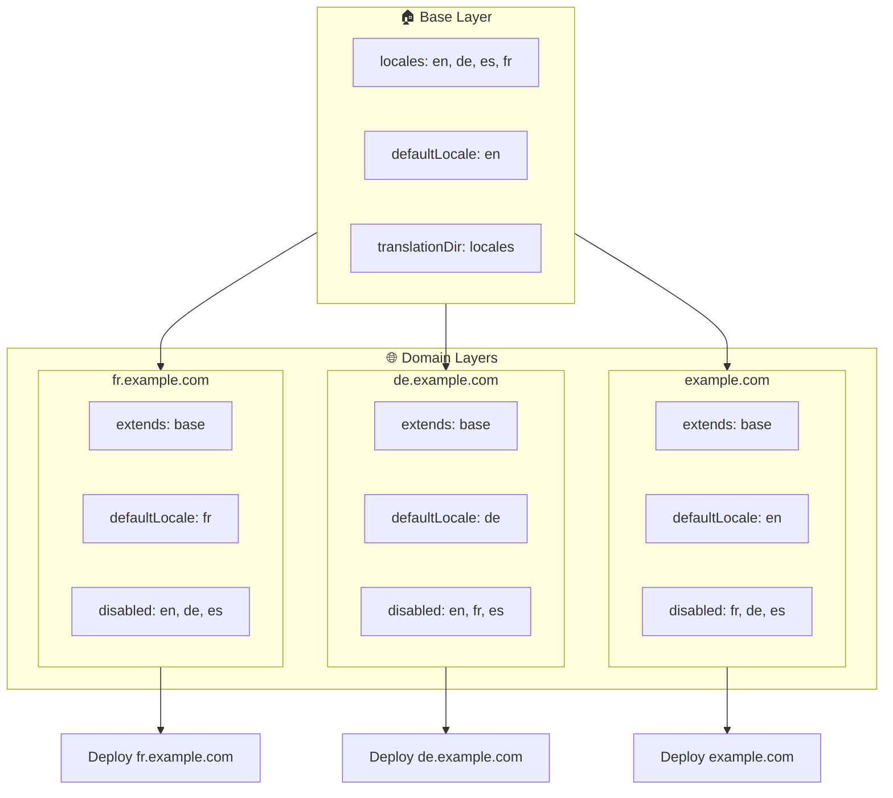

# 🌍 Konfiguracja wielodomenowych locale z `Nuxt I18n Micro` za pomocą warstw

## 📝 Wprowadzenie

Wykorzystując warstwy w `Nuxt I18n Micro`, możesz stworzyć elastyczną i łatwą w utrzymaniu konfigurację wielodomenowej lokalizacji. To podejście nie tylko upraszcza zarządzanie domenami, eliminując potrzebę skomplikowanych funkcjonalności, ale również umożliwia efektywne rozłożenie obciążenia i redukcję złożoności projektu. Uruchamiając osobne projekty dla różnych locale, Twoja aplikacja może łatwo skalować się i dostosowywać do różnych wymagań locale w wielu domenach, oferując solidne i skalowalne rozwiązanie dla aplikacji globalnych.

## 🎯 Cel

Stworzyć konfigurację, w której różne domeny serwują konkretne locale przez dostosowywanie konfiguracji w warstwach potomnych. Ta metoda wykorzystuje system warstw Nuxt, pozwalając Ci utrzymać konfigurację bazową, rozszerzając lub modyfikując ją dla każdej domeny.

### Architektura wielodomenowa



## 🛠 Kroki implementacji wielodomenowych locale

### 1. **Utwórz warstwę bazową**

Zacznij od stworzenia bazowej warstwy konfiguracji, która zawiera wszystkie wspólne ustawienia locale dla Twojej aplikacji. Ta konfiguracja będzie stanowić fundament dla innych konfiguracji specyficznych dla domen.

#### **Konfiguracja warstwy bazowej**

Utwórz plik konfiguracji bazowej `base/nuxt.config.ts`:

```typescript
// base/nuxt.config.ts

export default defineNuxtConfig({
  i18n: {
    locales: [
      { code: 'en', iso: 'en-US', dir: 'ltr' },
      { code: 'de', iso: 'de-DE', dir: 'ltr' },
      { code: 'es', iso: 'es-ES', dir: 'ltr' },
    ],
    defaultLocale: 'en',
    translationDir: 'locales',
    meta: true,
    autoDetectLanguage: true,
  },
})
```

### 2. **Utwórz warstwy potomne specyficzne dla domen**

Dla każdej domeny utwórz warstwę potomną, która modyfikuje konfigurację bazową, aby spełnić konkretne wymagania tej domeny. Możesz wyłączyć locale, które nie są potrzebne dla konkretnej domeny.

#### **Przykład: konfiguracja dla domeny francuskiej**

Utwórz konfigurację warstwy potomnej dla domeny francuskiej w `fr/nuxt.config.ts`:

```typescript
// fr/nuxt.config.ts

export default defineNuxtConfig({
  extends: '../base', // Inherit from the base configuration

  i18n: {
    locales: [
      { code: 'en', iso: 'en-US', dir: 'ltr', disabled: true }, // Disable English
      { code: 'fr', iso: 'fr-FR', dir: 'ltr' }, // Add and enable the French locale
      { code: 'de', iso: 'de-DE', dir: 'ltr', disabled: true }, // Disable German
      { code: 'es', iso: 'es-ES', dir: 'ltr', disabled: true }, // Disable Spanish
    ],
    defaultLocale: 'fr', // Set French as the default locale
    autoDetectLanguage: false, // Disable automatic language detection
  },
})
```

#### **Przykład: konfiguracja dla domeny niemieckiej**

Podobnie utwórz konfigurację warstwy potomnej dla domeny niemieckiej w `de/nuxt.config.ts`:

```typescript
// de/nuxt.config.ts

export default defineNuxtConfig({
  extends: '../base', // Inherit from the base configuration

  i18n: {
    locales: [
      { code: 'en', iso: 'en-US', dir: 'ltr', disabled: true }, // Disable English
      { code: 'fr', iso: 'fr-FR', dir: 'ltr', disabled: true }, // Disable French
      { code: 'de', iso: 'de-DE', dir: 'ltr' }, // Use the German locale
      { code: 'es', iso: 'es-ES', dir: 'ltr', disabled: true }, // Disable Spanish
    ],
    defaultLocale: 'de', // Set German as the default locale
    autoDetectLanguage: false, // Disable automatic language detection
  },
})
```

### 3. **Wdróż aplikację dla każdej domeny**

Wdróż aplikację z odpowiednią konfiguracją dla każdej domeny. Na przykład:

- Wdróż konfigurację warstwy `fr` na `fr.example.com`.
- Wdróż konfigurację warstwy `de` na `de.example.com`.

### 4. **Skonfiguruj wiele projektów dla różnych locale**

Dla każdego locale i domeny będziesz musiał uruchomić osobną instancję aplikacji. Zapewnia to, że każda domena serwuje poprawną konfigurację locale, optymalizując rozkład obciążenia i upraszczając strukturę projektu. Uruchamiając wiele projektów dostosowanych do każdego locale, możesz utrzymać czystą separację konfiguracji i zmniejszyć złożoność ogólnej konfiguracji.

### 5. **Skonfiguruj routing na podstawie domeny**

Upewnij się, że routing jest skonfigurowany tak, aby kierował użytkowników do odpowiedniego projektu na podstawie domeny, do której się dostają. Zapewni to, że każda domena będzie serwować odpowiednie locale, poprawiając doświadczenie użytkownika i utrzymując spójność w różnych regionach.

### 6. **Wdróż i zweryfikuj**

Po skonfigurowaniu warstw i wdrożeniu ich na odpowiednich domenach upewnij się, że każda domena serwuje poprawne locale. Dokładnie przetestuj aplikację, aby potwierdzić, że w zależności od domeny ładowane jest właściwe locale.

## 📝 Dobre praktyki

- **Utrzymuj bazową konfigurację generyczną**: Konfiguracja bazowa powinna obejmować ogólne ustawienia mające zastosowanie do wszystkich domen.
- **Izoluj logikę specyficzną dla domen**: Trzymaj konfiguracje specyficzne dla domen w ich odpowiednich warstwach, aby zachować przejrzystość i separację odpowiedzialności.

## 🎉 Podsumowanie

Wykorzystując warstwy w `Nuxt I18n Micro`, możesz stworzyć elastyczną i łatwą w utrzymaniu konfigurację wielodomenowej lokalizacji. To podejście nie tylko eliminuje potrzebę skomplikowanych funkcjonalności zarządzania domenami, ale również pozwala efektywnie rozłożyć obciążenie i zmniejszyć złożoność projektu. Uruchamianie osobnych projektów dla różnych locale zapewnia, że Twoja aplikacja może się łatwo skalować i dostosowywać do różnych wymagań locale w różnych domenach, oferując solidne i skalowalne rozwiązanie dla globalnych aplikacji.
