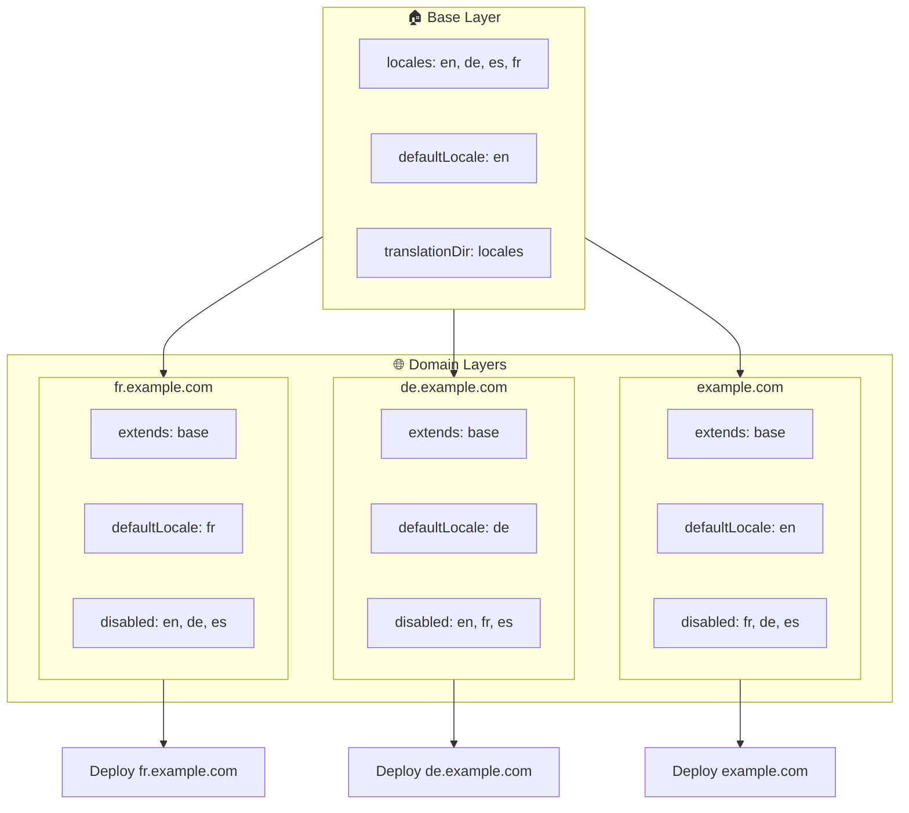

# 🌍 Konfiguracja multi-domenowych lokalizacji w `Nuxt I18n Micro` z użyciem warstw

## 📝 Wprowadzenie

Wykorzystując warstwy w `Nuxt I18n Micro`, możesz stworzyć elastyczną i łatwą w utrzymaniu konfigurację lokalizacji wielodomenowej. To podejście nie tylko upraszcza zarządzanie domenami, eliminując potrzebę złożonych funkcjonalności, ale także umożliwia efektywne rozłożenie obciążenia i zmniejszenie złożoności projektu. Uruchamiając osobne projekty dla różnych lokalizacji, Twoja aplikacja może łatwo się skalować i dostosowywać do różnych wymagań lokalizacji w wielu domenach, oferując solidne i skalowalne rozwiązanie dla aplikacji globalnych.

## 🎯 Cel

Stworzenie konfiguracji, w której różne domeny serwują konkretne lokalizacje przez dostosowanie konfiguracji w warstwach potomnych. Ta metoda wykorzystuje system warstw Nuxt, pozwalając zachować bazową konfigurację i rozszerzać ją lub modyfikować dla każdej domeny.

### Architektura multi-domenowa



## 🛠 Kroki wdrożenia multi-domenowych lokalizacji

### 1. **Utwórz warstwę bazową**

Zacznij od utworzenia bazowej warstwy konfiguracyjnej, która zawiera wszystkie wspólne ustawienia lokalizacji dla aplikacji. Ta konfiguracja posłuży jako fundament dla innych konfiguracji specyficznych dla domen.

#### **Konfiguracja warstwy bazowej**

Utwórz bazowy plik konfiguracyjny `base/nuxt.config.ts`:

```typescript
// base/nuxt.config.ts

export default defineNuxtConfig({
  i18n: {
    locales: [
      { code: 'en', iso: 'en-US', dir: 'ltr' },
      { code: 'de', iso: 'de-DE', dir: 'ltr' },
      { code: 'es', iso: 'es-ES', dir: 'ltr' },
    ],
    defaultLocale: 'en',
    translationDir: 'locales',
    meta: true,
    autoDetectLanguage: true,
  },
})
```

### 2. **Utwórz warstwy potomne specyficzne dla domen**

Dla każdej domeny utwórz warstwę potomną, która modyfikuje bazową konfigurację, aby spełnić konkretne wymagania tej domeny. Możesz wyłączyć lokalizacje, które nie są potrzebne dla konkretnej domeny.

#### **Przykład: konfiguracja dla domeny francuskiej**

Utwórz konfigurację warstwy potomnej dla domeny francuskiej w `fr/nuxt.config.ts`:

```typescript
// fr/nuxt.config.ts

export default defineNuxtConfig({
  extends: '../base', // Inherit from the base configuration

  i18n: {
    locales: [
      { code: 'en', iso: 'en-US', dir: 'ltr', disabled: true }, // Disable English
      { code: 'fr', iso: 'fr-FR', dir: 'ltr' }, // Add and enable the French locale
      { code: 'de', iso: 'de-DE', dir: 'ltr', disabled: true }, // Disable German
      { code: 'es', iso: 'es-ES', dir: 'ltr', disabled: true }, // Disable Spanish
    ],
    defaultLocale: 'fr', // Set French as the default locale
    autoDetectLanguage: false, // Disable automatic language detection
  },
})
```

#### **Przykład: konfiguracja dla domeny niemieckiej**

Analogicznie utwórz konfigurację warstwy potomnej dla domeny niemieckiej w `de/nuxt.config.ts`:

```typescript
// de/nuxt.config.ts

export default defineNuxtConfig({
  extends: '../base', // Inherit from the base configuration

  i18n: {
    locales: [
      { code: 'en', iso: 'en-US', dir: 'ltr', disabled: true }, // Disable English
      { code: 'fr', iso: 'fr-FR', dir: 'ltr', disabled: true }, // Disable French
      { code: 'de', iso: 'de-DE', dir: 'ltr' }, // Use the German locale
      { code: 'es', iso: 'es-ES', dir: 'ltr', disabled: true }, // Disable Spanish
    ],
    defaultLocale: 'de', // Set German as the default locale
    autoDetectLanguage: false, // Disable automatic language detection
  },
})
```

### 3. **Wdrażanie aplikacji dla każdej domeny**

Wdrażaj aplikację z odpowiednią konfiguracją dla każdej domeny. Na przykład:

- Wdróż konfigurację warstwy `fr` na `fr.example.com`.
- Wdróż konfigurację warstwy `de` na `de.example.com`.

### 4. **Skonfiguruj wiele projektów dla różnych lokalizacji**

Dla każdej lokalizacji i domeny musisz uruchomić osobną instancję aplikacji. Dzięki temu każda domena serwuje właściwą konfigurację lokalizacji, optymalizując rozłożenie obciążenia i upraszczając strukturę projektu. Uruchamiając wiele projektów dostosowanych do każdej lokalizacji, możesz zachować czysty rozdział między konfiguracjami i zmniejszyć złożoność ogólnej konfiguracji.

### 5. **Skonfiguruj routing na podstawie domeny**

Upewnij się, że routing jest skonfigurowany tak, aby kierować użytkowników do właściwego projektu na podstawie domeny, do której się odwołują. To zapewni, że każda domena serwuje odpowiednią lokalizację, poprawiając doświadczenie użytkownika i zachowując spójność między różnymi regionami.

### 6. **Wdróż i zweryfikuj**

Po skonfigurowaniu warstw i wdrożeniu ich na odpowiednie domeny upewnij się, że każda domena serwuje właściwą lokalizację. Przetestuj aplikację dokładnie, aby potwierdzić, że ładowana jest właściwa lokalizacja w zależności od domeny.

## 📝 Najlepsze praktyki

- **Zachowaj generyczną konfigurację bazową**: konfiguracja bazowa powinna obejmować ogólne ustawienia mające zastosowanie do wszystkich domen.
- **Izoluj logikę specyficzną dla domeny**: trzymaj konfiguracje specyficzne dla domen w ich odpowiednich warstwach, aby zachować klarowność i separację odpowiedzialności.

## 🎉 Podsumowanie

Wykorzystując warstwy w `Nuxt I18n Micro`, możesz stworzyć elastyczną i łatwą w utrzymaniu konfigurację lokalizacji multi-domenowej. To podejście nie tylko eliminuje potrzebę złożonych funkcjonalności zarządzania domenami, ale także pozwala efektywnie rozłożyć obciążenie i zmniejszyć złożoność projektu. Uruchamianie osobnych projektów dla różnych lokalizacji zapewnia, że Twoja aplikacja może się łatwo skalować i dostosowywać do różnych wymagań lokalizacji w różnych domenach, oferując solidne i skalowalne rozwiązanie dla aplikacji globalnych.
