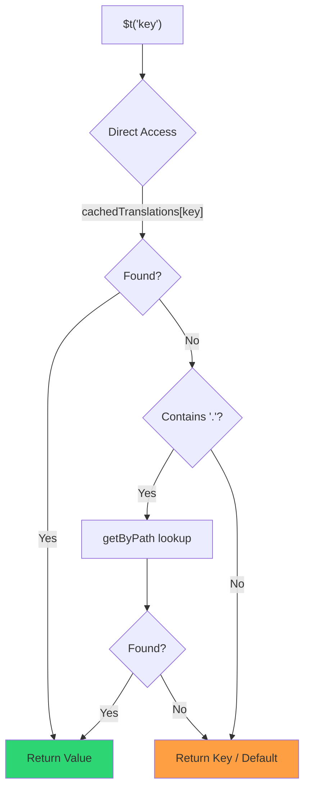

# 🚀 Przewodnik po wydajności

## 📖 Wprowadzenie

`Nuxt I18n Micro` został zaprojektowany z myślą o wydajności, oferując znaczącą poprawę względem tradycyjnych modułów internacjonalizacji (i18n), takich jak `nuxt-i18n`. Ten przewodnik szczegółowo omawia korzyści wydajnościowe płynące z używania `Nuxt I18n Micro` oraz porównuje go z innymi rozwiązaniami.

## 🤔 Dlaczego skupiamy się na wydajności?

W projektach o dużej skali i środowiskach z dużym ruchem wąskie gardła wydajnościowe mogą prowadzić do wolnych buildów, zwiększonego zużycia pamięci i słabych czasów odpowiedzi serwera. Problemy te stają się wyraźniejsze przy złożonych konfiguracjach i18n z dużymi plikami tłumaczeń. `Nuxt I18n Micro` został zbudowany, aby stawić czoła tym wyzwaniom, optymalizując pod kątem szybkości, efektywności pamięciowej i minimalnego wpływu na rozmiar paczki aplikacji.

## 📊 Porównanie wydajności

Przeprowadziliśmy serię testów na identycznych fixture'ach przez `pnpm test:performance` (`pnpm -C scripts cli performance`) w porównaniu z **`@nuxtjs/i18n@10.6.0`**. Pełna metodologia i wykresy: [Wyniki testów wydajności](/guides/performance-results).

Domyślny profil CLI: **4 locale** × **2 strony** (`index`, `page`) × ~10k kluczy liści indexu. Zwiększ `--locales` / `--keys` dla cięższego obciążenia. Raport rozdziela **kod**, **tłumaczenia** (w tym `chunks/raw/*` z `@nuxtjs/i18n`) oraz **łączny** deployable output.

```bash
pnpm test:performance
pnpm -C scripts cli performance --only micro --skip-stress
pnpm -C scripts cli performance --locales 12 --keys 100000 --runs 3
```

### ⏱️ Czas budowania i zużycie zasobów

<Accordion title="**@nuxtjs/i18n v10.6**">
- **Code Bundle**: 2.16 MB
- **Translations**: 7.21 MB (message chunks + locale payloads)
- **Total deployable**: 9.37 MB
- **Max Memory Usage**: 1,821 MB
- **Elapsed Time**: 8.34s (mean of 3)
</Accordion>

<Tip>
- **Code Bundle**: 1.74 MB — **~19% mniej kodu niż `@nuxtjs/i18n` v10.6**
- **Translations**: 6.8 MB (lazy-loaded JSON)
- **Total deployable**: 8.54 MB
- **Max Memory Usage**: 1,065 MB — **~41% mniej pamięci niż `@nuxtjs/i18n` v10.6**
- **Elapsed Time**: 5.34s — **~36% szybciej niż `@nuxtjs/i18n` v10.6** (≈ baseline czystego Nuxta)
</Tip>

> Starsze dokumenty pokazujące dla `@nuxtjs/i18n` „code ≈ 15 MB / translations 0 B” zaliczały pliki wiadomości `chunks/raw` jako kod aplikacji. Aktualny klasyfikator je rozdziela; różnica w **kodzie** jest mniejsza, ale micro nadal prowadzi pod względem czasu budowy, szczytowego RSS oraz testów obciążeniowych.

Zobacz [pełny raport benchmarku](/guides/performance-results), aby zapoznać się z wykresami, wynikami Autocannon oraz szczegółami fixture'ów.

### 🌐 Wydajność serwera pod obciążeniem

Artillery (6s@6 + 60s@60) i Autocannon (10c / 10s), średnia z 3 kolejnych przebiegów per fixture.

<Accordion title="**@nuxtjs/i18n v10.6**">
- **Requests per Second (Artillery)**: 143 [#/sec]
- **Average Response Time**: 956 ms
- **Autocannon RPS / avg latency**: 72 / 139 ms
</Accordion>

<Tip>
- **Requests per Second (Artillery)**: 275 [#/sec] — **~93% więcej niż `@nuxtjs/i18n` v10.6**
- **Average Response Time**: 483 ms — **~49% szybciej niż `@nuxtjs/i18n` v10.6**
- **Autocannon RPS / avg latency**: 162 / 62 ms
</Tip>

### 📈 Porównanie wizualne

<Note>
Interaktywny wykres pominięto w dokumentacji Mintlify. Zobacz tabele benchmarku na tej stronie lub [dokumentację VitePress](https://s00d.github.io/nuxt-i18n-micro/guide/performance-results) po wykres: `chart`.
</Note>

<Note>
Interaktywny wykres pominięto w dokumentacji Mintlify. Zobacz tabele benchmarku na tej stronie lub [dokumentację VitePress](https://s00d.github.io/nuxt-i18n-micro/guide/performance-results) po wykres: `chart`.
</Note>

| Metryka         | @nuxtjs/i18n v10.6 | i18n-micro | Poprawa            |
| --------------- | ------------------ | ---------- | ------------------ |
| Czas budowy     | 8.34s              | 5.34s      | **~36% szybciej**  |
| Pamięć (build)  | 1,821 MB           | 1,065 MB   | **~41% mniej**     |
| Code Bundle     | 2.16 MB            | 1.74 MB    | **~19% mniejszy**  |
| Response Time   | 956 ms             | 483 ms     | **~49% szybciej**  |
| RPS (Artillery) | 143                | 275        | **~93% więcej**    |

### 🔍 Interpretacja wyników

Względem obecnego `@nuxtjs/i18n` **v10.6** (domyślny profil CLI, średnia z 3):

- 🗜️ **Mniejszy graf kodu**: ~1.74 MB vs ~2.16 MB, gdy chunki wiadomości nie są błędnie oznaczane jako „kod”.
- 🧠 **Niższy RSS buildu**: ~1.1 GB szczyt vs ~1.8 GB.
- 🕒 **Szybsze buildy**: ~5.3s vs ~8.3s (micro dorównuje baseline'owi czystego Nuxta na tym profilu).
- ⚡ **Znacznie lepiej pod obciążeniem**: ~275 vs ~143 Artillery RPS, ~162 vs ~72 Autocannon RPS, niższe średnie opóźnienie.

Liczby bezwzględne różnią się od starszych opublikowanych tabel (mniejsze słowniki, starszy Nuxt oraz niesprawiedliwy podział „0 B translations” dla `@nuxtjs/i18n`). Kierunkowo to samo: micro pozostaje z przodu pod względem kosztu buildu i przepustowości żądań.

## ⚙️ Kluczowe optymalizacje

### 🛠️ Minimalistyczny design

`Nuxt I18n Micro` jest zbudowany wokół minimalistycznej architektury z małym rdzeniem i dedykowanymi pakietami strategii. Redukuje to narzut i upraszcza wewnętrzną logikę, prowadząc do lepszej wydajności.

### 🚦 Efektywny routing

W v3 generowanie tras i logika ścieżek runtime są rozdzielone na dedykowane pakiety w celu optymalnego tree-shakingu:

- **`@i18n-micro/route-strategy`** — Generowanie tras w czasie buildu: rozszerza strony Nuxt o zlokalizowane trasy. Uwzględniana jest tylko wybrana strategia (`no_prefix`, `prefix`, `prefix_except_default`, `prefix_and_default`).
- **`@i18n-micro/path-strategy`** — Rozstrzyganie ścieżek w runtime, przekierowania i generowanie linków. Używa czystych funkcji i wstępnie policzonych flag kontekstu, aby minimalizować alokacje na hot pathach. Subpath exports (`/prefix`, `/no-prefix` itd.) zapewniają, że w paczce znajduje się tylko wybrana implementacja.

To podejście utrzymuje konfigurację routingu lekką i zapewnia szybkie rozwiązywanie tras niezależnie od liczby locale.

### 📂 Uproszczone ładowanie tłumaczeń

Moduł obsługuje tylko pliki JSON dla tłumaczeń, z wyraźnym podziałem na pliki globalne i specyficzne dla stron. Zapewnia to, że w danej chwili ładowane są tylko niezbędne dane tłumaczeń, dodatkowo podnosząc wydajność.

### 🔒 Singleton cache w GlobalThis

Począwszy od v3.0.0 moduł używa wzorca singleton na `globalThis` z `Symbol.for`, aby zagwarantować jedną instancję cache dla całego procesu Node.js. Zapobiega to:

- Duplikacji cache, gdy ten sam moduł jest zbundlowany wielokrotnie
- Odtwarzaniu obiektów per-request, które generuje presję na garbage collector
- Wyciekom pamięci ze sierocych instancji cache

```mermaid
flowchart LR
    subgraph Process["Node.js Process"]
        G["globalThis[Symbol.for('CACHE')]"]

        subgraph R1["SSR Request 1"]
            P1[Plugin Instance] --> G
        end

        subgraph R2["SSR Request 2"]
            P2[Plugin Instance] --> G
        end

        subgraph R3["SSR Request 3"]
            P3[Plugin Instance] --> G
        end
    end

    G --> Cache["Single Map Instance"]
    Cache --> D1["en:index → translations"]
    Cache --> D2["en:about → translations"
```

```typescript
// Internal implementation pattern
const CACHE_KEY = Symbol.for('__NUXT_I18N_STORAGE_CACHE__')
if (!globalThis[CACHE_KEY]) {
  globalThis[CACHE_KEY] = new Map()
}
```

### ⚡ Zoptymalizowana funkcja tłumaczeń (tFast)

Funkcja `$t()` używa strategii bezpośredniego wyszukiwania zoptymalizowanej pod kątem szybkości:

1. **Wstępnie policzony kontekst**: Locale i nazwa trasy są wyliczane raz podczas nawigacji, a nie przy każdym wywołaniu `$t()`.
2. **Wyszukiwanie z jednego źródła**: Wszystkie tłumaczenia (root + page-specific + fallback) są scalane w czasie buildu w jeden plik per strona — brak potrzeby warstwowego wyszukiwania.
3. **Kumulatywny deep merge przy nawigacji**: Podczas nawigacji w obrębie tego samego locale nowe tłumaczenia stron są deep-mergowane (na głębokość 2 poziomów) w aktywny słownik, więc klucze z poprzedniej strony pozostają widoczne podczas animacji przejścia — nawet gdy strony współdzielą nakładające się zagnieżdżone prefiksy (np. obie strony mają klucze pod `common.*`).
4. **Garbage collection przez `page:transition:finish`**: Po pełnym zakończeniu animacji przejścia scalony słownik jest zastępowany czystymi tłumaczeniami wyłącznie dla nowej strony, zwalniając pamięć po kluczach starej strony.
5. **Bezpośredni dostęp do właściwości**: Używa `obj[key]` zamiast wyszukiwania w Mapie dla hot pathów.



```typescript
// Simplified lookup logic — single active dictionary
let val = cachedTranslations[key]
if (val === undefined && key.includes('.')) {
  val = getByPath(cachedTranslations, key)
}
```

### 💉 Ładowanie po stronie serwera (bez osadzania w HTML)

Tłumaczenia załadowane podczas SSR pozostają w **pamięci serwera** dla `$t` podczas renderowania. **Nie** są kopiowane do `nuxtApp.payload` / dokumentu HTML (to samo podejście co `@nuxtjs/i18n` z `experimental.preload: false`).

Na kliencie `01.plugin.ts` wykonuje `await` na `switchContext`, która ładuje `/\{apiBaseUrl\}/:page/:locale/data.json`, zanim aplikacja pójdzie dalej — jedno żądanie, a nie 8 MB inline'owego bloba.

`NuxtI18n` nadal przechowuje aktywny scalony słownik (`cachedTranslations`) dla `$t()` / `$has()`. Nawigacje w tym samym locale deep-mergują chunki stron, dopóki `page:transition:finish` nie posprząta nieaktualnych kluczy.

#### Gdzie stoimy dzisiaj

Poniższe liczby są odczytywane z pliku budżetu, który mierzy i egzekwuje `pnpm run budget:payload`.

{/* generated:payload-budget — do not edit; run `pnpm run docs:generate` */}

Zmierzone na `playground` na `/`, `/de`:

| Pomiar | Rozmiar |
| --- | --- |
| Źródła tłumaczeń na dysku | 15.2 MB |
| Serwowane jako osobne pliki payloadów | 76.3 MB |
| Największy inline `__NUXT_DATA__` | 6.9 MB |
| Zasoby klienta | 449.5 KB |

Playground celowo niesie duży słownik, więc te liczby nie są takie, jakich należy oczekiwać od prawdziwej aplikacji — są to stałe punkty odniesienia. Budżet zawodzi, gdy niespodziewanie rosną, dzięki czemu przypadkowa zmiana zawartości payloadu zostaje zauważona.

{/* /generated:payload-budget */}

### 💾 Cache i pre-rendering

Tłumaczenia przechodzą przez kilka warstw cache, a wiedza, która z nich odpowiedziała na żądanie, to różnica między pięcioma minutami a pięcioma godzinami debugowania. Są cztery, w kolejności, w jakiej spotyka je żądanie:

| Warstwa | Gdzie | Czas życia | Czyszczone przez |
| --- | --- | --- | --- |
| Przeglądarka / CDN | `Cache-Control` na `/\{apiBaseUrl\}/**` | `httpCacheDuration`, `immutable` | nowe `?v=` — czyli deploy, który zmienił tłumaczenia |
| Route cache Nitro | `routeRules['/\{apiBaseUrl\}/**'].cache` | 60 s, stale-while-revalidate | restart serwera |
| Server loader | in-process `CacheControl`, klucz `locale:routeName` | czas życia procesu, lub `cacheTtl` | restart serwera, HMR w dev |
| Client store | `translationStorage` + aktywny chunk w `NuxtI18n` | czas życia strony | przeładowanie |

Dwie zasady chronią je przed wzajemnym sprzecznym działaniem:

- **Route cache Nitro istnieje tylko wtedy, gdy istnieje `?v=`.** Z cache-busterem każdy URL jest unikalny dla swojej zawartości, więc jego cachowanie po stronie serwera jest wolne od nieaktualności. Ustaw `dateBuild: 0`, a ta warstwa zostanie wyłączona, ponieważ URL jest wtedy stabilny i odpowiedź mówi `must-revalidate` — cache po stronie serwera odpowiadałby ze stale entry przez do minuty i cicho by go pokonał.
- **`immutable` również wymaga `?v=`.** Bez bustera nagłówek to `public, max-age=0, must-revalidate`, cokolwiek mówi `httpCacheDuration`: długie `max-age` na niezmieniającym się URL-u przypina pierwszą odpowiedź, jaką przeglądarka kiedykolwiek widziała.

<Warning>
Przy `translationPayloads.publicAssets` (domyślnie w trybie premerged) payloady są kopiowane do `public/<apiBaseUrl>/\{page\}/\{locale\}/data.json`. Platforma serwująca ten katalog samodzielnie (Cloudflare Pages, Firebase Hosting, `npx serve`) stosuje własne nagłówki — nagłówek `routeRules` Nitro dociera tylko do odpowiedzi przechodzących przez serwer. Ustaw politykę cache dla tych plików statycznych w konfiguracji samej platformy.
</Warning>

🏁 **Pre-rendering**: w trybie premerged `publicAssets` już zapisuje drzewo URL klienta do `public/`. Włącz `prerenderRoutes` tylko, jeśli potrzebujesz, aby Nitro materializowało trasy handlera, gdy ta kopia jest wyłączona.

### 🗜️ Skompresowane payloady public

Gdy `nitro.compressPublicAssets` jest włączone, payloady tłumaczeń kopiowane do katalogu public otrzymują też rodzeństwo `.gz` i `.br`:

```ts
export default defineNuxtConfig({
  nitro: { compressPublicAssets: true },
})
```

Nitro kompresuje zasoby public przed hookiem kopiującym payloady, więc bez tego byłyby jedyną nieskompresowaną częścią statycznego buildu. Moduł sam nie włącza kompresji — jedynie stosuje wybrane przez Ciebie ustawienie. Selekcja per-encoding (`\{ gzip: true, brotli: false \}`) jest respektowana.

Payload indexu playgroundu: 6 651 984 B raw, 1 012 831 B gzip, 821 617 B brotli.

### ☁️ Wyjście payloadu serverless

Na **Node** SSR czyta JSON tłumaczeń z `public/<apiBaseUrl>` (`readFile`, bez `serverAssets` Nitro / `raw:` Rollupa). Na **Edge** `serverAssets` Nitro osadzają to samo drzewo (preferuj `mode: 'source'` dla dużych katalogów).

```typescript
export default defineNuxtConfig({
  i18n: {
    translationPayloads: {
      serverAssets: true, // default — Node → public copy; Edge → serverAssets embed
      publicAssets: true, // default in premerged mode
    },
  },
})
```

Używaj `translationPayloads.mode: 'source'` dla zwartych osadzeń Edge (i opcjonalnych zwartych kopii public):

```typescript
export default defineNuxtConfig({
  i18n: {
    translationPayloads: {
      mode: 'source',
    },
  },
})
```

`mode: 'source'` utrzymuje pliki źródłowe scalone warstwowo w zwartej postaci i scala root/page/fallback w runtime przez wbudowaną trasę `/_locales` (lub `assets:i18n` Edge). Domyślnie wyłącza kopie public i prerenderowane trasy payloadów.

<Warning>
`prerenderRoutes` domyślnie ma wartość `false`. Przy `mode: 'source'` `publicAssets` też domyślnie ma wartość `false`. Czysto statyczny hosting bez Nitro/edge runtime nie może więc załadować tłumaczeń na kliencie, chyba że włączysz jedno z tych wyjść, zachowasz `serverHandler` dostępny w runtime lub będziesz hostować payloady zewnętrznie.

Domyślne premerged + `publicAssets` już umieszcza `/\{apiBaseUrl\}/\{page\}/\{locale\}/data.json` pod `public/`, więc hostingi statyczne mogą obsługiwać fetche klienta bez Nitro.
</Warning>

<Warning>
Ustawienie `apiBaseServerHost` lub `apiBaseClientHost` przenosi serwowanie payloadów na ten origin, co niesie własne wymagania — zobacz [Konfiguracja → Zewnętrzne hosty CDN](/guides/configuration#external-cdn-hosts).
</Warning>

Albo wyłącz poszczególne wyjścia HTTP/public i hostuj payloady zewnętrznie:

```typescript
export default defineNuxtConfig({
  i18n: {
    apiBaseClientHost: 'https://cdn.example.com',
    apiBaseServerHost: 'https://cdn.example.com',
    translationPayloads: {
      serverHandler: false,
      publicAssets: false,
      prerenderRoutes: false,
    },
  },
})
```

Zachowaj `serverHandler` włączone, gdy polegasz na wbudowanej lokalnej trasie `/\{apiBaseUrl\}/:page/:locale/data.json`. Wyłącz je, gdy payloady są hostowane zewnętrznie, a `apiBaseServerHost` wskazuje na ten zewnętrzny origin. Włącz `prerenderRoutes` tylko wtedy, gdy potrzebujesz, aby Nitro zmaterializowało statyczne trasy payloadów, a `publicAssets` już ich nie zapisało.

Podczas buildu moduł ostrzega, gdy wygenerowane wyjście payloadu przekracza `translationPayloads.warnFileCount` (domyślnie 500) lub `translationPayloads.warnSizeBytes` (domyślnie 10 MB). Ostrzega też, gdy wszystkie lokalne wyjścia są wyłączone bez skonfigurowanych zewnętrznych hostów payloadów.

## 📝 Wskazówki dla maksymalnej wydajności

Oto kilka wskazówek, które pozwolą Ci wycisnąć najwięcej z `Nuxt I18n Micro`:

- 📉 **Ograniczaj dane locale**: Uwzględniaj w projekcie tylko potrzebne locale, aby paczka pozostała mała.
- 🗂️ **Używaj tłumaczeń per strona**: Organizuj pliki tłumaczeń według stron, aby unikać ładowania niepotrzebnych danych.
- 💾 **Włącz cache**: Wykorzystuj funkcje cache, aby redukować obciążenie serwera i poprawiać czasy odpowiedzi.
- 🏁 **Wykorzystuj pre-rendering**: Pre-renderuj tłumaczenia, aby przyspieszyć ładowanie stron i zredukować narzut w runtime.

Szczegółowe wyniki testów wydajności znajdziesz w [Wynikach testów wydajności](/guides/performance-results).
