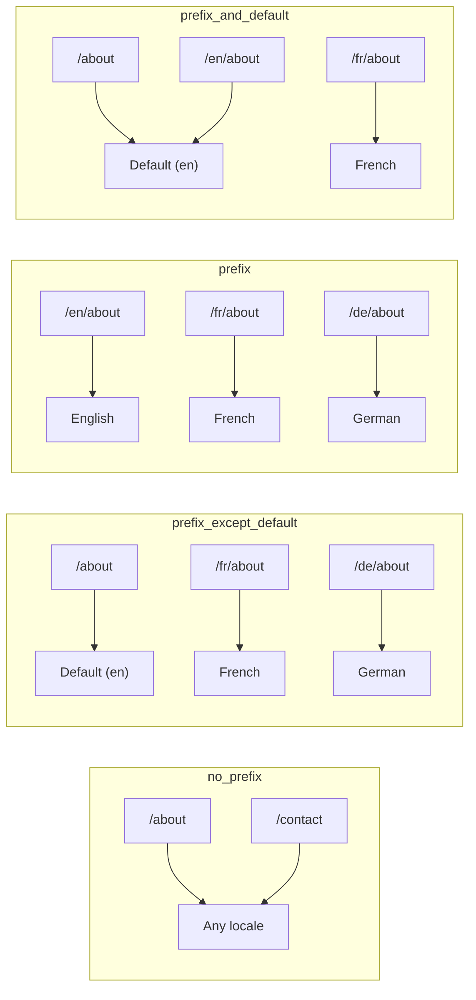
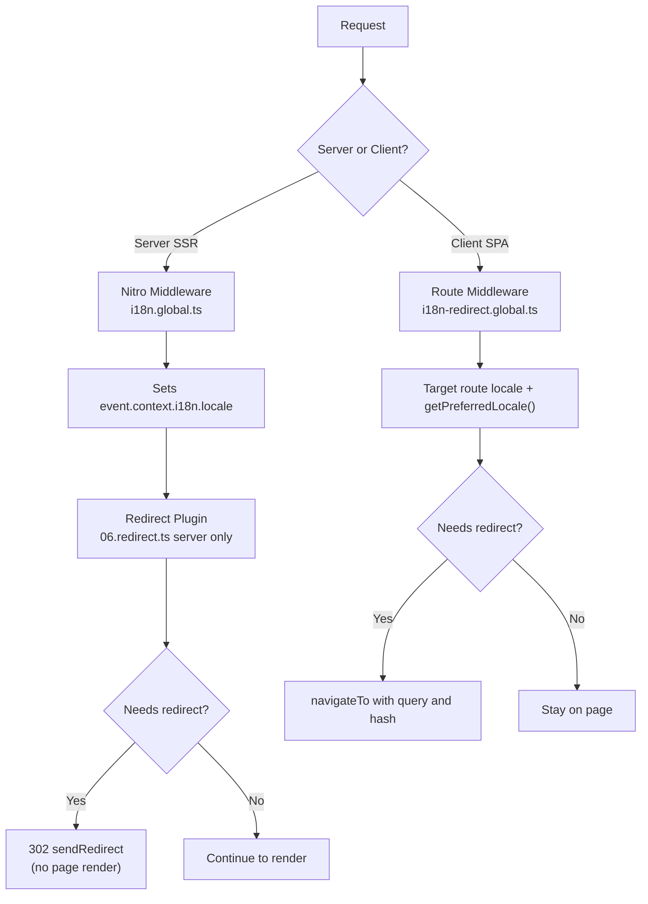

# 🗂️ Strategie routingu w Nuxt I18n Micro

## 📖 Omówienie

Nuxt I18n Micro kontroluje sposób, w jaki prefiksy lokalizacji pojawiają się w URL-ach za pomocą opcji `strategy`. Pod maską implementują to dwa pakiety:

- **`@i18n-micro/route-strategy`** — generowanie tras w czasie budowy (rozszerza strony Nuxt o zlokalizowane trasy)
- **`@i18n-micro/path-strategy`** — runtime'owe rozwiązywanie ścieżek, przekierowania, atrybuty SEO i generowanie linków

Moduł Nuxt wybiera właściwą klasę strategii w czasie budowy i aliasuje ją przez `#i18n-strategy`, więc do bundla trafia tylko wybrana implementacja.

## 🚦 Dostępne strategie

{/* generated:option:strategy — do not edit; run `pnpm run docs:generate` */}

**Typ** `Strategies` · **Domyślnie** `'prefix_except_default'`

Strategia routingu URL dla prefiksów lokalizacji.

- `'no_prefix'` — brak lokalizacji w URL; lokalizacja przechowywana w ciasteczku.
- `'prefix_except_default'` — prefiksuj wszystkie lokalizacje z wyjątkiem domyślnej.
- `'prefix'` — zawsze prefiksuj, w tym domyślną lokalizację.
- `'prefix_and_default'` — jak `prefix`, ale domyślna lokalizacja jest też dostępna bez prefiksu.

{/* /generated:option:strategy */}

### Porównanie strategii



### 🛑 `no_prefix`

URL-e nie mają segmentu lokalizacji. Lokalizacja jest określana przez ciasteczka, stan `useI18nLocale()` lub wykrywanie przeglądarki.

- **Trasy**: `/about`, `/contact` — ten sam wzorzec URL dla wszystkich lokalizacji (bez prefiksu `/en/`, `/fr/`)
- **Trwałość lokalizacji**: przez `localeCookie` (automatycznie ustawiane na `'user-locale'`, jeśli nie określono)
- **Niestandardowe ścieżki**: obsługiwane przez [`globalLocaleRoutes`](/guides/configuration#globallocaleroutes) i [`defineI18nRoute`](/guides/custom-locale-routes) — zlokalizowane slugi są generowane bez dodawania prefiksu lokalizacji do URL-i (np. `/about` vs `/ueber-uns`). Trasy zagnieżdżone, aliasy i ograniczenia per lokalizacja są prostsze niż w `prefix_except_default`.

<Tip>
Przy używaniu `no_prefix`, `localeCookie` jest automatycznie ustawiane na `'user-locale'`, jeśli nie określono. Jest to wymagane, ponieważ URL nie zawiera informacji o lokalizacji.
</Tip>

```typescript
i18n: {
  strategy: 'no_prefix'
  // localeCookie is automatically set to 'user-locale'
}
```

### 🚧 `prefix_except_default`

Wszystkie trasy mają prefiks lokalizacji **z wyjątkiem** domyślnej lokalizacji.

- **Domyślna lokalizacja**: `/about`, `/contact`
- **Inne lokalizacje**: `/fr/about`, `/de/contact`
- **Domyślna lokalizacja z prefiksem zwraca 404**: `/en/about` → 404 (gdy `en` jest domyślne)

```typescript
i18n: {
  strategy: 'prefix_except_default' // This is the default
}
```

### 🌍 `prefix`

Każda trasa ma prefiks lokalizacji, w tym domyślna.

- **Wszystkie lokalizacje**: `/en/about`, `/fr/about`, `/de/about`
- **Root `/`**: przekierowuje do `/\{locale\}/` na podstawie preferencji użytkownika

```typescript
i18n: {
  strategy: 'prefix'
}
```

### 🔄 `prefix_and_default`

Domyślna lokalizacja jest dostępna zarówno z prefiksem, jak i bez. Lokalizacje inne niż domyślna zawsze mają prefiks.

- **Domyślna lokalizacja**: zarówno `/about`, jak i `/en/about` są prawidłowe
- **Inne lokalizacje**: `/fr/about`, `/de/about`
- **Brak przekierowania z `/`**: zarówno `/`, jak i `/en/` serwują domyślną lokalizację

```typescript
i18n: {
  strategy: 'prefix_and_default'
}
```

## 🔀 Architektura przekierowań (v3)

W v3 logika przekierowań jest podzielona na dwie warstwy dla optymalnej wydajności:

### Jak to działa



### Po stronie serwera (bez flash)

1. **Middleware Nitro** (`i18n.global.ts`) uruchamia się jako pierwsze — wykrywa lokalizację z URL, ciasteczka lub nagłówka `Accept-Language` i ustawia `event.context.i18n.locale`
2. **Plugin przekierowania** (`06.redirect.ts`, tylko serwer) sprawdza, czy bieżąca ścieżka wymaga przekierowania za pomocą `i18nStrategy.getClientRedirect()` i wystawia 302 **przed** jakimkolwiek renderowaniem strony
3. To zapobiega „error flash”, gdzie użytkownicy widzą przez chwilę niewłaściwą stronę przed przekierowaniem

### Po stronie klienta (nawigacja SPA)

1. Globalne middleware trasy (`i18n-redirect.global.ts`) uruchamia się przy każdej nawigacji klienta, gdy `redirects` jest włączone
2. Wyprowadza preferowaną lokalizację najpierw z **trasy docelowej**, potem wraca do `useI18nLocale().getPreferredLocale()`
3. Używa `i18nStrategy.getClientRedirect()`, aby zdecydować, czy potrzebne jest przekierowanie
4. Zachowuje `query` i `hash` przy przekierowaniu

### Kolejność priorytetu lokalizacji

Na serwerze plugin przekierowania określa preferowaną lokalizację w tej kolejności:

1. **`useState('i18n-locale')`** — najwyższy priorytet (ustawione programowo przez `useI18nLocale().setLocale()`)
2. **Ciasteczko** — jeśli skonfigurowane jest `localeCookie`
3. **Nagłówek `Accept-Language`** — jeśli `autoDetectLanguage: true`
4. **`defaultLocale`** — ostateczny fallback

Na kliencie middleware trasy preferuje lokalizację z trasy docelowej, potem używa tego samego łańcucha fallback stan/ciasteczko.

### Zachowanie przekierowania per strategia

| Strategia               | Zachowanie `GET /`                              | Ciasteczko wymagane? |
| ----------------------- | ----------------------------------------------- | -------------------- |
| `no_prefix`             | Brak przekierowania (lokalizacja z ciasteczka/stanu) | Ustawiane automatycznie |
| `prefix`                | 302 → `/\{locale\}/`                              | Zalecane             |
| `prefix_except_default` | 302 → `/\{locale\}/`, gdy lokalizacja ≠ domyślna | Zalecane             |
| `prefix_and_default`    | Brak przekierowania (zarówno `/`, jak i `/\{locale\}/` prawidłowe) | Opcjonalne |

### Wyłączanie przekierowań

```typescript
i18n: {
  redirects: false // Disables automatic locale redirects
}
```

Gdy `redirects: false`, automatyczne przekierowania lokalizacji są wyłączone:

- **Serwer**: plugin przekierowania (`06.redirect.ts`, tylko serwer) pozostaje zarejestrowany, ale pomija logikę przekierowań. Nadal wykonuje **sprawdzenia 404** dla nieprawidłowych prefiksów lokalizacji (np. `/xx/about`, gdzie `xx` nie jest prawidłową lokalizacją) i **synchronizację ciasteczka** z prefiksu URL (np. odwiedzenie `/fr/about` synchronizuje ciasteczko na `fr`)
- **Klient**: globalne middleware trasy `i18n-redirect` **nie jest zarejestrowane** — brak auto-przekierowań SPA

## 🍪 Trwałość lokalizacji oparta na ciasteczkach

<Warning>
Przy używaniu `prefix` lub `prefix_except_default` z `redirects: true` (domyślne), **musisz** ustawić `localeCookie`, aby przekierowania działały poprawnie. Bez ciasteczka plugin przekierowania nie może zapamiętać preferencji lokalizacji użytkownika między przeładowaniami strony.

```typescript
i18n: {
  strategy: 'prefix_except_default',
  localeCookie: 'user-locale' // Required for redirects to work properly
}
```
</Warning>

**Jak działa `localeCookie` w v3:**

- Zarządzane wewnętrznie przez `useI18nLocale()` — **nie ustawiaj go ręcznie** przez `useCookie()`
- Gdy użytkownik odwiedza prefiksowany URL (np. `/fr/about`), ciasteczko jest automatycznie synchronizowane na `fr`
- Przy następnej wizycie na `/`, wartość ciasteczka jest używana do przekierowania na `/\{locale\}/`
- Jeśli ciasteczko zawiera nieprawidłową lokalizację (spoza listy `locales`), wraca do `defaultLocale`

| Strategia               | Domyślne `localeCookie` | Uwagi                                          |
| ----------------------- | ----------------------- | ---------------------------------------------- |
| `no_prefix`             | Auto: `'user-locale'`   | Wymagane; ustawiane automatycznie              |
| `prefix`                | `null` (wyłączone)      | Ustaw na `'user-locale'` dla przekierowań      |
| `prefix_except_default` | `null` (wyłączone)      | Ustaw na `'user-locale'` dla przekierowań      |
| `prefix_and_default`    | `null` (wyłączone)      | Opcjonalne                                     |

## 🔍 `autoDetectLanguage` i `autoDetectPath`

### `autoDetectLanguage`

{/* generated:option:autoDetectLanguage — do not edit; run `pnpm run docs:generate` */}

**Typ** `boolean` · **Domyślnie** `true`

Automatycznie wykryj preferowany język użytkownika z nagłówka HTTP `Accept-Language`.
Używane w połączeniu z `autoDetectPath`, aby zdecydować, kiedy zachodzi wykrywanie.

{/* /generated:option:autoDetectLanguage */}

Sprawdzenie działa w middleware serwera i jest fallbackiem: ciasteczko lub istniejący stan wygrywa.

```typescript
i18n: {
  autoDetectLanguage: true
}
```

### `autoDetectPath`

{/* generated:option:autoDetectPath — do not edit; run `pnpm run docs:generate` */}

**Typ** `string` · **Domyślnie** `'/'`

Gdzie mogą działać przekierowania preferencji ciasteczka / Accept-Language (gdy `redirects` jest włączone).

- `'/'` — tylko `/` (linki głębokie w domyślnej lokalizacji pozostają dostępne; domyślne)
- `'no_prefix'` — tylko ścieżki bez prefiksu lokalizacji
- `'*'` — każda ścieżka, w tym przepisywanie jawnego prefiksu lokalizacji
  (np. `/fr/about` → `/de/about`, gdy ciasteczko preferuje `de`)

- dowolny inny ciąg — dokładne dopasowanie ścieżki (np. `'/welcome'`)

Czyszczenie strategii z prefiksem (np. `/en` → `/` przy `prefix_except_default`) nie jest ograniczane.

{/* /generated:option:autoDetectPath */}

```typescript
i18n: {
  autoDetectPath: '/' // Default: only root
  // autoDetectPath: '*' // All paths — redirects even /fr/about to /de/about
}
```

<Warning>
Z `autoDetectPath: '*'`, nawet URL-e z jawnym prefiksem lokalizacji (np. `/fr/about`) zostaną przekierowane, jeśli preferowana lokalizacja użytkownika się różni. Może to być przydatne dla konfiguracji opartych na domenie, ale może dezorientować użytkowników udostępniających URL-e.
</Warning>

Z domyślnym `autoDetectPath: '/'` i ciasteczkiem lokalizacji:

| żądanie | ciasteczko | wynik |
| ------- | ---------- | ----- |
| `/`     | `de`       | 302 → `/de` |
| `/about` | `de`      | 200, domyślna lokalizacja (bez przepisania) |

```typescript
i18n: {
  localeCookie: 'user-locale',
  strategy: 'prefix_except_default',
  // Default — remember language on entry, keep deep links stable
  autoDetectPath: '/',
  // Or redirect on every unprefixed path (but not /de/… → /fr/…):
  // autoDetectPath: 'no_prefix',
}
```

## ⚠️ Znane problemy i najlepsze praktyki

### 1. Hydration mismatch w strategii `no_prefix`

Przy używaniu `no_prefix` lokalizacja jest określana dynamicznie. Jeśli serwer i klient nie zgadzają się co do lokalizacji, zobaczysz hydration mismatch.

**Rozwiązanie**: użyj `useI18nLocale().setLocale()` w pluginie serwera (z `order: -10`), aby ustawić lokalizację przed inicjalizacją i18n:

```ts
// plugins/i18n-loader.server.ts
export default defineNuxtPlugin({
  name: 'i18n-custom-loader',
  enforce: 'pre',
  order: -10,
  setup() {
    const { setLocale } = useI18nLocale()
    setLocale('ja') // Your detection logic here
  },
})
```

Szczegółowe przykłady znajdziesz w [Niestandardowym wykrywaniu języka](/guides/custom-language-detection).

### 2. Używaj nazwanych tras z `localeRoute`

Routing oparty na ścieżce może powodować problemy z rozwiązywaniem tras:

```typescript
// May cause issues
$localeRoute('/page')

// Preferred approach
$localeRoute({ name: 'page' })
```

### 3. Używanie `pages: false` z i18n

Gdy używasz Nuxt z `pages: false`:

```typescript
export default defineNuxtConfig({
  pages: false,
  i18n: {
    strategy: 'no_prefix', // Recommended
    disablePageLocales: true, // Required
    localeCookie: 'user-locale', // Required for persistence
  },
})
```

**Ograniczenia z `pages: false`:**

- Brak automatycznych przekierowań
- Brak wykrywania lokalizacji opartego na URL
- Przełączanie lokalizacji po stronie klienta wymaga przeładowania strony lub ręcznego ładowania tłumaczeń

### 4. Obsługa nieprawidłowego ciasteczka

Jeśli ciasteczko zawiera nieprawidłową lokalizację (spoza listy `locales`), moduł gracefully wraca do `defaultLocale`. Nie są rzucane żadne błędy.

## 📝 Podsumowanie najlepszych praktyk

| Rekomendacja               | Szczegóły                                                                              |
| -------------------------- | -------------------------------------------------------------------------------------- |
| **Ustaw `localeCookie`**   | Zawsze ustawiaj dla strategii z prefiksem z `redirects: true`                          |
| **Używaj `useI18nLocale()`** | Scentralizowany sposób zarządzania stanem lokalizacji (zastępuje ręczne `useState`/`useCookie`) |
| **Używaj nazwanych tras**  | `$localeRoute(\{ name: 'page' \})` zamiast `$localeRoute('/page')`                     |
| **Programowa lokalizacja** | Używaj `useI18nLocale().setLocale()` w pluginie serwera z `order: -10`                 |
| **Unikaj ręcznych ciasteczek** | Nie używaj bezpośrednio `useCookie('user-locale')` — `useI18nLocale()` tym zarządza |
