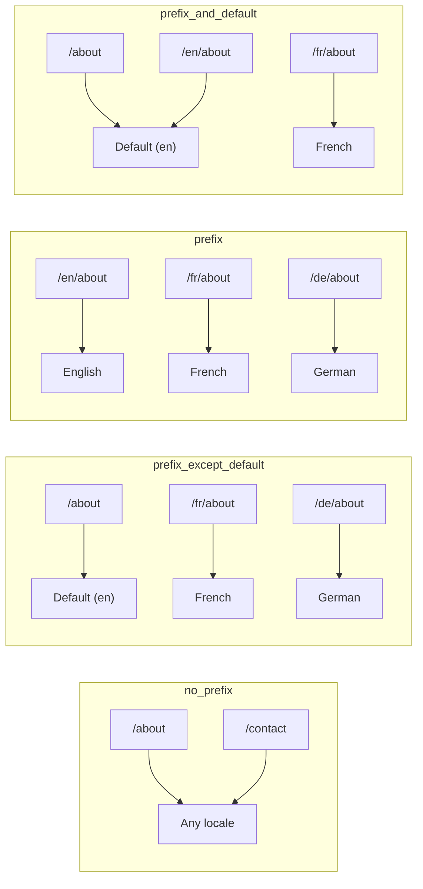
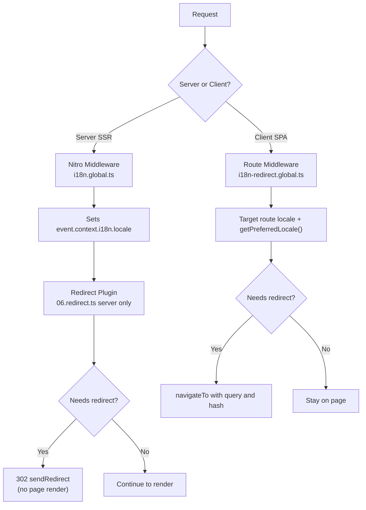

# 🗂️ Strategie routingu w Nuxt I18n Micro

## 📖 Przegląd

Nuxt I18n Micro kontroluje, jak prefiksy locale pojawiają się w URL-ach, za pomocą opcji `strategy`. Pod maską implementują to dwa pakiety:

- **`@i18n-micro/route-strategy`** — generowanie tras w czasie buildu (rozszerza strony Nuxt o zlokalizowane trasy)
- **`@i18n-micro/path-strategy`** — rozstrzyganie ścieżek w runtime, przekierowania, atrybuty SEO i generowanie linków

Moduł Nuxt wybiera odpowiednią klasę strategii w czasie buildu i aliasuje ją przez `#i18n-strategy`, więc zbundlowana jest tylko wybrana implementacja.

## 🚦 Dostępne strategie

{/* generated:option:strategy — do not edit; run `pnpm run docs:generate` */}

**Typ** `Strategies` · **Domyślnie** `'prefix_except_default'`

Strategia routingu URL dla prefiksów locale.

- `'no_prefix'` — brak locale w URL; locale przechowywane w ciasteczku.
- `'prefix_except_default'` — prefiksuj wszystkie locale oprócz domyślnego.
- `'prefix'` — zawsze prefiksuj, w tym locale domyślne.
- `'prefix_and_default'` — jak `prefix`, ale locale domyślne jest też dostępne bez prefiksu.

{/* /generated:option:strategy */}

### Porównanie strategii



### 🛑 `no_prefix`

URL-e nie mają segmentu locale. Locale jest ustalane przez ciasteczka, stan `useI18nLocale()` lub detekcję przeglądarki.

- **Trasy**: `/about`, `/contact` — ten sam wzorzec URL dla wszystkich locale (bez prefiksów `/en/`, `/fr/`)
- **Trwałość locale**: Przez `localeCookie` (automatycznie ustawiane na `'user-locale'`, jeśli nie zostanie podane)
- **Niestandardowe ścieżki**: Obsługiwane przez [`globalLocaleRoutes`](/guides/configuration#globallocaleroutes) i [`defineI18nRoute`](/guides/custom-locale-routes) — zlokalizowane slugi są generowane bez dodawania prefiksu locale do URL-i (np. `/about` vs `/ueber-uns`). Zagnieżdżone trasy, aliasy i ograniczenia per locale są prostsze niż w `prefix_except_default`.

<Tip>
Przy użyciu `no_prefix` `localeCookie` jest automatycznie ustawiane na `'user-locale'`, jeśli nie zostanie podane. Jest to wymagane, ponieważ URL nie zawiera informacji o locale.
</Tip>

```typescript
i18n: {
  strategy: 'no_prefix'
  // localeCookie is automatically set to 'user-locale'
}
```

### 🚧 `prefix_except_default`

Wszystkie trasy mają prefiks locale **z wyjątkiem** locale domyślnego.

- **Locale domyślne**: `/about`, `/contact`
- **Inne locale**: `/fr/about`, `/de/contact`
- **Locale domyślne z prefiksem zwraca 404**: `/en/about` → 404 (gdy `en` jest domyślne)

```typescript
i18n: {
  strategy: 'prefix_except_default' // This is the default
}
```

### 🌍 `prefix`

Każda trasa ma prefiks locale, w tym locale domyślne.

- **Wszystkie locale**: `/en/about`, `/fr/about`, `/de/about`
- **Root `/`**: Przekierowuje do `/\{locale\}/` na podstawie preferencji użytkownika

```typescript
i18n: {
  strategy: 'prefix'
}
```

### 🔄 `prefix_and_default`

Locale domyślne jest dostępne zarówno z prefiksem, jak i bez. Locale inne niż domyślne zawsze mają prefiks.

- **Locale domyślne**: zarówno `/about`, jak i `/en/about` są prawidłowe
- **Inne locale**: `/fr/about`, `/de/about`
- **Brak przekierowania z `/`**: Zarówno `/`, jak i `/en/` serwują locale domyślne

```typescript
i18n: {
  strategy: 'prefix_and_default'
}
```

## 🔀 Architektura przekierowań (v3)

W v3 logika przekierowań jest rozdzielona na dwie warstwy dla optymalnej wydajności:

### Jak to działa



### Po stronie serwera (bez flashu)

1. **Middleware Nitro** (`i18n.global.ts`) uruchamia się jako pierwszy — wykrywa locale z URL-a, ciasteczka lub nagłówka `Accept-Language` i ustawia `event.context.i18n.locale`.
2. **Wtyczka przekierowań** (`06.redirect.ts`, tylko serwer) sprawdza, czy bieżąca ścieżka wymaga przekierowania, używając `i18nStrategy.getClientRedirect()`, i wykonuje 302 **przed** jakimkolwiek renderowaniem strony.
3. Zapobiega to „error flashowi”, w którym użytkownicy widzą przez chwilę niewłaściwą stronę przed przekierowaniem.

### Po stronie klienta (nawigacja SPA)

1. Globalne middleware trasy (`i18n-redirect.global.ts`) uruchamia się przy każdej nawigacji klienta, gdy `redirects` jest włączone.
2. Wyprowadza preferowane locale najpierw z **docelowej trasy**, następnie wraca do `useI18nLocale().getPreferredLocale()`.
3. Używa `i18nStrategy.getClientRedirect()`, aby zdecydować, czy przekierowanie jest potrzebne.
4. Zachowuje `query` i `hash` podczas przekierowania.

### Kolejność priorytetów locale

Po stronie serwera wtyczka przekierowań ustala preferowane locale w następującej kolejności:

1. **`useState('i18n-locale')`** — najwyższy priorytet (ustawione programowo przez `useI18nLocale().setLocale()`)
2. **Ciasteczko** — jeśli `localeCookie` jest skonfigurowane
3. **Nagłówek `Accept-Language`** — jeśli `autoDetectLanguage: true`
4. **`defaultLocale`** — końcowy fallback

Po stronie klienta middleware trasy preferuje locale z docelowej trasy, a następnie używa tego samego łańcucha fallbacków state/cookie.

### Zachowanie przekierowań per strategia

| Strategia               | Zachowanie `GET /`                            | Ciasteczko wymagane? |
| ----------------------- | --------------------------------------------- | -------------------- |
| `no_prefix`             | Brak przekierowania (locale z cookie/state)   | Auto-set             |
| `prefix`                | 302 → `/\{locale\}/`                            | Zalecane             |
| `prefix_except_default` | 302 → `/\{locale\}/`, jeśli locale ≠ default    | Zalecane             |
| `prefix_and_default`    | Brak przekierowania (`/` i `/\{locale\}/` OK)   | Opcjonalne           |

### Wyłączanie przekierowań

```typescript
i18n: {
  redirects: false // Disables automatic locale redirects
}
```

Gdy `redirects: false`, automatyczne przekierowania locale są wyłączone:

- **Serwer**: wtyczka przekierowań (`06.redirect.ts`, tylko serwer) pozostaje zarejestrowana, ale pomija logikę przekierowań. Nadal wykonuje **sprawdzenia 404** dla nieprawidłowych prefiksów locale (np. `/xx/about`, gdzie `xx` nie jest prawidłowym locale) oraz **synchronizację ciasteczka** z prefiksu URL (np. odwiedzenie `/fr/about` synchronizuje ciasteczko do `fr`).
- **Klient**: globalne middleware trasy `i18n-redirect` **nie jest zarejestrowane** — brak auto-przekierowań SPA.

## 🍪 Trwałość locale oparta na ciasteczkach

<Warning>
Używając `prefix` lub `prefix_except_default` z `redirects: true` (domyślnie), **musisz** ustawić `localeCookie`, aby przekierowania działały poprawnie. Bez ciasteczka wtyczka przekierowań nie może zapamiętać preferencji locale użytkownika między przeładowaniami strony.

```typescript
i18n: {
  strategy: 'prefix_except_default',
  localeCookie: 'user-locale' // Required for redirects to work properly
}
```
</Warning>

**Jak działa `localeCookie` w v3:**

- Zarządzane wewnętrznie przez `useI18nLocale()` — **nie ustawiaj go ręcznie** przez `useCookie()`.
- Gdy użytkownik odwiedza URL z prefiksem (np. `/fr/about`), ciasteczko jest automatycznie synchronizowane do `fr`.
- Przy kolejnej wizycie na `/` wartość ciasteczka jest używana do przekierowania na `/\{locale\}/`.
- Jeśli ciasteczko zawiera nieprawidłowe locale (spoza listy `locales`), wraca do `defaultLocale`.

| Strategia               | Domyślne `localeCookie` | Uwagi                                     |
| ----------------------- | ---------------------- | ----------------------------------------- |
| `no_prefix`             | Auto: `'user-locale'`  | Wymagane; ustawiane automatycznie          |
| `prefix`                | `null` (wyłączone)     | Ustaw na `'user-locale'` dla przekierowań  |
| `prefix_except_default` | `null` (wyłączone)     | Ustaw na `'user-locale'` dla przekierowań  |
| `prefix_and_default`    | `null` (wyłączone)     | Opcjonalne                                 |

## 🔍 `autoDetectLanguage` i `autoDetectPath`

### `autoDetectLanguage`

{/* generated:option:autoDetectLanguage — do not edit; run `pnpm run docs:generate` */}

**Typ** `boolean` · **Domyślnie** `true`

Automatycznie wykrywa preferowany język użytkownika z nagłówka HTTP `Accept-Language`.
Używane w połączeniu z `autoDetectPath`, aby zdecydować, kiedy detekcja się odbywa.

{/* /generated:option:autoDetectLanguage */}

Sprawdzenie uruchamia się w middleware serwera i stanowi fallback: ciasteczko lub istniejący stan wygrywają.

```typescript
i18n: {
  autoDetectLanguage: true
}
```

### `autoDetectPath`

{/* generated:option:autoDetectPath — do not edit; run `pnpm run docs:generate` */}

**Typ** `string` · **Domyślnie** `'/'`

Gdzie mogą działać przekierowania oparte na ciasteczku / `Accept-Language` (gdy `redirects` jest włączone).

- `'/'` — tylko `/` (głębokie linki w domyślnym locale pozostają dostępne; domyślne)
- `'no_prefix'` — tylko ścieżki bez prefiksu locale
- `'*'` — każda ścieżka, w tym przepisanie jawnego prefiksu locale
  (np. `/fr/about` → `/de/about`, gdy ciasteczko preferuje `de`)

- dowolny inny string — dokładne dopasowanie ścieżki (np. `'/welcome'`)

Sprzątanie strategii z prefiksem (np. `/en` → `/` w `prefix_except_default`) nie jest ograniczane.

{/* /generated:option:autoDetectPath */}

```typescript
i18n: {
  autoDetectPath: '/' // Default: only root
  // autoDetectPath: '*' // All paths — redirects even /fr/about to /de/about
}
```

<Warning>
Przy `autoDetectPath: '*'` nawet URL-e z jawnym prefiksem locale (np. `/fr/about`) zostaną przekierowane, jeśli preferowane locale użytkownika jest inne. Może to być przydatne w konfiguracjach domenowych, ale może dezorientować użytkowników udostępniających URL-e.
</Warning>

Przy domyślnym `autoDetectPath: '/'` i ciasteczku locale:

| żądanie | cookie | wynik |
| --- | --- | --- |
| `/` | `de` | 302 → `/de` |
| `/about` | `de` | 200, locale domyślne (bez przepisania) |

```typescript
i18n: {
  localeCookie: 'user-locale',
  strategy: 'prefix_except_default',
  // Default — remember language on entry, keep deep links stable
  autoDetectPath: '/',
  // Or redirect on every unprefixed path (but not /de/… → /fr/…):
  // autoDetectPath: 'no_prefix',
}
```

## ⚠️ Znane problemy i dobre praktyki

### 1. Hydration mismatch w strategii `no_prefix`

Przy użyciu `no_prefix` locale jest ustalane dynamicznie. Jeśli serwer i klient nie zgadzają się co do locale, zobaczysz hydration mismatch.

**Rozwiązanie**: Użyj `useI18nLocale().setLocale()` we wtyczce serwerowej (z `order: -10`), aby ustawić locale przed inicjalizacją i18n:

```ts
// plugins/i18n-loader.server.ts
export default defineNuxtPlugin({
  name: 'i18n-custom-loader',
  enforce: 'pre',
  order: -10,
  setup() {
    const { setLocale } = useI18nLocale()
    setLocale('ja') // Your detection logic here
  },
})
```

Zobacz [Niestandardową detekcję języka](/guides/custom-language-detection), aby zapoznać się ze szczegółowymi przykładami.

### 2. Używaj nazwanych tras z `localeRoute`

Routing oparty na ścieżkach może powodować problemy z rozstrzyganiem tras:

```typescript
// May cause issues
$localeRoute('/page')

// Preferred approach
$localeRoute({ name: 'page' })
```

### 3. Używanie `pages: false` z i18n

Przy użyciu Nuxt z `pages: false`:

```typescript
export default defineNuxtConfig({
  pages: false,
  i18n: {
    strategy: 'no_prefix', // Recommended
    disablePageLocales: true, // Required
    localeCookie: 'user-locale', // Required for persistence
  },
})
```

**Ograniczenia przy `pages: false`:**

- Brak automatycznych przekierowań
- Brak detekcji locale opartej o URL
- Przełączanie locale po stronie klienta wymaga przeładowania strony lub ręcznego ładowania tłumaczeń

### 4. Obsługa nieprawidłowego ciasteczka

Jeśli ciasteczko zawiera nieprawidłowe locale (spoza listy `locales`), moduł łagodnie wraca do `defaultLocale`. Nie są rzucane żadne błędy.

## 📝 Podsumowanie dobrych praktyk

| Zalecenie                 | Szczegóły                                                                            |
| ------------------------- | ------------------------------------------------------------------------------------ |
| **Ustaw `localeCookie`**  | Zawsze ustawiaj dla strategii z prefiksami przy `redirects: true`                    |
| **Używaj `useI18nLocale()`** | Scentralizowany sposób zarządzania stanem locale (zastępuje ręczne `useState`/`useCookie`) |
| **Używaj nazwanych tras** | `$localeRoute(\{ name: 'page' \})` zamiast `$localeRoute('/page')`                     |
| **Programowe locale**     | Użyj `useI18nLocale().setLocale()` we wtyczce serwerowej z `order: -10`              |
| **Unikaj ręcznych cookies** | Nie używaj `useCookie('user-locale')` bezpośrednio — `useI18nLocale()` tym zarządza |
