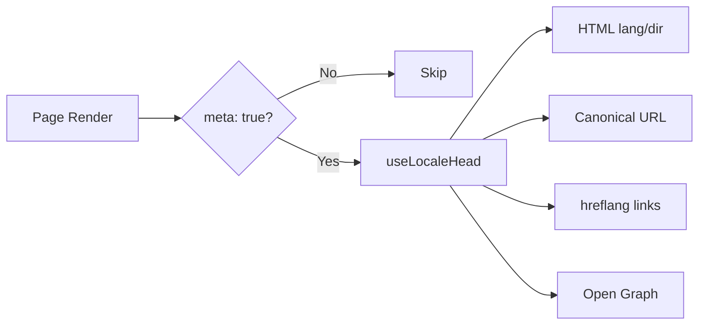

# 🌐 Przewodnik SEO dla Nuxt I18n Micro

## 📖 Wprowadzenie

Skuteczne SEO (Search Engine Optimization) jest niezbędne, aby zapewnić, że Twoja wielojęzyczna witryna jest dostępna i widoczna dla użytkowników na całym świecie poprzez wyszukiwarki. `Nuxt I18n Micro` upraszcza proces zarządzania SEO dla witryn wielojęzycznych przez automatyczne generowanie niezbędnych tagów meta i atrybutów informujących wyszukiwarki o strukturze i zawartości Twojej witryny.

Ten przewodnik wyjaśnia, jak `Nuxt I18n Micro` obsługuje SEO, aby zwiększyć widoczność Twojej witryny i doświadczenie użytkownika bez konieczności dodatkowej konfiguracji.

## ⚙️ Automatyczna obsługa SEO

### Przepływ generowania meta SEO



**Generowane tagi:**

| Tag             | Przykład                                                 |
| --------------- | -------------------------------------------------------- |
| Atrybuty HTML   | `<html lang="en" dir="ltr">`                             |
| Canonical       | `<link rel="canonical" href="...">`                      |
| hreflang        | `<link rel="alternate" hreflang="en" href="...">`        |
| x-default       | `<link rel="alternate" hreflang="x-default" href="...">` |
| Open Graph      | `<meta property="og:locale" content="en_US">`            |

#### `og` per lokalizacja (`og:locale` vs BCP 47)

`<html lang>` i `hreflang` używają **BCP 47** przez `locale.iso` (np. `ar-AE`).  
Open Graph wymaga **`language_TERRITORY`** z **podkreśleniem** (`ar_AE`), zgodnie z [protokołem OG](https://ogp.me/).

Domyślnie `og:locale` jest wyprowadzane z `iso`, gdy mapowanie jest jednoznaczne (`en-US` → `en_US`).  
Ustaw jawny ciąg **`og`**, gdy potrzebujesz niestandardowej wartości (np. `zh-Hans` → `zh_CN`).  
Jeśli nie ma ani `og`, ani konwertowalnego `iso`, tagi `og:locale` nie są generowane — w trybie deweloperskim dostajesz ostrzeżenie w konsoli (respektuje `missingWarn`).

```typescript
i18n: {
  meta: true,
  locales: [
    { code: 'ar', iso: 'ar-AE', og: 'ar_AE', dir: 'rtl' },
    { code: 'en', iso: 'en-US' }, // og:locale → en_US
    { code: 'zh', iso: 'zh-Hans', og: 'zh_CN' }, // script tags need explicit og
  ],
}
```

### 🔑 Kluczowe funkcje SEO

Gdy opcja `meta` jest włączona w `Nuxt I18n Micro`, moduł automatycznie zarządza następującymi aspektami SEO:

1. **🌍 Atrybuty języka i kierunku**:
   - Moduł ustawia atrybuty `lang` i `dir` na tagu `<html>` zgodnie z bieżącą lokalizacją i kierunkiem tekstu (np. `ltr` dla angielskiego lub `rtl` dla arabskiego).

2. **🔗 Kanoniczne adresy URL**:
   - Moduł generuje link kanoniczny (`<link rel="canonical">`) dla każdej strony, zapewniając, że wyszukiwarki rozpoznają główną wersję treści.

3. **🌐 Alternatywne linki językowe (`hreflang`)**:
   - Moduł automatycznie generuje tagi `<link rel="alternate" hreflang="">` dla wszystkich dostępnych lokalizacji. Pomaga to wyszukiwarkom zrozumieć, jakie wersje językowe Twojej treści są dostępne, poprawiając doświadczenie użytkowników globalnych.
   - Każda lokalizacja emituje **jeden** tag: `hreflang = iso || code`. Gdy `iso` jest ustawione, kod routingu `code` nigdy nie jest używany jako `hreflang` (więc klucze rynkowe takie jak `mx` nie stają się nieprawidłowymi tagami językowymi).
   - Opcjonalne `hreflangBaseLanguage: true` emituje też goły tag językowy wyprowadzony z `iso` (np. `es-ES` → `es`), przejmowany przez pierwszą regionalną lokalizację w `locales`.

4. **🌏 `x-default` Hreflang**:
   - Moduł automatycznie generuje tag `<link rel="alternate" hreflang="x-default">` wskazujący URL domyślnej lokalizacji. Informuje to wyszukiwarki, który URL pokazać użytkownikom, których język nie pasuje do żadnej ze zdefiniowanych lokalizacji. Nie jest wymagana żadna dodatkowa konfiguracja — działa automatycznie, gdy ustawione jest `meta: true`.

5. **🔖 Metadane Open Graph**:
   - Moduł generuje tagi meta Open Graph (`og:locale`, `og:url` itd.) dla każdej lokalizacji, co jest szczególnie przydatne przy udostępnianiu w mediach społecznościowych i indeksowaniu w wyszukiwarkach.

### 🛠️ Konfiguracja

Aby włączyć te funkcje SEO, upewnij się, że opcja `meta` jest ustawiona na `true` w pliku `nuxt.config.ts`:

```typescript
export default defineNuxtConfig({
  modules: ['nuxt-i18n-micro'],
  i18n: {
    locales: [
      { code: 'en', iso: 'en-US', dir: 'ltr' },
      { code: 'fr', iso: 'fr-FR', dir: 'ltr' },
      { code: 'ar', iso: 'ar-SA', dir: 'rtl' },
    ],
    defaultLocale: 'en',
    translationDir: 'locales',
    meta: true, // Enables automatic SEO management
  },
})
```

### 🌍 Dynamiczne `metaBaseUrl` dla wdrożeń multi-domenowych

Gdy `metaBaseUrl` nie jest ustawione, absolutne URL-e SEO są rozwiązywane w tej kolejności (#240):

1. `site.url` z [`nuxt-site-config`](https://nuxtseo.com/docs/site-config) (jeśli ten moduł jest obecny — np. przez `@nuxtjs/seo`)
2. W przeciwnym razie nazwa hosta z bieżącego żądania (`useRequestURL()` / `window.location.origin`)

Fallback originu żądania respektuje nagłówki reverse-proxy (`X-Forwarded-Host`, `X-Forwarded-Proto`), więc działa poprawnie za nginx, Cloudflare, AWS ALB i podobnymi proxy.

Oznacza to, że aplikacje już ustawiające `site.url` dla sitemap / robots / schema.org **nie** potrzebują drugiej deklaracji `metaBaseUrl`:

```typescript
export default defineNuxtConfig({
  site: {
    url: process.env.NUXT_SITE_URL, // also used by micro for canonical / og:url / hreflang
  },
  i18n: {
    meta: true,
    // metaBaseUrl omitted — picks up site.url, then request origin
  },
})
```

Bez `site.url` pojedyncza instancja aplikacji może wciąż serwować **wiele domen** z prawidłowymi tagami SEO dla każdej przez origin żądania:

```typescript
export default defineNuxtConfig({
  i18n: {
    meta: true,
    // metaBaseUrl is undefined by default — resolved dynamically from the request
  },
})
```

Na przykład żądanie do `https://site-a.com/en/about` wyprodukuje:

```html
<link rel="canonical" href="https://site-a.com/en/about" /> <meta property="og:url" content="https://site-a.com/en/about" />
```

Podczas gdy ta sama aplikacja serwująca `https://site-b.com/en/about` wyprodukuje:

```html
<link rel="canonical" href="https://site-b.com/en/about" /> <meta property="og:url" content="https://site-b.com/en/about" />
```

Jeśli potrzebujesz stałego bazowego URL-a, który zawsze wygrywa nad `site.url`, przekaż statyczny ciąg:

```typescript
metaBaseUrl: 'https://example.com'
```

### 🔍 Whitelist zapytań kanonicznych

Domyślnie parametry query są usuwane z canonical i `og:url`, aby uniknąć duplikatu treści. Możesz zdefiniować whitelist konkretnych parametrów query, które powinny być zachowane:

```typescript
i18n: {
  canonicalQueryWhitelist: ['page', 'sort', 'filter', 'search', 'q', 'query', 'tag']
}
```

Tylko parametry wymienione w `canonicalQueryWhitelist` pojawią się w URL-ach kanonicznych. Wszystkie inne parametry query (np. tracking, session ID) są usuwane.

### 🚫 Wyłączanie tagów meta per strona

Możesz wyłączyć generowanie tagów meta SEO dla konkretnych stron za pomocą `defineI18nRoute()`:

```vue
<script setup>
// Disable all SEO meta tags for this page
defineI18nRoute({
  disableMeta: true,
})
</script>
```

Możesz też wyłączyć meta tylko dla konkretnych lokalizacji:

```vue
<script setup>
// Disable meta tags only for English locale on this page
defineI18nRoute({
  disableMeta: ['en'],
})
</script>
```

Gdy `disableMeta` jest aktywne, żadne tagi `hreflang`, `canonical`, `og:locale`, `og:url` czy `x-default` nie są generowane dla dotkniętej strony/lokalizacji.

### 🔇 Wyłączone lokalizacje

Lokalizacje z `disabled: true` są automatycznie wykluczane z generowania wszystkich tagów SEO — nie są dla nich tworzone tagi `hreflang`, `og:locale:alternate` ani alternate linki:

```typescript
i18n: {
  locales: [
    { code: 'en', iso: 'en-US' },
    { code: 'fr', iso: 'fr-FR', disabled: true }, // excluded from SEO tags
  ]
}
```

### 🙈 Lokalizacje wypisane z SEO (`seo: false`)

Dla lokalizacji, które powinny pozostać routowalne i przetłumaczone, ale nie powinny pojawiać się w tagach discovery między lokalizacjami, ustaw `seo: false`. Te lokalizacje są pomijane w alternatywach `hreflang` i `og:locale:alternate`. Jeśli Twoja skonfigurowana **domyślna** lokalizacja ma `seo: false`, link `x-default` też nie jest emitowany.

```typescript
i18n: {
  locales: [
    { code: 'en', iso: 'en-US' },
    { code: 'ru', iso: 'ru-RU', seo: false }, // internal / non-indexed locale
  ]
}
```

### 📌 Zachowanie specyficzne dla strategii

| Strategia               | linki hreflang | x-default             | canonical      | og:url |
| ----------------------- | -------------- | --------------------- | -------------- | ------ |
| `prefix`                | ✅ wszystkie   | ✅ URL domyślnej lokalizacji | ✅ bieżący URL | ✅   |
| `prefix_except_default` | ✅ wszystkie   | ✅ URL bez prefiksu   | ✅ bieżący URL | ✅     |
| `prefix_and_default`    | ✅ wszystkie   | ✅ URL domyślnej lokalizacji | ✅ bieżący URL | ✅   |
| `no_prefix`             | ❌ nie generowane | ❌ nie generowane   | ✅ bieżący URL | ✅     |

Dla strategii `no_prefix` generowane są tylko `canonical`, `og:url`, `og:locale` i atrybuty `html` (`lang`, `dir`). Alternatywne linki językowe (`hreflang`) i `x-default` nie są generowane, ponieważ nie ma odrębnych URL-i per lokalizacja.

## Nadpisania na poziomie strony (`useI18nHead`)

Dla **artykułów, przewodników lub dowolnej treści CMS**, gdzie nie każda lokalizacja istnieje lub URL-e pochodzą z API, użyj [`useI18nHead`](/api/composables/use-i18n-head) na stronie zamiast niestandardowego pluginu head i18n.

### Artykuł z częściowymi tłumaczeniami

```vue
<script setup lang="ts">
const article = await loadArticle()
// article.locales = { en: '...', de: '...' } — only translated locales

useI18nHead({
  meta: [{ property: 'og:title', content: article.title }],
  replace: {
    hreflang: Object.entries(article.locales).map(([locale, href]) => ({
      rel: 'alternate',
      hreflang: locale,
      href,
    })),
    ogAlternates: Object.keys(article.locales),
  },
})
</script>
```

### Slugi per lokalizacja z `$setI18nRouteParams`

Gdy slugi różnią się w zależności od języka, najpierw ustaw parametry trasy, potem nadpisz alternatywy prawdziwymi URL-ami:

```vue
<script setup lang="ts">
const { $defineI18nRoute, $setI18nRouteParams } = useNuxtApp()
const { data: article } = await useFetch(`/api/articles/${slug}`)

$defineI18nRoute({
  localeRoutes: { en: '/blog/[slug]', de: '/de/blog/[slug]' },
})

$setI18nRouteParams({
  en: { slug: article.value.slugEn },
  de: { slug: article.value.slugDe },
})

useI18nHead({
  replace: {
    hreflang: ['en', 'de'].map((locale) => ({
      rel: 'alternate',
      hreflang: locale,
      href: article.value.urls[locale],
    })),
    ogAlternates: ['en', 'de'],
  },
})
</script>
```

### Origin HTTPS za proxy

Dla prawidłowych bezwzględnych URL-i w SSR bez niestandardowego composable originu:

```ts
i18n: {
  meta: true,
  metaBaseUrl: undefined,
  metaTrustForwardedHost: true,
  metaTrustForwardedProto: true,
}
```

Więcej przykładów (nadpisanie canonical, `x-default`, reaktywne pobieranie, współdzielone helpery): [composable useI18nHead](/api/composables/use-i18n-head).

### ⚠️ Trailing slash

Moduł generuje URL-e canonical i `hreflang` na podstawie faktycznej ścieżki z `useRoute().fullPath`. Jeśli Twoja aplikacja używa trailing slashes (np. przez `router.options` Nuxt), wygenerowane URL-e to odzwierciedlą. Jednak `$switchLocalePath` może normalizować ścieżki i usuwać trailing slashes. Jeśli spójność trailing slash jest krytyczna dla Twojego SEO, zweryfikuj, że wygenerowane URL-e pasują do struktury URL Twojej aplikacji.

### 🎯 Korzyści

Włączając opcję `meta`, korzystasz z:

- **📈 Lepsze pozycje w wyszukiwarkach**: wyszukiwarki mogą lepiej indeksować Twoją witrynę, rozumiejąc relacje między różnymi wersjami językowymi.
- **👥 Lepsze doświadczenie użytkownika**: użytkownicy otrzymują właściwą wersję językową na podstawie ich preferencji, co prowadzi do bardziej spersonalizowanego doświadczenia.
- **🔧 Zmniejszona ręczna konfiguracja**: moduł automatycznie obsługuje zadania SEO, uwalniając Cię od potrzeby ręcznego dodawania tagów meta i atrybutów związanych z SEO.

## 🔗 Nuxt SEO (`@nuxtjs/seo`)

[`@nuxtjs/seo`](https://nuxtseo.com/) zawiera pakiety sitemap, robots, schema.org, OG images i powiązane moduły. Integruje się z **nuxt-i18n-micro** przez [`nuxt-site-config`](https://nuxtseo.com/docs/site-config/guides/i18n) (v4+).

### Wymagania

- **`@nuxtjs/seo` 3+** (obecne wydania używają `nuxt-site-config` 4+, który rejestruje plugin `nuxt-site-config:i18n` dla micro)
- **`i18n.meta: true`** (zalecane — micro dostarcza tagi head świadome lokalizacji; Nuxt SEO dodaje sitemap, schema.org itd.)

### Kolejność modułów

Wypisz **nuxt-i18n-micro przed `@nuxtjs/seo`**, aby site config mógł odczytać Twoją konfigurację lokalizacji:

```typescript
export default defineNuxtConfig({
  modules: ['nuxt-i18n-micro', '@nuxtjs/seo'],
  site: {
    url: 'https://example.com',
    name: 'My Site',
  },
  i18n: {
    meta: true,
    defaultLocale: 'en',
    locales: [
      { code: 'en', iso: 'en-US' },
      { code: 'de', iso: 'de-DE' },
    ],
  },
})
```

### Tłumaczona nazwa witryny i opis

Nuxt Site Config czyta opcjonalne klucze tłumaczeń z Twoich plików lokalizacji:

```json
{
  "nuxtSiteConfig": {
    "name": "My Site",
    "description": "My site description"
  }
}
```

Wartości per lokalizacja w `locales/en.json`, `locales/de.json` itd. są automatycznie pobierane.

### Rozwiązywanie problemów

Jeśli widzisz `Plugin nuxt-seo:defaults depends on nuxt-site-config:i18n but they are not registered`, zaktualizuj **`@nuxtjs/seo` do 3+** (zobacz [issue #133](https://github.com/s00d/nuxt-i18n-micro/issues/133)). Starsze `nuxt-site-config` 3.x podłączało i18n tylko dla `@nuxtjs/i18n`, a nie micro.

Więcej: [Sitemap i18n guide](https://nuxtseo.com/docs/sitemap/guides/i18n), [Site Config i18n guide](https://nuxtseo.com/docs/site-config/guides/i18n).
