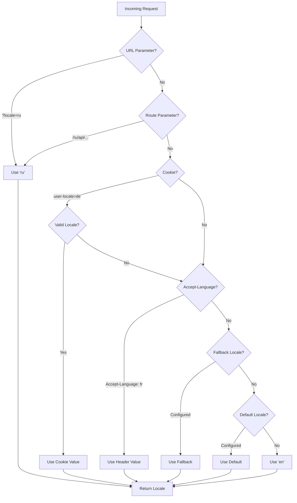

# 🌍 Tłumaczenia po stronie serwera i informacje o lokalizacji w Nuxt I18n Micro

## 📖 Omówienie

Nuxt I18n Micro obsługuje tłumaczenia po stronie serwera i informacje o lokalizacji, pozwalając Ci tłumaczyć treści i uzyskiwać dostęp do szczegółów lokalizacji na serwerze. Jest to szczególnie przydatne dla API lub aplikacji renderowanych po stronie serwera, gdzie lokalizacja jest potrzebna zanim treść dotrze do klienta.

Tłumaczenia używają wiadomości lokalizacji zdefiniowanych w konfiguracji Nuxt I18n i są dynamicznie rozwiązywane na podstawie wykrytej lokalizacji.

Domyślnie (`translationPayloads.mode: 'premerged'`) pliki root-level są wpiekane w każdy payload strony w czasie budowy jako `\{page\}/\{locale\}/data.json`. Serwer ładuje te same pre-built pliki, które klient pobiera pod `/\{apiBaseUrl\}/...`, więc wszystkie klucze (zarówno współdzielone, jak i specyficzne dla strony) są dostępne w handlerach serwera.

Z `translationPayloads.mode: 'source'` kompaktowe pliki źródłowe są scalane w runtime, gdy wywoływane jest `loadTranslationsFromServer()` (lub trasa `/_locales`) — na **Edge** przez `serverAssets` Nitro, na **Node** z opcjonalnej kopii publicznej. Szczegóły znajdziesz w [Przewodniku po wydajności — Wyjście payloadu serverless](/guides/performance#serverless-payload-output) i [Architekturze cache i pamięci](/api/cache).

Skonsolidowaną listę API runtime i serwera znajdziesz w [Dokumentacji API](/api/overview).

## 🛠️ Konfiguracja middleware po stronie serwera

Aby włączyć tłumaczenia po stronie serwera i informacje o lokalizacji, użyj dostarczonych funkcji middleware:

- `useTranslationServerMiddleware` — do tłumaczenia treści
- `useLocaleServerMiddleware` — do dostępu do informacji o lokalizacji

Obie funkcje middleware są automatycznie dostępne we wszystkich trasach serwera.

Logika wykrywania lokalizacji jest współdzielona między obiema funkcjami middleware przez narzędziową funkcję `detectCurrentLocale`, aby zapewnić spójność w module.

## ✨ Używanie tłumaczeń w handlerach serwera

Możesz płynnie tłumaczyć treści w dowolnym `eventHandler`, używając middleware tłumaczeń.

### Przykład: podstawowe użycie tłumaczeń

```typescript
import { defineEventHandler } from 'h3'

export default defineEventHandler(async (event) => {
  const t = await useTranslationServerMiddleware(event)
  return {
    message: t('greeting'), // Returns the translated value for the key "greeting"
  }
})
```

W tym przykładzie:

- Lokalizacja użytkownika jest wykrywana automatycznie z parametrów query, ciasteczek lub nagłówków.
- Funkcja `t` pobiera odpowiednie tłumaczenie dla wykrytej lokalizacji.

## 🌍 Używanie informacji o lokalizacji w handlerach serwera

### Podstawowe użycie informacji o lokalizacji

```typescript
import { defineEventHandler } from 'h3'

export default defineEventHandler((event) => {
  const localeInfo = useLocaleServerMiddleware(event)

  return {
    success: true,
    data: localeInfo,
    timestamp: new Date().toISOString(),
  }
})
```

### Podawanie niestandardowych parametrów lokalizacji

```typescript
import { defineEventHandler } from 'h3'

export default defineEventHandler((event) => {
  // Force specific locale with custom default
  const localeInfo = useLocaleServerMiddleware(event, 'en', 'ru')

  return {
    success: true,
    data: localeInfo,
    timestamp: new Date().toISOString(),
  }
})
```

### Struktura odpowiedzi

Middleware lokalizacji zwraca obiekt `LocaleInfo` z następującymi właściwościami:

```typescript
interface LocaleInfo {
  current: string // Current detected locale code
  default: string // Default locale code
  fallback: string // Fallback locale code
  available: string[] // Array of all available locale codes
  locale: Locale | null // Full locale configuration object
  isDefault: boolean // Whether current locale is the default
  isFallback: boolean // Whether current locale is the fallback
}
```

### Przykładowa odpowiedź

```json
{
  "success": true,
  "data": {
    "current": "ru",
    "default": "en",
    "fallback": "en",
    "available": ["en", "ru", "de"],
    "locale": {
      "code": "ru",
      "iso": "ru-RU",
      "dir": "ltr",
      "displayName": "Русский"
    },
    "isDefault": false,
    "isFallback": false
  },
  "timestamp": "2024-01-15T10:30:00.000Z"
}
```

## 🌐 Podawanie niestandardowej lokalizacji

Jeśli musisz określić lokalizację ręcznie (np. do testów lub konkretnych żądań), możesz przekazać ją do middleware tłumaczeń:

### Przykład: niestandardowa lokalizacja

```typescript
import { defineEventHandler } from 'h3'

function detectLocale(event): string | null {
  const urlSearchParams = new URLSearchParams(event.node.req.url?.split('?')[1])
  const localeFromQuery = urlSearchParams.get('locale')
  if (localeFromQuery) return localeFromQuery

  return 'en'
}

export default defineEventHandler(async (event) => {
  const t = await useTranslationServerMiddleware(event, 'en', detectLocale(event)) // Force French local, en - default locale
  return {
    message: t('welcome'), // Returns the French translation for "welcome"
  }
})
```

## 📋 Logika wykrywania lokalizacji

Obie funkcje middleware automatycznie określają lokalizację użytkownika przy użyciu następującej kolejności priorytetów:



1. **Parametry URL**: `?locale=ru`
2. **Parametry trasy**: `/ru/api/endpoint`
3. **Ciasteczka**: ciasteczko `user-locale`
4. **Nagłówki HTTP**: nagłówek `Accept-Language`
5. **Lokalizacja fallback**: skonfigurowana w opcjach modułu
6. **Domyślna lokalizacja**: skonfigurowana w opcjach modułu
7. **Twardo zakodowany fallback**: `'en'`

> **Uwaga**: logika wykrywania lokalizacji jest współdzielona między `useLocaleServerMiddleware` i `useTranslationServerMiddleware`, aby zapewnić spójność w module.

## 📋 Przykłady zaawansowanego użycia

### Warunkowa odpowiedź na podstawie lokalizacji

```typescript
import { defineEventHandler } from 'h3'

export default defineEventHandler((event) => {
  const { current, isDefault, locale } = useLocaleServerMiddleware(event)

  // Return different content based on locale
  if (current === 'ru') {
    return {
      message: 'Привет, мир!',
      locale: current,
      isDefault,
    }
  }

  if (current === 'de') {
    return {
      message: 'Hallo, Welt!',
      locale: current,
      isDefault,
    }
  }

  // Default English response
  return {
    message: 'Hello, World!',
    locale: current,
    isDefault,
  }
})
```

### Niestandardowe wykrywanie lokalizacji

```typescript
import { defineEventHandler } from 'h3'

export default defineEventHandler((event) => {
  // Force German locale with English as fallback
  const { current, isDefault, locale } = useLocaleServerMiddleware(event, 'en', 'de')

  return {
    message: 'Hallo, Welt!',
    locale: current,
    isDefault: false, // Will be false since we forced German
  }
})
```

### Locale-aware API z walidacją

```typescript
import { defineEventHandler, createError } from 'h3'

export default defineEventHandler((event) => {
  const { current, available, locale } = useLocaleServerMiddleware(event)

  // Validate if the detected locale is supported
  if (!available.includes(current)) {
    throw createError({
      statusCode: 400,
      statusMessage: `Unsupported locale: ${current}. Available locales: ${available.join(', ')}`,
    })
  }

  // Return locale-specific configuration
  return {
    locale: current,
    direction: locale?.dir || 'ltr',
    displayName: locale?.displayName || current,
    availableLocales: available,
  }
})
```

### Integracja z middleware tłumaczeń

Możesz połączyć informacje o lokalizacji z middleware tłumaczeń dla kompleksowej internacjonalizacji:

```typescript
import { defineEventHandler } from 'h3'

export default defineEventHandler(async (event) => {
  const localeInfo = useLocaleServerMiddleware(event)
  const t = await useTranslationServerMiddleware(event)

  return {
    locale: localeInfo.current,
    message: t('welcome_message'),
    availableLocales: localeInfo.available,
    isDefault: localeInfo.isDefault,
  }
})
```

## 📝 Najlepsze praktyki

1. **Zawsze waliduj lokalizacje**: sprawdź, czy wykryta lokalizacja znajduje się na Twojej liście dostępnych lokalizacji
2. **Używaj logiki fallback**: zapewnij rozsądne wartości domyślne, gdy wykrywanie lokalizacji się nie powiedzie
3. **Cache'uj informacje o lokalizacji**: dla aplikacji wrażliwych na wydajność rozważ cache'owanie wyników wykrywania lokalizacji
4. **Obsługuj przypadki brzegowe**: uwzględniaj nieobsługiwane lokalizacje i podawaj odpowiednie odpowiedzi błędów
5. **Łącz z tłumaczeniami**: używaj informacji o lokalizacji obok middleware tłumaczeń dla pełnego wsparcia i18n

## 🚀 Uwagi dotyczące wydajności

- Obie funkcje middleware są lekkie i zaprojektowane do szybkiego wykonywania
- Wykrywanie lokalizacji używa wydajnych łańcuchów fallback
- Podczas wykrywania lokalizacji nie są wykonywane żadne zewnętrzne wywołania API
- Wyniki są obliczane synchronicznie dla optymalnej wydajności
