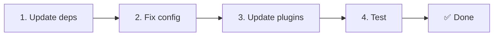

# 📦 Migracja z v2.x do v3.x

<Tip>
Zobacz [Migrację z nuxt-i18n](/migration/from-nuxtjs-i18n) — tamten przewodnik dotyczy przenoszenia się z ekosystemu vue-i18n, a nie z nuxt-i18n-micro v2.
</Tip>

v3.0.0 wprowadza fundamentalne zmiany architektoniczne: pakiety strategii, nowy system cache, scentralizowane zarządzanie locale przez `useI18nLocale()` oraz przeprojektowany pipeline przekierowań. Ta sekcja obejmuje wszystkie zmiany łamiące kompatybilność i sposób aktualizacji Twojego kodu.

## Kroki migracji



## Podsumowanie zmian łamiących kompatybilność

- **Stan locale** — `useState` / `useCookie` ręcznie → kompozycja `useI18nLocale()`
- **Dostęp do konfiguracji** — `useRuntimeConfig().public.i18nConfig` → `getI18nConfig()` z `#build/i18n.strategy.mjs`
- **Komponent przekierowań** — opcja `fallbackRedirectComponentPath` → wtyczka przekierowań serwerowych + middleware trasy klienta (automatycznie)
- **`includeDefaultLocaleRoute`** — Obsługiwane (deprecated) → Usunięte, użyj opcji `strategy`
- **`experimental.hmr`** — W `experimental` → Opcja na poziomie głównym
- **`previousPageFallback`** — Usunięte całkowicie (strategia kumulatywnego mergowania obsługuje to automatycznie)
- **Cache** — `useStorage('cache')` → Singleton `TranslationStorage` (`Symbol.for` na `globalThis`)
- **Transfer SSR** — Runtime config → payload Nuxt (v3 używało `useState`; chunki są teraz w `payload.data`, zobacz [Wydajność](/guides/performance#server-side-payload-transfer))
- **Klasy strategii** — Wewnętrzne → Osobne pakiety (`@i18n-micro/route-strategy`, `@i18n-micro/path-strategy`)

## Usunięte: `fallbackRedirectComponentPath`

Opcja `fallbackRedirectComponentPath` oraz zapasowy komponent `locale-redirect.vue` zostały usunięte. Logika przekierowań jest teraz obsługiwana przez:

1. **Middleware serwera** (`i18n.global.ts`) — ustawia `event.context.i18n.locale`
2. **Wtyczka przekierowań serwera** (`06.redirect.ts`, tylko serwer) — przekierowania 302 przed renderowaniem
3. **Middleware trasy klienta** (`i18n-redirect.global.ts`) — przekierowania SPA po hydracji

```diff
 i18n: {
   strategy: 'prefix_except_default',
-  fallbackRedirectComponentPath: '~/components/MyRedirect.vue',
 }
```

Jeśli miałeś niestandardową logikę przekierowań w komponencie fallback, zaimplementuj ją zamiast tego w plugin serwerowym:

```ts
// plugins/i18n-loader.server.ts
export default defineNuxtPlugin({
  name: 'i18n-custom-redirect',
  enforce: 'pre',
  order: -10,
  setup() {
    const { setLocale } = useI18nLocale()
    // Your custom detection logic
    setLocale(detectedLocale)
  },
})
```

## Usunięte: `includeDefaultLocaleRoute`

Zamiast tego użyj opcji `strategy`:

- `includeDefaultLocaleRoute: true` → `strategy: 'prefix'`
- `includeDefaultLocaleRoute: false` → `strategy: 'prefix_except_default'` (domyślne)

```diff
 i18n: {
-  includeDefaultLocaleRoute: true,
+  strategy: 'prefix',
 }
```

## Dostęp do konfiguracji: `getI18nConfig()` zastępuje `useRuntimeConfig`

```diff
- const config = useRuntimeConfig()
- const cookieName = config.public.i18nConfig?.localeCookie || 'user-locale'
+ import { getI18nConfig } from '#build/i18n.strategy.mjs'
+ const { localeCookie: configCookie } = getI18nConfig()
+ const cookieName = configCookie ?? 'user-locale'
```

## Zarządzanie locale: `useI18nLocale()` zastępuje ręczny stan

W v2 mogłeś używać `useState('i18n-locale')` lub `useCookie('user-locale')` bezpośrednio. W v3 używaj scentralizowanej kompozycji `useI18nLocale()`:

```diff
- const locale = useState('i18n-locale')
- const cookie = useCookie('user-locale')
- locale.value = 'fr'
- cookie.value = 'fr'
+ const { setLocale } = useI18nLocale()
+ setLocale('fr') // Updates both state and cookie atomically
```

Zobacz [Niestandardową detekcję języka](/guides/custom-language-detection), aby zapoznać się ze szczegółowymi przykładami.

## Opcje eksperymentalne przeniesione / usunięte

`hmr` zostało przeniesione z `experimental` na poziom główny. `previousPageFallback` zostało usunięte całkowicie — moduł używa teraz strategii kumulatywnego deep merge (głębokość 2 poziomów), która automatycznie zachowuje tłumaczenia z poprzedniej strony podczas animacji przejścia, nawet gdy strony współdzielą nakładające się zagnieżdżone klucze. Po zakończeniu animacji przejścia hook `page:transition:finish` czyści klucze starej strony z pamięci.

```diff
 i18n: {
-  experimental: {
-    hmr: true,
-    previousPageFallback: true
-  }
+  hmr: true,
+  // previousPageFallback removed — handled automatically
 }
```

## Architektura przekierowań (v3)

Przekierowania są teraz obsługiwane automatycznie przez dwa komponenty:

1. **Po stronie serwera** (`06.redirect.ts`, tylko serwer): Uruchamia się podczas SSR, wykonuje przekierowania 302 przed jakimkolwiek renderowaniem strony — brak „error flash”.
2. **Po stronie klienta** (`i18n-redirect.global.ts`): Globalne middleware trasy podczas nawigacji SPA; zachowuje query string i hash.

Priorytet locale dla przekierowań:

1. `useState('i18n-locale')` — ustawione przez `useI18nLocale().setLocale()`
2. Ciasteczko — jeśli `localeCookie` jest skonfigurowane
3. Nagłówek `Accept-Language` — jeśli `autoDetectLanguage: true`
4. `defaultLocale` — fallback

W standardowych konfiguracjach nie są wymagane żadne zmiany w kodzie.

<Warning>
Dla strategii `prefix` i `prefix_except_default` z `redirects: true` ustaw `localeCookie: 'user-locale'`, aby włączyć trwałość locale między przeładowaniami strony. Bez tego przekierowania używają tylko `Accept-Language` lub `defaultLocale`.
</Warning>

## TypeScript: wewnętrzne typy modułu (opcjonalnie)

Jeśli napotkasz błędy typów związane z wewnętrznymi importami takimi jak `#i18n-internal/plural`, `#i18n-internal/strategy` lub `#i18n-internal/config`, dodaj sekcję `imports` do `package.json` swojego projektu:

```json
{
  "imports": {
    "#i18n-internal/plural": "nuxt-i18n-micro/internals",
    "#i18n-internal/strategy": "nuxt-i18n-micro/internals",
    "#i18n-internal/config": "nuxt-i18n-micro/internals"
  }
}
```

<Tip>

</Tip>
