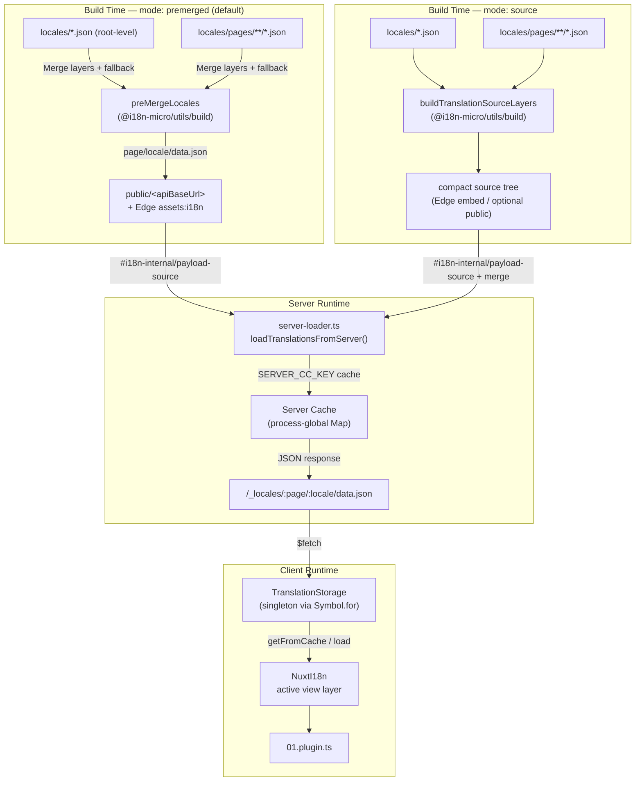

# 🗄️ Arquitetura de cache e storage de traduções

## 📖 Visão geral

O Nuxt I18n Micro v3 usa uma arquitetura de cache multicamada para traduções. O carregamento de payload depende de `translationPayloads.mode`:

- **`premerged`** (padrão) — arquivos raiz, de página, de fallback e de layer são mesclados em tempo de build via `@i18n-micro/utils/build` em `\{page\}/\{locale\}/data.json`
- **`source`** — arquivos fonte compactos são mantidos para merge em runtime via `@i18n-micro/utils/source-loader` e `@i18n-micro/utils/merge-source` (Edge os embute em `serverAssets` do Nitro; Node os lê de `public/` quando copiados)

Esta página descreve como o cache embutido funciona e como estendê-lo para casos de uso customizados (ferramentas admin, APIs externas, invalidação de cache).

## 📊 Visão geral da arquitetura

### Fluxo de dados



## 🧱 Componentes principais

### 1. `TranslationStorage` (Cliente + Servidor)

**Arquivo**: `src/runtime/utils/storage.ts`

Uma classe singleton que fornece storage unificado de traduções tanto no cliente quanto no servidor. Usa `Symbol.for('__NUXT_I18N_STORAGE_CACHE__')` em `globalThis` para garantir que apenas uma instância exista, mesmo quando múltiplos bundles são carregados.

**Métodos principais:**

| Método                              | Descrição                                                            |
| ----------------------------------- | ---------------------------------------------------------------------- |
| `getFromCache(locale, routeName?)`  | Checagem síncrona: retorna dados cacheados em memória, ou `null`            |
| `load(locale, routeName?, options)` | Carregamento assíncrono com cache: verifica o cache primeiro, depois busca via `$fetch` |
| `clear()`                           | Limpa todo o cache                                                |

**Formato da chave de cache**: `\{locale\}:\{routeName\}` (ex.: `en:index`, `fr:about`)

```typescript
import { translationStorage } from '../utils/storage'

// Synchronous cache check
const cached = translationStorage.getFromCache('en', 'index')

// Async load (with automatic caching)
const result = await translationStorage.load('en', 'index', {
  apiBaseUrl: '_locales',
  baseURL: '/',
  dateBuild: '2024-01-01',
})
// result.data — merged translations
// result.cacheKey — cache key used
```

### ⚙️ Cache busting determinístico (`i18n.dateBuild`)

Por padrão, este módulo gera `dateBuild` em tempo de build usando `Date.now()`. Ele é então embutido no `#build/i18n.strategy.mjs` gerado e usado como um parâmetro de query (`?v=...`) para invalidar caches de fetch de traduções após rebuilds.

Se você precisa de builds reprodutíveis (por exemplo, para melhorar taxas de acerto de cache de chunks em deploys rolling), defina um valor estável em `nuxt.config`:

```ts
export default defineNuxtConfig({
  i18n: {
    // Any stable string/number (git SHA, CI build number, release tag, etc.)
    dateBuild: process.env.GIT_SHA ?? 'local-dev',
  },
})
```

### 2. `loadTranslationsFromServer()` (Apenas Servidor)

**Arquivo**: `src/runtime/server/utils/server-loader.ts`

Carrega traduções para um par locale/página e cacheia o resultado mesclado em um `Map` `CacheControl` global do processo, indexado por `@i18n-micro/hmr/cache-keys` (`SERVER_CC_KEY`).

Comportamento: o SSR carrega de `#i18n-internal/payload-source` — **Node** `readFile` sob `public/<apiBaseUrl>` (`\{page\}/\{locale\}/data.json` no modo premerged), **Edge** `assets:i18n`. `premerged` lê um único arquivo; `source` mescla root/page/fallback via `@i18n-micro/utils/source-loader`.

```typescript
import { loadTranslationsFromServer } from '../server/utils/server-loader'

// Returns { data: Translations, json: string }
const { data, json } = await loadTranslationsFromServer('en', 'index')
```

### 3. Carga no cliente (sem embutir no HTML)

Os dicionários **não** são gravados em `nuxtApp.payload`. O servidor os mantém em memória para renderização SSR; o plugin do cliente faz `await` em `switchContext`, que carrega `/\{apiBaseUrl\}/:page/:locale/data.json`
(mesma postura padrão do `@nuxtjs/i18n` com `experimental.preload: false`).

`NuxtI18n` mantém o dicionário ativo da camada de view usado por `$t()` e `$has()`. `NuxtTranslationLoader` troca o contexto de locale/rota e mescla os chunks nessa camada.

### 4. Rota de API do servidor

**Rota**: `/_locales/\{page\}/\{locale\}/data.json`

**Arquivo**: `src/runtime/server/routes/i18n.ts`

Essa rota do Nitro serve as traduções mescladas para o modo de payload ativo. Ela chama `loadTranslationsFromServer()` e retorna o resultado como JSON.

Em produção, também define:

```http
Cache-Control: public, max-age={httpCacheDuration}, immutable
```

O `httpCacheDuration` padrão é `31536000` (1 ano). Isso é seguro porque os clientes solicitam payloads com cache-busting `?v=\{dateBuild\}`. Defina `httpCacheDuration: 0` para omitir o header. O header não é aplicado em desenvolvimento.

## 📥 Estendendo: carregamento personalizado de traduções

### Ler do cache (rota de servidor)

```ts
// server/api/i18n/load-cache.[post].ts
import { defineEventHandler, readBody } from 'h3'
import { loadTranslationsFromServer } from '#imports'

export default defineEventHandler(async (event) => {
  const { page, locale } = await readBody<{ page: string; locale: string }>(event)
  const { data } = await loadTranslationsFromServer(locale, page)
  return { locale, page, data }
})
```

### Atualizar traduções (arquivo + invalidar cache)

```ts
// server/api/i18n/update.[post].ts
import { defineEventHandler, readBody, createError } from 'h3'
import { join } from 'node:path'
import { readFile, writeFile } from 'node:fs/promises'
import { deepMergeTranslations } from '@i18n-micro/utils/deep-merge'

export default defineEventHandler(async (event) => {
  const { path, updates } = await readBody<{ path: string; updates: Record<string, unknown> }>(event)

  if (!path || !updates) {
    throw createError({ statusCode: 400, statusMessage: 'Missing path or updates' })
  }

  const fullPath = join('locales', path)
  let existing: Record<string, unknown> = {}

  try {
    const content = await readFile(fullPath, 'utf-8')
    existing = JSON.parse(content) as Record<string, unknown>
  } catch {
    // File does not exist — create new
  }

  const merged = deepMergeTranslations(existing, updates)
  await writeFile(fullPath, JSON.stringify(merged, null, 2), 'utf-8')

  return { success: true, path, updated: merged }
})
```

<Tip>

</Tip>

## 🧹 Limpando o cache

### Limpeza programática de cache (cliente)

Use o método embutido `$clearCache`:

```vue
<script setup>
const { $clearCache } = useNuxtApp()

// Clears both TranslationStorage and plugin-level cache
$clearCache()
</script>
```

### Comportamento do cache no servidor

O cache do lado do servidor (`loadTranslationsFromServer`) é global do processo e persiste até:

- O processo do servidor reiniciar
- Um novo deploy ser detectado (valor diferente de `dateBuild`)

Em ambientes serverless, cada cold start tem um cache novo.

## ⚙️ Configuração serverless

Para ambientes serverless (Cloudflare Workers, AWS Lambda), o cache embutido usa objetos `Map` em memória. Não é preciso configurar storage externo para o cache de traduções em si.

Porém, o storage do Nitro para arquivos fonte de tradução pode precisar de configuração:

```ts
export default defineNuxtConfig({
  nitro: {
    storage: {
      // Only needed if default file-system storage is unavailable
      'assets:server': {
        driver: 'cloudflare-kv-binding',
        binding: 'MY_KV_NAMESPACE',
      },
    },
  },
})
```

## 💡 Principais diferenças em relação à v2

| Aspecto           | v2                            | v3                                                                       |
| ---------------- | ----------------------------- | ------------------------------------------------------------------------ |
| Cache no cliente     | `useStorage('cache')`         | Singleton `TranslationStorage` (Symbol.for em globalThis)                |
| Transferência via SSR     | Runtime config                | Chunks completos via `payload.data` (a v3.0 usava `useState`)                    |
| Cache no servidor     | Storage de cache do Nitro           | `Map` global do processo via `Symbol.for`                                    |
| Lógica de merge      | No lado do cliente                   | Em tempo de build (`premerged`) ou runtime (`source`) via `@i18n-micro/utils/*` |
| Formato da chave de cache | `i18n:merged:\{page\}:\{locale\}` | `\{locale\}:\{routeName\}`                                                   |

## 📚 Relacionado

- [Guia de performance](/guides/performance) — Como o cache impacta a performance
- [Traduções no lado do servidor](/guides/server-side-translations) — Usando traduções em rotas de servidor
- [Deploy no Firebase](/guides/firebase) — Considerações de cache específicas de deploy
