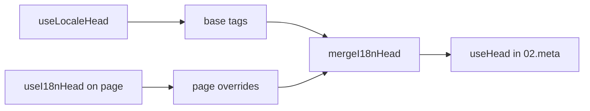

# Composable `useI18nHead`

O `useI18nHead` permite personalizar as tags SEO de i18n **por página** sem um plugin de meta personalizado. Quando `meta: true`, o módulo mescla sua entrada por cima da saída de [`useLocaleHead`](/api/composables/use-locale-head).

Casos típicos:

- **Artigos de CMS / blog** apenas alguns locales são traduzidos; URLs alternativas diferem por idioma (slugs ou paths diferentes).
- **Canonical dinâmico** a URL canônica deve corresponder à URL do artigo vinda da API, não a `$switchLocalePath`.
- **Open Graph extra** `og:title`, `og:description`, `og:image` junto com `og:locale` / `og:url` gerados automaticamente.
- **Controle parcial** manter canonical e `og:url` gerados pelo módulo, mas substituir apenas `hreflang` e `og:locale:alternate`.

---

## Assinatura

{/* generated:symbol:useI18nHead — do not edit; run `pnpm run docs:generate` */}

```ts
useI18nHead(input?: MaybeRefOrGetter<I18nHeadInput | null>): { pageHead: any; resetPageHead: () => void }
```

Registra sobrescritas em nível de página para tags SEO de head i18n.
Mescladas por cima da saída de `useLocaleHead` pelo plugin `02.meta`.

| Parâmetro | Tipo | Descrição |
| --- | --- | --- |
| `input` *(opcional)* | `MaybeRefOrGetter<I18nHeadInput \| null>` |  |

{/* /generated:symbol:useI18nHead */}

## Como se encaixa no pipeline



Você chama `useI18nHead` em um componente de página. O plugin `02.meta` aplica as sobrescritas após cada `updateMeta()` (troca de rota, `$setI18nRouteParams`, `page:finish` no cliente).

---

## Exemplo 1 — Artigo com traduções apenas em alguns locales

Um padrão comum: a API retorna quais locales existem e suas URLs absolutas ou relativas.

```ts
interface Article {
  title: string
  slug: string
  /** Locale code → page URL (absolute or site-relative) */
  locales: Record<string, string>
}
```

```vue
<script setup lang="ts">
const route = useRoute()
const { data: article } = await useFetch<Article>(`/api/articles/${route.params.slug}`)

const localeCodes = computed(() => Object.keys(article.value?.locales ?? {}))

useI18nHead(() => {
  if (!article.value) return null

  return {
    meta: [
      { property: 'og:title', content: article.value.title },
      { property: 'og:type', content: 'article' },
    ],
    replace: {
      hreflang: localeCodes.value.map((locale) => ({
        rel: 'alternate',
        hreflang: locale,
        href: article.value!.locales[locale]!,
      })),
      ogAlternates: localeCodes.value,
    },
  }
})
</script>
```

`ogAlternates` pega **códigos de locale** da sua config `i18n.locales`. Os valores para `og:locale:alternate` são resolvidos via `locale.og` ou `iso` (formato Open Graph `en_US`).

---

## Exemplo 2 — Artigo com slugs por locale (`$defineI18nRoute` + `$setI18nRouteParams`)

Quando URLs são construídas a partir de templates de rota localizados e parâmetros dinâmicos:

```vue
<script setup lang="ts">
const { $defineI18nRoute, $setI18nRouteParams } = useNuxtApp()
const route = useRoute()

const { data: article } = await useFetch(`/api/articles/${route.params.slug}`)

$defineI18nRoute({
  localeRoutes: {
    en: '/blog/[slug]',
    de: '/de/blog/[slug]',
    fr: '/fr/blog/[slug]',
  },
})

if (article.value) {
  $setI18nRouteParams({
    en: { slug: article.value.slugEn },
    de: { slug: article.value.slugDe },
    fr: { slug: article.value.slugFr },
  })

  const availableLocales = article.value.availableLocales as string[]

  useI18nHead({
    meta: [{ property: 'og:title', content: article.value.title }],
    replace: {
      hreflang: availableLocales.map((locale) => ({
        rel: 'alternate',
        hreflang: locale,
        href: article.value!.urls[locale],
      })),
      ogAlternates: availableLocales,
    },
  })
}
</script>
```

Alternativos gerados pelo módulo listariam **todos** os locales configurados. `replace.hreflang` limita as tags aos locales que realmente têm uma tradução.

---

## Exemplo 3 — `x-default` personalizado para a URL do artigo no locale padrão

Por padrão, `x-default` aponta para a URL do locale padrão vinda de `$switchLocalePath`. Para artigos, aponte-o para a URL da tradução padrão:

```vue
<script setup lang="ts">
const { $defaultLocale } = useNuxtApp()
const article = await loadArticle()

const defaultLocale = $defaultLocale() ?? 'en'
const defaultHref = article.locales[defaultLocale]

useI18nHead({
  replace: {
    hreflang: Object.entries(article.locales).map(([locale, href]) => ({
      rel: 'alternate',
      hreflang: locale,
      href,
    })),
    xDefault: defaultHref ? { rel: 'alternate', hreflang: 'x-default', href: defaultHref } : false,
    ogAlternates: Object.keys(article.locales),
  },
})
</script>
```

---

## Exemplo 4 — Substituir canonical e `og:url` com dados da API

Quando o canonical deve corresponder a uma URL fornecida pelo CMS (multi-domínio, path customizado ou URL absoluta pré-construída):

```vue
<script setup lang="ts">
const article = await loadArticle()
const canonical = article.canonicalUrl // e.g. https://www.example.com/en/blog/my-post

useI18nHead({
  replace: {
    canonical,
    ogUrl: canonical,
    hreflang: buildAlternateLinks(article),
    ogAlternates: Object.keys(article.locales),
  },
  meta: [
    { property: 'og:title', content: article.title },
    { name: 'description', content: article.excerpt },
  ],
})
</script>
```

---

## Exemplo 5 — Manter canonical / `og:url` automáticos e substituir apenas alternativos

Se `$switchLocalePath` + `$setI18nRouteParams` já produzem canonical e `og:url` corretos, substitua apenas tags de descoberta:

```vue
<script setup lang="ts">
const article = await loadArticle()

useI18nHead({
  replace: {
    hreflang: buildAlternateLinks(article),
    ogAlternates: Object.keys(article.locales),
  },
})
</script>
```

---

## Exemplo 6 — Head completo para uma página de detalhe de conteúdo (meta + links)

Padrão semelhante a dividir "meta da página" e "links alternativos" em helpers separados, combinados em uma única chamada:

```vue
<script setup lang="ts">
const article = await loadArticle()
const alternates = Object.entries(article.locales).map(([locale, href]) => ({
  rel: 'alternate' as const,
  hreflang: locale,
  href: normalizeSeoUrl(href), // strip ?query and #hash if needed
}))

useI18nHead({
  meta: [
    { property: 'og:title', content: article.title },
    { property: 'og:description', content: article.description },
    { property: 'og:image', content: article.imageUrl },
    { name: 'twitter:card', content: 'summary_large_image' },
    { name: 'twitter:title', content: article.title },
  ],
  replace: {
    canonical: article.canonicalUrl,
    ogUrl: article.canonicalUrl,
    hreflang: alternates,
    ogAlternates: Object.keys(article.locales),
  },
})
</script>
```

```ts
/** Remove query and hash — useful when CMS URLs must be clean for SEO */
function normalizeSeoUrl(href: string): string {
  try {
    const url = new URL(href, 'https://placeholder.local')
    url.search = ''
    url.hash = ''
    return href.startsWith('http') ? url.href : `${url.pathname}`
  } catch {
    return href.split(/[?#]/)[0] ?? href
  }
}
```

---

## Exemplo 7 — Dois tipos de conteúdo, mesmo padrão (notícias vs guias)

Mesmo formato de API, nomes de rota diferentes. Reutilize um pequeno helper:

```ts
// composables/useArticleHead.ts
import type { I18nHeadInput } from '@i18n-micro/types'

interface LocalizedContent {
  title: string
  locales: Record<string, string>
  canonicalUrl?: string
}

export function buildArticleHead(content: LocalizedContent): I18nHeadInput {
  const localeCodes = Object.keys(content.locales)
  const canonical = content.canonicalUrl ?? content.locales.en

  return {
    meta: [{ property: 'og:title', content: content.title }],
    replace: {
      canonical,
      ogUrl: canonical,
      hreflang: localeCodes.map((locale) => ({
        rel: 'alternate',
        hreflang: locale,
        href: content.locales[locale]!,
      })),
      ogAlternates: localeCodes,
    },
  }
}
```

```vue
<!-- pages/blog/[slug].vue -->
<script setup lang="ts">
const article = await loadArticle()
useI18nHead(buildArticleHead(article))
</script>
```

```vue
<!-- pages/guides/[slug].vue -->
<script setup lang="ts">
const guide = await loadGuide()
useI18nHead(buildArticleHead(guide))
</script>
```

---

## Exemplo 8 — Desabilitar alternativos integrados e fornecer sua própria lista

Equivalente a desabilitar o gerador de hreflang do módulo e passar uma lista personalizada (sem conjuntos de alternates duplicados):

```vue
<script setup lang="ts">
const article = await loadArticle()

useI18nHead({
  disable: ['hreflang', 'x-default', 'og-alternates'],
  link: Object.entries(article.locales).map(([locale, href]) => ({
    rel: 'alternate',
    hreflang: locale,
    href,
  })),
  replace: {
    ogAlternates: Object.keys(article.locales),
  },
})
</script>
```

Ou prefira `replace.hreflang` sem `disable`. Ele substitui todos os links `rel="alternate"` em uma única etapa.

---

## Exemplo 9 — Landing page: apenas OG extra, manter todas as tags i18n

```vue
<script setup lang="ts">
const { t } = useI18n()

useI18nHead({
  meta: [
    { property: 'og:title', content: t('landing.ogTitle') },
    { property: 'og:description', content: t('landing.ogDescription') },
  ],
})
</script>
```

---

## Exemplo 10 — Página de produto: desabilitar hreflang em um experimento de único locale

```vue
<script setup lang="ts">
useI18nHead({
  disable: ['hreflang', 'x-default'],
  // canonical, og:locale, og:url still generated
})
</script>
```

---

## Exemplo 11 — Atualizações reativas após fetch no cliente

```vue
<script setup lang="ts">
const article = ref<Article | null>(null)

onMounted(async () => {
  article.value = await $fetch('/api/articles/latest')
})

useI18nHead(() => {
  if (!article.value) return null
  return {
    meta: [{ property: 'og:title', content: article.value.title }],
    replace: {
      hreflang: Object.entries(article.value.locales).map(([locale, href]) => ({
        rel: 'alternate',
        hreflang: locale,
        href,
      })),
    },
  }
})
</script>
```

O head atualiza em `page:finish` e quando o estado de `pageHead` muda.

---

## Exemplo 12 — Origem HTTPS atrás de um reverse proxy

Se você anteriormente resolvia um composable de "origem pública" para URLs absolutas canônicas / alternativas, use a config do módulo em vez disso:

```ts
// nuxt.config.ts
export default defineNuxtConfig({
  i18n: {
    meta: true,
    // undefined = origin from current request (multi-domain friendly)
    metaBaseUrl: undefined,
    metaTrustForwardedHost: true,
    metaTrustForwardedProto: true,
  },
})
```

Em seguida, passe **paths ou URLs completas** em `replace.hreflang` / `replace.canonical`. O módulo usa `useRequestURL` com `X-Forwarded-Host` / `X-Forwarded-Proto` no SSR.

---

## Referência da API

### `meta`

Tags `<meta>` extras. Deduplicadas por `id`, `property` ou `name`.

### `link`

Tags `<link>` extras. Deduplicadas por `id` ou `rel` + `hreflang`.

### `htmlAttrs`

Mescladas nos atributos de `<html>` vindos de `useLocaleHead` (`lang`, `dir`).

### `replace`

| Chave          | Tipo                      | Efeito                                         |
| -------------- | ------------------------- | ---------------------------------------------- |
| `canonical`    | `string \| false`         | Substituir ou remover o link canônico          |
| `hreflang`     | `I18nHeadLink[] \| false` | Substituir ou remover todos os links `rel="alternate"` |
| `xDefault`     | `I18nHeadLink \| false`   | Substituir ou remover `hreflang="x-default"`   |
| `ogLocale`     | `string \| false`         | Substituir ou remover `og:locale`              |
| `ogUrl`        | `string \| false`         | Substituir ou remover `og:url`                 |
| `ogAlternates` | `string[] \| false`       | Reconstruir `og:locale:alternate` para os códigos de locale |

### `disable`

| Valor           | Remove                                   |
| --------------- | ---------------------------------------- |
| `hreflang`      | Links alternativos de locale (não `x-default`) |
| `x-default`     | Link `hreflang="x-default"`              |
| `canonical`     | Link canonical                           |
| `og`            | `og:locale` e `og:url`                   |
| `og-alternates` | Tags `og:locale:alternate`               |
| `html`          | `lang` / `dir` em `<html>`               |

---

## `useLocaleHead` vs `useI18nHead`

| Composable      | Escopo               | Quando usar                                |
| --------------- | -------------------- | ------------------------------------------ |
| `useLocaleHead` | Head global / manual | `meta: false`, setup totalmente customizado de `useHead` |
| `useI18nHead`   | Sobrescritas por página | `meta: true`, personalizar páginas específicas |

Quando `meta: true`, você **não** precisa de `useLocaleHead` em páginas que só usam `useI18nHead`.

---

## Migrando de um plugin de head de i18n personalizado

Muitos projetos mantêm um plugin personalizado que:

- mescla links alternativos específicos de página a partir de estado compartilhado;
- filtra entradas regionais `hreflang` duplicadas;
- normaliza valores de `og:locale`;
- remove query strings de URLs de SEO.

Você pode substituir isso por `useI18nHead` em cada página de conteúdo e pelos padrões do módulo.

| Abordagem anterior                                    | Com `useI18nHead`                                    |
| ----------------------------------------------------- | ---------------------------------------------------- |
| Estado compartilhado + "quais locales existem para este artigo" | `replace: \{ ogAlternates: localeCodes \}`   |
| Helper separado construindo links `rel="alternate"`   | `replace: \{ hreflang: links \}`                     |
| Plugin personalizado mesclando estado da página no head | Merge integrado em `02.meta`                       |
| "Origem pública" personalizada para URLs absolutas    | `metaBaseUrl` + cabeçalhos forwarded (veja Exemplo 12) |
| `og:locale` curto (`en` em vez de `en_US`)            | Defina `locale.og` ou use `iso` → `en_US` (protocolo OG) |

**`hreflang` a partir de `iso`:** cada locale emite um alternate com `hreflang = iso || code`. O `code` de roteamento nunca é usado quando `iso` está definido (evita tags inválidas como `hreflang="mx"`). Ative fallbacks de idioma puro (`es-ES` → também `es`) com `hreflangBaseLanguage: true`. Derivado de `iso`, não de `code`. Para listas totalmente personalizadas, use `replace.hreflang`.

**JSON-LD:** `useI18nHead` não gera dados estruturados. Mantenha `useHead(\{ script: [...] \})` ou um helper JSON-LD dedicado ao lado.

---

## Veja também

- [Guia de SEO](/guides/seo) geração automática de meta e sobrescritas em nível de página
- [`useLocaleHead`](/api/composables/use-locale-head) API de head de baixo nível
