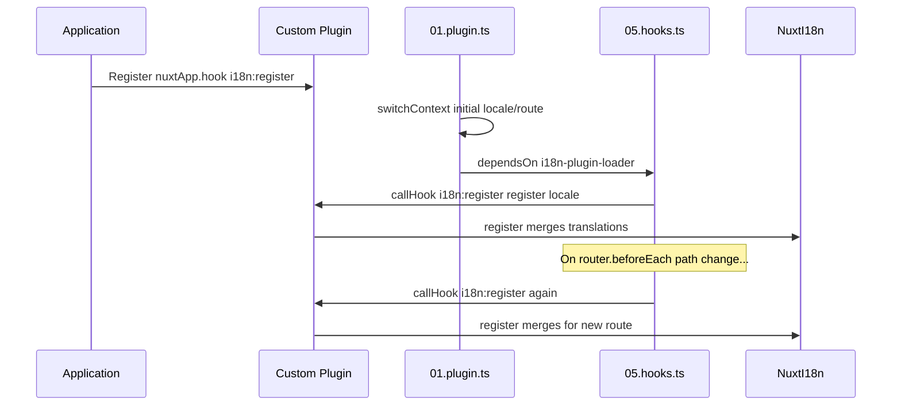

# 📢 Eventos

## 🔄 `i18n:register`

O evento `i18n:register` no `Nuxt I18n Micro` permite a adição dinâmica de traduções ao contexto de i18n da sua aplicação, tornando o processo de internacionalização perfeito e flexível. Este evento permite integrar novas traduções conforme necessário, aprimorando as capacidades de localização da sua aplicação.

### 📝 Detalhes do evento

- **Finalidade**:
  - Permite incorporar dinamicamente traduções adicionais ao conjunto existente de um locale específico.

- **Payload**:
  - **`register`**:
    - Uma função fornecida pelo evento que recebe dois argumentos:
      - **`translations`** (`Translations`):
        - Um objeto contendo pares chave-valor representando traduções, organizados de acordo com a interface `Translations`.
      - **`locale`** (`string`, opcional):
        - O código do locale (por exemplo, `'en'`, `'ru'`) para o qual as traduções são registradas. Se não especificado, usa o locale fornecido pelo evento.

- **Comportamento**:
  - Quando disparada, a função `register` mescla as novas traduções ao contexto atual para o locale especificado, atualizando as traduções disponíveis em toda a aplicação.

### ⏱️ Quando é disparado

O plugin de hooks do módulo (`05.hooks.ts`, `dependsOn: ['i18n-plugin-loader']`) chama `nuxtApp.callHook('i18n:register', …)`:

1. **Uma vez na inicialização** após o plugin principal de i18n (`01.plugin.ts`) ter carregado as traduções para a rota inicial
2. **Na navegação** em `router.beforeEach` quando o path muda, ou a cada navegação quando `strategy: 'no_prefix'`

Registre seu listener em um plugin Nuxt normal com `nuxtApp.hook('i18n:register', …)`. O plugin de hooks é executado após o loader estar pronto, então seu callback é invocado quando as traduções precisam ser estendidas.

Defina `hooks: false` em `nuxt.config` para desabilitar as chamadas automáticas de `i18n:register` (consulte [Configuração — `hooks`](/guides/configuration#hooks)).

### 💡 Exemplo de uso

O exemplo a seguir demonstra como usar o evento `i18n:register` para adicionar traduções dinamicamente:

```typescript
nuxt.hook('i18n:register', async (register: (translations: unknown, locale?: string) => void, locale: string) => {
  register(
    {
      greeting: 'Hello',
      farewell: 'Goodbye',
    },
    locale,
  )
})
```

### 🛠️ Explicação



- **Disparando o evento**:
  - O plugin de hooks (`05.hooks.ts`) dispara `i18n:register` após o loader principal estar pronto e em navegações relevantes.

- **Adicionando traduções**:
  - O exemplo registra traduções em inglês para `"greeting"` e `"farewell"`.
  - A função `register` mescla essas traduções ao conjunto existente para o locale fornecido.

### 🔗 Principais benefícios

- **Atualizações dinâmicas**:
  - Atualize ou adicione traduções facilmente sem precisar re-deployar toda a sua aplicação.

- **Flexibilidade de localização**:
  - Suporta ajustes de localização em tempo real com base nas necessidades do usuário ou da aplicação.

Usando o evento `i18n:register`, você garante que a estratégia de localização da sua aplicação permaneça flexível e adaptável, melhorando a experiência geral do usuário.

---

## 🛠️ Modificando traduções com plugins

Para modificar traduções dinamicamente em sua aplicação Nuxt, o uso de plugins é recomendado. Plugins oferecem uma maneira estruturada de lidar com atualizações de localização, especialmente ao trabalhar com módulos ou arquivos de tradução externos.

### **Registrando o plugin**

Se você estiver usando um módulo, registre o plugin onde ocorrerão as modificações de tradução adicionando-o à configuração do seu módulo:

```javascript
addPlugin({
  src: resolve('./plugins/extend_locales'),
})
```

Isso registra o plugin localizado em `./plugins/extend_locales`, que lidará com o carregamento e registro dinâmico de traduções.

### **Implementando o plugin**

No plugin, você pode gerenciar as modificações de locale. Aqui está um exemplo de implementação em um plugin Nuxt:

```typescript
import { defineNuxtPlugin } from '#app'

export default defineNuxtPlugin(async (nuxtApp) => {
  // Function to load translations from JSON files and register them
  const loadTranslations = async (lang: string) => {
    try {
      const translations = await import(`../locales/${lang}.json`)
      return translations.default
    } catch (error) {
      console.error(`Error loading translations for language: ${lang}`, error)
      return null
    }
  }

  // Hook into the 'i18n:register' event to dynamically add translations
  // eslint-disable-next-line @typescript-eslint/ban-ts-comment
  // @ts-expect-error
  nuxtApp.hook('i18n:register', async (register: (translations: unknown, locale?: string) => void, locale: string) => {
    const translations = await loadTranslations(locale)
    if (translations) {
      register(translations, locale)
    }
  })
})
```

### 📝 Explicação detalhada

1. **Carregando traduções**:

- A função `loadTranslations` importa dinamicamente arquivos de tradução com base no locale. Espera-se que os arquivos estejam no diretório `locales` e nomeados de acordo com os códigos de locale (por exemplo, `en.json`, `de.json`).
- Em caso de carregamento bem-sucedido, as traduções são retornadas; caso contrário, um erro é registrado.

2. **Registrando traduções**:

- O plugin se conecta ao evento `i18n:register` usando `nuxtApp.hook`.
- Quando o evento é disparado, a função `register` é chamada com as traduções carregadas e o locale correspondente.
- Isso mescla as novas traduções ao contexto de i18n para o locale especificado, atualizando as traduções disponíveis em toda a aplicação.

### 🔗 Benefícios de usar plugins para modificações de tradução

- **Separação de responsabilidades**:
  - Encapsule a lógica de localização separadamente do código principal da aplicação, tornando o gerenciamento e a manutenção mais fáceis.

- **Dinâmico e escalável**:
  - Ao carregar e registrar traduções dinamicamente, você pode atualizar o conteúdo sem exigir um redeploy completo da aplicação, o que é especialmente útil para aplicações com conteúdo frequentemente atualizado ou multilíngue.

- **Flexibilidade de localização aprimorada**:
  - Plugins permitem modificar ou estender traduções conforme necessário, oferecendo uma estratégia de localização mais adaptável e responsiva, que atende às preferências do usuário ou aos requisitos de negócio.

Ao adotar essa abordagem, você pode expandir e modificar de forma eficiente a localização da sua aplicação por meio de um processo estruturado e sustentável usando plugins, mantendo a internacionalização adaptável às necessidades em mudança e melhorando a experiência geral do usuário.
