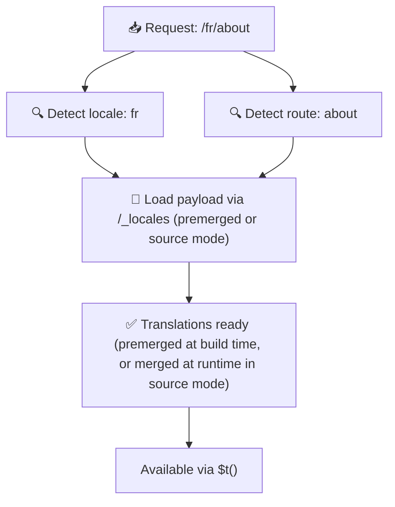

# 📂 Guia de estrutura de pastas

## 📖 Introdução

Organizar seus arquivos de tradução de forma eficaz é essencial para manter um sistema de internacionalização (i18n) escalável e eficiente. O `Nuxt I18n Micro` simplifica esse processo oferecendo uma abordagem clara para gerenciar traduções de nível raiz e específicas de página. Este guia orienta você pela estrutura de pastas recomendada e explica como o `Nuxt I18n Micro` lida com essas traduções.

## 🗂️ Estrutura de pastas recomendada

O `Nuxt I18n Micro` organiza as traduções em arquivos de nível raiz e arquivos específicos de página dentro do diretório `pages`. Com `translationPayloads.mode: 'premerged'` (padrão), as traduções de nível raiz são mescladas automaticamente em cada arquivo de página em tempo de build, de modo que cada página tenha um conjunto completo de traduções sem sobrecarga de merge em runtime.

Com `mode: 'source'`, os arquivos fonte permanecem separados nos assets do Nitro e são mesclados em runtime via a rota `/_locales`. Veja [Saída de payload serverless](/guides/performance#serverless-payload-output).

### 🔧 Estrutura básica

Aqui está um exemplo básico da estrutura de pastas que você deve seguir:

```text
locales/
├── pages/
│   ├── index/
│   │   ├── en.json
│   │   ├── fr.json
│   │   └── ar.json
│   ├── about/
│   │   ├── en.json
│   │   ├── fr.json
│   │   └── ar.json
├── en.json
├── fr.json
└── ar.json

```

### 📄 Explicação da estrutura

#### 1. 🌍 Arquivos de tradução de nível raiz

- **Caminho:** `/locales/\{locale\}.json` (ex.: `/locales/en.json`)
- **Objetivo:** Estes arquivos contêm traduções compartilhadas por toda a aplicação (menus de navegação, cabeçalhos, rodapés, etc.). Com `mode: 'premerged'` (padrão), eles são mesclados automaticamente em cada arquivo específico de página em tempo de build, de modo que o servidor retorne um único arquivo pré-construído por página.

  **Exemplo de conteúdo (`/locales/en.json`):**

  ```json
  {
    "menu": {
      "home": "Home",
      "about": "About Us",
      "contact": "Contact"
    },
    "footer": {
      "copyright": "© 2024 Your Company"
    }
  }
  ```

#### 2. 📄 Arquivos de tradução específicos de página

- **Caminho:** `/locales/pages/\{routeName\}/\{locale\}.json` (ex.: `/locales/pages/index/en.json`)
- **Objetivo:** Estes arquivos contêm traduções específicas de páginas individuais. Com `mode: 'premerged'` (padrão), as traduções de nível raiz são mescladas como base em tempo de build, de modo que cada arquivo de página se torna autocontido.

  **Exemplo de conteúdo (`/locales/pages/index/en.json`):**

  ```json
  {
    "title": "Welcome to Our Website",
    "description": "We offer a wide range of products and services to meet your needs."
  }
  ```

  **Exemplo de conteúdo (`/locales/pages/about/en.json`):**

  ```json
  {
    "title": "About Us",
    "description": "Learn more about our mission, vision, and values."
  }
  ```

### 📂 Tratando rotas dinâmicas e caminhos aninhados

O `Nuxt I18n Micro` transforma automaticamente segmentos dinâmicos e caminhos aninhados nas rotas em uma estrutura de pastas plana usando uma convenção específica de renomeação. Isso garante que todas as traduções sejam armazenadas de forma consistente e facilmente acessível.

#### Estrutura de pastas para traduções de rotas dinâmicas

Ao lidar com rotas dinâmicas, como `/products/[id]`, o módulo converte o segmento dinâmico `[id]` em um formato estático dentro da estrutura de arquivos.

**Exemplo de estrutura de pastas para rotas dinâmicas:**

Para uma rota como `/products/[id]`, os arquivos de tradução seriam armazenados em uma pasta chamada `products-id`:

```text
locales/pages/
├── products-id/
│   ├── en.json
│   ├── fr.json
│   └── ar.json

```

**Exemplo de estrutura de pastas para rotas dinâmicas aninhadas:**

Para uma rota aninhada como `/products/key/[id]`, os arquivos de tradução seriam armazenados em uma pasta chamada `products-key-id`:

```text
locales/pages/
├── products-key-id/
│   ├── en.json
│   ├── fr.json
│   └── ar.json

```

**Exemplo de estrutura de pastas para rotas aninhadas em múltiplos níveis:**

Para uma rota aninhada mais complexa como `/products/category/[id]/details`, os arquivos de tradução seriam armazenados em uma pasta chamada `products-category-id-details`:

```text
locales/pages/
├── products-category-id-details/
│   ├── en.json
│   ├── fr.json
│   └── ar.json

```

### 🛠 Personalizando a estrutura de diretórios

Se você preferir armazenar as traduções em um diretório diferente, o `Nuxt I18n Micro` permite personalizar o diretório onde os arquivos de tradução são armazenados. Você pode configurar isso no seu `nuxt.config.ts`.

**Exemplo: personalizando o diretório de traduções**

```typescript
export default defineNuxtConfig({
  i18n: {
    translationDir: 'i18n', // Custom directory path
  },
})
```

Isso instruirá o `Nuxt I18n Micro` a procurar arquivos de tradução no diretório `/i18n` em vez do diretório padrão `/locales`.

## ⚙️ Como as traduções são carregadas

### 🌍 Rotas de locale dinâmicas

O `Nuxt I18n Micro` usa rotas de locale dinâmicas para carregar traduções de forma eficiente. Quando um usuário visita uma página, o módulo determina o locale apropriado e carrega os arquivos de tradução correspondentes com base na rota e locale atuais.



Por exemplo:

- Visitar `/en/index` carregará as traduções de `/locales/pages/index/en.json`.
- Visitar `/fr/about` carregará as traduções de `/locales/pages/about/fr.json`.

Esse método garante que apenas as traduções necessárias sejam carregadas, otimizando tanto a carga do servidor quanto a performance no lado do cliente.

### 💾 Cache e pré-renderização

Para melhorar ainda mais a performance, o `Nuxt I18n Micro` suporta cache e pré-renderização de arquivos de tradução:

- **Cache**: Uma vez que um arquivo de tradução é carregado, ele é cacheado para requisições subsequentes, reduzindo a necessidade de buscar os mesmos dados repetidamente.
- **Pré-renderização**: Durante o processo de build, você pode pré-renderizar arquivos de tradução para todos os locales e rotas configurados, permitindo que sejam servidos diretamente do servidor sem atrasos em runtime.

## 📝 Boas práticas

### 📂 Use arquivos específicos de página com sabedoria

Aproveite os arquivos específicos de página para manter as traduções organizadas. Isso mantém as traduções de cada página enxutas e rápidas de carregar, o que é especialmente importante para páginas com conteúdo complexo ou extenso.

### 🔑 Mantenha as chaves de tradução consistentes

Use convenções de nomenclatura consistentes para suas chaves de tradução em todos os arquivos. Isso ajuda a manter a clareza e evita problemas ao gerenciar traduções, especialmente à medida que sua aplicação cresce.

### 🗂️ Organize traduções por contexto

Agrupe traduções relacionadas dentro dos seus arquivos. Por exemplo, agrupe todos os rótulos de botão sob uma chave `buttons` e todos os textos relacionados a formulários sob uma chave `forms`. Isso não só melhora a legibilidade, como também facilita o gerenciamento de traduções em diferentes locales.

### ⚠️ Limite de profundidade de aninhamento (2 níveis recomendados)

Durante a navegação no lado do cliente, o `Nuxt I18n Micro` usa um deep merge otimizado de 2 níveis para combinar as traduções das páginas de saída e entrada. Isso garante que chaves aninhadas sobrepostas (por exemplo, ambas as páginas têm chaves sob `common.*`) sejam preservadas durante as animações de transição.

**Isso funciona corretamente para a estrutura padrão `Seção → Chave → Valor` (2 níveis):**

```json
// Page A translations
{ "common": { "fromA": "Text A" } }

// Page B translations
{ "common": { "fromB": "Text B" } }

// During transition, both are available:
// { "common": { "fromA": "Text A", "fromB": "Text B" } }
```

**No entanto, se você usar 3+ níveis de aninhamento, chaves mais profundas podem ser sobrescritas durante as transições:**

```json
// Page A translations
{ "auth": { "form": { "login": "Login" } } }

// Page B translations
{ "auth": { "form": { "register": "Register" } } }

// During transition: "login" key is lost
// { "auth": { "form": { "register": "Register" } } }
```

<Tip>

</Tip>

### 🧹 Limpe regularmente traduções não utilizadas

Com o tempo, sua aplicação pode acumular chaves de tradução não utilizadas, especialmente se recursos forem removidos ou reestruturados. Revise periodicamente e faça a limpeza dos seus arquivos de tradução para mantê-los enxutos e sustentáveis.
