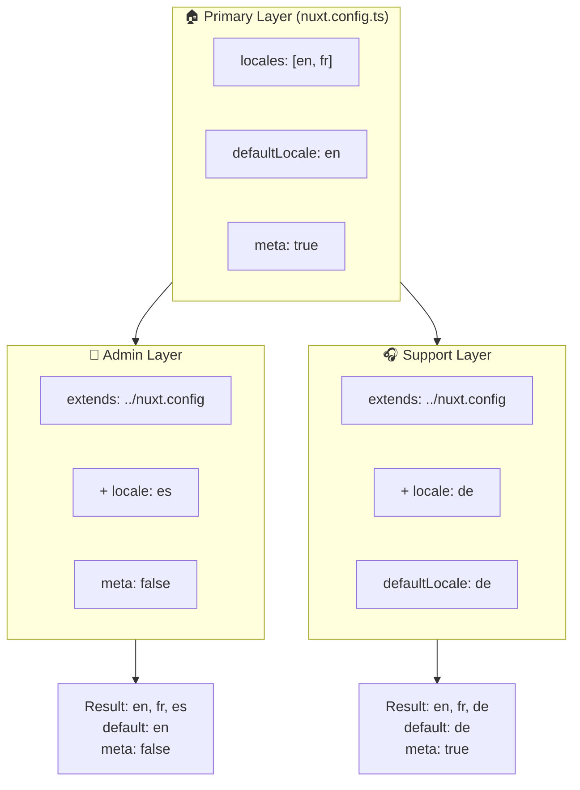

# 🗂️ Layers no `Nuxt I18n Micro`

## 📖 Introdução aos layers

Layers no `Nuxt I18n Micro` permitem gerenciar e personalizar configurações de localização de forma flexível entre diferentes partes da sua aplicação. Ao definir diferentes layers, você pode ajustar a configuração para vários contextos, como sobrescrever configurações para seções específicas do seu site ou criar configurações base reutilizáveis que podem ser estendidas por outras partes da sua aplicação.

### Fluxo de herança de layers



## 🛠️ Camada de configuração primária

A **camada de configuração primária** é onde você define as configurações padrão de localização para toda a sua aplicação. Esse layer é essencial pois define a configuração global, incluindo os locales suportados, o idioma padrão e outras configurações críticas de i18n.

### 📄 Exemplo: definindo a camada de configuração primária

Aqui está um exemplo de como você pode definir a camada de configuração primária no seu `nuxt.config.ts`:

```typescript
export default defineNuxtConfig({
  i18n: {
    locales: [
      { code: 'en', iso: 'en-EN', dir: 'ltr' },
      { code: 'fr', iso: 'fr-FR', dir: 'ltr' },
      { code: 'ar', iso: 'ar-SA', dir: 'rtl' },
    ],
    defaultLocale: 'en', // The default locale for the entire app
    translationDir: 'locales', // Directory where translations are stored
    meta: true, // Automatically generate SEO-related meta tags like `alternate`
    autoDetectLanguage: true, // Automatically detect and use the user's preferred language
  },
})
```

## 🌱 Layers filhos

Layers filhos são usados para estender ou sobrescrever a configuração primária para partes específicas da sua aplicação. Por exemplo, você pode querer adicionar locales adicionais ou modificar o locale padrão em determinada seção do seu site. Layers filhos são especialmente úteis em aplicações modulares onde partes diferentes da aplicação podem ter requisitos distintos de localização.

### 📄 Exemplo: estendendo o layer primário em um layer filho

Suponha que você tenha uma seção do seu site que precise suportar locales adicionais, ou que queira desabilitar um locale específico em um determinado contexto. Veja como fazer isso estendendo a camada de configuração primária:

```typescript
// basic/nuxt.config.ts (Primary Layer)
export default defineNuxtConfig({
  i18n: {
    locales: [
      { code: 'en', iso: 'en-EN', dir: 'ltr' },
      { code: 'fr', iso: 'fr-FR', dir: 'ltr' },
    ],
    defaultLocale: 'en',
    meta: true,
    translationDir: 'locales',
  },
})
```

```typescript
// extended/nuxt.config.ts (Child Layer)
export default defineNuxtConfig({
  extends: '../basic', // Inherit the base configuration from the 'basic' layer
  i18n: {
    locales: [
      { code: 'en', iso: 'en-EN', dir: 'ltr' }, // Inherited from the base layer
      { code: 'fr', iso: 'fr-FR', dir: 'ltr' }, // Inherited from the base layer
      { code: 'de', iso: 'de-DE', dir: 'ltr' }, // Added in the child layer
    ],
    defaultLocale: 'fr', // Override the default locale to French for this section
    autoDetectLanguage: false, // Disable automatic language detection in this section
  },
})
```

### 🌐 Usando layers em uma aplicação modular

Em uma aplicação Nuxt maior e modular, você pode ter múltiplas seções, cada uma exigindo suas próprias configurações de i18n. Aproveitando layers, você pode manter uma estrutura de configuração limpa e escalável.

### 📄 Exemplo: configuração em camadas em uma aplicação modular

Imagine que você tenha um site de e-commerce com seções distintas como o site principal, painel admin e portal de suporte ao cliente. Cada seção pode precisar de um conjunto diferente de locales ou outras configurações de i18n.

#### **Camada primária (configuração global):**

```typescript
// nuxt.config.ts
export default defineNuxtConfig({
  i18n: {
    locales: [
      { code: 'en', iso: 'en-EN', dir: 'ltr' },
      { code: 'fr', iso: 'fr-FR', dir: 'ltr' },
    ],
    defaultLocale: 'en',
    meta: true,
    translationDir: 'locales',
    autoDetectLanguage: true,
  },
})
```

#### **Camada filha para o painel admin:**

```typescript
// admin/nuxt.config.ts
export default defineNuxtConfig({
  extends: '../nuxt.config', // Inherit the global settings
  i18n: {
    locales: [
      { code: 'en', iso: 'en-EN', dir: 'ltr' }, // Inherited
      { code: 'fr', iso: 'fr-FR', dir: 'ltr' }, // Inherited
      { code: 'es', iso: 'es-ES', dir: 'ltr' }, // Specific to the admin panel
    ],
    defaultLocale: 'en',
    meta: false, // Disable automatic meta generation in the admin panel
  },
})
```

#### **Camada filha para o portal de suporte ao cliente:**

```typescript
// support/nuxt.config.ts
export default defineNuxtConfig({
  extends: '../nuxt.config', // Inherit the global settings
  i18n: {
    locales: [
      { code: 'en', iso: 'en-EN', dir: 'ltr' }, // Inherited
      { code: 'fr', iso: 'fr-FR', dir: 'ltr' }, // Inherited
      { code: 'de', iso: 'de-DE', dir: 'ltr' }, // Specific to the support portal
    ],
    defaultLocale: 'de', // Default to German in the support portal
    autoDetectLanguage: false, // Disable automatic language detection
  },
})
```

Neste exemplo modular:

- Cada seção (admin, support) tem suas próprias configurações de i18n, mas todas herdam da configuração base.
- O painel admin adiciona o espanhol (`es`) como locale e desabilita a geração automática de meta tags.
- O portal de suporte adiciona o alemão (`de`) como locale e usa alemão como padrão para a interface do usuário.

## 📝 Boas práticas ao usar layers

- **🔧 Mantenha a camada primária simples:** A camada primária deve conter as configurações mais utilizadas que se aplicam globalmente à sua aplicação. Mantenha-a direta para garantir consistência.
- **⚙️ Use camadas filhas para personalizações específicas:** Sobrescreva ou estenda configurações em camadas filhas apenas quando necessário. Essa abordagem evita complexidade desnecessária na sua configuração.
- **📚 Documente seus layers:** Documente claramente o propósito e as especificidades de cada layer no seu projeto. Isso ajuda a manter a clareza e facilita para outros (ou o seu eu futuro) entenderem a configuração.
