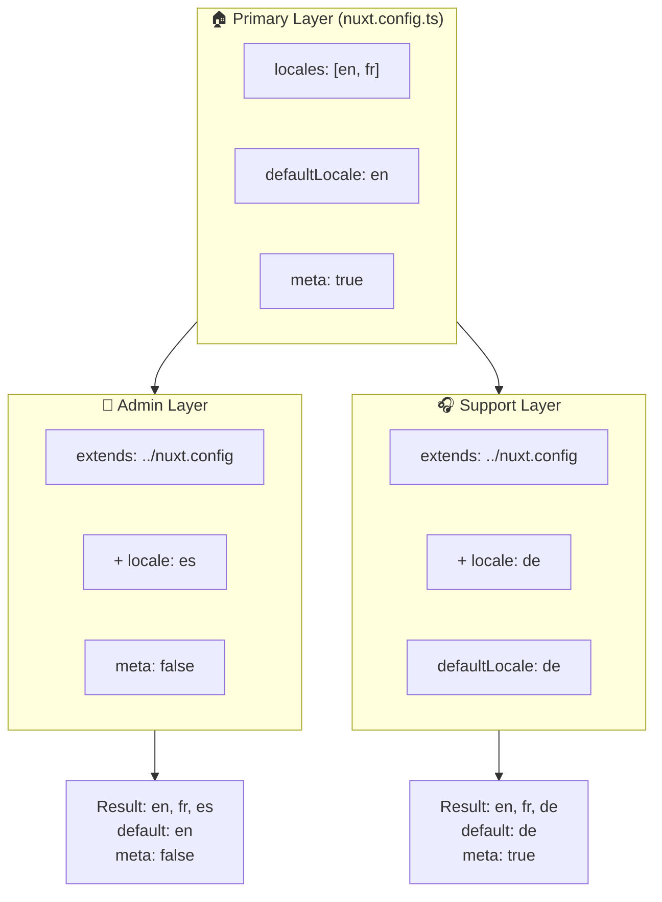

# 🗂️ Camadas no `Nuxt I18n Micro`

## 📖 Introdução às camadas

Camadas no `Nuxt I18n Micro` permitem gerenciar e personalizar configurações de localização de forma flexível em diferentes partes da sua aplicação. Definindo camadas diferentes, você pode ajustar a configuração para vários contextos, como sobrescrever configurações para seções específicas do seu site ou criar configurações base reutilizáveis que podem ser estendidas por outras partes da sua aplicação.

### Fluxo de herança de camadas



## 🛠️ Camada de configuração primária

A **camada de configuração primária** é onde você define as configurações de localização padrão para toda a sua aplicação. Essa camada é essencial pois define a configuração global, incluindo os locales suportados, o idioma padrão e outras configurações críticas de i18n.

### 📄 Exemplo: definindo a camada de configuração primária

Aqui está um exemplo de como você pode definir a camada de configuração primária no seu arquivo `nuxt.config.ts`:

```typescript
export default defineNuxtConfig({
  i18n: {
    locales: [
      { code: 'en', iso: 'en-EN', dir: 'ltr' },
      { code: 'fr', iso: 'fr-FR', dir: 'ltr' },
      { code: 'ar', iso: 'ar-SA', dir: 'rtl' },
    ],
    defaultLocale: 'en', // The default locale for the entire app
    translationDir: 'locales', // Directory where translations are stored
    meta: true, // Automatically generate SEO-related meta tags like `alternate`
    autoDetectLanguage: true, // Automatically detect and use the user's preferred language
  },
})
```

## 🌱 Camadas filhas

Camadas filhas são usadas para estender ou sobrescrever a configuração primária para partes específicas da sua aplicação. Por exemplo, você pode querer adicionar locales adicionais ou modificar o locale padrão para uma seção específica do seu site. Camadas filhas são especialmente úteis em aplicações modulares onde diferentes partes da aplicação podem ter requisitos de localização diferentes.

### 📄 Exemplo: estendendo a camada primária em uma camada filha

Suponha que você tenha uma seção do seu site que precisa suportar locales adicionais, ou queira desabilitar um locale específico em um determinado contexto. Veja como fazer isso estendendo a camada de configuração primária:

```typescript
// basic/nuxt.config.ts (Primary Layer)
export default defineNuxtConfig({
  i18n: {
    locales: [
      { code: 'en', iso: 'en-EN', dir: 'ltr' },
      { code: 'fr', iso: 'fr-FR', dir: 'ltr' },
    ],
    defaultLocale: 'en',
    meta: true,
    translationDir: 'locales',
  },
})
```

```typescript
// extended/nuxt.config.ts (Child Layer)
export default defineNuxtConfig({
  extends: '../basic', // Inherit the base configuration from the 'basic' layer
  i18n: {
    locales: [
      { code: 'en', iso: 'en-EN', dir: 'ltr' }, // Inherited from the base layer
      { code: 'fr', iso: 'fr-FR', dir: 'ltr' }, // Inherited from the base layer
      { code: 'de', iso: 'de-DE', dir: 'ltr' }, // Added in the child layer
    ],
    defaultLocale: 'fr', // Override the default locale to French for this section
    autoDetectLanguage: false, // Disable automatic language detection in this section
  },
})
```

### 🌐 Usando camadas em uma aplicação modular

Em uma aplicação Nuxt maior e modular, você pode ter várias seções, cada uma exigindo suas próprias configurações i18n. Aproveitando camadas, você mantém uma estrutura de configuração limpa e escalável.

### 📄 Exemplo: configuração em camadas em uma aplicação modular

Imagine que você tem um site de e-commerce com seções distintas como o site principal, o painel administrativo e o portal de suporte ao cliente. Cada seção pode precisar de um conjunto diferente de locales ou outras configurações i18n.

#### **Camada primária (configuração global):**

```typescript
// nuxt.config.ts
export default defineNuxtConfig({
  i18n: {
    locales: [
      { code: 'en', iso: 'en-EN', dir: 'ltr' },
      { code: 'fr', iso: 'fr-FR', dir: 'ltr' },
    ],
    defaultLocale: 'en',
    meta: true,
    translationDir: 'locales',
    autoDetectLanguage: true,
  },
})
```

#### **Camada filha para o painel admin:**

```typescript
// admin/nuxt.config.ts
export default defineNuxtConfig({
  extends: '../nuxt.config', // Inherit the global settings
  i18n: {
    locales: [
      { code: 'en', iso: 'en-EN', dir: 'ltr' }, // Inherited
      { code: 'fr', iso: 'fr-FR', dir: 'ltr' }, // Inherited
      { code: 'es', iso: 'es-ES', dir: 'ltr' }, // Specific to the admin panel
    ],
    defaultLocale: 'en',
    meta: false, // Disable automatic meta generation in the admin panel
  },
})
```

#### **Camada filha para o portal de suporte ao cliente:**

```typescript
// support/nuxt.config.ts
export default defineNuxtConfig({
  extends: '../nuxt.config', // Inherit the global settings
  i18n: {
    locales: [
      { code: 'en', iso: 'en-EN', dir: 'ltr' }, // Inherited
      { code: 'fr', iso: 'fr-FR', dir: 'ltr' }, // Inherited
      { code: 'de', iso: 'de-DE', dir: 'ltr' }, // Specific to the support portal
    ],
    defaultLocale: 'de', // Default to German in the support portal
    autoDetectLanguage: false, // Disable automatic language detection
  },
})
```

Neste exemplo modular:

- Cada seção (admin, suporte) tem suas próprias configurações i18n, mas todas herdam a configuração base.
- O painel admin adiciona o espanhol (`es`) como locale e desabilita a geração de meta tags.
- O portal de suporte adiciona o alemão (`de`) como locale e usa o alemão como padrão na interface.

## 📝 Boas práticas para usar camadas

- **🔧 Mantenha a camada primária simples:** a camada primária deve conter as configurações mais comumente usadas que se aplicam globalmente à sua aplicação. Mantenha-a direta para garantir consistência.
- **⚙️ Use camadas filhas para personalizações específicas:** sobrescreva ou estenda configurações em camadas filhas apenas quando necessário. Essa abordagem evita complexidade desnecessária na configuração.
- **📚 Documente suas camadas:** documente claramente a finalidade e as especificidades de cada camada no seu projeto. Isso ajudará a manter a clareza e facilitará que outros (ou você no futuro) entendam a configuração.
