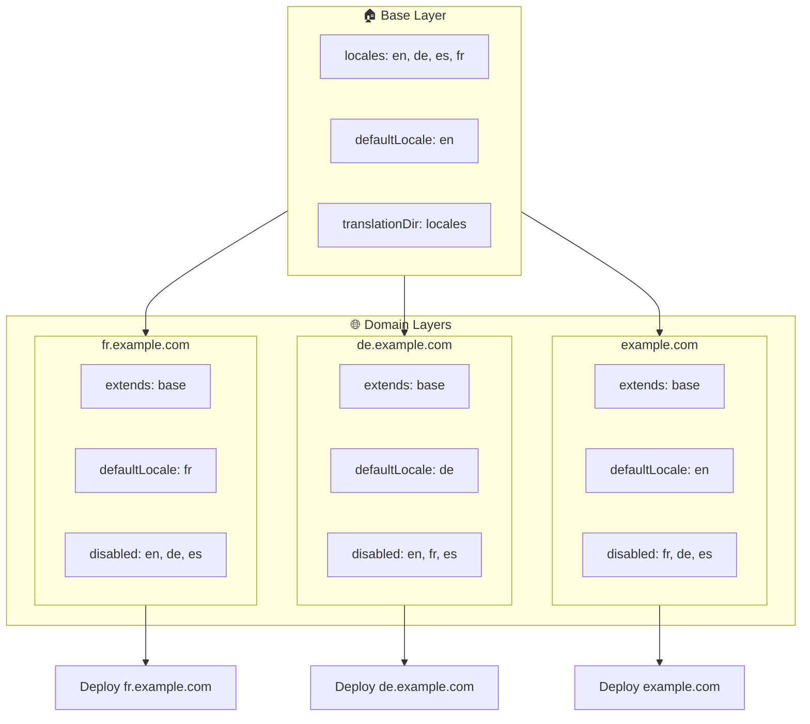

# 🌍 Configurando locales multi-domínio com `Nuxt I18n Micro` usando camadas

## 📝 Introdução

Aproveitando camadas no `Nuxt I18n Micro`, você pode criar um setup de localização multi-domínio flexível e sustentável. Essa abordagem não apenas simplifica o gerenciamento de domínios eliminando a necessidade de funcionalidades complexas, mas também permite distribuição de carga eficiente e reduz a complexidade do projeto. Ao executar projetos separados para diferentes locales, sua aplicação pode escalar e se adaptar facilmente a requisitos variados de locale em múltiplos domínios, oferecendo uma solução robusta e escalável para aplicações globais.

## 🎯 Objetivo

Criar um setup em que domínios diferentes servem locales específicos personalizando configurações em camadas filhas. Esse método aproveita o sistema de camadas do Nuxt, permitindo manter uma configuração base enquanto se estende ou modifica para cada domínio.

### Arquitetura multi-domínio



## 🛠 Passos para implementar locales multi-domínio

### 1. **Crie a camada base**

Comece criando uma camada de configuração base que inclua todas as configurações comuns de locale para sua aplicação. Essa configuração servirá como base para outras configurações específicas de domínio.

#### **Configuração da camada base**

Crie o arquivo de configuração base `base/nuxt.config.ts`:

```typescript
// base/nuxt.config.ts

export default defineNuxtConfig({
  i18n: {
    locales: [
      { code: 'en', iso: 'en-US', dir: 'ltr' },
      { code: 'de', iso: 'de-DE', dir: 'ltr' },
      { code: 'es', iso: 'es-ES', dir: 'ltr' },
    ],
    defaultLocale: 'en',
    translationDir: 'locales',
    meta: true,
    autoDetectLanguage: true,
  },
})
```

### 2. **Crie camadas filhas específicas de domínio**

Para cada domínio, crie uma camada filha que modifique a configuração base para atender aos requisitos específicos daquele domínio. Você pode desabilitar locales que não são necessários para um domínio específico.

#### **Exemplo: configuração para o domínio francês**

Crie uma configuração de camada filha para o domínio francês em `fr/nuxt.config.ts`:

```typescript
// fr/nuxt.config.ts

export default defineNuxtConfig({
  extends: '../base', // Inherit from the base configuration

  i18n: {
    locales: [
      { code: 'en', iso: 'en-US', dir: 'ltr', disabled: true }, // Disable English
      { code: 'fr', iso: 'fr-FR', dir: 'ltr' }, // Add and enable the French locale
      { code: 'de', iso: 'de-DE', dir: 'ltr', disabled: true }, // Disable German
      { code: 'es', iso: 'es-ES', dir: 'ltr', disabled: true }, // Disable Spanish
    ],
    defaultLocale: 'fr', // Set French as the default locale
    autoDetectLanguage: false, // Disable automatic language detection
  },
})
```

#### **Exemplo: configuração para o domínio alemão**

Da mesma forma, crie uma configuração de camada filha para o domínio alemão em `de/nuxt.config.ts`:

```typescript
// de/nuxt.config.ts

export default defineNuxtConfig({
  extends: '../base', // Inherit from the base configuration

  i18n: {
    locales: [
      { code: 'en', iso: 'en-US', dir: 'ltr', disabled: true }, // Disable English
      { code: 'fr', iso: 'fr-FR', dir: 'ltr', disabled: true }, // Disable French
      { code: 'de', iso: 'de-DE', dir: 'ltr' }, // Use the German locale
      { code: 'es', iso: 'es-ES', dir: 'ltr', disabled: true }, // Disable Spanish
    ],
    defaultLocale: 'de', // Set German as the default locale
    autoDetectLanguage: false, // Disable automatic language detection
  },
})
```

### 3. **Faça o deploy da aplicação para cada domínio**

Faça o deploy da aplicação com a configuração apropriada para cada domínio. Por exemplo:

- Faça o deploy da configuração de camada `fr` em `fr.example.com`.
- Faça o deploy da configuração de camada `de` em `de.example.com`.

### 4. **Configure múltiplos projetos para diferentes locales**

Para cada locale e domínio, você precisará executar uma instância separada da aplicação. Isso garante que cada domínio sirva a configuração correta de locale, otimizando a distribuição de carga e simplificando a estrutura do projeto. Executando múltiplos projetos adaptados a cada locale, você mantém uma separação limpa entre configurações e reduz a complexidade geral do setup.

### 5. **Configure o roteamento baseado no domínio**

Garanta que seu roteamento esteja configurado para direcionar usuários ao projeto correto com base no domínio que estão acessando. Isso garantirá que cada domínio sirva o locale apropriado, aprimorando a experiência do usuário e mantendo consistência entre diferentes regiões.

### 6. **Faça deploy e verifique**

Após configurar as camadas e fazer deploy para seus respectivos domínios, garanta que cada domínio esteja servindo o locale correto. Teste a aplicação minuciosamente para confirmar que o locale correto é carregado dependendo do domínio.

## 📝 Boas práticas

- **Mantenha a configuração base genérica**: a configuração base deve cobrir configurações gerais aplicáveis a todos os domínios.
- **Isole a lógica específica de domínio**: mantenha configurações específicas de domínio em suas respectivas camadas para preservar clareza e separação de responsabilidades.

## 🎉 Conclusão

Aproveitando camadas no `Nuxt I18n Micro`, você pode criar um setup de localização multi-domínio flexível e sustentável. Essa abordagem não apenas elimina a necessidade de funcionalidades complexas de gerenciamento de domínio, mas também permite distribuir a carga de forma eficiente e reduzir a complexidade do projeto. Executar projetos separados para diferentes locales garante que sua aplicação possa escalar facilmente e se adaptar a diferentes requisitos de locale em vários domínios, oferecendo uma solução robusta e escalável para aplicações globais.
