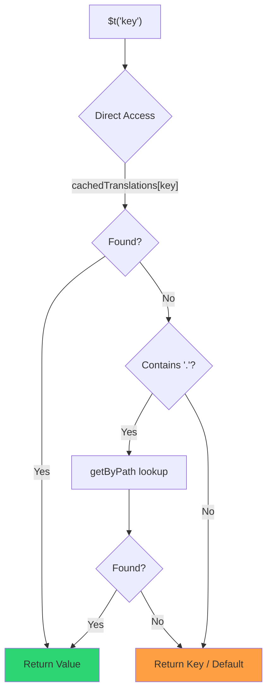

# 🚀 Guia de desempenho

## 📖 Introdução

O `Nuxt I18n Micro` foi projetado com desempenho em mente, oferecendo uma melhoria significativa em relação a módulos tradicionais de internacionalização (i18n) como o `nuxt-i18n`. Este guia oferece uma visão detalhada dos benefícios de desempenho de usar o `Nuxt I18n Micro` e como ele se compara a outras soluções.

## 🤔 Por que focar em desempenho?

Em projetos de grande escala e ambientes de alto tráfego, gargalos de desempenho podem levar a tempos de build lentos, uso aumentado de memória e tempos de resposta ruins do servidor. Esses problemas se tornam mais pronunciados com setups i18n complexos envolvendo arquivos de tradução grandes. O `Nuxt I18n Micro` foi construído para atacar esses desafios de frente, otimizando velocidade, eficiência de memória e impacto mínimo no tamanho do bundle da sua aplicação.

## 📊 Comparação de desempenho

Executamos uma série de testes em fixtures idênticas via `pnpm test:performance` (`pnpm -C scripts cli performance`) contra **`@nuxtjs/i18n@10.6.0`**. Metodologia completa e gráficos: [Resultados de testes de desempenho](/guides/performance-results).

Perfil padrão da CLI: **4 locales** × **2 páginas** (`index`, `page`) × ~10k chaves-folha no index. Aumente `--locales` / `--keys` para carga mais pesada de regression-radar. O relatório separa **código**, **traduções** (incluindo `chunks/raw/*` do `@nuxtjs/i18n`) e **total** implantável.

```bash
pnpm test:performance
pnpm -C scripts cli performance --only micro --skip-stress
pnpm -C scripts cli performance --locales 12 --keys 100000 --runs 3
```

### ⏱️ Tempo de build e consumo de recursos

<Accordion title="**@nuxtjs/i18n v10.6**">
- **Bundle de código**: 2.16 MB
- **Traduções**: 7.21 MB (chunks de mensagens + payloads de locale)
- **Total implantável**: 9.37 MB
- **Uso máx de memória**: 1.821 MB
- **Tempo decorrido**: 8.34s (média de 3)
</Accordion>

<Tip>
- **Bundle de código**: 1.74 MB **~19% menos código que `@nuxtjs/i18n` v10.6**
- **Traduções**: 6.8 MB (JSON lazy-loaded)
- **Total implantável**: 8.54 MB
- **Uso máx de memória**: 1.065 MB **~41% menos memória que `@nuxtjs/i18n` v10.6**
- **Tempo decorrido**: 5.34s **~36% mais rápido que `@nuxtjs/i18n` v10.6** (≈ baseline plain-nuxt)
</Tip>

> Docs antigos que mostravam `@nuxtjs/i18n` "code ≈ 15 MB / translations 0 B" contavam arquivos de mensagens em `chunks/raw` como código do app. O classificador atual os separa; a diferença em **código** é menor, e o micro ainda lidera em tempo de build, RSS de pico e testes de carga.

Consulte o [relatório completo de benchmark](/guides/performance-results) para gráficos, resultados Autocannon e detalhes das fixtures.

### 🌐 Desempenho do servidor sob carga

Artillery (6s@6 + 60s@60) e Autocannon (10c / 10s), média de 3 execuções consecutivas por fixture.

<Accordion title="**@nuxtjs/i18n v10.6**">
- **Requisições por segundo (Artillery)**: 143 [#/s]
- **Tempo médio de resposta**: 956 ms
- **RPS / latência média Autocannon**: 72 / 139 ms
</Accordion>

<Tip>
- **Requisições por segundo (Artillery)**: 275 [#/s] **~93% mais que `@nuxtjs/i18n` v10.6**
- **Tempo médio de resposta**: 483 ms **~49% mais rápido que `@nuxtjs/i18n` v10.6**
- **RPS / latência média Autocannon**: 162 / 62 ms
</Tip>

### 📈 Comparação visual

<Note>
Gráfico interativo omitido nos docs do Mintlify. Consulte as tabelas de benchmark nesta página ou os [docs no VitePress](https://s00d.github.io/nuxt-i18n-micro/guide/performance-results) para o gráfico: `chart`.
</Note>

<Note>
Gráfico interativo omitido nos docs do Mintlify. Consulte as tabelas de benchmark nesta página ou os [docs no VitePress](https://s00d.github.io/nuxt-i18n-micro/guide/performance-results) para o gráfico: `chart`.
</Note>

| Métrica         | @nuxtjs/i18n v10.6 | i18n-micro | Melhoria           |
| --------------- | ------------------ | ---------- | ------------------ |
| Tempo de build  | 8.34s              | 5.34s      | **~36% mais rápido** |
| Memória (build) | 1.821 MB           | 1.065 MB   | **~41% menos**     |
| Bundle de código | 2.16 MB           | 1.74 MB    | **~19% menor**     |
| Tempo de resposta | 956 ms          | 483 ms     | **~49% mais rápido** |
| RPS (Artillery) | 143                | 275        | **~93% mais**      |

### 🔍 Interpretação dos resultados

Contra o `@nuxtjs/i18n` atual **v10.6** (perfil padrão da CLI, média de 3):

- 🗜️ **Grafo de código menor**: ~1.74 MB vs ~2.16 MB depois que chunks de mensagem não são mais rotulados erroneamente como "code".
- 🧠 **RSS de build menor**: pico ~1.1 GB vs ~1.8 GB.
- 🕒 **Builds mais rápidos**: ~5.3s vs ~8.3s (o micro iguala o baseline plain-Nuxt neste perfil).
- ⚡ **Muito melhor sob carga**: ~275 vs ~143 RPS Artillery, ~162 vs ~72 RPS Autocannon, menor latência média.

Os números absolutos diferem de tabelas antigas publicadas (dicionários menores, Nuxt mais antigo e uma divisão injusta "0 B translations" para `@nuxtjs/i18n`). Direcionalmente é o mesmo: o micro se mantém à frente no custo de build e no throughput de requisições.

## ⚙️ Otimizações principais

### 🛠️ Design minimalista

O `Nuxt I18n Micro` é construído em torno de uma arquitetura minimalista com um núcleo pequeno e pacotes de estratégia dedicados. Isso reduz overhead e simplifica a lógica interna, levando a desempenho aprimorado.

### 🚦 Roteamento eficiente

Na v3, a geração de rotas e a lógica de path em runtime são divididas em pacotes dedicados para tree-shaking ideal:

- **`@i18n-micro/route-strategy`** geração de rotas em tempo de build: estende as páginas Nuxt com rotas localizadas. Apenas a estratégia selecionada (`no_prefix`, `prefix`, `prefix_except_default`, `prefix_and_default`) é incluída.
- **`@i18n-micro/path-strategy`** resolução de path em runtime, redirecionamentos e geração de links. Usa funções puras e flags de contexto pré-computados para minimizar alocações em caminhos quentes. Subpath exports (`/prefix`, `/no-prefix`, etc.) garantem que apenas a implementação escolhida seja empacotada.

Essa abordagem mantém a configuração de roteamento leve e garante resolução de rotas rápida independentemente do número de locales.

### 📂 Carregamento de traduções simplificado

O módulo suporta apenas arquivos JSON para traduções, com separação clara entre arquivos globais e específicos de página. Isso garante que apenas os dados de tradução necessários sejam carregados a qualquer momento, aprimorando ainda mais o desempenho.

### 🔒 Cache singleton GlobalThis

A partir da v3.0.0, o módulo usa um padrão singleton `globalThis` com `Symbol.for` para garantir uma única instância de cache em todo o processo Node.js. Isso previne:

- Duplicação de cache quando o mesmo módulo é empacotado múltiplas vezes
- Recriação de objetos por requisição que causa pressão no garbage collector
- Vazamentos de memória de instâncias de cache órfãs

```mermaid
flowchart LR
    subgraph Process["Node.js Process"]
        G["globalThis[Symbol.for('CACHE')]"]

        subgraph R1["SSR Request 1"]
            P1[Plugin Instance] --> G
        end

        subgraph R2["SSR Request 2"]
            P2[Plugin Instance] --> G
        end

        subgraph R3["SSR Request 3"]
            P3[Plugin Instance] --> G
        end
    end

    G --> Cache["Single Map Instance"]
    Cache --> D1["en:index → translations"]
    Cache --> D2["en:about → translations"
```

```typescript
// Internal implementation pattern
const CACHE_KEY = Symbol.for('__NUXT_I18N_STORAGE_CACHE__')
if (!globalThis[CACHE_KEY]) {
  globalThis[CACHE_KEY] = new Map()
}
```

### ⚡ Função de tradução otimizada (tFast)

A função `$t()` usa uma estratégia de lookup direta otimizada para velocidade:

1. **Contexto pré-computado**: locale e nome da rota são calculados uma vez durante a navegação, não a cada chamada `$t()`
2. **Lookup em fonte única**: todas as traduções (raiz + específicas de página + fallback) são pré-mescladas em tempo de build em um único arquivo por página. Sem busca em camadas
3. **Deep merge cumulativo na navegação**: ao navegar dentro do mesmo locale, as novas traduções da página são deep-mescladas (profundidade de 2 níveis) no dicionário ativo, então chaves da página anterior permanecem visíveis durante animações de transição, mesmo quando páginas compartilham prefixos aninhados sobrepostos (ex.: ambas as páginas têm chaves sob `common.*`)
4. **Coleta de lixo via `page:transition:finish`**: após a animação de transição estar totalmente completa, o dicionário mesclado é substituído por traduções limpas apenas da nova página, liberando memória de chaves da página antiga
5. **Acesso direto a propriedades**: usa `obj[key]` em vez de lookups em Map para caminhos quentes



```typescript
// Simplified lookup logic — single active dictionary
let val = cachedTranslations[key]
if (val === undefined && key.includes('.')) {
  val = getByPath(cachedTranslations, key)
}
```

### 💉 Carga server-side (sem embed em HTML)

As traduções carregadas durante o SSR permanecem em **memória do servidor** para `$t` durante a renderização. Elas **não** são copiadas para `nuxtApp.payload` / o documento HTML (mesma ideia do `@nuxtjs/i18n` com `experimental.preload: false`).

No cliente, `01.plugin.ts` `await`-a `switchContext`, que carrega `/\{apiBaseUrl\}/:page/:locale/data.json` antes de o app continuar. Uma requisição, não um blob inline de 8 MB.

O `NuxtI18n` ainda mantém o dicionário mesclado ativo (`cachedTranslations`) para `$t()` / `$has()`. Navegações no mesmo locale fazem deep-merge de chunks de página até que `page:transition:finish` limpe chaves antigas.

#### Situação atual

Os números abaixo são lidos do arquivo de budget que `pnpm run budget:payload` mede e faz enforcement.

{/* generated:payload-budget — do not edit; run `pnpm run docs:generate` */}

Medido em `playground` em `/`, `/de`:

| Medição | Tamanho |
| --- | --- |
| Fontes de traduções em disco | 15.2 MB |
| Servidas como arquivos de payload separados | 76.3 MB |
| Maior `__NUXT_DATA__` inline | 6.9 MB |
| Assets do cliente | 449.5 KB |

O playground carrega um dicionário deliberadamente superdimensionado, então esses não são números esperados de uma aplicação real. São um ponto fixo para medir contra. O budget falha quando eles crescem inesperadamente, o que é como uma mudança acidental no que o payload carrega é notada.

{/* /generated:payload-budget */}

### 💾 Cache e pré-renderização

As traduções passam por várias camadas de cache, e saber qual delas respondeu a uma requisição é a diferença entre uma sessão de debug de cinco minutos e de cinco horas. Há quatro, na ordem que uma requisição as encontra:

| Camada | Onde | Duração | Limpa por |
| --- | --- | --- | --- |
| Navegador / CDN | `Cache-Control` em `/\{apiBaseUrl\}/**` | `httpCacheDuration`, `immutable` | um novo `?v=`. Ou seja, um deploy que mudou as traduções |
| Cache de rota do Nitro | `routeRules['/\{apiBaseUrl\}/**'].cache` | 60 s, stale-while-revalidate | reinício do servidor |
| Loader do servidor | `CacheControl` em processo, chave `locale:routeName` | duração do processo, ou `cacheTtl` | reinício do servidor, HMR em dev |
| Store do cliente | `translationStorage` + o chunk ativo em `NuxtI18n` | duração da página | recarga |

Duas regras impedem que se contradigam:

- **O cache de rota do Nitro só existe quando `?v=` existe.** Com um cache-buster, cada URL é única ao seu conteúdo, então cachear no servidor é livre de estale. Defina `dateBuild: 0` e essa camada é desligada, porque a URL é então estável e a resposta diz `must-revalidate`. Um cache no servidor responderia de uma entrada estale por até um minuto e o derrotaria silenciosamente.
- **`immutable` também exige `?v=`.** Sem um buster, o cabeçalho é `public, max-age=0, must-revalidate`, independente do que `httpCacheDuration` diz: um `max-age` longo em uma URL que nunca muda fixa a primeira resposta que um navegador viu.

<Warning>
Com `translationPayloads.publicAssets` (padrão em modo premerged), os payloads são copiados para `public/<apiBaseUrl>/\{page\}/\{locale\}/data.json`. Uma plataforma que serve esse diretório sozinha (Cloudflare Pages, Firebase Hosting, `npx serve`) aplica seus próprios cabeçalhos. O cabeçalho `routeRules` do Nitro só atinge respostas que passam pelo servidor. Defina a política de cache para esses arquivos estáticos na configuração da própria plataforma.
</Warning>

🏁 **Pré-renderização**: em modo premerged, `publicAssets` já escreve a árvore de URL do cliente em `public/`. Ative `prerenderRoutes` apenas se precisar que o Nitro materialize rotas de handler quando essa cópia estiver desabilitada.

### 🗜️ Payloads públicos comprimidos

Quando `nitro.compressPublicAssets` está habilitado, os payloads de tradução copiados para o diretório public também recebem irmãos `.gz` e `.br`:

```ts
export default defineNuxtConfig({
  nitro: { compressPublicAssets: true },
})
```

O Nitro comprime assets públicos antes do hook que copia os payloads, então sem isso eles seriam a única parte não comprimida de um build estático. O módulo não liga a compressão sozinho. Ele apenas aplica a configuração que você escolheu. Seleção por encoding (`\{ gzip: true, brotli: false \}`) é respeitada.

Payload do index do playground: 6.651.984 B raw, 1.012.831 B gzip, 821.617 B brotli.

### ☁️ Saída de payload serverless

No **Node**, o SSR lê JSON de tradução de `public/<apiBaseUrl>` (`readFile`, sem `serverAssets` do Nitro / Rollup `raw:`). No **Edge**, `serverAssets` do Nitro embute a mesma árvore (prefira `mode: 'source'` para catálogos grandes).

```typescript
export default defineNuxtConfig({
  i18n: {
    translationPayloads: {
      serverAssets: true, // default — Node → public copy; Edge → serverAssets embed
      publicAssets: true, // default in premerged mode
    },
  },
})
```

Use `translationPayloads.mode: 'source'` para embeds Edge compactos (e cópias públicas compactas opcionais):

```typescript
export default defineNuxtConfig({
  i18n: {
    translationPayloads: {
      mode: 'source',
    },
  },
})
```

`mode: 'source'` mantém arquivos-fonte mesclados por camadas compactos e mescla root/page/fallback em runtime pela rota integrada `/_locales` (ou `assets:i18n` do Edge). Por padrão, ele desabilita cópias de assets públicos e rotas de payload prerenderizadas.

<Warning>
`prerenderRoutes` tem `false` como padrão. Com `mode: 'source'`, `publicAssets` também tem `false` como padrão. Hospedagem estática pura sem runtime Nitro/edge, portanto, não pode carregar traduções no cliente a menos que você habilite uma dessas saídas, mantenha `serverHandler` disponível em runtime ou hospede payloads externamente.

O premerged padrão + `publicAssets` já coloca `/\{apiBaseUrl\}/\{page\}/\{locale\}/data.json` em `public/`, então hosts estáticos podem servir fetches do cliente sem Nitro.
</Warning>

<Warning>
Definir `apiBaseServerHost` ou `apiBaseClientHost` move o serviço de payloads para essa origem, o que vem com seus próprios requisitos. Consulte [Configuração → Hosts CDN externos](/guides/configuration#external-cdn-hosts).
</Warning>

Ou desabilite saídas HTTP/públicas individuais e hospede payloads externamente:

```typescript
export default defineNuxtConfig({
  i18n: {
    apiBaseClientHost: 'https://cdn.example.com',
    apiBaseServerHost: 'https://cdn.example.com',
    translationPayloads: {
      serverHandler: false,
      publicAssets: false,
      prerenderRoutes: false,
    },
  },
})
```

Mantenha `serverHandler` habilitado quando você depender da rota local integrada `/\{apiBaseUrl\}/:page/:locale/data.json`. Desabilite-o quando os payloads forem hospedados externamente e `apiBaseServerHost` apontar para essa origem externa. Habilite `prerenderRoutes` apenas quando precisar que o Nitro materialize rotas estáticas de payload e `publicAssets` não as escreveu.

Durante o build, o módulo avisa quando a saída de payload gerada excede `translationPayloads.warnFileCount` (padrão 500) ou `translationPayloads.warnSizeBytes` (padrão 10 MB). Também avisa quando todas as saídas locais estão desabilitadas sem hosts de payload externos configurados.

## 📝 Dicas para maximizar o desempenho

Aqui estão algumas dicas para garantir que você tire o melhor desempenho do `Nuxt I18n Micro`:

- 📉 **Limite os dados de locale**: inclua apenas os locales que você precisa no seu projeto para manter o tamanho do bundle pequeno.
- 🗂️ **Use traduções específicas de página**: organize seus arquivos de tradução por página para evitar carregar dados desnecessários.
- 💾 **Habilite o cache**: use os recursos de cache para reduzir a carga no servidor e melhorar tempos de resposta.
- 🏁 **Aproveite a pré-renderização**: pré-renderize suas traduções para acelerar carregamentos de página e reduzir overhead em runtime.

Para resultados detalhados dos testes de desempenho, consulte [Resultados de testes de desempenho](/guides/performance-results).
