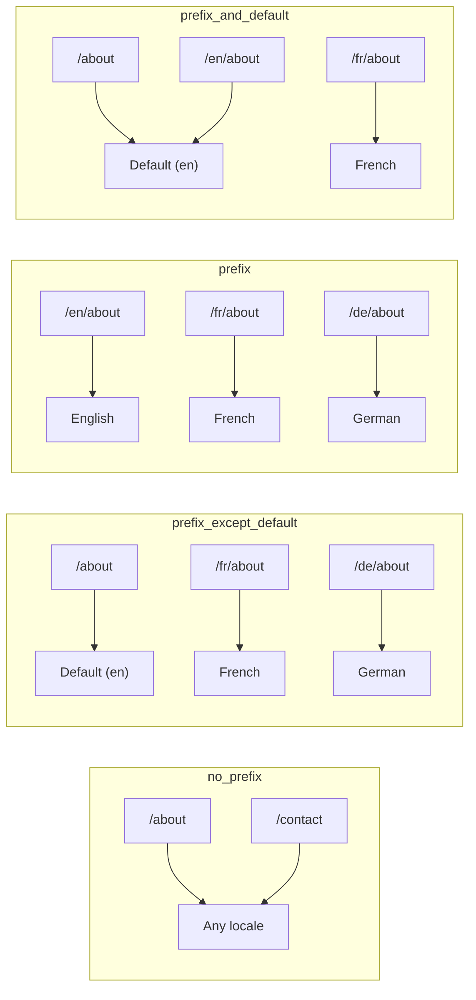
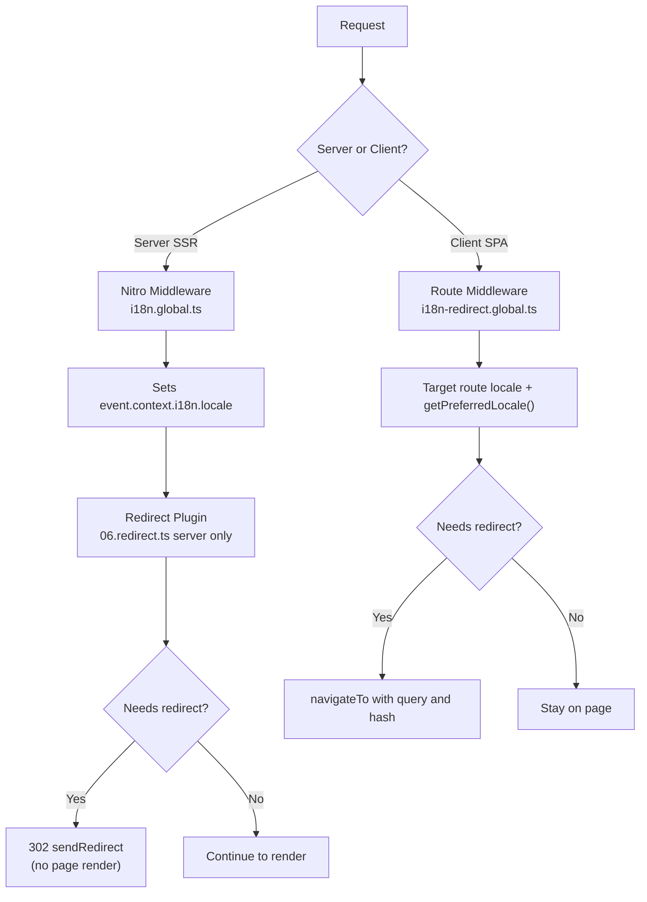

# 🗂️ Estratégias de roteamento no Nuxt I18n Micro

## 📖 Visão geral

O Nuxt I18n Micro controla como os prefixos de locale aparecem nas URLs por meio da opção `strategy`. Nos bastidores, dois pacotes implementam isso:

- **`@i18n-micro/route-strategy`** geração de rotas em tempo de build (estende as páginas do Nuxt com rotas localizadas)
- **`@i18n-micro/path-strategy`** resolução de path em runtime, redirecionamentos, atributos de SEO e geração de links

O módulo Nuxt seleciona a classe de estratégia correta em tempo de build e a alias via `#i18n-strategy`, de forma que apenas a implementação escolhida é empacotada.

## 🚦 Estratégias disponíveis

{/* generated:option:strategy — do not edit; run `pnpm run docs:generate` */}

**Tipo** `Strategies` · **Padrão** `'prefix_except_default'`

Estratégia de roteamento por URL para prefixos de locale.

- `'no_prefix'` sem locale na URL; locale armazenado em cookie.
- `'prefix_except_default'` prefixa todos os locales exceto o padrão.
- `'prefix'` sempre prefixa, incluindo o locale padrão.
- `'prefix_and_default'` como `prefix`, mas o locale padrão também é acessível sem prefixo.

{/* /generated:option:strategy */}

### Comparação de estratégias



### 🛑 `no_prefix`

As URLs não têm segmento de locale. O locale é determinado por cookies, pelo estado de `useI18nLocale()` ou por detecção no navegador.

- **Rotas**: `/about`, `/contact` mesmo padrão de URL para todos os locales (sem prefixo `/en/`, `/fr/`)
- **Persistência de locale**: via `localeCookie` (definido automaticamente como `'user-locale'` se não especificado)
- **Paths personalizados**: suportados via [`globalLocaleRoutes`](/guides/configuration#globallocaleroutes) e [`defineI18nRoute`](/guides/custom-locale-routes) slugs localizados são gerados sem adicionar um prefixo de locale nas URLs (ex.: `/about` vs `/ueber-uns`). Rotas aninhadas, aliases e restrições por locale são mais simples que em `prefix_except_default`.

<Tip>
Ao usar `no_prefix`, `localeCookie` é automaticamente definido como `'user-locale'` se não especificado. Isso é necessário porque a URL não contém informação de locale.
</Tip>

```typescript
i18n: {
  strategy: 'no_prefix'
  // localeCookie is automatically set to 'user-locale'
}
```

### 🚧 `prefix_except_default`

Todas as rotas têm prefixo de locale **exceto** o locale padrão.

- **Locale padrão**: `/about`, `/contact`
- **Outros locales**: `/fr/about`, `/de/contact`
- **Locale padrão com prefixo retorna 404**: `/en/about` → 404 (quando `en` é o padrão)

```typescript
i18n: {
  strategy: 'prefix_except_default' // This is the default
}
```

### 🌍 `prefix`

Cada rota tem um prefixo de locale, incluindo o locale padrão.

- **Todos os locales**: `/en/about`, `/fr/about`, `/de/about`
- **Raiz `/`**: redireciona para `/\{locale\}/` com base na preferência do usuário

```typescript
i18n: {
  strategy: 'prefix'
}
```

### 🔄 `prefix_and_default`

O locale padrão está disponível com e sem prefixo. Locales não padrão sempre têm prefixo.

- **Locale padrão**: tanto `/about` quanto `/en/about` são válidos
- **Outros locales**: `/fr/about`, `/de/about`
- **Sem redirecionamento de `/`**: tanto `/` quanto `/en/` servem o locale padrão

```typescript
i18n: {
  strategy: 'prefix_and_default'
}
```

## 🔀 Arquitetura de redirecionamento (v3)

Na v3, a lógica de redirecionamento é dividida em duas camadas para desempenho ideal:

### Como funciona



### Lado servidor (sem flash)

1. **Middleware Nitro** (`i18n.global.ts`) executa primeiro. Detecta o locale a partir da URL, do cookie ou do cabeçalho `Accept-Language` e define `event.context.i18n.locale`
2. **Plugin de redirecionamento** (`06.redirect.ts`, apenas servidor) verifica se o path atual precisa de um redirecionamento usando `i18nStrategy.getClientRedirect()` e emite um 302 **antes** de qualquer renderização de página
3. Isso previne o "flash de erro" no qual os usuários veem brevemente uma página errada antes do redirecionamento

### Lado cliente (navegação SPA)

1. Middleware de rota global (`i18n-redirect.global.ts`) roda a cada navegação no cliente quando `redirects` está habilitado
2. Deriva o locale preferido a partir da **rota de destino** primeiro e recorre a `useI18nLocale().getPreferredLocale()`
3. Usa `i18nStrategy.getClientRedirect()` para decidir se é necessário um redirecionamento
4. Preserva `query` e `hash` ao redirecionar

### Ordem de prioridade do locale

No servidor, o plugin de redirecionamento determina o locale preferido nesta ordem:

1. **`useState('i18n-locale')`** prioridade mais alta (definido programaticamente via `useI18nLocale().setLocale()`)
2. **Cookie** se `localeCookie` estiver configurado
3. **Cabeçalho `Accept-Language`** se `autoDetectLanguage: true`
4. **`defaultLocale`** fallback final

No cliente, o middleware de rota prefere o locale da rota de destino, depois usa a mesma cadeia de fallback de estado/cookie.

### Comportamento de redirecionamento por estratégia

| Estratégia              | Comportamento em `GET /`                        | Cookie necessário? |
| ----------------------- | ---------------------------------------------- | ---------------- |
| `no_prefix`             | Sem redirecionamento (locale via cookie/estado) | Definido automaticamente |
| `prefix`                | 302 → `/\{locale\}/`                              | Recomendado      |
| `prefix_except_default` | 302 → `/\{locale\}/` se locale ≠ padrão           | Recomendado      |
| `prefix_and_default`    | Sem redirecionamento (`/` e `/\{locale\}/` são válidos) | Opcional  |

### Desabilitando redirecionamentos

```typescript
i18n: {
  redirects: false // Disables automatic locale redirects
}
```

Quando `redirects: false`, os redirecionamentos automáticos de locale são desabilitados:

- **Servidor**: o plugin de redirecionamento (`06.redirect.ts`, apenas servidor) permanece registrado, mas pula a lógica de redirecionamento. Ele ainda faz **verificações de 404** para prefixos de locale inválidos (ex.: `/xx/about` onde `xx` não é um locale válido) e **sincronização de cookie** a partir do prefixo da URL (ex.: visitar `/fr/about` sincroniza o cookie para `fr`)
- **Cliente**: o middleware de rota global `i18n-redirect` **não é registrado**. Sem redirecionamentos automáticos em SPA

## 🍪 Persistência de locale por cookie

<Warning>
Ao usar `prefix` ou `prefix_except_default` com `redirects: true` (o padrão), você **deve** definir `localeCookie` para que os redirecionamentos funcionem corretamente. Sem um cookie, o plugin de redirecionamento não consegue lembrar a preferência de locale do usuário entre recargas de página.

```typescript
i18n: {
  strategy: 'prefix_except_default',
  localeCookie: 'user-locale' // Required for redirects to work properly
}
```
</Warning>

**Como `localeCookie` funciona na v3:**

- Gerenciado internamente por `useI18nLocale()`. **Não o defina manualmente** via `useCookie()`
- Quando um usuário visita uma URL prefixada (ex.: `/fr/about`), o cookie é automaticamente sincronizado para `fr`
- Na próxima visita a `/`, o valor do cookie é usado para redirecionar para `/\{locale\}/`
- Se o cookie contém um locale inválido (não presente na lista `locales`), ele recorre a `defaultLocale`

| Estratégia              | `localeCookie` padrão | Notas                                |
| ----------------------- | --------------------- | ------------------------------------ |
| `no_prefix`             | Auto: `'user-locale'` | Obrigatório; definido automaticamente |
| `prefix`                | `null` (desabilitado) | Defina como `'user-locale'` para redirecionamentos |
| `prefix_except_default` | `null` (desabilitado) | Defina como `'user-locale'` para redirecionamentos |
| `prefix_and_default`    | `null` (desabilitado) | Opcional                             |

## 🔍 `autoDetectLanguage` e `autoDetectPath`

### `autoDetectLanguage`

{/* generated:option:autoDetectLanguage — do not edit; run `pnpm run docs:generate` */}

**Tipo** `boolean` · **Padrão** `true`

Detecta automaticamente o idioma preferido do usuário a partir do cabeçalho HTTP `Accept-Language`. Usado em combinação com `autoDetectPath` para decidir quando a detecção ocorre.

{/* /generated:option:autoDetectLanguage */}

A checagem roda no middleware do servidor e é um fallback: um cookie ou estado existente vence.

```typescript
i18n: {
  autoDetectLanguage: true
}
```

### `autoDetectPath`

{/* generated:option:autoDetectPath — do not edit; run `pnpm run docs:generate` */}

**Tipo** `string` · **Padrão** `'/'`

Onde os redirecionamentos de preferência via cookie / Accept-Language podem rodar (quando `redirects` estiver habilitado).

- `'/'` apenas `/` (deep links no locale padrão permanecem acessíveis; padrão)
- `'no_prefix'` apenas paths sem prefixo de locale
- `'*'` todo path, incluindo reescrever um prefixo de locale explícito (ex.: `/fr/about` → `/de/about` quando o cookie prefere `de`)

- qualquer outra string correspondência exata de path (ex.: `'/welcome'`)

A limpeza de estratégias com prefixo (ex.: `/en` → `/` em `prefix_except_default`) não é limitada.

{/* /generated:option:autoDetectPath */}

```typescript
i18n: {
  autoDetectPath: '/' // Default: only root
  // autoDetectPath: '*' // All paths — redirects even /fr/about to /de/about
}
```

<Warning>
Com `autoDetectPath: '*'`, mesmo URLs com prefixo de locale explícito (ex.: `/fr/about`) serão redirecionadas se o locale preferido do usuário for diferente. Isso pode ser útil para setups baseados em domínio, mas pode confundir usuários que compartilham URLs.
</Warning>

Com o padrão `autoDetectPath: '/'` e um cookie de locale:

| requisição | cookie | resultado |
| --- | --- | --- |
| `/` | `de` | 302 → `/de` |
| `/about` | `de` | 200, locale padrão (sem reescrita) |

```typescript
i18n: {
  localeCookie: 'user-locale',
  strategy: 'prefix_except_default',
  // Default — remember language on entry, keep deep links stable
  autoDetectPath: '/',
  // Or redirect on every unprefixed path (but not /de/… → /fr/…):
  // autoDetectPath: 'no_prefix',
}
```

## ⚠️ Problemas conhecidos e boas práticas

### 1. Divergência de hidratação na estratégia `no_prefix`

Ao usar `no_prefix`, o locale é determinado dinamicamente. Se servidor e cliente divergem sobre o locale, você verá uma divergência de hidratação.

**Solução**: use `useI18nLocale().setLocale()` em um plugin de servidor (com `order: -10`) para definir o locale antes da inicialização do i18n:

```ts
// plugins/i18n-loader.server.ts
export default defineNuxtPlugin({
  name: 'i18n-custom-loader',
  enforce: 'pre',
  order: -10,
  setup() {
    const { setLocale } = useI18nLocale()
    setLocale('ja') // Your detection logic here
  },
})
```

Consulte [Detecção de idioma personalizada](/guides/custom-language-detection) para exemplos detalhados.

### 2. Use rotas nomeadas com `localeRoute`

Roteamento baseado em path pode causar problemas com a resolução de rota:

```typescript
// May cause issues
$localeRoute('/page')

// Preferred approach
$localeRoute({ name: 'page' })
```

### 3. Usando `pages: false` com i18n

Ao usar o Nuxt com `pages: false`:

```typescript
export default defineNuxtConfig({
  pages: false,
  i18n: {
    strategy: 'no_prefix', // Recommended
    disablePageLocales: true, // Required
    localeCookie: 'user-locale', // Required for persistence
  },
})
```

**Limitações com `pages: false`:**

- Sem redirecionamentos automáticos
- Sem detecção de locale baseada em URL
- Troca de locale no cliente exige recarga de página ou carregamento manual de traduções

### 4. Tratamento de cookie inválido

Se um cookie contém um locale inválido (não presente na lista `locales`), o módulo recorre a `defaultLocale` sem lançar erros.

## 📝 Resumo de boas práticas

| Recomendação              | Detalhes                                                                            |
| ------------------------- | ----------------------------------------------------------------------------------- |
| **Defina `localeCookie`** | Sempre defina para estratégias com prefixo e `redirects: true`                      |
| **Use `useI18nLocale()`** | Forma centralizada de gerenciar estado de locale (substitui `useState`/`useCookie` manuais) |
| **Use rotas nomeadas**    | `$localeRoute(\{ name: 'page' \})` em vez de `$localeRoute('/page')`                  |
| **Locale programático**   | Use `useI18nLocale().setLocale()` em um plugin de servidor com `order: -10`         |
| **Evite cookies manuais** | Não use `useCookie('user-locale')` diretamente. O `useI18nLocale()` gerencia isso   |
