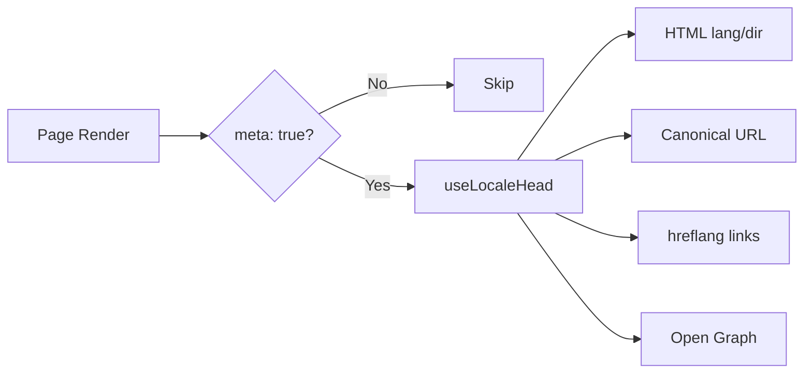

# 🌐 Guia de SEO para Nuxt I18n Micro

## 📖 Introdução

Um SEO (Search Engine Optimization) eficaz é essencial para garantir que seu site multilíngue seja acessível e visível para usuários de todo o mundo por meio de mecanismos de busca. O `Nuxt I18n Micro` simplifica o processo de gerenciar SEO para sites multilíngues gerando automaticamente meta tags e atributos essenciais que informam aos mecanismos de busca sobre a estrutura e o conteúdo do seu site.

Este guia explica como o `Nuxt I18n Micro` lida com SEO para melhorar a visibilidade e a experiência do usuário sem exigir configuração adicional.

## ⚙️ Tratamento automático de SEO

### Fluxo de geração de meta de SEO



**Tags geradas:**

| Tag             | Exemplo                                                  |
| --------------- | -------------------------------------------------------- |
| Atributos HTML  | `<html lang="en" dir="ltr">`                             |
| Canonical       | `<link rel="canonical" href="...">`                      |
| hreflang        | `<link rel="alternate" hreflang="en" href="...">`        |
| x-default       | `<link rel="alternate" hreflang="x-default" href="...">` |
| Open Graph      | `<meta property="og:locale" content="en_US">`            |

#### `og` por locale (`og:locale` vs BCP 47)

`<html lang>` e `hreflang` usam **BCP 47** via `locale.iso` (ex.: `ar-AE`).  
Open Graph exige **`language_TERRITORY`** com **underscore** (`ar_AE`), conforme o [protocolo OG](https://ogp.me/).

Por padrão, `og:locale` é derivado de `iso` quando o mapeamento é inequívoco (`en-US` → `en_US`).  
Defina uma string **`og`** explícita quando precisar de um valor personalizado (ex.: `zh-Hans` → `zh_CN`).  
Se nem `og` nem um `iso` conversível estiver disponível, tags `og:locale` não são geradas. Em desenvolvimento você recebe um aviso no console (respeita `missingWarn`).

```typescript
i18n: {
  meta: true,
  locales: [
    { code: 'ar', iso: 'ar-AE', og: 'ar_AE', dir: 'rtl' },
    { code: 'en', iso: 'en-US' }, // og:locale → en_US
    { code: 'zh', iso: 'zh-Hans', og: 'zh_CN' }, // script tags need explicit og
  ],
}
```

### 🔑 Principais recursos de SEO

Quando a opção `meta` está habilitada no `Nuxt I18n Micro`, o módulo gerencia automaticamente os seguintes aspectos de SEO:

1. **🌍 Atributos de idioma e direção**:
   - O módulo define os atributos `lang` e `dir` na tag `<html>` de acordo com o locale atual e a direção do texto (ex.: `ltr` para inglês ou `rtl` para árabe).

2. **🔗 URLs canônicas**:
   - O módulo gera um link canônico (`<link rel="canonical">`) para cada página, garantindo que os mecanismos de busca reconheçam a versão principal do conteúdo.

3. **🌐 Links de idioma alternativo (`hreflang`)**:
   - O módulo gera automaticamente tags `<link rel="alternate" hreflang="">` para todos os locales disponíveis. Isso ajuda os mecanismos de busca a entender quais versões de idioma do seu conteúdo estão disponíveis, melhorando a experiência para audiências globais.
   - Cada locale emite **uma** tag: `hreflang = iso || code`. Quando `iso` é definido, o `code` de roteamento nunca é usado como `hreflang` (então chaves de mercado como `mx` não se tornam tags de idioma inválidas).
   - `hreflangBaseLanguage: true` opcional também emite uma tag de idioma puro derivada de `iso` (ex.: `es-ES` → `es`), reivindicada pelo primeiro locale regional em `locales`.

4. **🌏 Hreflang `x-default`**:
   - O módulo gera automaticamente uma tag `<link rel="alternate" hreflang="x-default">` apontando para a URL do locale padrão. Isso indica aos mecanismos de busca qual URL exibir aos usuários cujo idioma não corresponde a nenhum dos locales definidos. Nenhuma configuração adicional é necessária. Funciona automaticamente quando `meta: true` está definido.

5. **🔖 Metadados Open Graph**:
   - O módulo gera meta tags Open Graph (`og:locale`, `og:url`, etc.) para cada locale, o que é particularmente útil para compartilhamento em redes sociais e indexação em mecanismos de busca.

### 🛠️ Configuração

Para habilitar esses recursos de SEO, garanta que a opção `meta` esteja definida como `true` no seu arquivo `nuxt.config.ts`:

```typescript
export default defineNuxtConfig({
  modules: ['nuxt-i18n-micro'],
  i18n: {
    locales: [
      { code: 'en', iso: 'en-US', dir: 'ltr' },
      { code: 'fr', iso: 'fr-FR', dir: 'ltr' },
      { code: 'ar', iso: 'ar-SA', dir: 'rtl' },
    ],
    defaultLocale: 'en',
    translationDir: 'locales',
    meta: true, // Enables automatic SEO management
  },
})
```

### 🌍 `metaBaseUrl` dinâmico para deploys multi-domínio

Quando `metaBaseUrl` não está definido, URLs de SEO absolutas são resolvidas nesta ordem (#240):

1. `site.url` de [`nuxt-site-config`](https://nuxtseo.com/docs/site-config) (se esse módulo estiver presente, ex.: via `@nuxtjs/seo`)
2. Caso contrário, o hostname da requisição atual (`useRequestURL()` / `window.location.origin`)

O fallback de origem da requisição respeita cabeçalhos de reverse-proxy (`X-Forwarded-Host`, `X-Forwarded-Proto`), então funciona corretamente atrás de nginx, Cloudflare, AWS ALB e proxies similares.

Isso significa que apps já definindo `site.url` para sitemap / robots / schema.org **não** precisam de uma segunda declaração `metaBaseUrl`:

```typescript
export default defineNuxtConfig({
  site: {
    url: process.env.NUXT_SITE_URL, // also used by micro for canonical / og:url / hreflang
  },
  i18n: {
    meta: true,
    // metaBaseUrl omitted — picks up site.url, then request origin
  },
})
```

Sem `site.url`, uma única instância de aplicação ainda pode servir **múltiplos domínios** com tags SEO corretas para cada um via origem da requisição:

```typescript
export default defineNuxtConfig({
  i18n: {
    meta: true,
    // metaBaseUrl is undefined by default — resolved dynamically from the request
  },
})
```

Por exemplo, uma requisição a `https://site-a.com/en/about` produzirá:

```html
<link rel="canonical" href="https://site-a.com/en/about" /> <meta property="og:url" content="https://site-a.com/en/about" />
```

Enquanto o mesmo app servindo `https://site-b.com/en/about` produzirá:

```html
<link rel="canonical" href="https://site-b.com/en/about" /> <meta property="og:url" content="https://site-b.com/en/about" />
```

Se você precisa de uma URL base fixa que sempre venha antes de `site.url`, passe uma string estática:

```typescript
metaBaseUrl: 'https://example.com'
```

### 🔍 Whitelist de query canonical

Por padrão, parâmetros de query são removidos de canonical e `og:url` para evitar conteúdo duplicado. Você pode listar parâmetros de query específicos que devem ser preservados:

```typescript
i18n: {
  canonicalQueryWhitelist: ['page', 'sort', 'filter', 'search', 'q', 'query', 'tag']
}
```

Apenas parâmetros listados em `canonicalQueryWhitelist` aparecerão nas URLs canônicas. Todos os outros parâmetros de query (ex.: tracking, session IDs) são removidos.

### 🚫 Desabilitando meta tags por página

Você pode desabilitar a geração de meta tags de SEO para páginas específicas usando `defineI18nRoute()`:

```vue
<script setup>
// Disable all SEO meta tags for this page
defineI18nRoute({
  disableMeta: true,
})
</script>
```

Você também pode desabilitar meta apenas para locales específicos:

```vue
<script setup>
// Disable meta tags only for English locale on this page
defineI18nRoute({
  disableMeta: ['en'],
})
</script>
```

Quando `disableMeta` está ativo, nenhuma tag `hreflang`, `canonical`, `og:locale`, `og:url` ou `x-default` é gerada para a página/locale afetados.

### 🔇 Locales desabilitados

Locales com `disabled: true` são automaticamente excluídos de toda geração de tags SEO. Nenhum `hreflang`, `og:locale:alternate` ou link alternativo é criado para eles:

```typescript
i18n: {
  locales: [
    { code: 'en', iso: 'en-US' },
    { code: 'fr', iso: 'fr-FR', disabled: true }, // excluded from SEO tags
  ]
}
```

### 🙈 Locales opt-out (`seo: false`)

Para locales que devem permanecer roteáveis e traduzidos, mas não devem aparecer em tags de descoberta entre locales, defina `seo: false`. Esses locales são omitidos dos alternates de `hreflang` e de `og:locale:alternate`. Se o seu locale **padrão** configurado tiver `seo: false`, o link `x-default` também não é emitido.

```typescript
i18n: {
  locales: [
    { code: 'en', iso: 'en-US' },
    { code: 'ru', iso: 'ru-RU', seo: false }, // internal / non-indexed locale
  ]
}
```

### 📌 Comportamento específico por estratégia

| Estratégia              | Links hreflang   | x-default              | canonical      | og:url |
| ----------------------- | ---------------- | ---------------------- | -------------- | ------ |
| `prefix`                | ✅ Todos os locales   | ✅ URL do locale padrão | ✅ URL atual   | ✅     |
| `prefix_except_default` | ✅ Todos os locales   | ✅ URL sem prefixo     | ✅ URL atual   | ✅     |
| `prefix_and_default`    | ✅ Todos os locales   | ✅ URL do locale padrão | ✅ URL atual   | ✅     |
| `no_prefix`             | ❌ Não gerado    | ❌ Não gerado          | ✅ URL atual   | ✅     |

Para a estratégia `no_prefix`, apenas `canonical`, `og:url`, `og:locale` e atributos HTML (`lang`, `dir`) são gerados. Links de idioma alternativo (`hreflang`) e `x-default` não são gerados porque não há URLs distintas por locale.

## Sobrescritas em nível de página (`useI18nHead`)

Para **artigos, guias ou qualquer conteúdo de CMS** onde nem todos os locales existem ou as URLs vêm de uma API, use [`useI18nHead`](/api/composables/use-i18n-head) na página em vez de um plugin de head i18n personalizado.

### Artigo com traduções parciais

```vue
<script setup lang="ts">
const article = await loadArticle()
// article.locales = { en: '...', de: '...' } — only translated locales

useI18nHead({
  meta: [{ property: 'og:title', content: article.title }],
  replace: {
    hreflang: Object.entries(article.locales).map(([locale, href]) => ({
      rel: 'alternate',
      hreflang: locale,
      href,
    })),
    ogAlternates: Object.keys(article.locales),
  },
})
</script>
```

### Slugs por locale com `$setI18nRouteParams`

Quando os slugs diferem por idioma, defina os params de rota primeiro e depois sobrescreva os alternates com URLs reais:

```vue
<script setup lang="ts">
const { $defineI18nRoute, $setI18nRouteParams } = useNuxtApp()
const { data: article } = await useFetch(`/api/articles/${slug}`)

$defineI18nRoute({
  localeRoutes: { en: '/blog/[slug]', de: '/de/blog/[slug]' },
})

$setI18nRouteParams({
  en: { slug: article.value.slugEn },
  de: { slug: article.value.slugDe },
})

useI18nHead({
  replace: {
    hreflang: ['en', 'de'].map((locale) => ({
      rel: 'alternate',
      hreflang: locale,
      href: article.value.urls[locale],
    })),
    ogAlternates: ['en', 'de'],
  },
})
</script>
```

### Origem HTTPS atrás de um proxy

Para URLs absolutas corretas em SSR sem um composable de origem personalizado:

```ts
i18n: {
  meta: true,
  metaBaseUrl: undefined,
  metaTrustForwardedHost: true,
  metaTrustForwardedProto: true,
}
```

Mais exemplos (sobrescrita de canonical, `x-default`, fetch reativo, helpers compartilhados): [composable useI18nHead](/api/composables/use-i18n-head).

### ⚠️ Trailing Slash

O módulo gera URLs canônicas e `hreflang` com base no path real de `useRoute().fullPath`. Se sua aplicação usa trailing slashes (por exemplo, via `router.options` do Nuxt), as URLs geradas refletirão isso. No entanto, `$switchLocalePath` pode normalizar paths e remover trailing slashes. Se a consistência de trailing slash é crítica para seu SEO, verifique se as URLs geradas correspondem à estrutura de URL da sua aplicação.

### 🎯 Benefícios

Ao habilitar a opção `meta`, você se beneficia de:

- **📈 Melhores rankings em mecanismos de busca**: os mecanismos podem indexar melhor seu site, entendendo os relacionamentos entre diferentes versões de idioma.
- **👥 Melhor experiência do usuário**: usuários são servidos com a versão de idioma correta com base em suas preferências, levando a uma experiência mais personalizada.
- **🔧 Menos configuração manual**: o módulo lida com tarefas de SEO automaticamente, liberando você da necessidade de adicionar manualmente meta tags e atributos relacionados a SEO.

## 🔗 Nuxt SEO (`@nuxtjs/seo`)

O [`@nuxtjs/seo`](https://nuxtseo.com/) empacota sitemap, robots, schema.org, imagens OG e módulos relacionados. Ele se integra ao **nuxt-i18n-micro** por meio do [`nuxt-site-config`](https://nuxtseo.com/docs/site-config/guides/i18n) (v4+).

### Requisitos

- **`@nuxtjs/seo` 3+** (as releases atuais usam `nuxt-site-config` 4+, que registra o plugin `nuxt-site-config:i18n` para micro)
- **`i18n.meta: true`** (recomendado. O micro fornece meta tags de head específicas de locale; o Nuxt SEO adiciona sitemap, schema.org, etc.)

### Ordem dos módulos

Liste **nuxt-i18n-micro antes de `@nuxtjs/seo`** para que a config do site possa ler seu setup de locale:

```typescript
export default defineNuxtConfig({
  modules: ['nuxt-i18n-micro', '@nuxtjs/seo'],
  site: {
    url: 'https://example.com',
    name: 'My Site',
  },
  i18n: {
    meta: true,
    defaultLocale: 'en',
    locales: [
      { code: 'en', iso: 'en-US' },
      { code: 'de', iso: 'de-DE' },
    ],
  },
})
```

### Nome e descrição do site traduzidos

O Nuxt Site Config lê chaves de tradução opcionais dos seus arquivos de locale:

```json
{
  "nuxtSiteConfig": {
    "name": "My Site",
    "description": "My site description"
  }
}
```

Valores por locale em `locales/en.json`, `locales/de.json`, etc. são pegos automaticamente.

### Resolução de problemas

Se você ver `Plugin nuxt-seo:defaults depends on nuxt-site-config:i18n but they are not registered`, faça upgrade do **`@nuxtjs/seo` para 3+** (consulte a [issue #133](https://github.com/s00d/nuxt-i18n-micro/issues/133)). O `nuxt-site-config` 3.x mais antigo só ligava i18n para `@nuxtjs/i18n`, não para o micro.

Mais: [Guia i18n do Sitemap](https://nuxtseo.com/docs/sitemap/guides/i18n), [Guia i18n do Site Config](https://nuxtseo.com/docs/site-config/guides/i18n).
