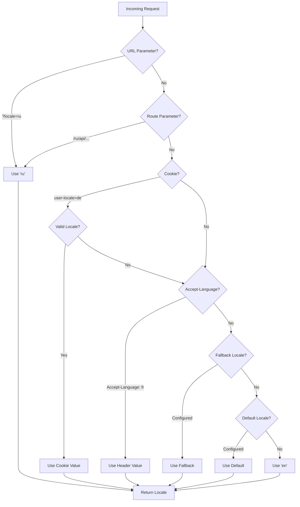

# 🌍 Traduções server-side e informações de locale no Nuxt I18n Micro

## 📖 Visão geral

O Nuxt I18n Micro oferece suporte a traduções e informações de locale no servidor, permitindo traduzir conteúdo e acessar detalhes de locale no servidor. Isso é particularmente útil para APIs ou aplicações renderizadas no servidor onde a localização é necessária antes de chegar ao cliente.

As traduções usam mensagens de locale definidas na configuração do Nuxt I18n e são resolvidas dinamicamente com base no locale detectado.

Por padrão (`translationPayloads.mode: 'premerged'`), os arquivos raiz são embutidos em cada payload de página em tempo de build como `\{page\}/\{locale\}/data.json`. O servidor carrega os mesmos arquivos pré-construídos que o cliente busca em `/\{apiBaseUrl\}/...`, então todas as chaves (compartilhadas e específicas de página) estão disponíveis nos handlers do servidor.

Com `translationPayloads.mode: 'source'`, arquivos-fonte compactos são mesclados em runtime quando `loadTranslationsFromServer()` (ou a rota `/_locales`) é chamada. No **Edge** via `serverAssets` do Nitro, no **Node** a partir da cópia pública opcional. Consulte o [Guia de desempenho — saída de payload serverless](/guides/performance#serverless-payload-output) e [Arquitetura de cache e armazenamento](/api/cache) para detalhes.

Para uma lista consolidada das APIs de runtime e de servidor, consulte a [Referência da API](/api/overview).

## 🛠️ Configurando o middleware server-side

Para habilitar traduções e informações de locale no servidor, use as funções de middleware fornecidas:

- `useTranslationServerMiddleware` para traduzir conteúdo
- `useLocaleServerMiddleware` para acessar informações de locale

Ambas as funções de middleware estão disponíveis automaticamente em todas as rotas do servidor.

A lógica de detecção de locale é compartilhada entre as duas funções de middleware por meio da função utilitária `detectCurrentLocale` para garantir consistência em todo o módulo.

## ✨ Usando traduções em handlers de servidor

Você pode traduzir conteúdo de forma perfeita em qualquer `eventHandler` usando o middleware de tradução.

### Exemplo: uso básico de tradução

```typescript
import { defineEventHandler } from 'h3'

export default defineEventHandler(async (event) => {
  const t = await useTranslationServerMiddleware(event)
  return {
    message: t('greeting'), // Returns the translated value for the key "greeting"
  }
})
```

Neste exemplo:

- O locale do usuário é detectado automaticamente a partir de parâmetros de query, cookies ou cabeçalhos.
- A função `t` obtém a tradução apropriada para o locale detectado.

## 🌍 Usando informações de locale em handlers de servidor

### Uso básico de informação de locale

```typescript
import { defineEventHandler } from 'h3'

export default defineEventHandler((event) => {
  const localeInfo = useLocaleServerMiddleware(event)

  return {
    success: true,
    data: localeInfo,
    timestamp: new Date().toISOString(),
  }
})
```

### Fornecendo parâmetros de locale personalizados

```typescript
import { defineEventHandler } from 'h3'

export default defineEventHandler((event) => {
  // Force specific locale with custom default
  const localeInfo = useLocaleServerMiddleware(event, 'en', 'ru')

  return {
    success: true,
    data: localeInfo,
    timestamp: new Date().toISOString(),
  }
})
```

### Estrutura da resposta

O middleware de locale retorna um objeto `LocaleInfo` com as seguintes propriedades:

```typescript
interface LocaleInfo {
  current: string // Current detected locale code
  default: string // Default locale code
  fallback: string // Fallback locale code
  available: string[] // Array of all available locale codes
  locale: Locale | null // Full locale configuration object
  isDefault: boolean // Whether current locale is the default
  isFallback: boolean // Whether current locale is the fallback
}
```

### Exemplo de resposta

```json
{
  "success": true,
  "data": {
    "current": "ru",
    "default": "en",
    "fallback": "en",
    "available": ["en", "ru", "de"],
    "locale": {
      "code": "ru",
      "iso": "ru-RU",
      "dir": "ltr",
      "displayName": "Русский"
    },
    "isDefault": false,
    "isFallback": false
  },
  "timestamp": "2024-01-15T10:30:00.000Z"
}
```

## 🌐 Fornecendo um locale personalizado

Se você precisa especificar um locale manualmente (ex.: para testes ou certas requisições), pode passá-lo ao middleware de tradução:

### Exemplo: locale personalizado

```typescript
import { defineEventHandler } from 'h3'

function detectLocale(event): string | null {
  const urlSearchParams = new URLSearchParams(event.node.req.url?.split('?')[1])
  const localeFromQuery = urlSearchParams.get('locale')
  if (localeFromQuery) return localeFromQuery

  return 'en'
}

export default defineEventHandler(async (event) => {
  const t = await useTranslationServerMiddleware(event, 'en', detectLocale(event)) // Force French local, en - default locale
  return {
    message: t('welcome'), // Returns the French translation for "welcome"
  }
})
```

## 📋 Lógica de detecção de locale

Ambas as funções de middleware determinam automaticamente o locale do usuário usando a seguinte ordem de prioridade:



1. **Parâmetros de URL**: `?locale=ru`
2. **Parâmetros de rota**: `/ru/api/endpoint`
3. **Cookies**: cookie `user-locale`
4. **Cabeçalhos HTTP**: cabeçalho `Accept-Language`
5. **Locale de fallback**: conforme configurado nas opções do módulo
6. **Locale padrão**: conforme configurado nas opções do módulo
7. **Fallback fixo**: `'en'`

> **Nota**: a lógica de detecção de locale é compartilhada entre `useLocaleServerMiddleware` e `useTranslationServerMiddleware` para garantir consistência no módulo.

## 📋 Exemplos avançados de uso

### Resposta condicional baseada no locale

```typescript
import { defineEventHandler } from 'h3'

export default defineEventHandler((event) => {
  const { current, isDefault, locale } = useLocaleServerMiddleware(event)

  // Return different content based on locale
  if (current === 'ru') {
    return {
      message: 'Привет, мир!',
      locale: current,
      isDefault,
    }
  }

  if (current === 'de') {
    return {
      message: 'Hallo, Welt!',
      locale: current,
      isDefault,
    }
  }

  // Default English response
  return {
    message: 'Hello, World!',
    locale: current,
    isDefault,
  }
})
```

### Detecção de locale personalizada

```typescript
import { defineEventHandler } from 'h3'

export default defineEventHandler((event) => {
  // Force German locale with English as fallback
  const { current, isDefault, locale } = useLocaleServerMiddleware(event, 'en', 'de')

  return {
    message: 'Hallo, Welt!',
    locale: current,
    isDefault: false, // Will be false since we forced German
  }
})
```

### API com locale e validação

```typescript
import { defineEventHandler, createError } from 'h3'

export default defineEventHandler((event) => {
  const { current, available, locale } = useLocaleServerMiddleware(event)

  // Validate if the detected locale is supported
  if (!available.includes(current)) {
    throw createError({
      statusCode: 400,
      statusMessage: `Unsupported locale: ${current}. Available locales: ${available.join(', ')}`,
    })
  }

  // Return locale-specific configuration
  return {
    locale: current,
    direction: locale?.dir || 'ltr',
    displayName: locale?.displayName || current,
    availableLocales: available,
  }
})
```

### Integração com o middleware de tradução

Você pode combinar informações de locale com o middleware de tradução para internacionalização abrangente:

```typescript
import { defineEventHandler } from 'h3'

export default defineEventHandler(async (event) => {
  const localeInfo = useLocaleServerMiddleware(event)
  const t = await useTranslationServerMiddleware(event)

  return {
    locale: localeInfo.current,
    message: t('welcome_message'),
    availableLocales: localeInfo.available,
    isDefault: localeInfo.isDefault,
  }
})
```

## 📝 Boas práticas

1. **Sempre valide os locales**: verifique se o locale detectado está na sua lista de locales disponíveis
2. **Use lógica de fallback**: forneça padrões sensatos quando a detecção de locale falhar
3. **Cachear informações de locale**: para aplicações críticas em desempenho, considere cachear resultados de detecção
4. **Lide com edge cases**: considere locales não suportados e forneça respostas de erro apropriadas
5. **Combine com traduções**: use informações de locale junto com o middleware de tradução para suporte i18n completo

## 🚀 Considerações de desempenho

- Ambas as funções de middleware são leves e projetadas para execução rápida
- A detecção de locale usa cadeias de fallback eficientes
- Nenhuma chamada de API externa é feita durante a detecção de locale
- Os resultados são computados de forma síncrona para desempenho ótimo
