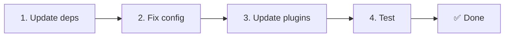

# 📦 Atualizando da v2.x para a v3.x

<Tip>
Consulte [Migração do nuxt-i18n](/migration/from-nuxtjs-i18n). Aquele guia cobre a migração a partir do ecossistema vue-i18n, não da v2 do nuxt-i18n-micro.
</Tip>

A v3.0.0 introduz mudanças arquiteturais fundamentais: pacotes de estratégia, um novo sistema de cache, gerenciamento centralizado de locale via `useI18nLocale()` e um pipeline de redirecionamento redesenhado. Esta seção cobre todas as breaking changes e como atualizar seu código.

## Passos de migração



## Resumo de breaking changes

- **Estado de locale** `useState` / `useCookie` manualmente → composable `useI18nLocale()`
- **Acesso à config** `useRuntimeConfig().public.i18nConfig` → `getI18nConfig()` de `#build/i18n.strategy.mjs`
- **Componente de redirecionamento** opção `fallbackRedirectComponentPath` → plugin de redirecionamento no servidor + middleware de rota no cliente (automático)
- **`includeDefaultLocaleRoute`** suportado (deprecated) → removido, use a opção `strategy`
- **`experimental.hmr`** dentro de `experimental` → opção no nível raiz
- **`previousPageFallback`** removido inteiramente (a estratégia de merge cumulativo trata disso automaticamente)
- **Cache** `useStorage('cache')` → singleton `TranslationStorage` (`Symbol.for` em `globalThis`)
- **Transferência SSR** config de runtime → payload do Nuxt (a v3 usava `useState`; os chunks agora ficam em `payload.data`, veja [Desempenho](/guides/performance#server-side-payload-transfer))
- **Classes de estratégia** internas → pacotes separados (`@i18n-micro/route-strategy`, `@i18n-micro/path-strategy`)

## Removido: `fallbackRedirectComponentPath`

A opção `fallbackRedirectComponentPath` e o componente de fallback `locale-redirect.vue` foram removidos. A lógica de redirecionamento agora é tratada por:

1. **Middleware de servidor** (`i18n.global.ts`) define `event.context.i18n.locale`
2. **Plugin de redirecionamento do servidor** (`06.redirect.ts`, apenas servidor) redirecionamentos 302 antes da renderização
3. **Middleware de rota do cliente** (`i18n-redirect.global.ts`) redirecionamentos SPA após hidratação

```diff
 i18n: {
   strategy: 'prefix_except_default',
-  fallbackRedirectComponentPath: '~/components/MyRedirect.vue',
 }
```

Se você tinha lógica de redirecionamento personalizada no componente de fallback, implemente-a em um plugin de servidor:

```ts
// plugins/i18n-loader.server.ts
export default defineNuxtPlugin({
  name: 'i18n-custom-redirect',
  enforce: 'pre',
  order: -10,
  setup() {
    const { setLocale } = useI18nLocale()
    // Your custom detection logic
    setLocale(detectedLocale)
  },
})
```

## Removido: `includeDefaultLocaleRoute`

Use a opção `strategy` em vez disso:

- `includeDefaultLocaleRoute: true` → `strategy: 'prefix'`
- `includeDefaultLocaleRoute: false` → `strategy: 'prefix_except_default'` (o padrão)

```diff
 i18n: {
-  includeDefaultLocaleRoute: true,
+  strategy: 'prefix',
 }
```

## Acesso à config: `getI18nConfig()` substitui `useRuntimeConfig`

```diff
- const config = useRuntimeConfig()
- const cookieName = config.public.i18nConfig?.localeCookie || 'user-locale'
+ import { getI18nConfig } from '#build/i18n.strategy.mjs'
+ const { localeCookie: configCookie } = getI18nConfig()
+ const cookieName = configCookie ?? 'user-locale'
```

## Gerenciamento de locale: `useI18nLocale()` substitui estado manual

Na v2 você talvez tenha usado `useState('i18n-locale')` ou `useCookie('user-locale')` diretamente. Na v3, use o composable centralizado `useI18nLocale()`:

```diff
- const locale = useState('i18n-locale')
- const cookie = useCookie('user-locale')
- locale.value = 'fr'
- cookie.value = 'fr'
+ const { setLocale } = useI18nLocale()
+ setLocale('fr') // Updates both state and cookie atomically
```

Consulte [Detecção de idioma personalizada](/guides/custom-language-detection) para exemplos detalhados.

## Opções experimentais movidas / removidas

`hmr` foi movido de `experimental` para o nível raiz. `previousPageFallback` foi removido inteiramente. O módulo agora usa uma estratégia de deep merge cumulativa (profundidade de 2 níveis) que automaticamente preserva as traduções da página anterior durante as animações de transição, mesmo quando as páginas compartilham chaves aninhadas sobrepostas. Após a animação de transição terminar, o hook `page:transition:finish` limpa as chaves da página antiga da memória.

```diff
 i18n: {
-  experimental: {
-    hmr: true,
-    previousPageFallback: true
-  }
+  hmr: true,
+  // previousPageFallback removed — handled automatically
 }
```

## Arquitetura de redirecionamento (v3)

Os redirecionamentos agora são tratados automaticamente por dois componentes:

1. **Lado servidor** (`06.redirect.ts`, apenas servidor): executa durante o SSR, emite redirecionamentos 302 antes de qualquer renderização de página. Sem "flash de erro".
2. **Lado cliente** (`i18n-redirect.global.ts`): middleware de rota global na navegação SPA; preserva query string e hash.

Prioridade de locale para redirecionamentos:

1. `useState('i18n-locale')` definido via `useI18nLocale().setLocale()`
2. Cookie se `localeCookie` estiver configurado
3. Cabeçalho `Accept-Language` se `autoDetectLanguage: true`
4. `defaultLocale` fallback

Nenhuma mudança de código é necessária para setups padrão.

<Warning>
Para as estratégias `prefix` e `prefix_except_default` com `redirects: true`, defina `localeCookie: 'user-locale'` para habilitar a persistência do locale entre recargas de página. Sem isso, os redirecionamentos usam apenas `Accept-Language` ou `defaultLocale`.
</Warning>

## TypeScript: tipos internos do módulo (opcional)

Se você encontrar erros de tipo relacionados a imports internos como `#i18n-internal/plural`, `#i18n-internal/strategy` ou `#i18n-internal/config`, adicione a seção `imports` ao `package.json` do seu projeto:

```json
{
  "imports": {
    "#i18n-internal/plural": "nuxt-i18n-micro/internals",
    "#i18n-internal/strategy": "nuxt-i18n-micro/internals",
    "#i18n-internal/config": "nuxt-i18n-micro/internals"
  }
}
```
