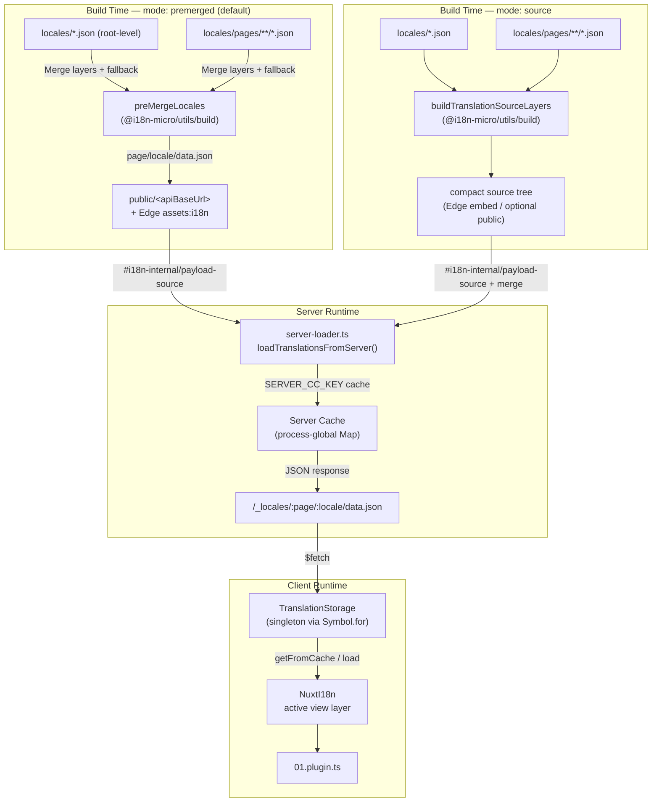

# 🗄️ Arquitetura de cache e armazenamento de traduções

## 📖 Visão geral

O Nuxt I18n Micro v3 utiliza uma arquitetura de cache multicamada para as traduções. O carregamento de payloads depende de `translationPayloads.mode`:

- **`premerged`** (predefinição) — os ficheiros raiz, de página, de fallback e de camadas são fundidos em tempo de build por `@i18n-micro/utils/build` em `\{page\}/\{locale\}/data.json`
- **`source`** — os ficheiros de origem compactos são mantidos para fusão em runtime por `@i18n-micro/utils/source-loader` e `@i18n-micro/utils/merge-source` (o Edge integra-os nos `serverAssets` do Nitro; o Node lê-os a partir de `public/` quando copiados)

Esta página descreve como funciona a cache incorporada e como estendê-la para casos de utilização personalizados (ferramentas de administração, APIs externas, invalidação de cache).

## 📊 Visão geral da arquitetura

### Fluxo de dados



## 🧱 Componentes principais

### 1. `TranslationStorage` (cliente + servidor)

**Ficheiro**: `src/runtime/utils/storage.ts`

Uma classe singleton que fornece armazenamento unificado de traduções tanto para o cliente como para o servidor. Utiliza `Symbol.for('__NUXT_I18N_STORAGE_CACHE__')` em `globalThis` para garantir que existe apenas uma instância, mesmo quando vários bundles são carregados.

**Métodos principais:**

| Método                              | Descrição                                                              |
| ----------------------------------- | ---------------------------------------------------------------------- |
| `getFromCache(locale, routeName?)`  | Verificação síncrona: devolve dados em memória em cache ou `null`      |
| `load(locale, routeName?, options)` | Carregamento assíncrono com cache: verifica primeiro a cache, depois usa `$fetch` |
| `clear()`                           | Limpa toda a cache                                                     |

**Formato da chave de cache**: `\{locale\}:\{routeName\}` (por exemplo, `en:index`, `fr:about`)

```typescript
import { translationStorage } from '../utils/storage'

// Synchronous cache check
const cached = translationStorage.getFromCache('en', 'index')

// Async load (with automatic caching)
const result = await translationStorage.load('en', 'index', {
  apiBaseUrl: '_locales',
  baseURL: '/',
  dateBuild: '2024-01-01',
})
// result.data — merged translations
// result.cacheKey — cache key used
```

### ⚙️ Invalidação determinística de cache (`i18n.dateBuild`)

Por predefinição, este módulo gera `dateBuild` em tempo de build usando `Date.now()`. Este valor é depois incorporado no `#build/i18n.strategy.mjs` gerado e utilizado como parâmetro de consulta (`?v=...`) para invalidar caches de fetch de traduções após rebuilds.

Se precisar de builds reproduzíveis (por exemplo, para melhorar as taxas de acerto de cache de chunks em implementações rolantes), defina um valor estável em `nuxt.config`:

```ts
export default defineNuxtConfig({
  i18n: {
    // Any stable string/number (git SHA, CI build number, release tag, etc.)
    dateBuild: process.env.GIT_SHA ?? 'local-dev',
  },
})
```

### 2. `loadTranslationsFromServer()` (apenas servidor)

**Ficheiro**: `src/runtime/server/utils/server-loader.ts`

Carrega as traduções para um par locale/página e coloca em cache o resultado fundido num mapa `CacheControl` global do processo, com chave `@i18n-micro/hmr/cache-keys` (`SERVER_CC_KEY`).

Comportamento: o SSR carrega a partir de `#i18n-internal/payload-source` — **Node** utiliza `readFile` em `public/<apiBaseUrl>` (`\{page\}/\{locale\}/data.json` no modo premerged), **Edge** utiliza `assets:i18n`. O modo `premerged` lê um único ficheiro; o modo `source` funde raiz/página/fallback via `@i18n-micro/utils/source-loader`.

```typescript
import { loadTranslationsFromServer } from '../server/utils/server-loader'

// Returns { data: Translations, json: string }
const { data, json } = await loadTranslationsFromServer('en', 'index')
```

### 3. Carregamento no cliente (sem incorporação em HTML)

Os dicionários **não** são gravados em `nuxtApp.payload`. O servidor mantém-nos em memória para a renderização SSR; o plugin do cliente aguarda `switchContext`, que carrega `/\{apiBaseUrl\}/:page/:locale/data.json` (a mesma postura predefinida do `@nuxtjs/i18n` com `experimental.preload: false`).

`NuxtI18n` mantém o dicionário da camada de visualização ativa usado por `$t()` e `$has()`. `NuxtTranslationLoader` alterna o contexto de locale/rota e funde os chunks nessa camada.

### 4. Rota da API do servidor

**Rota**: `/_locales/\{page\}/\{locale\}/data.json`

**Ficheiro**: `src/runtime/server/routes/i18n.ts`

Esta rota Nitro serve as traduções fundidas para o modo de payload ativo. Chama `loadTranslationsFromServer()` e devolve o resultado como JSON.

Em produção define também:

```http
Cache-Control: public, max-age={httpCacheDuration}, immutable
```

O valor predefinido de `httpCacheDuration` é `31536000` (1 ano). Isto é seguro porque os clientes pedem os payloads com o cache-busting `?v=\{dateBuild\}`. Defina `httpCacheDuration: 0` para omitir o cabeçalho. O cabeçalho não é aplicado em desenvolvimento.

## 📥 Extensão: carregamento personalizado de traduções

### Ler da cache (rota do servidor)

```ts
// server/api/i18n/load-cache.[post].ts
import { defineEventHandler, readBody } from 'h3'
import { loadTranslationsFromServer } from '#imports'

export default defineEventHandler(async (event) => {
  const { page, locale } = await readBody<{ page: string; locale: string }>(event)
  const { data } = await loadTranslationsFromServer(locale, page)
  return { locale, page, data }
})
```

### Atualizar traduções (ficheiro + invalidar cache)

```ts
// server/api/i18n/update.[post].ts
import { defineEventHandler, readBody, createError } from 'h3'
import { join } from 'node:path'
import { readFile, writeFile } from 'node:fs/promises'
import { deepMergeTranslations } from '@i18n-micro/utils/deep-merge'

export default defineEventHandler(async (event) => {
  const { path, updates } = await readBody<{ path: string; updates: Record<string, unknown> }>(event)

  if (!path || !updates) {
    throw createError({ statusCode: 400, statusMessage: 'Missing path or updates' })
  }

  const fullPath = join('locales', path)
  let existing: Record<string, unknown> = {}

  try {
    const content = await readFile(fullPath, 'utf-8')
    existing = JSON.parse(content) as Record<string, unknown>
  } catch {
    // File does not exist — create new
  }

  const merged = deepMergeTranslations(existing, updates)
  await writeFile(fullPath, JSON.stringify(merged, null, 2), 'utf-8')

  return { success: true, path, updated: merged }
})
```


## 🧹 Limpar a cache

### Limpar cache programaticamente (cliente)

Utilize o método incorporado `$clearCache`:

```vue
<script setup>
const { $clearCache } = useNuxtApp()

// Clears both TranslationStorage and plugin-level cache
$clearCache()
</script>
```

### Comportamento da cache do servidor

A cache do lado do servidor (`loadTranslationsFromServer`) é global ao processo e persiste até:

- O processo do servidor reiniciar
- Uma nova implementação ser detetada (valor `dateBuild` diferente)

Em ambientes serverless, cada cold start tem uma cache nova.

## ⚙️ Configuração para serverless

Em ambientes serverless (Cloudflare Workers, AWS Lambda), a cache incorporada usa objetos `Map` em memória. Não é necessária qualquer configuração de armazenamento externo para a própria cache de traduções.

No entanto, o armazenamento do Nitro para os ficheiros de tradução de origem poderá precisar de configuração:

```ts
export default defineNuxtConfig({
  nitro: {
    storage: {
      // Only needed if default file-system storage is unavailable
      'assets:server': {
        driver: 'cloudflare-kv-binding',
        binding: 'MY_KV_NAMESPACE',
      },
    },
  },
})
```

## 💡 Principais diferenças em relação à v2

| Aspeto           | v2                            | v3                                                                       |
| ---------------- | ----------------------------- | ------------------------------------------------------------------------ |
| Cache do cliente | `useStorage('cache')`         | Singleton `TranslationStorage` (Symbol.for em globalThis)                |
| Transferência SSR | Configuração de runtime      | Chunks completos via `payload.data` (a v3.0 usava `useState`)            |
| Cache do servidor | Armazenamento de cache do Nitro | `Map` global ao processo via `Symbol.for`                              |
| Lógica de fusão  | No cliente                    | Em tempo de build (`premerged`) ou em runtime (`source`) via `@i18n-micro/utils/*` |
| Formato da chave de cache | `i18n:merged:\{page\}:\{locale\}` | `\{locale\}:\{routeName\}`                                       |

## 📚 Relacionado

- [Guia de desempenho](/guides/performance) — Como a cache afeta o desempenho
- [Traduções no lado do servidor](/guides/server-side-translations) — Utilizar traduções em rotas de servidor
- [Implementação em Firebase](/guides/firebase) — Considerações de cache específicas da implementação
