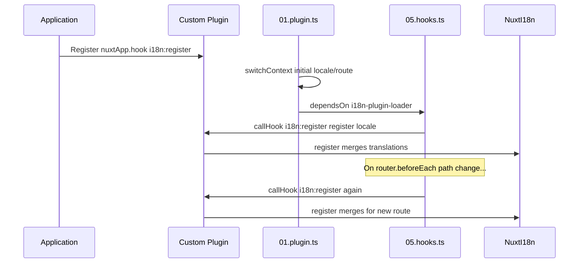

# 📢 Eventos

## 🔄 `i18n:register`

O evento `i18n:register` no `Nuxt I18n Micro` permite a adição dinâmica de traduções ao contexto i18n da sua aplicação, tornando o processo de internacionalização transparente e flexível. Este evento permite integrar novas traduções conforme necessário, ampliando as capacidades de localização da aplicação.

### 📝 Detalhes do evento

- **Objetivo**:
  - Permite a incorporação dinâmica de traduções adicionais no conjunto existente para um locale específico.

- **Payload**:
  - **`register`**:
    - Uma função fornecida pelo evento que recebe dois argumentos:
      - **`translations`** (`Translations`):
        - Um objeto que contém pares chave-valor representando traduções, organizados de acordo com a interface `Translations`.
      - **`locale`** (`string`, opcional):
        - O código de locale (p. ex., `'en'`, `'ru'`) para o qual as traduções são registadas. Assume por predefinição o locale fornecido pelo evento se não for indicado.

- **Comportamento**:
  - Quando é acionada, a função `register` funde as novas traduções no contexto atual do locale especificado, atualizando as traduções disponíveis em toda a aplicação.

### ⏱️ Quando é disparado

O plugin de hooks do módulo (`05.hooks.ts`, `dependsOn: ['i18n-plugin-loader']`) invoca `nuxtApp.callHook('i18n:register', …)`:

1. **Uma vez no arranque** — depois de o plugin i18n principal (`01.plugin.ts`) ter carregado as traduções para a rota inicial.
2. **Em cada navegação** — em `router.beforeEach` quando o caminho muda, ou em cada navegação quando `strategy: 'no_prefix'`.

Registe o seu listener num plugin Nuxt normal com `nuxtApp.hook('i18n:register', …)`. O plugin de hooks corre depois de o loader estar pronto, portanto o seu callback é invocado quando as traduções precisam de ser estendidas.

Defina `hooks: false` em `nuxt.config` para desativar as chamadas automáticas a `i18n:register` (consulte [Configuração — `hooks`](/guides/configuration#hooks)).

### 💡 Exemplo de utilização

O exemplo seguinte demonstra como utilizar o evento `i18n:register` para adicionar dinamicamente traduções:

```typescript
nuxt.hook('i18n:register', async (register: (translations: unknown, locale?: string) => void, locale: string) => {
  register(
    {
      greeting: 'Hello',
      farewell: 'Goodbye',
    },
    locale,
  )
})
```

### 🛠️ Explicação



- **Acionar o evento**:
  - O plugin de hooks (`05.hooks.ts`) dispara `i18n:register` depois de o loader principal estar pronto e em navegações relevantes.

- **Adicionar traduções**:
  - O exemplo regista traduções em inglês para `"greeting"` e `"farewell"`.
  - A função `register` funde estas traduções no conjunto existente para o locale fornecido.

### 🔗 Principais benefícios

- **Atualizações dinâmicas**:
  - Atualize ou adicione facilmente traduções sem ter de reimplementar toda a aplicação.

- **Flexibilidade de localização**:
  - Suporta ajustes de localização em tempo real com base nas necessidades do utilizador ou da aplicação.

Ao utilizar o evento `i18n:register`, pode garantir que a estratégia de localização da sua aplicação se mantém flexível e adaptável, melhorando a experiência global do utilizador.

---

## 🛠️ Modificar traduções com plugins

Para modificar traduções dinamicamente na sua aplicação Nuxt, é recomendável utilizar plugins. Os plugins fornecem uma forma estruturada de gerir atualizações de localização, especialmente ao trabalhar com módulos ou ficheiros de tradução externos.

### **Registar o plugin**

Se estiver a utilizar um módulo, registe o plugin onde as modificações de tradução ocorrerão, adicionando-o à configuração do seu módulo:

```javascript
addPlugin({
  src: resolve('./plugins/extend_locales'),
})
```

Isto regista o plugin localizado em `./plugins/extend_locales`, que tratará do carregamento e registo dinâmico das traduções.

### **Implementar o plugin**

No plugin, pode gerir as modificações de locale. Segue-se um exemplo de implementação num plugin Nuxt:

```typescript
import { defineNuxtPlugin } from '#app'

export default defineNuxtPlugin(async (nuxtApp) => {
  // Function to load translations from JSON files and register them
  const loadTranslations = async (lang: string) => {
    try {
      const translations = await import(`../locales/${lang}.json`)
      return translations.default
    } catch (error) {
      console.error(`Error loading translations for language: ${lang}`, error)
      return null
    }
  }

  // Hook into the 'i18n:register' event to dynamically add translations
  // eslint-disable-next-line @typescript-eslint/ban-ts-comment
  // @ts-expect-error
  nuxtApp.hook('i18n:register', async (register: (translations: unknown, locale?: string) => void, locale: string) => {
    const translations = await loadTranslations(locale)
    if (translations) {
      register(translations, locale)
    }
  })
})
```

### 📝 Explicação detalhada

1. **Carregamento de traduções**:

- A função `loadTranslations` importa dinamicamente ficheiros de tradução com base no locale. Os ficheiros devem estar no diretório `locales` e ser nomeados de acordo com os códigos de locale (p. ex., `en.json`, `de.json`).
- Em caso de sucesso, as traduções são devolvidas; caso contrário, é registado um erro.

2. **Registo de traduções**:

- O plugin liga-se ao evento `i18n:register` através de `nuxtApp.hook`.
- Quando o evento é disparado, a função `register` é chamada com as traduções carregadas e o locale correspondente.
- Isto funde as novas traduções no contexto i18n do locale especificado, atualizando as traduções disponíveis em toda a aplicação.

### 🔗 Benefícios de utilizar plugins para modificar traduções

- **Separação de responsabilidades**:
  - Isola a lógica de localização do código principal da aplicação, facilitando a gestão e a manutenção.

- **Dinâmico e escalável**:
  - Ao carregar e registar traduções dinamicamente, pode atualizar conteúdo sem exigir uma reimplementação completa da aplicação, o que é especialmente útil em aplicações com conteúdo frequentemente atualizado ou multilingue.

- **Maior flexibilidade de localização**:
  - Os plugins permitem-lhe modificar ou estender traduções conforme necessário, proporcionando uma estratégia de localização mais adaptável e responsiva às preferências dos utilizadores ou aos requisitos de negócio.

Ao adotar esta abordagem, pode expandir e modificar eficientemente a localização da sua aplicação através de um processo estruturado e fácil de manter com recurso a plugins, mantendo a internacionalização adaptável a necessidades em mudança e melhorando a experiência global do utilizador.
