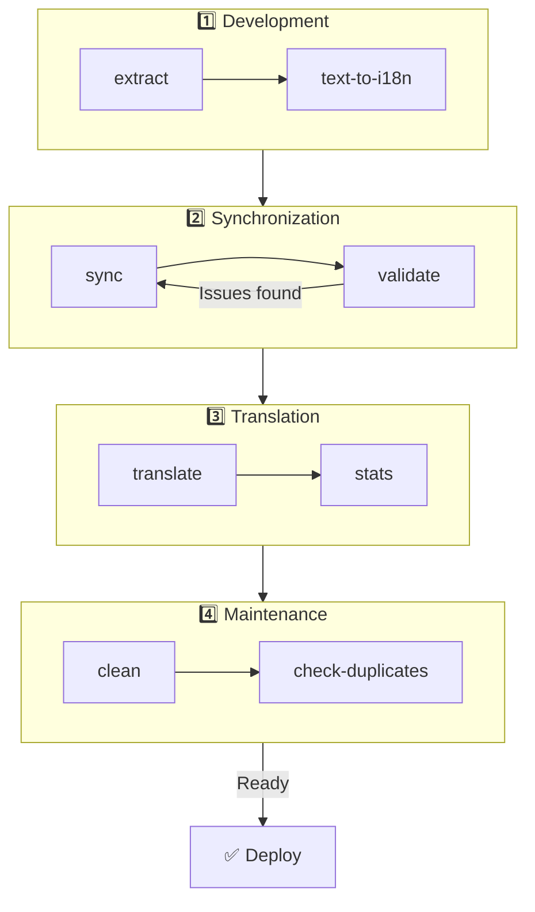

# 🌐 Guia do nuxt-i18n-micro-cli

## 📖 Introdução

O `nuxt-i18n-micro-cli` é uma ferramenta de linha de comandos concebida para agilizar o processo de localização e internacionalização em projetos Nuxt.js que utilizam o módulo `nuxt-i18n-micro` (Nuxt I18n Micro). Fornece utilitários para extrair chaves de tradução do seu código, gerir ficheiros de tradução, sincronizar traduções entre locales e automatizar o processo de tradução com recurso a serviços de tradução externos.

Este guia acompanha-o na instalação, configuração e utilização do `nuxt-i18n-micro-cli` para gerir eficazmente as traduções do seu projeto. Pacote em [npmjs.com](https://www.npmjs.com/package/nuxt-i18n-micro-cli).

## 🔧 Instalação e configuração

### 📦 Instalar o nuxt-i18n-micro-cli

Instale globalmente ou como dependência de desenvolvimento no seu projeto Nuxt (recomendado para CI):

```bash
# global
npm install -g nuxt-i18n-micro-cli

# or per project
pnpm add -D nuxt-i18n-micro-cli
pnpm exec i18n-micro text-to-i18n --dryRun
```

Utilize o **`nuxt-i18n-micro-cli` ≥ 2.1.1** se o seu projeto usar o diretório `app/` do Nuxt 4 (`app/pages`, `app/components`, …). As versões mais antigas do CLI apenas analisavam a pasta `pages/` na raiz do projeto.

### 🛠 Inicializar no seu projeto

Depois de instalar, pode executar comandos `i18n-micro` no diretório do seu projeto Nuxt.js.

Garanta que o seu projeto está configurado com o `nuxt-i18n-micro` e tem a configuração necessária em `nuxt.config.ts` (ou `nuxt.config.js`).

### 📄 Argumentos comuns

- `--cwd`: especifica o diretório de trabalho atual (predefinição: `.`).
- `--logLevel`: define o nível de registo (`silent`, `info`, `verbose`).
- `--translationDir`: diretório que contém os ficheiros JSON de tradução (predefinição: `locales`).

## 📊 Visão geral do fluxo de trabalho do CLI



### Passos do fluxo de trabalho

| Fase           | Comandos                    | Objetivo                           |
| --------------- | --------------------------- | --------------------------------- |
| **Desenvolvimento** | `extract`, `text-to-i18n`   | Encontrar e extrair chaves de tradução |
| **Sincronização**        | `sync`, `validate`          | Garantir que todos os locales têm as mesmas chaves |
| **Tradução**   | `translate`, `stats`        | Traduzir automaticamente chaves em falta       |
| **Manutenção** | `clean`, `check-duplicates` | Manter as traduções organizadas            |

## 📋 Comandos

### 🔄 Comando `text-to-i18n`

Pacote CLI: [`nuxt-i18n-micro-cli`](https://www.npmjs.com/package/nuxt-i18n-micro-cli)

**Descrição**: analisa ficheiros Vue/TS/JS à procura de strings visíveis ao utilizador em modo hardcoded, substitui-as por `$t('...')` e funde as novas chaves no seu ficheiro JSON de tradução. Execute a partir da **raiz do projeto Nuxt** (onde reside o `nuxt.config`).

**Utilização**:

```bash
i18n-micro text-to-i18n [options]
```

**Opções**:

| Opção                  | Predefinição           | Descrição                                                           |
| ----------------------- | ----------------- | --------------------------------------------------------------------- |
| `--translationFile`     | `locales/en.json` | Ficheiro JSON para novas chaves (relativo à raiz do projeto).                    |
| `--path`                | —                 | Processar apenas um ficheiro ou diretório (p. ex. `app/pages/about.vue`).      |
| `--context`             | —                 | Prefixo de chave (p. ex. `auth` → `auth.*`).                                  |
| `--dryRun`              | `false`           | Pré-visualizar sem escrever ficheiros.                                        |
| `--verbose`             | `false`           | Registo adicional.                                                        |
| `--interactive`         | `false`           | Confirmar ou editar cada chave antes de aplicar.                             |
| `--extractOnlyDirs`     | `plugins`         | Diretórios onde as chaves são extraídas mas os ficheiros de origem **não** são reescritos. |
| `--extractOnlyPatterns` | —                 | Padrões estilo glob apenas para extração (p. ex. `**/*.plugin.ts`).              |

**Exemplo**:

```bash
i18n-micro text-to-i18n --translationFile locales/en.json --context auth --dryRun
```

#### Que pastas são analisadas?

<Info>
A partir da versão **2.1.1** do CLI, o `text-to-i18n` analisa tanto as pastas raiz clássicas como as equivalentes em `app/*`. Execute o comando a partir da **raiz do projeto** — não faça `cd app`.
</Info>

Recolhe `*.vue`, `*.js` e `*.ts` em:

| Nuxt 3 (raiz do projeto) | Nuxt 4 (diretório `app/`) |
| --------------------- | ------------------------- |
| `pages/`              | `app/pages/`              |
| `components/`         | `app/components/`         |
| `plugins/`            | `app/plugins/`            |
| `layouts/`            | `app/layouts/`            |

Outras pastas (`server/`, `composables/`, `middleware/`, …) são ignoradas, a menos que utilize `--path`. Para Nuxt 4, execute a partir da raiz do projeto (não é preciso `cd app`). Faça corresponder `i18n.translationDir` em `--translationFile` se este não for `locales/`.

```bash
i18n-micro text-to-i18n --path app/pages
```

#### Como funciona

1. Recolhe ficheiros dos diretórios acima (ou de `--path`).
2. Substitui literais / texto de template por `$t('generated.key')` (`plugins/` é extract-only por predefinição).
3. Funde as novas chaves em `--translationFile` sem remover entradas existentes.

**Exemplo de transformações**:

Antes:

```vue
<template>
  <div>
    <h1>Welcome to our site</h1>
    <p>Please sign in to continue</p>
  </div>
</template>
```

Depois:

```vue
<template>
  <div>
    <h1>{{ $t('pages.home.welcome_to_our_site') }}</h1>
    <p>{{ $t('pages.home.please_sign_in') }}</p>
  </div>
</template>
```

**Boas práticas**: faça primeiro um dry run; faça commit antes de uma execução completa; alinhe `--translationFile` com `i18n.translationDir` em `nuxt.config`; mantenha `--extractOnlyDirs plugins` para o código de bootstrap.

**Limitações**: pacote npm separado (não vem com o módulo); não lê o `nuxt.config` automaticamente; produz `$t(...)`; strings dinâmicas complexas podem exigir antes `extract` / `search`.

### 📊 Comando `stats`

**Descrição**: o comando `stats` é utilizado para apresentar estatísticas de tradução para cada locale no seu projeto Nuxt.js. Ajuda-o a perceber o progresso das traduções, mostrando quantas chaves estão traduzidas em comparação com o total de chaves disponíveis.

**Utilização**:

```bash
i18n-micro stats [options]
```

**Opções**:

- `--full`: apresentar apenas estatísticas combinadas das traduções (predefinição: `false`).

**Exemplo**:

```bash
i18n-micro stats --full
```

### 🌍 Comando `translate`

**Descrição**: o comando `translate` traduz automaticamente as chaves em falta utilizando serviços de tradução externos. Este comando simplifica o processo de tradução ao tirar partido das APIs de serviços como Google Translate, DeepL e outros para preencher traduções em falta.

**Utilização**:

```bash
i18n-micro translate [options]
```

**Opções**:

- `--service`: serviço de tradução a utilizar (p. ex., `google`, `deepl`, `yandex`). Se não for indicado, o comando pede-lhe para selecionar um.
- `--token`: chave da API correspondente ao serviço de tradução escolhido. Se não for fornecido, ser-lhe-á pedido.
- `--options`: opções adicionais do serviço de tradução, fornecidas como pares chave:valor separados por vírgulas (p. ex., `model:gpt-3.5-turbo,max_tokens:1000`).
- `--replace`: traduzir todas as chaves, substituindo traduções existentes (predefinição: `false`).

**Exemplo**:

```bash
i18n-micro translate --service deepl --token YOUR_DEEPL_API_KEY
```

#### 🌐 Serviços de tradução suportados

O comando `translate` suporta vários serviços de tradução. Alguns dos serviços suportados são:

- **Google Translate** (`google`)
- **DeepL** (`deepl`)
- **Yandex Translate** (`yandex`)
- **OpenAI** (`openai`)
- **Azure Translator** (`azure`)
- **IBM Watson** (`ibm`)
- **Baidu Translate** (`baidu`)
- **LibreTranslate** (`libretranslate`)
- **MyMemory** (`mymemory`)
- **Lingva Translate** (`lingvatranslate`)
- **Papago** (`papago`)
- **Tencent Translate** (`tencent`)
- **Systran Translate** (`systran`)
- **Yandex Cloud Translate** (`yandexcloud`)
- **ModernMT** (`modernmt`)
- **Lilt** (`lilt`)
- **Unbabel** (`unbabel`)
- **Reverso Translate** (`reverso`)

#### ⚙️ Configuração de serviços

Alguns serviços requerem configurações específicas ou chaves de API. Ao utilizar o comando `translate`, pode indicar o serviço e fornecer o `--token` obrigatório (chave da API) e `--options` adicionais, se necessário.

Por exemplo:

```bash
i18n-micro translate --service openai --token YOUR_OPENAI_API_KEY --options openaiModel:gpt-3.5-turbo,max_tokens:1000
```

### 🛠️ Comando `extract`

**Descrição**: extrai chaves de tradução do seu código e organiza-as por âmbito.

**Utilização**:

```bash
i18n-micro extract [options]
```

**Opções**:

- `--prod, -p`: executar em modo de produção.

**Exemplo**:

```bash
i18n-micro extract
```

### 🔄 Comando `sync`

**Descrição**: sincroniza os ficheiros de tradução entre locales, garantindo que todos têm as mesmas chaves.

**Utilização**:

```bash
i18n-micro sync [options]
```

**Exemplo**:

```bash
i18n-micro sync
```

### ✅ Comando `validate`

**Descrição**: valida os ficheiros de tradução, verificando chaves em falta ou em excesso face ao locale de referência.

**Utilização**:

```bash
i18n-micro validate [options]
```

**Exemplo**:

```bash
i18n-micro validate
```

### 🧹 Comando `clean`

**Descrição**: remove chaves de tradução não utilizadas dos ficheiros de tradução.

**Utilização**:

```bash
i18n-micro clean [options]
```

**Exemplo**:

```bash
i18n-micro clean
```

### 📤 Comando `import`

**Descrição**: converte ficheiros PO de volta para o formato JSON e guarda-os no diretório de traduções.

**Utilização**:

```bash
i18n-micro import [options]
```

**Opções**:

- `--potsDir`: diretório que contém os ficheiros PO (predefinição: `pots`).

**Exemplo**:

```bash
i18n-micro import --potsDir pots
```

### 📥 Comando `export`

**Descrição**: exporta as traduções para ficheiros PO, para gestão externa das traduções.

**Utilização**:

```bash
i18n-micro export [options]
```

**Opções**:

- `--potsDir`: diretório onde guardar os ficheiros PO (predefinição: `pots`).

**Exemplo**:

```bash
i18n-micro export --potsDir pots
```

### 🗂️ Comando `export-csv`

**Descrição**: o comando `export-csv` exporta chaves e valores de tradução dos ficheiros JSON, incluindo os caminhos dos ficheiros, para um formato CSV. Este comando é útil para equipas que preferem trabalhar com dados de tradução em software de folha de cálculo.

**Utilização**:

```bash
i18n-micro export-csv [options]
```

**Opções**:

- `--csvDir`: diretório onde serão guardados os ficheiros CSV exportados.
- `--delimiter`: especifica um delimitador para o ficheiro CSV (predefinição: `,`).

**Exemplo**:

```bash
i18n-micro export-csv --csvDir csv_files
```

### 📑 Comando `import-csv`

**Descrição**: o comando `import-csv` importa dados de tradução de ficheiros CSV, atualizando os ficheiros JSON correspondentes. É útil para aplicar atualizações em massa de traduções a partir de folhas de cálculo.

**Utilização**:

```bash
i18n-micro import-csv [options]
```

**Opções**:

- `--csvDir`: diretório que contém os ficheiros CSV a importar.
- `--delimiter`: especifica um delimitador utilizado no ficheiro CSV (predefinição: `,`).

**Exemplo**:

```bash
i18n-micro import-csv --csvDir csv_files
```

### 🧾 Comando `diff`

**Descrição**: compara ficheiros de tradução entre o locale predefinido e outros locales dentro do mesmo diretório (incluindo subdiretórios). O comando identifica chaves em falta e os seus valores no locale predefinido em comparação com outros locales, facilitando o acompanhamento do progresso ou das discrepâncias.

**Utilização**:

```bash
i18n-micro diff [options]
```

**Exemplo**:

```bash
i18n-micro diff
```

### 🔍 Comando `check-duplicates`

**Descrição**: o comando `check-duplicates` procura valores de tradução duplicados dentro de cada locale, em todos os ficheiros de tradução, tanto ao nível da raiz como específicos por página. Garante que chaves diferentes dentro do mesmo idioma não partilham valores de tradução idênticos, ajudando a manter clareza e consistência nas suas traduções.

**Utilização**:

```bash
i18n-micro check-duplicates [options]
```

**Exemplo**:

```bash
i18n-micro check-duplicates
```

**Como funciona**:

- O comando verifica os ficheiros de tradução ao nível da raiz e os específicos por página, para cada locale.
- Se um valor de tradução aparecer em várias localizações (dentro das traduções raiz ou entre páginas diferentes), reporta os valores duplicados, juntamente com o ficheiro e a chave onde se encontram.
- Se não forem encontrados duplicados, o comando confirma que o locale está livre de valores de tradução duplicados.

Este comando ajuda a garantir que as chaves de tradução mantêm valores únicos, evitando repetições acidentais dentro do mesmo locale.

### 🔄 Comando `replace-values`

**Descrição**: o comando `replace-values` permite fazer substituições em massa de valores de tradução em todos os locales. Suporta substituições simples de texto e substituições avançadas com expressões regulares (regex). Também pode utilizar grupos de captura em padrões regex e referenciá-los na string de substituição, tornando-o ideal para cenários de substituição mais complexos.

**Utilização**:

```bash
i18n-micro replace-values [options]
```

**Opções**:

- `--search`: texto ou padrão regex a procurar nas traduções. Esta opção é obrigatória.
- `--replace`: texto de substituição para as traduções encontradas. Esta opção é obrigatória.
- `--useRegex`: ativar a pesquisa através de um padrão de expressão regular (predefinição: `false`).

**Exemplo 1**: substituição simples

Substituir a string "Hello" por "Hi" em todos os locales:

```bash
i18n-micro replace-values --search "Hello" --replace "Hi"
```

**Exemplo 2**: substituição com regex

Ativar a pesquisa por regex e substituir qualquer string que comece por "Hello" seguida de números (p. ex., "Hello123") por "Hi" em todos os locales:

```bash
i18n-micro replace-values --search "Hello\\d+" --replace "Hi" --useRegex
```

**Exemplo 3**: utilização de grupos de captura em regex

Utilize grupos de captura para inserir dinamicamente parte da string correspondente na substituição. Por exemplo, substituir "Hello [name]" por "Hi [name]" mantendo o nome intacto:

```bash
i18n-micro replace-values --search "Hello (\\w+)" --replace "Hi $1" --useRegex
```

Neste caso, `$1` refere-se ao primeiro grupo de captura, que corresponde à parte `[name]` a seguir a "Hello". A substituição preserva o nome da string original.

**Como funciona**:

- O comando analisa todos os ficheiros de tradução (globais e específicos por página).
- Quando é encontrada uma correspondência com base na string ou padrão regex de pesquisa, o texto correspondente é substituído pela substituição indicada.
- Ao utilizar regex, os grupos de captura podem ser usados na string de substituição, referenciando-os com `$1`, `$2`, etc.
- Todas as alterações são registadas, mostrando o caminho do ficheiro, a chave da tradução e o estado antes/depois do valor da tradução.

**Registo**:
Para cada substituição, o comando regista detalhes que incluem:

- Locale e caminho do ficheiro.
- A chave de tradução modificada.
- O valor antigo e o novo valor após a substituição.
- Ao utilizar regex com grupos de captura, os registos mostram as correspondências dos grupos e como foram substituídos.

Isto permite-lhe acompanhar exatamente onde e o que foi alterado durante a operação de substituição, fornecendo um histórico claro das modificações nos seus ficheiros de tradução.

## 🛠 Exemplos

- **Extrair traduções**:

  ```bash
  i18n-micro extract
  ```

- **Traduzir chaves em falta com o Google Translate**:

  ```bash
  i18n-micro translate --service google --token YOUR_GOOGLE_API_KEY
  ```

- **Traduzir todas as chaves, substituindo traduções existentes**:

  ```bash
  i18n-micro translate --service deepl --token YOUR_DEEPL_API_KEY --replace
  ```

- **Validar ficheiros de tradução**:

  ```bash
  i18n-micro validate
  ```

- **Limpar chaves de tradução não utilizadas**:

  ```bash
  i18n-micro clean
  ```

- **Sincronizar ficheiros de tradução**:

  ```bash
  i18n-micro sync
  ```

## ⚙️ Guia de configuração

O `nuxt-i18n-micro-cli` depende da configuração i18n do Nuxt.js em `nuxt.config.ts` (ou `nuxt.config.js`). Garanta que tem o módulo `nuxt-i18n-micro` instalado e configurado.

### 🔑 Exemplo de nuxt.config.js

```ts
export default defineNuxtConfig({
  modules: ['nuxt-i18n-micro'],
  i18n: {
    locales: [
      { code: 'en', iso: 'en-US' },
      { code: 'fr', iso: 'fr-FR' },
    ],
    defaultLocale: 'en',
    fallbackLocale: 'en',
    translationDir: 'locales', // or 'app/locales' for Nuxt 4 colocation
  },
})
```

Garanta que `translationDir` corresponde ao diretório utilizado pelo `nuxt-i18n-micro-cli` (a predefinição é `locales`).

## 📝 Boas práticas

### 🔑 Nomenclatura de chaves consistente

Garanta que as chaves de tradução são consistentes e descritivas para evitar confusão e duplicação.

### 🧹 Manutenção regular

Utilize o comando `clean` regularmente para remover chaves de tradução não utilizadas e manter os ficheiros de tradução limpos.

### 🛠 Automatize o fluxo de trabalho de tradução

Integre os comandos do `nuxt-i18n-micro-cli` no seu fluxo de trabalho de desenvolvimento ou no pipeline de CI/CD, para automatizar a extração, tradução, validação e sincronização dos ficheiros de tradução.

### 🛡️ Proteja as chaves de API

Ao utilizar serviços de tradução que exigem chaves de API, garanta que as suas chaves são mantidas em segurança e não são submetidas para sistemas de controlo de versões. Considere usar variáveis de ambiente ou soluções seguras de gestão de chaves.

## 📞 Suporte e contribuições

Se encontrar problemas ou tiver sugestões de melhoria, sinta-se à vontade para contribuir para o projeto ou abrir um issue no repositório do projeto.

---

Seguindo este guia, conseguirá gerir eficazmente as traduções do seu projeto Nuxt.js utilizando o `nuxt-i18n-micro-cli`, agilizando os seus esforços de internacionalização e garantindo uma experiência fluida para os utilizadores em diferentes locales.
