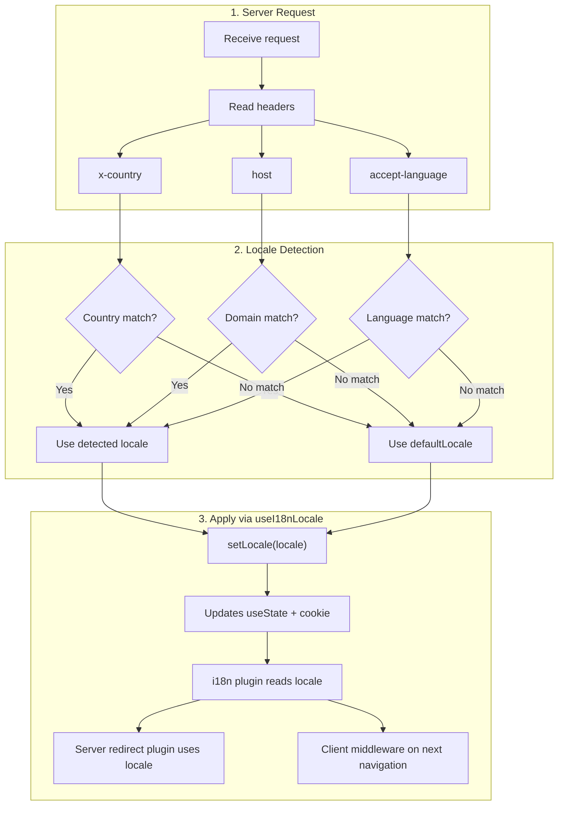

# 🔧 Deteção de idioma personalizada no Nuxt I18n Micro

## 📖 Visão geral

O Nuxt I18n Micro v3 disponibiliza um composable centralizado — `useI18nLocale()` — para toda a gestão de locale. Este substitui os padrões manuais com `useState`/`useCookie` da v2. Ao utilizar `useI18nLocale().setLocale()` num plugin de servidor, pode implementar qualquer lógica de deteção personalizada, mantendo a compatibilidade total com os sistemas de redirecionamento e cookies do módulo.

## 🏗️ Arquitetura

```mermaid
flowchart TB
    subgraph Plugins["Plugin Execution Order"]
        A["Your plugin<br/>order: -10"] -->|setLocale()| B["01.plugin.ts<br/>order: -5"]
        B --> C["06.redirect.ts server<br/>order: 10"]
    end

    subgraph Client["Client SPA Navigation"]
        D["i18n-redirect.global.ts<br/>route middleware"]
    end

    subgraph State["Locale State"]
        E["useState('i18n-locale')"]
        F["localeCookie"]
    end

    A -->|"setLocale() updates both"| E
    A -->|"setLocale() updates both"| F
    B -->|reads| E
    C -->|reads| E
    C -->|reads| F
    D -->|reads target route +| E
```

**Princípio essencial**: chame `useI18nLocale().setLocale()` num plugin de servidor com `order: -10`. Isto atualiza atomicamente `useState('i18n-locale')` e o cookie de locale, para que o plugin i18n (`order: -5`) e o plugin de redirecionamento do servidor (`order: 10`) vejam o locale correto no primeiro pedido SSR. Os auto-redirecionamentos do lado do cliente são executados no middleware global de rota nas navegações subsequentes.

## 🛠️ Desativar a deteção automática incorporada

Se pretender controlo total sobre a deteção de locale, desative o mecanismo incorporado:

```ts
export default defineNuxtConfig({
  i18n: {
    autoDetectLanguage: false,
  },
})
```

## ✨ Exemplo: deteção do lado do servidor com `useI18nLocale`

Esta é a **abordagem recomendada** para todas as estratégias.

### Passo 1: configurar `nuxt.config.ts`

```ts
export default defineNuxtConfig({
  modules: ['nuxt-i18n-micro'],
  i18n: {
    strategy: 'no_prefix', // Works with ANY strategy
    defaultLocale: 'en',
    localeCookie: 'user-locale',
    autoDetectLanguage: false,
    locales: [
      { code: 'en', iso: 'en-US' },
      { code: 'de', iso: 'de-DE' },
      { code: 'ja', iso: 'ja-JP' },
    ],
  },
})
```

### Passo 2: criar `plugins/i18n-loader.server.ts`

```ts
import { defineNuxtPlugin, useRequestHeaders } from '#imports'

export default defineNuxtPlugin({
  name: 'i18n-custom-loader',
  enforce: 'pre',
  order: -10, // Execute BEFORE the i18n plugin (which has order -5)

  setup() {
    const { setLocale } = useI18nLocale()
    const headers = useRequestHeaders(['host', 'x-country', 'accept-language'])
    let detectedLocale = 'en'

    // --- YOUR DETECTION LOGIC ---

    // Example 1: By domain
    const host = headers['host']
    if (host?.includes('example.de')) {
      detectedLocale = 'de'
    }
    // Example 2: By custom header
    else if (headers['x-country'] === 'JP') {
      detectedLocale = 'ja'
    }
    // Example 3: By Accept-Language header
    else if (headers['accept-language']?.includes('de')) {
      detectedLocale = 'de'
    }

    // --- APPLY THE LOCALE ---
    setLocale(detectedLocale)
  },
})
```

### Como funciona



1. **O plugin é executado primeiro** (`order: -10`) — deteta o locale a partir de cabeçalhos, domínio ou outras origens.
2. **`setLocale()` atualiza ambos** — `useState('i18n-locale')` e o cookie — garantindo visibilidade imediata para todos os plugins seguintes.
3. **Plugin i18n** (`order: -5`) lê o locale e carrega as traduções corretas.
4. **Plugin de redirecionamento do servidor** (`order: 10`) utiliza o locale nas decisões de redirecionamento em SSR.
5. **Middleware de rota do cliente** (`i18n-redirect`) aplica redirecionamentos na navegação SPA quando o locale do URL não corresponde à preferência.

## 🌐 Comportamento por estratégia

`useI18nLocale().setLocale()` funciona com **todas as estratégias**. O comportamento de redirecionamento depende da estratégia:

<Tip>
| Estratégia | Efeito de `setLocale('de')` |
|----------|---------------------------|
| `no_prefix` | Renderiza em alemão, sem alteração de URL |
| `prefix` | 302 → `/de/` (redirecionamento do lado do servidor) |
| `prefix_except_default` | 302 → `/de/` se `de` ≠ default; sem redirecionamento se `de` = default |
| `prefix_and_default` | Sem redirecionamento (`/` e `/de/` são ambos válidos) |
</Tip>

**Notas importantes:**

- A deteção de locale baseada em cookies está desativada por predefinição (`localeCookie: null`).
- Defina `localeCookie: 'user-locale'` para ativar a persistência em cookie.
- Se o valor de cookie/estado não estiver na lista de `locales`, faz fallback para `defaultLocale`.

## 🏢 Avançado: deteção baseada em domínio

Para configurações multi-domínio em que cada domínio serve um locale diferente:

```ts
import { defineNuxtPlugin, useRequestHeaders } from '#imports'

export default defineNuxtPlugin({
  name: 'i18n-domain-loader',
  enforce: 'pre',
  order: -10,

  setup() {
    const { setLocale } = useI18nLocale()
    const headers = useRequestHeaders(['host'])
    const host = headers['host'] || ''

    let detectedLocale = 'en'

    if (host.endsWith('.de') || host.includes('german.')) {
      detectedLocale = 'de'
    } else if (host.endsWith('.fr') || host.includes('french.')) {
      detectedLocale = 'fr'
    } else if (host.endsWith('.jp') || host.includes('japanese.')) {
      detectedLocale = 'ja'
    }

    setLocale(detectedLocale)
  },
})
```

## 🔄 Avançado: respeitar a preferência do utilizador

Se os utilizadores puderem mudar de idioma manualmente, respeite a sua escolha em vez da deteção automática:

```ts
import { defineNuxtPlugin, useRequestHeaders } from '#imports'

export default defineNuxtPlugin({
  name: 'i18n-smart-loader',
  enforce: 'pre',
  order: -10,

  setup() {
    const { getLocale, setLocale } = useI18nLocale()

    // If user already has a preference (from cookie), respect it
    if (getLocale()) {
      return
    }

    // Otherwise, detect locale from headers
    const headers = useRequestHeaders(['accept-language'])
    let detectedLocale = 'en'

    const acceptLanguage = headers['accept-language'] || ''
    if (acceptLanguage.includes('de')) {
      detectedLocale = 'de'
    } else if (acceptLanguage.includes('ja')) {
      detectedLocale = 'ja'
    }

    setLocale(detectedLocale)
  },
})
```

## ⚙️ Plugins exclusivos do servidor ou do cliente

Utilize as [convenções de nome de ficheiros do Nuxt](https://nuxt.com/docs/getting-started/directory-structure#plugins) para controlar onde o seu plugin é executado:

- **Apenas servidor**: `i18n-loader.server.ts` — executado apenas durante o SSR (recomendado para deteção baseada em cabeçalhos).
- **Apenas cliente**: `i18n-loader.client.ts` — executado apenas no navegador (para deteção via `localStorage` ou DOM).

<Tip>

</Tip>

## ✅ Resumo

| Funcionalidade                                | Descrição                                                       |
| -------------------------------------- | ----------------------------------------------------------------- |
| `useI18nLocale().setLocale()`          | Atualiza `useState` + cookie atomicamente; funciona com todas as estratégias |
| `useI18nLocale().getLocale()`          | Devolve o locale atual a partir do estado ou do cookie                       |
| `useI18nLocale().getPreferredLocale()` | Devolve o locale preferido (validado contra a lista de `locales`)       |
| `order: -10` no plugin                    | Garante que o seu plugin é executado antes da inicialização do i18n |
| `enforce: 'pre'`                       | Executa no grupo de plugins "pre"                                    |

**Não deve:**

- Utilizar `useCookie('user-locale')` diretamente — `useI18nLocale()` gere internamente os cookies.
- Utilizar `useState('i18n-locale')` diretamente — utilize `useI18nLocale().setLocale()` em alternativa.
- Definir `order` >= -5 — o seu plugin tem de correr antes do plugin i18n.
