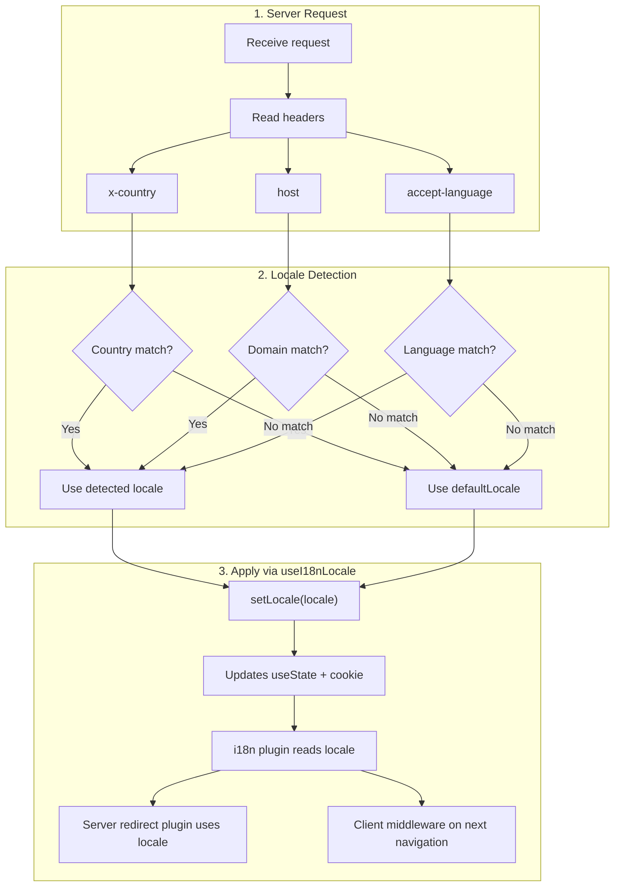

# 🔧 Deteção de idioma personalizada no Nuxt I18n Micro

## 📖 Visão geral

O Nuxt I18n Micro v3 fornece um composable centralizado — `useI18nLocale()` — para toda a gestão de locale. Substitui os padrões manuais `useState`/`useCookie` da v2. Ao usar `useI18nLocale().setLocale()` num plugin de servidor, pode implementar qualquer lógica de deteção personalizada mantendo total compatibilidade com os sistemas de redirecionamento e cookies do módulo.

## 🏗️ Arquitetura

```mermaid
flowchart TB
    subgraph Plugins["Plugin Execution Order"]
        A["Your plugin<br/>order: -10"] -->|setLocale()| B["01.plugin.ts<br/>order: -5"]
        B --> C["06.redirect.ts server<br/>order: 10"]
    end

    subgraph Client["Client SPA Navigation"]
        D["i18n-redirect.global.ts<br/>route middleware"]
    end

    subgraph State["Locale State"]
        E["useState('i18n-locale')"]
        F["localeCookie"]
    end

    A -->|"setLocale() updates both"| E
    A -->|"setLocale() updates both"| F
    B -->|reads| E
    C -->|reads| E
    C -->|reads| F
    D -->|reads target route +| E
```

**Princípio essencial**: chame `useI18nLocale().setLocale()` num plugin de servidor com `order: -10`. Isto atualiza atomicamente tanto `useState('i18n-locale')` como o cookie de locale, para que o plugin i18n (`order: -5`) e o plugin de redirecionamento do servidor (`order: 10`) vejam o locale correto no primeiro pedido SSR. Os auto-redirecionamentos no cliente correm no middleware global de rota em navegações subsequentes.

## 🛠️ Desativar a deteção automática incorporada

Se pretende controlo total sobre a deteção de locale, desative o mecanismo incorporado:

```ts
export default defineNuxtConfig({
  i18n: {
    autoDetectLanguage: false,
  },
})
```

## ✨ Exemplo: deteção no servidor com `useI18nLocale`

Esta é a **abordagem recomendada** para todas as estratégias.

### Passo 1: configure `nuxt.config.ts`

```ts
export default defineNuxtConfig({
  modules: ['nuxt-i18n-micro'],
  i18n: {
    strategy: 'no_prefix', // Works with ANY strategy
    defaultLocale: 'en',
    localeCookie: 'user-locale',
    autoDetectLanguage: false,
    locales: [
      { code: 'en', iso: 'en-US' },
      { code: 'de', iso: 'de-DE' },
      { code: 'ja', iso: 'ja-JP' },
    ],
  },
})
```

### Passo 2: crie `plugins/i18n-loader.server.ts`

```ts
import { defineNuxtPlugin, useRequestHeaders } from '#imports'

export default defineNuxtPlugin({
  name: 'i18n-custom-loader',
  enforce: 'pre',
  order: -10, // Execute BEFORE the i18n plugin (which has order -5)

  setup() {
    const { setLocale } = useI18nLocale()
    const headers = useRequestHeaders(['host', 'x-country', 'accept-language'])
    let detectedLocale = 'en'

    // --- YOUR DETECTION LOGIC ---

    // Example 1: By domain
    const host = headers['host']
    if (host?.includes('example.de')) {
      detectedLocale = 'de'
    }
    // Example 2: By custom header
    else if (headers['x-country'] === 'JP') {
      detectedLocale = 'ja'
    }
    // Example 3: By Accept-Language header
    else if (headers['accept-language']?.includes('de')) {
      detectedLocale = 'de'
    }

    // --- APPLY THE LOCALE ---
    setLocale(detectedLocale)
  },
})
```

### Como funciona



1. **O plugin corre primeiro** (`order: -10`) — deteta o locale a partir de cabeçalhos, domínio ou outras fontes
2. **`setLocale()` atualiza ambos** `useState('i18n-locale')` e cookie — garante visibilidade imediata para todos os plugins subsequentes
3. **Plugin i18n** (`order: -5`) lê o locale e carrega as traduções corretas
4. **Plugin de redirecionamento do servidor** (`order: 10`) usa o locale para decisões de redirecionamento em SSR
5. **Middleware de rota no cliente** (`i18n-redirect`) aplica redirecionamentos em navegações SPA quando o locale do URL não corresponde à preferência

## 🌐 Comportamento por estratégia

`useI18nLocale().setLocale()` funciona com **todas as estratégias**. O comportamento de redirecionamento depende da estratégia:

<Tip>
| Estratégia | Efeito de `setLocale('de')` |
|----------|---------------------------|
| `no_prefix` | Renderiza em alemão, sem alterar o URL |
| `prefix` | 302 → `/de/` (redirecionamento no servidor) |
| `prefix_except_default` | 302 → `/de/` se `de` ≠ predefinido; sem redirecionamento se `de` = predefinido |
| `prefix_and_default` | Sem redirecionamento (tanto `/` como `/de/` são válidos) |
</Tip>

**Notas importantes:**

- A deteção de locale por cookie está desativada por predefinição (`localeCookie: null`)
- Defina `localeCookie: 'user-locale'` para ativar a persistência por cookie
- Se o valor no cookie/estado não estiver na lista `locales`, recai para `defaultLocale`

## 🏢 Avançado: deteção baseada em domínio

Para configurações multidomínio em que cada domínio serve um locale diferente:

```ts
import { defineNuxtPlugin, useRequestHeaders } from '#imports'

export default defineNuxtPlugin({
  name: 'i18n-domain-loader',
  enforce: 'pre',
  order: -10,

  setup() {
    const { setLocale } = useI18nLocale()
    const headers = useRequestHeaders(['host'])
    const host = headers['host'] || ''

    let detectedLocale = 'en'

    if (host.endsWith('.de') || host.includes('german.')) {
      detectedLocale = 'de'
    } else if (host.endsWith('.fr') || host.includes('french.')) {
      detectedLocale = 'fr'
    } else if (host.endsWith('.jp') || host.includes('japanese.')) {
      detectedLocale = 'ja'
    }

    setLocale(detectedLocale)
  },
})
```

## 🔄 Avançado: respeitar a preferência do utilizador

Se os utilizadores podem trocar de idioma manualmente, respeite a sua escolha em vez da deteção automática:

```ts
import { defineNuxtPlugin, useRequestHeaders } from '#imports'

export default defineNuxtPlugin({
  name: 'i18n-smart-loader',
  enforce: 'pre',
  order: -10,

  setup() {
    const { getLocale, setLocale } = useI18nLocale()

    // If user already has a preference (from cookie), respect it
    if (getLocale()) {
      return
    }

    // Otherwise, detect locale from headers
    const headers = useRequestHeaders(['accept-language'])
    let detectedLocale = 'en'

    const acceptLanguage = headers['accept-language'] || ''
    if (acceptLanguage.includes('de')) {
      detectedLocale = 'de'
    } else if (acceptLanguage.includes('ja')) {
      detectedLocale = 'ja'
    }

    setLocale(detectedLocale)
  },
})
```

## ⚙️ Plugins apenas de servidor ou apenas de cliente

Use as [convenções de nome de ficheiro do Nuxt](https://nuxt.com/docs/getting-started/directory-structure#plugins) para controlar onde o seu plugin corre:

- **Apenas servidor**: `i18n-loader.server.ts` — corre apenas durante SSR (recomendado para deteção baseada em cabeçalhos)
- **Apenas cliente**: `i18n-loader.client.ts` — corre apenas no browser (para deteção baseada em `localStorage` ou DOM)


## ✅ Resumo

| Funcionalidade                         | Descrição                                                          |
| -------------------------------------- | ----------------------------------------------------------------- |
| `useI18nLocale().setLocale()`          | Atualiza `useState` + cookie atomicamente; funciona com todas as estratégias |
| `useI18nLocale().getLocale()`          | Devolve o locale atual do estado ou cookie                        |
| `useI18nLocale().getPreferredLocale()` | Devolve o locale preferido (validado contra a lista `locales`)    |
| Plugin `order: -10`                    | Garante que o seu plugin corre antes da inicialização do i18n     |
| `enforce: 'pre'`                       | Corre no grupo de plugins "pre"                                    |

**NÃO faça:**

- Não use `useCookie('user-locale')` diretamente — `useI18nLocale()` gere os cookies internamente
- Não use `useState('i18n-locale')` diretamente — use antes `useI18nLocale().setLocale()`
- Não defina `order` >= -5 — o seu plugin tem de correr antes do plugin i18n
