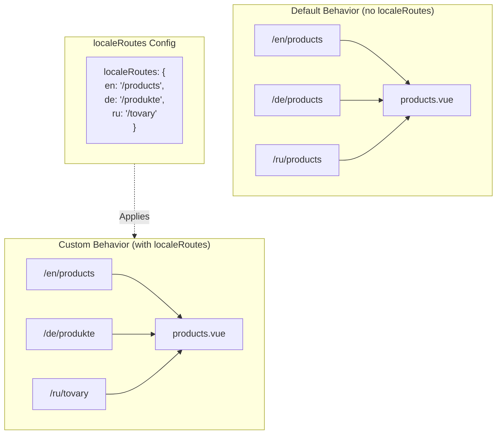

# 🔗 Rotas localizadas personalizadas com `localeRoutes` no `Nuxt I18n Micro`

## 📖 Introdução ao `localeRoutes`

A funcionalidade `localeRoutes` no `Nuxt I18n Micro` permite definir rotas personalizadas para locales específicos, oferecendo flexibilidade e controlo sobre a estrutura de encaminhamento da sua aplicação. Esta funcionalidade é particularmente útil quando certos locales requerem estruturas de URL diferentes, caminhos adaptados ou têm de seguir convenções regionais ou linguísticas específicas.

## 🚀 Caso de uso principal do `localeRoutes`

O caso de uso principal do `localeRoutes` é fornecer rotas distintas para diferentes locales, melhorando a experiência do utilizador ao garantir que os URLs são intuitivos e relevantes para o público-alvo. Por exemplo, pode ter caminhos diferentes para as versões inglesa e russa de uma página, em que o locale russo segue um formato de URL localizado.

### 📄 Exemplo: definir `localeRoutes` em `$defineI18nRoute`

Segue-se um exemplo de como pode definir rotas personalizadas para locales específicos utilizando `localeRoutes` na sua função `$defineI18nRoute`:

```typescript
import { useNuxtApp } from '#imports'

const { $defineI18nRoute } = useNuxtApp()

$defineI18nRoute({
  localeRoutes: {
    ru: '/localesubpage', // Custom route path for the Russian locale
    de: '/lokaleseite', // Custom route path for the German locale
  },
})
```

> [!IMPORTANT]
> `$defineI18nRoute` não é uma função global. Em `script setup`, obtenha-a primeiro de `useNuxtApp()` e só depois a chame.

### 🔄 Como funciona o `localeRoutes`



- **Comportamento predefinido**: sem `localeRoutes`, todos os locales utilizam uma estrutura de rota comum definida pelo caminho principal.
- **Comportamento personalizado**: com `localeRoutes`, locales específicos podem ter as suas próprias rotas, substituindo o caminho predefinido pelas rotas específicas do locale definidas na configuração.

## 🌱 Casos de utilização do `localeRoutes`

### 📄 Exemplo: utilizar `localeRoutes` numa página

Segue-se um componente Vue simples que demonstra a utilização de `$defineI18nRoute` com `localeRoutes`:

```vue
<template>
  <div>
    <!-- Display greeting message based on the current locale -->
    <p>{{ $t('greeting') }}</p>

    <!-- Navigation links -->
    <div>
      <NuxtLink :to="$localeRoute({ name: 'index' })"> Go to Index </NuxtLink>
      |
      <NuxtLink :to="$localeRoute({ name: 'about' })"> Go to About Page </NuxtLink>
    </div>
  </div>
</template>

<script setup>
import { useNuxtApp } from '#imports'

const { $getLocale, $switchLocale, $getLocales, $localeRoute, $t, $defineI18nRoute } = useNuxtApp()

// Define translations and custom routes for specific locales
$defineI18nRoute({
  localeRoutes: {
    ru: '/localesubpage', // Custom route path for Russian locale
  },
})
</script>
```

### 🛠️ Utilizar `localeRoutes` em diferentes contextos

- **Páginas de destino**: use rotas personalizadas para localizar URLs de páginas de destino, garantindo que se alinham com as campanhas de marketing.
- **Sites de documentação**: forneça rotas distintas para cada locale, de forma a corresponder melhor à estrutura de conteúdo localizada.
- **Sites de e-commerce**: adapte URLs de produtos ou categorias por locale para melhorar o SEO e a experiência do utilizador.

## Utilizar navegação com `localeRoutes`

Como as rotas localizadas não correspondem diretamente a nomes de ficheiros no diretório de páginas, precisa de referenciar a sua navegação por objeto e não por nome.

```vue
<template>
  /**
   * Exemple page: /pages/about-us.vue
   * EN /about-us
   * ES /sobre-nosotros
   * FR /a-propos
   */

  // Using NuxtLink
  <NuxtLink :to="$localeRoute({ name: 'about-us' })">
    Go to About Page
  </NuxtLink>

  // Using I18nLink
  <I18nLink :to="{ name: 'about-us' }">
    Go to About Page
  </NuxtLink>

  // The string literal navigation wouldn't work for any locale but english
  <I18nLink to="/about-us">
    Go to About Page
  </NuxtLink>
</template>
```

### Nomenclatura de páginas aninhadas

Por predefinição, as suas páginas são nomeadas com base no nome do ficheiro e do caminho. Eis o que isto significa:

- `/pages/about-us.vue` pode ser acedido com `$localeRoute(\{ name: 'about-us' \})`.
- `/pages/about-us/physical-stores.vue` pode ser acedido com `$localeRoute(\{ name: 'about-us-physical-stores' \})`.

Para substituir este comportamento, nomeie explicitamente a sua página com `definePageMeta`.

```vue
// /pages/about-us/physical-stores.vue
<script setup>
definePageMeta({
  name: 'our-stores'
})
```

Esta página pode agora ser referenciada com `$localeRoute` ou `I18nLink` através do seu nome `:to='\{ name: "our-stores" \}'`.

## 🎯 Rotas dinâmicas com slugs e `$setI18nRouteParams`

Ao trabalhar com rotas dinâmicas que contêm slugs ou parâmetros, pode utilizar `localeRoutes` com segmentos dinâmicos e `$setI18nRouteParams` para fornecer slugs específicos de cada locale.

### Parâmetros de rota dinâmicos em `localeRoutes`

Pode definir rotas dinâmicas utilizando a sintaxe de parâmetros de rota do Nuxt (`[...slug]` para rotas catch-all, `[param]` para parâmetros únicos ou `:param()` para parâmetros nomeados):

```vue
<script setup lang="ts">
import { useNuxtApp, useRoute, useFetch, createError } from '#imports'

const { $defineI18nRoute, $setI18nRouteParams } = useNuxtApp()

// Define custom routes with dynamic segments
$defineI18nRoute({
  localeRoutes: {
    en: '/our-products/[...slug]',
    es: '/nuestros-productos/[...slug]',
  },
})
</script>
```

### Definir parâmetros de rota específicos do locale

A função `$setI18nRouteParams` permite definir valores de parâmetros distintos (como slugs) para cada locale. Isto é especialmente útil quando o seu conteúdo tem URLs específicos por locale.

**Importante**: `$setI18nRouteParams` deve ser chamado após obter os dados que contêm slugs específicos do locale, tipicamente dentro de `useFetch` ou `useAsyncData`.

```vue
<script setup lang="ts">
import { useNuxtApp, useRoute, useFetch, createError } from '#imports'

interface Product {
  title: string
  price: string
  urlEn: string // English slug
  urlEs: string // Spanish slug
}

const { $defineI18nRoute, $setI18nRouteParams } = useNuxtApp()

const route = useRoute()
const slug = Array.isArray(route.params.slug) ? route.params.slug[0] : route.params.slug

// Fetch product data that includes locale-specific slugs
const { data: product, error } = await useFetch<Product>(`/api/product/${slug}`)
if (error.value)
  throw createError({
    statusCode: error.value?.statusCode,
    statusMessage: error.value?.statusMessage,
    fatal: true,
  })

// Define custom routes with dynamic segments
$defineI18nRoute({
  localeRoutes: {
    en: '/our-products/[...slug]',
    es: '/nuestros-productos/[...slug]',
  },
})

// Set different slugs for different locales
if (product.value) {
  $setI18nRouteParams({
    en: { slug: product.value.urlEn },
    es: { slug: product.value.urlEs },
  })
}
</script>
```

### Exemplo completo: páginas de produto com slugs específicos por locale

Segue-se um exemplo completo que mostra como usar `localeRoutes` e `$setI18nRouteParams` em conjunto numa página de detalhe de produto:

```vue
<template>
  <div v-if="product">
    <h1>{{ product.title }}</h1>
    <p>{{ $t('price') }}: {{ product.price }}</p>
    <div class="locale-switcher">
      <a :href="$switchLocalePath('en')">English</a>
      <a :href="$switchLocalePath('es')">Español</a>
    </div>
  </div>
</template>

<script setup lang="ts">
import { useNuxtApp, useRoute, useFetch, createError } from '#imports'

interface Product {
  title: string
  price: string
  urlEn: string
  urlEs: string
}

const { $t, $defineI18nRoute, $setI18nRouteParams, $switchLocalePath } = useNuxtApp()

// Set page name for easier navigation
definePageMeta({ name: 'product-slug' })

const route = useRoute()
const slug = Array.isArray(route.params.slug) ? route.params.slug[0] : route.params.slug

// Fetch product data
const { data: product, error } = await useFetch<Product>(`/api/product/${slug}`)
if (error.value)
  throw createError({
    statusCode: error.value?.statusCode,
    statusMessage: error.value?.statusMessage,
    fatal: true,
  })

// Define locale-specific routes with dynamic segments
$defineI18nRoute({
  localeRoutes: {
    en: '/our-products/[...slug]',
    es: '/nuestros-productos/[...slug]',
  },
})

// Set locale-specific slugs so $switchLocalePath works correctly
if (product.value) {
  $setI18nRouteParams({
    en: { slug: product.value.urlEn },
    es: { slug: product.value.urlEs },
  })
}
</script>
```

### Exemplo: página de lista de produtos

Ao criar ligações para rotas dinâmicas a partir de uma página de lista, utilize o nome da rota com os parâmetros:

```vue
<template>
  <div>
    <h1>{{ $t('title') }}</h1>
    <ul>
      <li v-for="product in products?.[$getLocale()] || []" :key="product.id">
        <I18nLink :to="{ name: 'product-slug', params: { slug: product.url } }"> {{ product.title }} – {{ product.price }} </I18nLink>
      </li>
    </ul>
  </div>
</template>

<script setup lang="ts">
import { useNuxtApp, useFetch, createError } from '#imports'

interface Product {
  id: string
  title: string
  price: string
  url: string
}

type ProductsByLocale = Record<string, Product[]>

const { $t, $defineI18nRoute, $getLocale } = useNuxtApp()

const { data: products, error } = await useFetch<ProductsByLocale>('/api/product')
if (error.value)
  throw createError({
    statusCode: error.value?.statusCode,
    statusMessage: error.value?.statusMessage,
    fatal: true,
  })

$defineI18nRoute({
  locales: {
    en: {
      title: 'Our Product Range',
      description: 'Discover our collection of high-quality products.',
    },
    es: {
      title: 'Nuestra Gama de Productos',
      description: 'Descubra nuestra colección de productos de alta calidad.',
    },
  },
  localeRoutes: {
    en: '/our-products',
    es: '/nuestros-productos',
  },
})
</script>
```

### Como funciona

1. **Definição da rota**: `localeRoutes` define a estrutura de caminho base para cada locale, incluindo segmentos dinâmicos como `[...slug]` ou `[id]`.

2. **Definição de parâmetros**: `$setI18nRouteParams` define os valores reais dos parâmetros para cada locale. Quando um utilizador muda de locale com `$switchLocalePath`, o módulo utiliza estes parâmetros para construir o URL correto.

3. **Formato do parâmetro**: o objeto de parâmetros deve seguir a estrutura:

   ```typescript
   {
     [localeCode]: {
       [paramName]: paramValue
     }
   }
   ```

4. **Navegação**: utilize `I18nLink` ou `$localeRoute` com o nome da rota e os parâmetros para navegar entre versões localizadas de rotas dinâmicas.

### Notas importantes

- **Momento**: `$setI18nRouteParams` deve ser chamado após obter os dados que contêm slugs específicos do locale, tipicamente dentro de `useFetch` ou `useAsyncData`.

- **Nomes dos parâmetros**: os nomes dos parâmetros em `$setI18nRouteParams` têm de corresponder aos nomes dos parâmetros de rota (p. ex., `slug` para `[...slug]` ou `id` para `[id]`).

- **Nomes de rotas**: ao utilizar `definePageMeta(\{ name: 'route-name' \})`, use este nome ao ligar à rota com `I18nLink` ou `$localeRoute`.

- **Rotas catch-all**: para rotas catch-all (`[...slug]`), o parâmetro slug deve ser um array ou uma string que será convertida num array.

## 🧩 Rotas programáticas (`pages:extend`) — #244

As rotas criadas em `pages:extend` não têm um sítio para `defineI18nRoute()`, e várias rotas partilham frequentemente um SFC wrapper. A análise por ficheiro acaba por colapsá-las numa única entrada.

**Não** coloque caminhos localizados em `route.meta` (seriam enviados na tabela de rotas do cliente). Mantenha um único registo e projete-o duas vezes:

1. em `pages:extend` (cria as rotas Nuxt).
2. em `i18n.globalLocaleRoutes`, indexado pelo **nome** da rota (e não pelo caminho do ficheiro).

Utilize `splitLocaleRoutes` de `@i18n-micro/utils/split-locale-routes`:

```typescript
import { splitLocaleRoutes } from '@i18n-micro/utils/split-locale-routes'

const dynamic = splitLocaleRoutes([
  {
    name: 'products_tag',
    path: '/products/:tag',
    file: '~/pages/_dynamic.vue',
    paths: { fr: '/produits/:tag', de: '/produkte/:tag' },
  },
  {
    name: 'products_category',
    path: '/products/category/:category',
    file: '~/pages/_dynamic.vue',
    paths: { fr: '/produits/categorie/:category' },
  },
  // Disable localization for a programmatic route:
  // { name: 'internal', path: '/internal', file: '~/pages/_dynamic.vue', paths: false },
])

export default defineNuxtConfig({
  hooks: {
    'pages:extend'(pages) {
      pages.push(...dynamic.pages)
    },
  },
  i18n: {
    globalLocaleRoutes: dynamic.globalLocaleRoutes,
  },
})
```

As duas metades mantêm-se sincronizadas; wrappers partilhados deixam de se sobrescrever mutuamente. `globalLocaleRoutes` por si só não é suficiente — apenas personaliza caminhos para rotas que já existem na tabela de páginas do Nuxt.

## 📝 Boas práticas para utilizar `localeRoutes`

- **🚀 Use para locales relevantes**: aplique `localeRoutes` sobretudo onde a estrutura do URL impacta significativamente a experiência do utilizador ou o SEO. Evite abusar em diferenças menores.
- **🔧 Mantenha consistência**: mantenha um padrão de encaminhamento consistente entre locales, salvo se houver uma razão forte para divergir. Esta abordagem ajuda a manter a clareza e a reduzir a complexidade.
- **📚 Documente rotas personalizadas**: documente claramente todas as rotas personalizadas definidas com `localeRoutes`, sobretudo em aplicações modulares, para garantir que a equipa compreende a lógica de encaminhamento.
